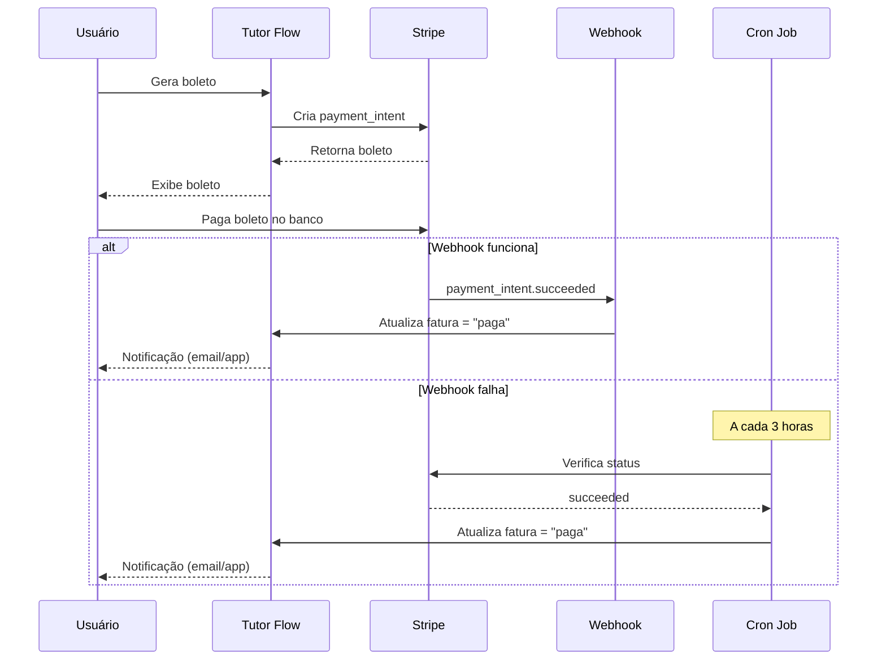

# Verificação Automática de Pagamentos de Boleto

## Visão Geral

O sistema Tutor Flow agora possui **verificação automática** de pagamentos de boletos, implementando duas camadas de segurança:

1. **Webhooks do Stripe** - Notificações em tempo real quando um pagamento é confirmado
2. **Verificação Periódica Automática** - Cron job que verifica faturas pendentes a cada 15 minutos

## Arquitetura Implementada

### 1. Webhook Stripe Connect
**Arquivo:** `supabase/functions/webhook-stripe-connect/index.ts`

Eventos monitorados:
- `payment_intent.succeeded` - Boleto pago com sucesso
- `payment_intent.payment_failed` - Falha no pagamento
- `invoice.paid` - Fatura paga (backup)
- `invoice.payment_succeeded` - Pagamento bem-sucedido (backup)
- `invoice.payment_failed` - Falha no pagamento da fatura

**Logs aprimorados:**
- Logs detalhados de todos os eventos recebidos
- Informações sobre payment_method_types (para identificar boletos)
- Metadata completa dos payment intents
- Status de atualização das faturas

### 2. Verificação Automática Periódica
**Arquivo:** `supabase/functions/auto-verify-pending-invoices/index.ts`

Funcionalidade:
- Busca todas as faturas com status `pendente` ou `falha_pagamento`
- Verifica o status real no Stripe via API
- Atualiza automaticamente o status se mudou
- Processa até 50 faturas por execução (para evitar timeout)
- Roda a cada 3 horas via cron job

### 3. Configuração do Cron Job
**Arquivo:** `supabase/functions/setup-invoice-auto-verification/index.ts`

Configura automaticamente o cron job no PostgreSQL usando pg_cron.

## Como Ativar o Sistema

### Passo 1: Configurar Webhook no Stripe Dashboard

1. Acesse: [Stripe Dashboard - Webhooks](https://dashboard.stripe.com/webhooks)
2. Clique em **"Add endpoint"**
3. Configure:
   - **URL:** `https://nwgomximjevgczwuyqcx.supabase.co/functions/v1/webhook-stripe-connect`
   - **Eventos para escutar:**
     - `payment_intent.succeeded`
     - `payment_intent.payment_failed`
     - `invoice.paid`
     - `invoice.payment_succeeded`
     - `invoice.payment_failed`
     - `account.updated` (já existente)

4. **IMPORTANTE:** Copie o **Signing Secret** e atualize a secret `STRIPE_WEBHOOK_SECRET_CONNECT` no Supabase

### Passo 2: Ativar o Cron Job

Execute a função de setup uma única vez:

```bash
# Via curl
curl -X POST https://nwgomximjevgczwuyqcx.supabase.co/functions/v1/setup-invoice-auto-verification \
  -H "Authorization: Bearer YOUR_ANON_KEY" \
  -H "Content-Type: application/json"

# Ou via Supabase Dashboard
# SQL Editor > Run:
SELECT
  net.http_post(
    url:='https://nwgomximjevgczwuyqcx.supabase.co/functions/v1/setup-invoice-auto-verification',
    headers:='{"Content-Type": "application/json", "Authorization": "Bearer YOUR_ANON_KEY"}'::jsonb,
    body:='{}'::jsonb
  ) as request_id;
```

### Passo 3: Verificar Funcionamento

#### Testar Manualmente a Verificação Automática:
```bash
curl -X POST https://nwgomximjevgczwuyqcx.supabase.co/functions/v1/auto-verify-pending-invoices \
  -H "Authorization: Bearer YOUR_ANON_KEY" \
  -H "Content-Type: application/json"
```

Resposta esperada:
```json
{
  "message": "Invoice verification complete",
  "total_invoices": 5,
  "verified": 5,
  "updated": 2,
  "results": [...]
}
```

#### Verificar Logs do Webhook:
```sql
-- Ver últimos eventos processados
SELECT event_type, processing_status, created_at, last_error
FROM processed_stripe_events
ORDER BY created_at DESC
LIMIT 20;
```

#### Verificar Cron Job Ativo:
```sql
-- Ver cron jobs ativos
SELECT * FROM cron.job
WHERE jobname = 'auto-verify-pending-invoices';
```

## Monitoramento

### Logs das Edge Functions

**Webhook Connect:**
```bash
# Ver logs em tempo real
Supabase Dashboard > Edge Functions > webhook-stripe-connect > Logs
```

**Auto-Verify:**
```bash
# Ver logs do cron job
Supabase Dashboard > Edge Functions > auto-verify-pending-invoices > Logs
```

### Métricas Importantes

1. **Taxa de eventos recebidos:**
   - Verificar se eventos `payment_intent.succeeded` estão sendo recebidos
   - Confirmar que não há erros de assinatura do webhook

2. **Faturas atualizadas automaticamente:**
   - Contar quantas faturas mudam de status sem intervenção manual
   - Tempo médio entre pagamento e atualização

3. **Eficácia do Cron Job:**
   - Quantas faturas são verificadas por execução
   - Quantas atualizações são feitas por execução
   - Taxa de sucesso vs erros

## Fluxo Completo de Pagamento de Boleto



## Troubleshooting

### Problema: Boleto pago mas fatura continua pendente

**Diagnóstico:**
1. Verificar logs do webhook: eventos sendo recebidos?
2. Verificar cron job: está ativo e rodando?
3. Verificar payment_intent_id: está correto na fatura?

**Solução:**
```bash
# Forçar verificação manual
curl -X POST https://nwgomximjevgczwuyqcx.supabase.co/functions/v1/auto-verify-pending-invoices

# Verificar status específico
curl -X POST https://nwgomximjevgczwuyqcx.supabase.co/functions/v1/verify-payment-status \
  -H "Authorization: Bearer YOUR_TOKEN" \
  -H "Content-Type: application/json" \
  -d '{"invoice_id": "uuid-da-fatura"}'
```

### Problema: Webhook não recebe eventos

**Diagnóstico:**
1. URL do webhook está correta no Stripe?
2. Secret do webhook está atualizada?
3. Eventos corretos estão selecionados?

**Solução:**
1. Verificar no Stripe Dashboard > Webhooks > Detalhes do endpoint
2. Testar webhook enviando evento de teste
3. Verificar logs de erro no Stripe Dashboard

### Problema: Cron job não está rodando

**Diagnóstico:**
```sql
-- Verificar se existe
SELECT * FROM cron.job WHERE jobname = 'auto-verify-pending-invoices';

-- Ver última execução
SELECT * FROM cron.job_run_details 
WHERE jobid = (SELECT jobid FROM cron.job WHERE jobname = 'auto-verify-pending-invoices')
ORDER BY start_time DESC
LIMIT 5;
```

**Solução:**
```bash
# Re-executar setup
curl -X POST https://nwgomximjevgczwuyqcx.supabase.co/functions/v1/setup-invoice-auto-verification
```

## Próximos Passos (Melhorias Futuras)

1. **Notificações por Email:** Avisar aluno quando pagamento for confirmado
2. **Dashboard de Monitoramento:** Métricas em tempo real de pagamentos
3. **Retry Inteligente:** Aumentar frequência de verificação para faturas próximas do vencimento
4. **Alertas Automáticos:** Notificar admin se webhook falhar por X horas

## Conclusão

Com este sistema implementado, os pagamentos de boleto são verificados de duas formas:
1. **Tempo real** via webhooks (< 1 minuto)
2. **Backup automático** via cron job (max 3 horas)

Isso garante que nenhum pagamento passe despercebido, mesmo se o webhook falhar.
