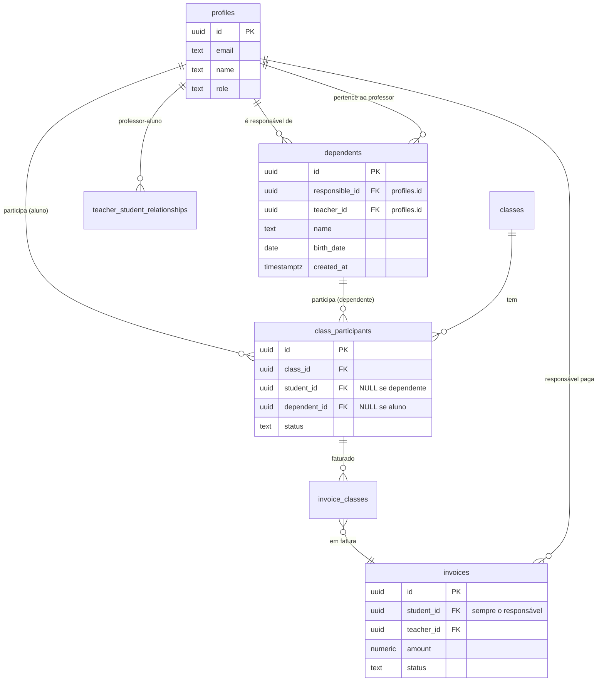
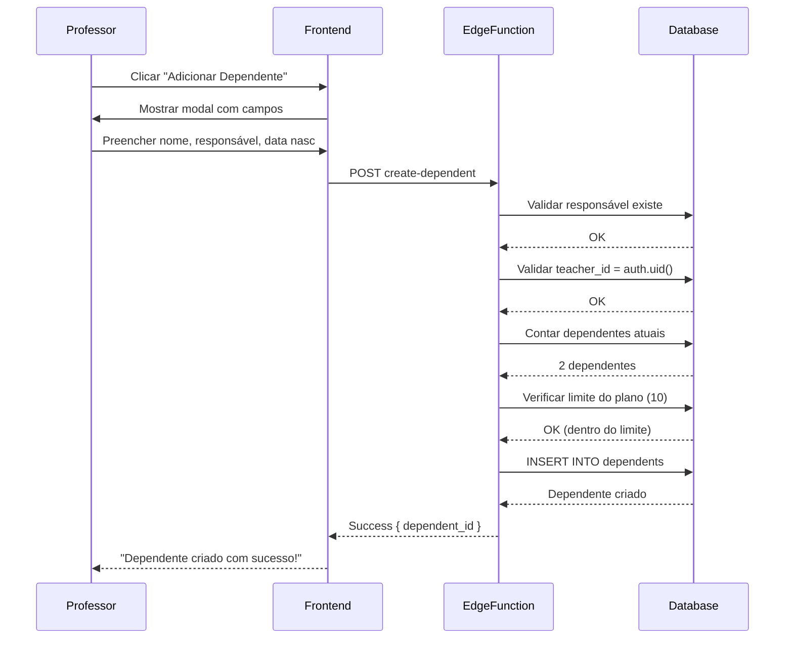
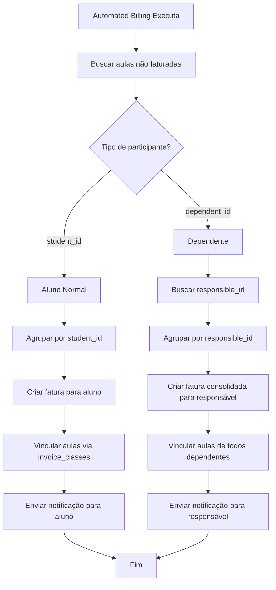
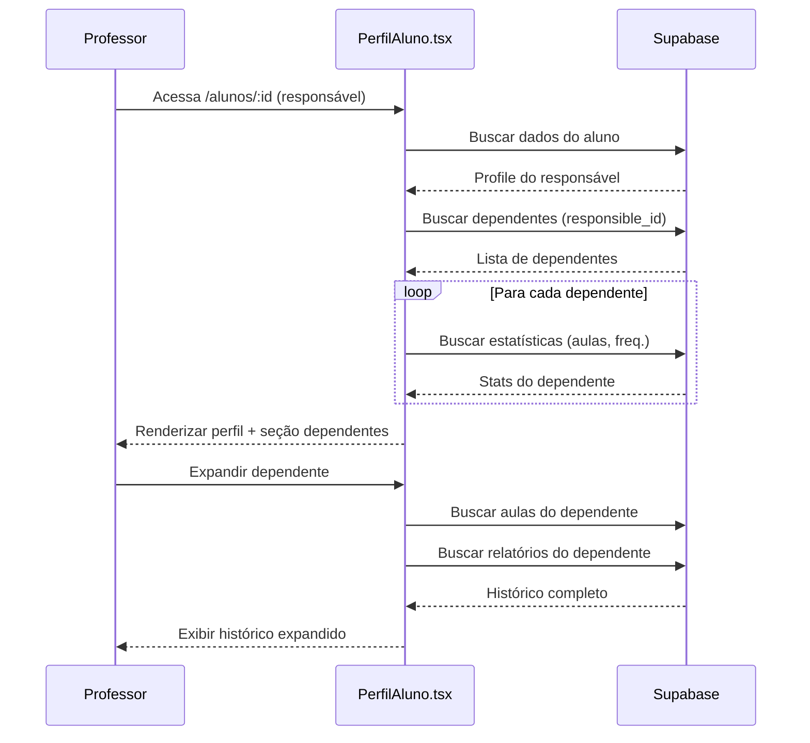
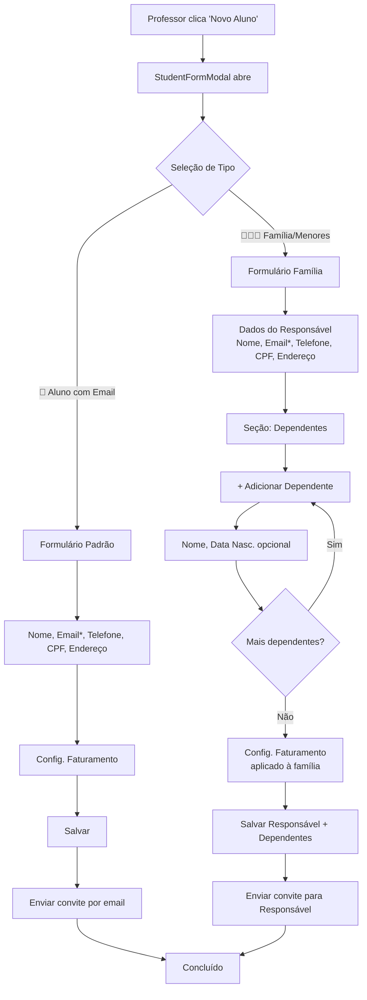
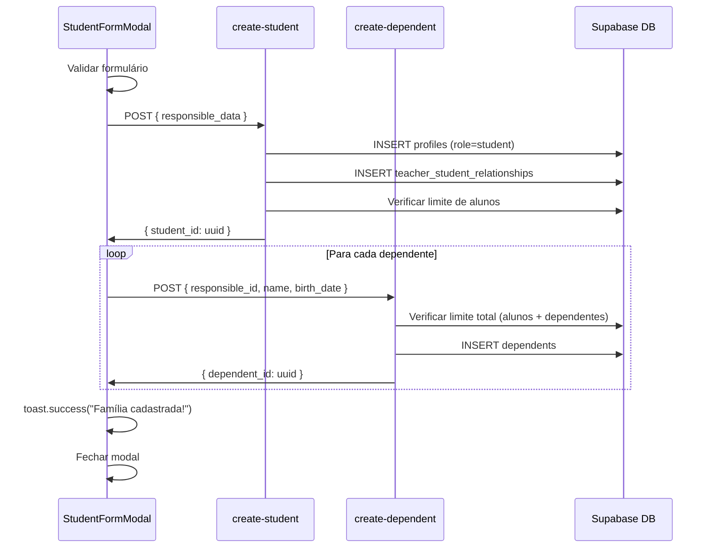

# Sistema de Dependentes - Plano de Implementação Completo

> Documento consolidado com todas as especificações, pontas soltas e cronograma de implementação
> 
> **Status:** Em Planejamento
> 
> **Última atualização:** 01/12/2025 (Revisão 4 - Perfil do Aluno)

---

## 📑 Sumário

1. [Visão Geral](#1-visão-geral)
2. [Arquitetura da Solução](#2-arquitetura-da-solução)
3. [Estrutura de Dados](#3-estrutura-de-dados)
4. [Pontas Soltas e Soluções](#4-pontas-soltas-e-soluções)
5. [Implementação Frontend](#5-implementação-frontend)
   - 5.0 [UX de Cadastro: Fluxo Unificado](#50-ux-de-cadastro-fluxo-unificado-com-seleção-de-tipo)
   - 5.1 [DependentManager](#51-componente-dependentmanager)
   - 5.2 [DependentFormModal](#52-componente-dependentformmodal)
   - 5.3 [StudentDashboard](#53-modificação-studentdashboard)
   - 5.4 [ClassForm](#54-modificação-classform)
   - 5.5 [ShareMaterialModal](#55-modificação-sharematerialmodal)
6. [Implementação Backend](#6-implementação-backend)
7. [Traduções i18n](#7-traduções-i18n)
8. [Testes e Validações](#8-testes-e-validações)
9. [Cronograma de Implementação](#9-cronograma-de-implementação)
10. [Riscos e Mitigações](#10-riscos-e-mitigações)
11. [Apêndice A: SQL Completo](#apêndice-a-sql-completo)
12. [Apêndice B: Checklist de Deploy](#apêndice-b-checklist-de-deploy)

---

## 1. Visão Geral

### 1.1 Contexto do Problema

Durante análise de requisitos com a professora, identificamos uma necessidade crítica: **alunos menores de idade sem email próprio**.

**Cenário atual:**
- Pais/responsáveis precisam criar múltiplas contas de email falsas para cada filho
- Sistema não oferece fatura consolidada por família
- Não há visão unificada do responsável sobre tarefas/atividades de múltiplos filhos
- Professores têm dificuldade em gerenciar alunos de uma mesma família

### 1.2 Requisitos Identificados

Baseado no questionário com a professora:

| Requisito | Prioridade | Detalhes |
|-----------|-----------|----------|
| ✅ Responsável com login único | ALTA | 1 email para toda a família |
| ✅ Fatura consolidada | ALTA | 1 fatura mensal para todos os filhos |
| ✅ Relatórios individuais | MÉDIA | Cada criança tem seu próprio relatório |
| ✅ Tarefas individuais | MÉDIA | Cada criança tem suas tarefas específicas |
| ✅ Materiais específicos | MÉDIA | Compartilhar material para criança específica |
| ✅ Desconto familiar | BAIXA | Flexibilidade para descontos (manual) |
| ✅ Portal do responsável | MÉDIA | Visualizar tarefas de todos os filhos |
| ✅ Simplicidade técnica | ALTA | Mínimo impacto no sistema existente |

### 1.3 Opção Escolhida: Dependentes Vinculados ao Responsável

**Conceito:** Responsável é cadastrado como "aluno" normal (com login), e os filhos são "dependentes" vinculados a ele.

**Vantagens:**
- ✅ **Minimalista:** 1 tabela nova + 3 modificações em tabelas existentes
- ✅ **Reutilização:** 95% do código existente funciona sem alterações
- ✅ **Escalável:** Permite N dependentes por responsável
- ✅ **Manutenibilidade:** Baixa complexidade, fácil dar suporte
- ✅ **Faturamento:** Usa o sistema existente, apenas agrupando por responsável

**Desvantagens:**
- ⚠️ Requer adaptação em alguns componentes (ClassForm, Billing, Notifications)
- ⚠️ Professores precisam entender a diferença entre "aluno normal" e "responsável com dependentes"

---

## 2. Arquitetura da Solução

### 2.1 Diagrama de Entidades (ER)



### 2.2 Fluxo de Criação de Dependente



### 2.3 Fluxo de Faturamento Consolidado



### 2.4 Decisões Técnicas Importantes

| Decisão | Justificativa |
|---------|---------------|
| **Usar `profiles` para responsável** | Aproveita autenticação, RLS e toda infraestrutura existente |
| **NOT NULL em `dependents.responsible_id`** | Dependente sempre pertence a um responsável |
| **CHECK constraint em `class_participants`** | Garantir que OR student_id OR dependent_id é preenchido |
| **Índices compostos** | Performance em queries que juntam responsible + teacher |
| **Fatura sempre no `responsible_id`** | Simplifica billing, usa `student_id` existente |
| **Dependentes NÃO têm login** | Simplifica segurança, responsável gerencia tudo |

---

## 3. Estrutura de Dados

### 3.1 Nova Tabela: `dependents`

```sql
-- ============================================================
-- TABELA: dependents
-- DESCRIÇÃO: Filhos/dependentes vinculados a um responsável
-- ============================================================

CREATE TABLE public.dependents (
  id UUID PRIMARY KEY DEFAULT gen_random_uuid(),
  
  -- Relacionamentos
  responsible_id UUID NOT NULL REFERENCES public.profiles(id) ON DELETE CASCADE,
  teacher_id UUID NOT NULL REFERENCES public.profiles(id) ON DELETE CASCADE,
  
  -- Dados do dependente
  name TEXT NOT NULL CHECK (char_length(name) >= 2),
  birth_date DATE,
  notes TEXT,
  
  -- Metadados
  created_at TIMESTAMPTZ NOT NULL DEFAULT NOW(),
  updated_at TIMESTAMPTZ NOT NULL DEFAULT NOW(),
  
  -- Constraints
  CONSTRAINT dependents_name_length CHECK (char_length(name) >= 2),
  CONSTRAINT dependents_birth_date_valid CHECK (birth_date <= CURRENT_DATE),
  CONSTRAINT dependents_unique_per_teacher UNIQUE (teacher_id, responsible_id, name)
);

-- Comentários
COMMENT ON TABLE public.dependents IS 'Dependentes (filhos) vinculados a um responsável';
COMMENT ON COLUMN public.dependents.responsible_id IS 'ID do responsável (perfil com login)';
COMMENT ON COLUMN public.dependents.teacher_id IS 'ID do professor que gerencia este dependente';
COMMENT ON COLUMN public.dependents.name IS 'Nome completo do dependente';
COMMENT ON COLUMN public.dependents.birth_date IS 'Data de nascimento (opcional)';

-- Índices para performance
CREATE INDEX idx_dependents_responsible ON public.dependents(responsible_id);
CREATE INDEX idx_dependents_teacher ON public.dependents(teacher_id);
CREATE INDEX idx_dependents_teacher_responsible ON public.dependents(teacher_id, responsible_id);

-- Trigger para updated_at
CREATE TRIGGER update_dependents_updated_at
  BEFORE UPDATE ON public.dependents
  FOR EACH ROW
  EXECUTE FUNCTION public.update_updated_at_column();
```

### 3.2 Modificação: `class_participants`

```sql
-- ============================================================
-- MODIFICAÇÃO: class_participants
-- ADICIONAR: coluna dependent_id
-- ============================================================

-- Adicionar coluna
ALTER TABLE public.class_participants
ADD COLUMN dependent_id UUID REFERENCES public.dependents(id) ON DELETE CASCADE;

-- Índice para performance
CREATE INDEX idx_class_participants_dependent ON public.class_participants(dependent_id);

-- Constraint: deve ter OU student_id OU dependent_id (mas não ambos)
ALTER TABLE public.class_participants
ADD CONSTRAINT check_participant_type 
  CHECK (
    (student_id IS NOT NULL AND dependent_id IS NULL) OR
    (student_id IS NULL AND dependent_id IS NOT NULL)
  );

-- Comentário
COMMENT ON COLUMN public.class_participants.dependent_id IS 'ID do dependente participante (mutuamente exclusivo com student_id)';
```

### 3.3 Modificação: `material_access`

```sql
-- ============================================================
-- MODIFICAÇÃO: material_access
-- ADICIONAR: coluna dependent_id
-- ============================================================

-- Adicionar coluna
ALTER TABLE public.material_access
ADD COLUMN dependent_id UUID REFERENCES public.dependents(id) ON DELETE CASCADE;

-- Índice para performance
CREATE INDEX idx_material_access_dependent ON public.material_access(dependent_id);

-- Constraint: deve ter OU student_id OU dependent_id (mas não ambos)
ALTER TABLE public.material_access
ADD CONSTRAINT check_material_access_type 
  CHECK (
    (student_id IS NOT NULL AND dependent_id IS NULL) OR
    (student_id IS NULL AND dependent_id IS NOT NULL)
  );

-- Comentário
COMMENT ON COLUMN public.material_access.dependent_id IS 'ID do dependente com acesso (mutuamente exclusivo com student_id)';
```

### 3.4 Modificação: `class_report_feedbacks`

```sql
-- ============================================================
-- MODIFICAÇÃO: class_report_feedbacks
-- ADICIONAR: coluna dependent_id
-- ============================================================

-- Adicionar coluna
ALTER TABLE public.class_report_feedbacks
ADD COLUMN dependent_id UUID REFERENCES public.dependents(id) ON DELETE CASCADE;

-- Índice para performance
CREATE INDEX idx_class_report_feedbacks_dependent ON public.class_report_feedbacks(dependent_id);

-- Constraint: deve ter OU student_id OU dependent_id (mas não ambos)
ALTER TABLE public.class_report_feedbacks
ADD CONSTRAINT check_feedback_type 
  CHECK (
    (student_id IS NOT NULL AND dependent_id IS NULL) OR
    (student_id IS NULL AND dependent_id IS NOT NULL)
  );

-- Comentário
COMMENT ON COLUMN public.class_report_feedbacks.dependent_id IS 'ID do dependente que recebeu feedback (mutuamente exclusivo com student_id)';
```

### 3.5 Políticas RLS

```sql
-- ============================================================
-- RLS POLICIES: dependents
-- ============================================================

-- Habilitar RLS
ALTER TABLE public.dependents ENABLE ROW LEVEL SECURITY;

-- 1. Professores podem ver APENAS seus próprios dependentes
CREATE POLICY "Professores veem seus dependentes"
  ON public.dependents
  FOR SELECT
  USING (
    auth.uid() = teacher_id AND
    is_professor(auth.uid())
  );

-- 2. Professores podem inserir dependentes para si
CREATE POLICY "Professores criam dependentes"
  ON public.dependents
  FOR INSERT
  WITH CHECK (
    auth.uid() = teacher_id AND
    is_professor(auth.uid()) AND
    -- Validar que responsible_id existe e é aluno do professor
    EXISTS (
      SELECT 1 FROM teacher_student_relationships tsr
      WHERE tsr.teacher_id = auth.uid()
        AND tsr.student_id = dependents.responsible_id
    )
  );

-- 3. Professores podem atualizar seus dependentes
CREATE POLICY "Professores atualizam dependentes"
  ON public.dependents
  FOR UPDATE
  USING (
    auth.uid() = teacher_id AND
    is_professor(auth.uid())
  )
  WITH CHECK (
    auth.uid() = teacher_id AND
    is_professor(auth.uid())
  );

-- 4. Professores podem deletar seus dependentes
CREATE POLICY "Professores deletam dependentes"
  ON public.dependents
  FOR DELETE
  USING (
    auth.uid() = teacher_id AND
    is_professor(auth.uid())
  );

-- 5. Responsáveis podem ver seus próprios dependentes
CREATE POLICY "Responsáveis veem dependentes"
  ON public.dependents
  FOR SELECT
  USING (
    auth.uid() = responsible_id
  );

-- ============================================================
-- RLS POLICIES: class_participants (atualizar)
-- ============================================================

-- 6. Responsáveis podem ver participações de seus dependentes
CREATE POLICY "Responsáveis veem participações de dependentes"
  ON public.class_participants
  FOR SELECT
  USING (
    dependent_id IN (
      SELECT id FROM dependents WHERE responsible_id = auth.uid()
    )
  );

-- ============================================================
-- RLS POLICIES: material_access (atualizar)
-- ============================================================

-- 7. Responsáveis podem ver materiais compartilhados com dependentes
CREATE POLICY "Responsáveis veem materiais de dependentes"
  ON public.material_access
  FOR SELECT
  USING (
    dependent_id IN (
      SELECT id FROM dependents WHERE responsible_id = auth.uid()
    )
  );

-- ============================================================
-- RLS POLICIES: class_report_feedbacks (atualizar)
-- ============================================================

-- 8. Responsáveis podem ver feedbacks de dependentes
CREATE POLICY "Responsáveis veem feedbacks de dependentes"
  ON public.class_report_feedbacks
  FOR SELECT
  USING (
    dependent_id IN (
      SELECT id FROM dependents WHERE responsible_id = auth.uid()
    )
  );
```

### 3.6 Funções Helper

```sql
-- ============================================================
-- FUNÇÃO: get_dependent_responsible
-- DESCRIÇÃO: Retorna o ID do responsável dado um dependent_id
-- ============================================================

CREATE OR REPLACE FUNCTION public.get_dependent_responsible(p_dependent_id UUID)
RETURNS UUID
LANGUAGE SQL
STABLE
SECURITY DEFINER
SET search_path = public
AS $$
  SELECT responsible_id
  FROM dependents
  WHERE id = p_dependent_id;
$$;

COMMENT ON FUNCTION public.get_dependent_responsible IS 'Retorna o ID do responsável de um dependente';

-- ============================================================
-- FUNÇÃO: get_teacher_dependents
-- DESCRIÇÃO: Retorna todos dependentes de um professor
-- ============================================================

CREATE OR REPLACE FUNCTION public.get_teacher_dependents(p_teacher_id UUID)
RETURNS TABLE(
  dependent_id UUID,
  dependent_name TEXT,
  responsible_id UUID,
  responsible_name TEXT,
  responsible_email TEXT,
  birth_date DATE,
  created_at TIMESTAMPTZ
)
LANGUAGE SQL
STABLE
SECURITY DEFINER
SET search_path = public
AS $$
  SELECT 
    d.id AS dependent_id,
    d.name AS dependent_name,
    d.responsible_id,
    p.name AS responsible_name,
    p.email AS responsible_email,
    d.birth_date,
    d.created_at
  FROM dependents d
  JOIN profiles p ON p.id = d.responsible_id
  WHERE d.teacher_id = p_teacher_id
  ORDER BY p.name, d.name;
$$;

COMMENT ON FUNCTION public.get_teacher_dependents IS 'Retorna todos dependentes de um professor com dados do responsável';

-- ============================================================
-- FUNÇÃO: count_teacher_students_and_dependents
-- DESCRIÇÃO: Conta alunos + dependentes para limite do plano
-- ============================================================

CREATE OR REPLACE FUNCTION public.count_teacher_students_and_dependents(p_teacher_id UUID)
RETURNS INTEGER
LANGUAGE SQL
STABLE
SECURITY DEFINER
SET search_path = public
AS $$
  SELECT (
    -- Contar alunos normais
    (SELECT COUNT(*) FROM teacher_student_relationships WHERE teacher_id = p_teacher_id)::INTEGER
    +
    -- Contar dependentes
    (SELECT COUNT(*) FROM dependents WHERE teacher_id = p_teacher_id)::INTEGER
  );
$$;

COMMENT ON FUNCTION public.count_teacher_students_and_dependents IS 'Conta total de alunos + dependentes de um professor';

-- ============================================================
-- FUNÇÃO: get_unbilled_participants_v2
-- DESCRIÇÃO: Retorna participantes não faturados incluindo dependentes
-- ============================================================

CREATE OR REPLACE FUNCTION public.get_unbilled_participants_v2(
  p_teacher_id UUID,
  p_responsible_id UUID DEFAULT NULL
)
RETURNS TABLE(
  participant_id UUID,
  class_id UUID,
  student_id UUID,
  dependent_id UUID,
  responsible_id UUID,
  class_date TIMESTAMPTZ,
  service_id UUID,
  charge_applied BOOLEAN,
  class_services JSONB
)
LANGUAGE plpgsql
STABLE
SECURITY DEFINER
SET search_path = public
AS $$
BEGIN
  RETURN QUERY
  SELECT 
    cp.id AS participant_id,
    cp.class_id,
    cp.student_id,
    cp.dependent_id,
    CASE
      -- Se for aluno normal, responsável é ele mesmo
      WHEN cp.student_id IS NOT NULL THEN cp.student_id
      -- Se for dependente, buscar responsible_id
      WHEN cp.dependent_id IS NOT NULL THEN d.responsible_id
    END AS responsible_id,
    c.class_date,
    c.service_id,
    cp.charge_applied,
    jsonb_build_object(
      'id', cs.id,
      'name', cs.name,
      'price', cs.price,
      'description', cs.description
    ) AS class_services
  FROM class_participants cp
  JOIN classes c ON cp.class_id = c.id
  LEFT JOIN dependents d ON cp.dependent_id = d.id
  LEFT JOIN class_services cs ON c.service_id = cs.id
  LEFT JOIN invoice_classes ic ON cp.id = ic.participant_id
  WHERE c.teacher_id = p_teacher_id
    AND cp.status = 'concluida'
    AND ic.id IS NULL  -- Não foi faturado ainda
    AND (
      -- Se p_responsible_id fornecido, filtrar por ele
      p_responsible_id IS NULL OR
      (cp.student_id = p_responsible_id OR d.responsible_id = p_responsible_id)
    )
  ORDER BY c.class_date;
END;
$$;

COMMENT ON FUNCTION public.get_unbilled_participants_v2 IS 'Retorna participantes não faturados (alunos + dependentes) com responsible_id resolvido';
```

---

## 4. Pontas Soltas e Soluções

### 4.1 🔴 CRÍTICO: Contagem de Alunos para Limite do Plano

#### Problema
O hook `useStudentCount` e a função `handle-student-overage` contam apenas `teacher_student_relationships`, ignorando dependentes. Isso permite criar ilimitados dependentes sem pagar overage.

#### Arquivos Afetados
- `src/hooks/useStudentCount.ts`
- `supabase/functions/handle-student-overage/index.ts`
- `supabase/functions/create-student/index.ts`

#### Solução

**Passo 1: Criar função SQL helper**

```sql
-- Já definida na seção 3.6
-- public.count_teacher_students_and_dependents(p_teacher_id UUID)
```

**Passo 2: Atualizar `useStudentCount.ts`**

```typescript
// src/hooks/useStudentCount.ts
import { useState, useEffect } from 'react';
import { supabase } from '@/integrations/supabase/client';

export function useStudentCount() {
  const [studentCount, setStudentCount] = useState<number>(0);
  const [loading, setLoading] = useState(true);

  useEffect(() => {
    const loadStudentCount = async () => {
      try {
        setLoading(true);
        
        const { data: { user } } = await supabase.auth.getUser();
        if (!user) return;

        // MUDANÇA: usar função SQL que conta alunos + dependentes
        const { data, error } = await supabase
          .rpc('count_teacher_students_and_dependents', {
            p_teacher_id: user.id
          });
        
        if (!error && data !== null) {
          setStudentCount(data);
        } else {
          console.error('Error loading student count:', error);
        }
      } catch (error) {
        console.error('Error loading student count:', error);
      } finally {
        setLoading(false);
      }
    };

    loadStudentCount();
  }, []);

  const refreshStudentCount = async () => {
    try {
      const { data: { user } } = await supabase.auth.getUser();
      if (!user) return;

      const { data, error } = await supabase
        .rpc('count_teacher_students_and_dependents', {
          p_teacher_id: user.id
        });
      
      if (!error && data !== null) {
        setStudentCount(data);
      }
    } catch (error) {
      console.error('Error refreshing student count:', error);
    }
  };

  return {
    studentCount,
    loading,
    refreshStudentCount
  };
}
```

**Passo 3: Atualizar `handle-student-overage`**

```typescript
// supabase/functions/handle-student-overage/index.ts

// Código existente para autenticação e setup

// MUDANÇA: contar alunos + dependentes
const { data: countData, error: countError } = await supabaseClient
  .rpc('count_teacher_students_and_dependents', {
    p_teacher_id: userId
  });

if (countError) {
  logStep('error', 'Erro ao contar alunos+dependentes', { error: countError });
  throw new Error('Falha ao verificar contagem');
}

const totalStudents = countData as number;
logStep('info', `Total de alunos + dependentes: ${totalStudents}`);

// ... rest of the code remains the same
```

#### Prioridade
🔴 **CRÍTICA** - Impacto financeiro direto

---

### 4.2 🔴 ALTA: Faturamento Automático

#### Problema
A edge function `automated-billing` busca apenas `class_participants.student_id` para agrupar faturas. Com o modelo de **faturamento consolidado**, todas as aulas do responsável (tanto as suas próprias quanto as de seus dependentes) devem ser agrupadas em uma única fatura.

#### Arquivos Afetados
- `supabase/functions/automated-billing/index.ts`

#### Solução

**Estratégia Simplificada:** Usar a nova função SQL `get_unbilled_participants_v2` que já resolve o `responsible_id` automaticamente.

```typescript
// supabase/functions/automated-billing/index.ts

// Código existente para setup e autenticação

// MUDANÇA: Usar função SQL que já resolve responsible_id
const { data: participants, error: participantsError } = await supabaseClient
  .rpc('get_unbilled_participants_v2', {
    p_teacher_id: teacherId,
    p_responsible_id: null  // Buscar todos
  });

if (participantsError) {
  throw new Error('Erro ao buscar participantes não faturados');
}

// Agrupar por (responsible_id, teacher_id)
const grouped = participants.reduce((acc, p) => {
  const key = `${p.responsible_id}_${p.teacher_id}`;
  if (!acc[key]) {
    acc[key] = {
      responsible_id: p.responsible_id,
      teacher_id: p.teacher_id,
      items: []
    };
  }
  acc[key].items.push(p);
  return acc;
}, {});

// Para cada grupo, criar fatura consolidada
for (const group of Object.values(grouped)) {
  const totalAmount = group.items.reduce((sum, item) => 
    sum + parseFloat(item.class_services.price), 0
  );
  
  // Usar a função atomica create_invoice_and_mark_classes_billed
  const invoiceData = {
    student_id: group.responsible_id,  // Sempre o responsável
    teacher_id: group.teacher_id,
    amount: totalAmount,
    description: `Fatura consolidada - ${group.items.length} aula(s)`,
    due_date: calculateDueDate(billingDay),
    status: 'pendente',
    invoice_type: 'automated',
    business_profile_id: businessProfileId
  };
  
  const classItems = group.items.map(item => ({
    participant_id: item.participant_id,
    class_id: item.class_id,
    item_type: 'regular',
    amount: parseFloat(item.class_services.price),
    description: item.class_services.name
  }));
  
  const { data: result } = await supabaseClient
    .rpc('create_invoice_and_mark_classes_billed', {
      p_invoice_data: invoiceData,
      p_class_items: classItems
    });
  
  if (result.success) {
    // Enviar notificação para o responsável
    await supabaseClient.functions.invoke('send-invoice-notification', {
      body: {
        invoice_id: result.invoice_id,
        notification_type: 'invoice_created'
      }
    });
  }
}
```

**Benefícios:**
- ✅ Faturamento consolidado automático (alunos + dependentes)
- ✅ Usa função SQL otimizada
- ✅ Reutiliza função atômica de criação de faturas
- ✅ Código mais simples e manutenível

#### Prioridade
🔴 **ALTA** - Impacto no faturamento

---

### 4.3 🟠 MÉDIA: Criação Manual de Faturas

#### Problema
Com o modelo de **faturamento consolidado**, ao criar faturas manualmente para dependentes, a fatura deve sempre ser vinculada ao responsável, não ao dependente.

#### Arquivos Afetados
- `src/components/CreateInvoiceModal.tsx`
- `supabase/functions/create-invoice/index.ts`

#### Solução

**Impacto Minimizado:** Como as faturas são sempre consolidadas no responsável, as alterações são mínimas:

```typescript
// supabase/functions/create-invoice/index.ts

// Mudança mínima na lógica de billing
const { student_id } = await req.json();

// Verificar se student_id é um dependente
const { data: dependent } = await supabaseClient
  .from('dependents')
  .select('responsible_id')
  .eq('id', student_id)
  .maybeSingle();

// Se for dependente, faturar o responsável; senão, faturar o próprio aluno
const billedStudentId = dependent ? dependent.responsible_id : student_id;

// Criar fatura
const { data: invoice } = await supabaseClient
  .from('invoices')
  .insert({
    student_id: billedStudentId,  // Sempre responsável se for dependente
    teacher_id: teacherId,
    amount,
    description,
    due_date: dueDate,
    status: 'pendente',
    invoice_type: 'manual'
  })
  .select()
  .single();

// ... rest of code
```

**No Frontend (`CreateInvoiceModal`):**
- ✅ Pode listar dependentes normalmente
- ✅ Não precisa indicar tipo ao selecionar
- ✅ Backend resolve automaticamente quem será faturado
- ✅ Mantém simplicidade da interface

**Nota:** Esta é uma **simplificação importante** - o modelo consolidado reduz drasticamente a complexidade de faturamento manual!

#### Prioridade
🟠 **MÉDIA** - Importante mas não bloqueante (faturamento automático é mais crítico)

---

### 4.4 🟠 ALTA: Notificação de Relatório de Aula

#### Problema
A edge function `send-class-report-notification` busca apenas `profiles` para enviar emails. Dependentes não receberão notificações.

#### Arquivos Afetados
- `supabase/functions/send-class-report-notification/index.ts`

#### Solução

```typescript
// supabase/functions/send-class-report-notification/index.ts

// Código existente para setup e autenticação

// Buscar participantes (alunos E dependentes)
const { data: participants, error: participantsError } = await supabaseAdmin
  .from('class_participants')
  .select(`
    id,
    student_id,
    dependent_id,
    profiles:student_id(
      id,
      name,
      email,
      notification_preferences
    )
  `)
  .eq('class_id', classId);

// Para cada participante
for (const participant of participants) {
  let recipientName: string;
  let recipientEmail: string;
  let notificationPrefs: any;
  
  if (participant.student_id) {
    // Aluno normal
    recipientName = participant.profiles.name;
    recipientEmail = participant.profiles.email;
    notificationPrefs = participant.profiles.notification_preferences;
  } else if (participant.dependent_id) {
    // Dependente -> enviar para o responsável
    const { data: dependent } = await supabaseAdmin
      .from('dependents')
      .select(`
        name,
        responsible_id,
        profiles:responsible_id(
          name,
          email,
          notification_preferences
        )
      `)
      .eq('id', participant.dependent_id)
      .single();
    
    recipientName = dependent.profiles.name; // Nome do responsável
    recipientEmail = dependent.profiles.email;
    notificationPrefs = dependent.profiles.notification_preferences;
    
    // Customizar subject para mencionar o dependente
    subject = `📚 Relatório de Aula - ${dependent.name}`;
  }
  
  // Verificar preferências
  if (notificationPrefs?.class_report_created === false) {
    console.log(`Notificação desabilitada para ${recipientEmail}`);
    continue;
  }
  
  // Enviar email
  await sendEmail({
    to: recipientEmail,
    subject,
    html: htmlContent
  });
}

// Código restante existente
```

#### Prioridade
🟠 **ALTA** - Impacto na experiência do responsável

---

### 4.5 🟡 MÉDIA: Notificação de Material Compartilhado

#### Problema
A edge function `send-material-shared-notification` não aceita `dependent_ids` no array de destinatários.

#### Arquivos Afetados
- `supabase/functions/send-material-shared-notification/index.ts`

#### Solução

```typescript
// supabase/functions/send-material-shared-notification/index.ts

interface NotificationRequest {
  material_id: string;
  student_ids: string[];
  dependent_ids: string[]; // NOVO
}

const { material_id, student_ids, dependent_ids } = 
  await req.json() as NotificationRequest;

// Enviar para alunos normais (código existente)
for (const studentId of student_ids) {
  // ... existing code
}

// NOVO: Enviar para responsáveis de dependentes
for (const dependentId of dependent_ids) {
  const { data: dependent, error: depError } = await supabaseClient
    .from('dependents')
    .select(`
      name,
      responsible_id,
      profiles:responsible_id(
        name,
        email,
        notification_preferences
      )
    `)
    .eq('id', dependentId)
    .single();
  
  if (depError || !dependent) {
    console.error(`Dependente ${dependentId} não encontrado`);
    continue;
  }
  
  // Verificar preferências do responsável
  const prefs = dependent.profiles.notification_preferences;
  if (prefs?.material_shared === false) {
    console.log(`Notificação desabilitada para responsável ${dependent.profiles.email}`);
    continue;
  }
  
  // Customizar email para mencionar o dependente
  const htmlContent = `
    <h1>📎 Novo Material Compartilhado</h1>
    <p>Olá ${dependent.profiles.name},</p>
    <p>Um novo material foi compartilhado com <strong>${dependent.name}</strong>:</p>
    <h2>${material.title}</h2>
    <p>${material.description || ''}</p>
    <p><a href="${siteUrl}/materiais">Acessar material</a></p>
  `;
  
  await sendEmail({
    to: dependent.profiles.email,
    subject: `📎 Material para ${dependent.name}`,
    html: htmlContent
  });
}
```

#### Prioridade
🟡 **MÉDIA** - Funcionalidade importante mas não crítica

---

### 4.6 🟡 MÉDIA: Compartilhamento de Materiais

#### Problema
O componente `ShareMaterialModal` e a tabela `material_access` precisam suportar dependentes.

#### Arquivos Afetados
- `src/components/ShareMaterialModal.tsx`
- Tabela `material_access` (já modificada na seção 3.3)

#### Solução

```typescript
// src/components/ShareMaterialModal.tsx

interface Student {
  id: string;
  name: string;
  email: string;
  type: 'student' | 'dependent';
  responsible_name?: string;
}

const ShareMaterialModal = ({ materialId, isOpen, onClose }) => {
  const [students, setStudents] = useState<Student[]>([]);
  const [selectedIds, setSelectedIds] = useState<string[]>([]);
  
  // Buscar alunos E dependentes
  useEffect(() => {
    const fetchStudents = async () => {
      const { data: { user } } = await supabase.auth.getUser();
      
      // Alunos normais
      const { data: normalStudents } = await supabase
        .rpc('get_teacher_students', { teacher_user_id: user.id });
      
      // Dependentes
      const { data: dependents } = await supabase
        .rpc('get_teacher_dependents', { p_teacher_id: user.id });
      
      const combined: Student[] = [
        ...normalStudents.map(s => ({
          id: s.student_id,
          name: s.student_name,
          email: s.student_email,
          type: 'student' as const
        })),
        ...dependents.map(d => ({
          id: d.dependent_id,
          name: d.dependent_name,
          email: d.responsible_email,
          type: 'dependent' as const,
          responsible_name: d.responsible_name
        }))
      ];
      
      setStudents(combined);
    };
    
    fetchStudents();
  }, []);
  
  const handleShare = async () => {
    const studentIds = selectedIds.filter(id => 
      students.find(s => s.id === id && s.type === 'student')
    );
    
    const dependentIds = selectedIds.filter(id => 
      students.find(s => s.id === id && s.type === 'dependent')
    );
    
    // Inserir em material_access
    const accessRecords = [
      ...studentIds.map(id => ({
        material_id: materialId,
        student_id: id,
        dependent_id: null,
        granted_by: user.id
      })),
      ...dependentIds.map(id => ({
        material_id: materialId,
        student_id: null,
        dependent_id: id,
        granted_by: user.id
      }))
    ];
    
    await supabase.from('material_access').insert(accessRecords);
    
    // Enviar notificações
    await supabase.functions.invoke('send-material-shared-notification', {
      body: {
        material_id: materialId,
        student_ids: studentIds,
        dependent_ids: dependentIds
      }
    });
    
    toast.success('Material compartilhado com sucesso!');
    onClose();
  };
  
  return (
    <Dialog open={isOpen} onOpenChange={onClose}>
      <DialogContent>
        <DialogHeader>
          <DialogTitle>Compartilhar Material</DialogTitle>
        </DialogHeader>
        
        <div className="space-y-2">
          {students.map(student => (
            <div key={student.id} className="flex items-center space-x-2">
              <Checkbox
                id={student.id}
                checked={selectedIds.includes(student.id)}
                onCheckedChange={(checked) => {
                  if (checked) {
                    setSelectedIds([...selectedIds, student.id]);
                  } else {
                    setSelectedIds(selectedIds.filter(id => id !== student.id));
                  }
                }}
              />
              <label htmlFor={student.id}>
                {student.name}
                {student.type === 'dependent' && (
                  <span className="text-sm text-muted-foreground ml-2">
                    (filho de {student.responsible_name})
                  </span>
                )}
              </label>
            </div>
          ))}
        </div>
        
        <DialogFooter>
          <Button variant="outline" onClick={onClose}>Cancelar</Button>
          <Button onClick={handleShare}>Compartilhar</Button>
        </DialogFooter>
      </DialogContent>
    </Dialog>
  );
};
```

#### Prioridade
🟡 **MÉDIA** - Funcionalidade importante

---

### 4.7 🟡 MÉDIA: Relatórios de Aula

#### Problema
O componente `ClassReportModal` salva feedback usando `student_id`, mas dependentes não têm esse campo.

#### Arquivos Afetados
- `src/components/ClassReportModal.tsx`
- Tabela `class_report_feedbacks` (já modificada na seção 3.4)

#### Solução

```typescript
// src/components/ClassReportModal.tsx

// Ao buscar participantes da aula
const { data: participants } = await supabase
  .from('class_participants')
  .select(`
    id,
    student_id,
    dependent_id,
    profiles:student_id(name),
    dependents:dependent_id(name)
  `)
  .eq('class_id', classId);

// Renderizar participantes
const participantsList = participants.map(p => ({
  id: p.id,
  participantType: p.student_id ? 'student' : 'dependent',
  studentId: p.student_id,
  dependentId: p.dependent_id,
  name: p.student_id ? p.profiles.name : p.dependents.name
}));

// Ao salvar feedback individual
const handleSaveFeedback = async (participantId: string, feedback: string) => {
  const participant = participantsList.find(p => p.id === participantId);
  
  await supabase.from('class_report_feedbacks').insert({
    report_id: reportId,
    student_id: participant.studentId,
    dependent_id: participant.dependentId,
    feedback
  });
};
```

#### Prioridade
🟡 **MÉDIA** - Funcionalidade importante

---

### 4.8 🟢 BAIXA: Importação em Massa

#### Problema
O componente `StudentImportDialog` não tem opção para importar dependentes.

#### Arquivos Afetados
- `src/components/students/StudentImportDialog.tsx`

#### Solução

**Adicionar coluna "Tipo" na planilha:**

```typescript
// src/components/students/StudentImportDialog.tsx

// Template XLSX
const template = [
  {
    'Nome': 'João Silva',
    'Email': 'joao@email.com',
    'Tipo': 'aluno', // NOVO: 'aluno' ou 'dependente'
    'Responsável': '', // NOVO: email do responsável (se dependente)
    'Data Nascimento': '2010-05-15' // NOVO: para dependentes
  }
];

// Ao processar importação
const processImport = async (rows: any[]) => {
  for (const row of rows) {
    if (row.Tipo === 'aluno' || !row.Tipo) {
      // Criar aluno normal
      await supabase.functions.invoke('create-student', {
        body: {
          name: row.Nome,
          email: row.Email,
          guardianEmail: row['Email Responsável']
        }
      });
    } else if (row.Tipo === 'dependente') {
      // Buscar ID do responsável
      const { data: responsible } = await supabase
        .from('profiles')
        .select('id')
        .eq('email', row.Responsável)
        .single();
      
      if (!responsible) {
        errors.push(`Responsável ${row.Responsável} não encontrado`);
        continue;
      }
      
      // Criar dependente
      await supabase.functions.invoke('create-dependent', {
        body: {
          name: row.Nome,
          responsibleId: responsible.id,
          birthDate: row['Data Nascimento']
        }
      });
    }
  }
};
```

#### Prioridade
🟢 **BAIXA** - Nice to have

---

### 4.9 🟡 MÉDIA: ClassForm - Seleção de Participantes

#### Problema
O componente `ClassForm` não distingue entre alunos normais e dependentes na seleção de participantes.

#### Arquivos Afetados
- `src/components/ClassForm/ClassForm.tsx`

#### Solução

```typescript
// src/components/ClassForm/ClassForm.tsx

interface Participant {
  id: string;
  name: string;
  type: 'student' | 'dependent';
  responsibleName?: string;
}

const ClassForm = () => {
  const [participants, setParticipants] = useState<Participant[]>([]);
  const [selectedParticipants, setSelectedParticipants] = useState<string[]>([]);
  
  // Buscar alunos E dependentes
  useEffect(() => {
    const fetchParticipants = async () => {
      const { data: { user } } = await supabase.auth.getUser();
      
      const { data: students } = await supabase
        .rpc('get_teacher_students', { teacher_user_id: user.id });
      
      const { data: dependents } = await supabase
        .rpc('get_teacher_dependents', { p_teacher_id: user.id });
      
      const combined: Participant[] = [
        ...students.map(s => ({
          id: s.student_id,
          name: s.student_name,
          type: 'student' as const
        })),
        ...dependents.map(d => ({
          id: d.dependent_id,
          name: d.dependent_name,
          type: 'dependent' as const,
          responsibleName: d.responsible_name
        }))
      ];
      
      setParticipants(combined);
    };
    
    fetchParticipants();
  }, []);
  
  const handleSubmit = async () => {
    // Criar aula
    const { data: classData } = await supabase
      .from('classes')
      .insert({
        teacher_id: user.id,
        class_date: formData.date,
        duration_minutes: formData.duration,
        // ... outros campos
      })
      .select()
      .single();
    
    // Criar participantes (alunos E dependentes)
    const participantRecords = selectedParticipants.map(id => {
      const p = participants.find(participant => participant.id === id);
      
      return {
        class_id: classData.id,
        student_id: p.type === 'student' ? p.id : null,
        dependent_id: p.type === 'dependent' ? p.id : null,
        status: 'pendente'
      };
    });
    
    await supabase.from('class_participants').insert(participantRecords);
  };
  
  return (
    <Form>
      {/* ... outros campos */}
      
      <FormField label="Participantes">
        {participants.map(p => (
          <Checkbox
            key={p.id}
            checked={selectedParticipants.includes(p.id)}
            onCheckedChange={(checked) => {
              if (checked) {
                setSelectedParticipants([...selectedParticipants, p.id]);
              } else {
                setSelectedParticipants(selectedParticipants.filter(id => id !== p.id));
              }
            }}
          >
            {p.name}
            {p.type === 'dependent' && (
              <Badge variant="secondary" className="ml-2">
                filho de {p.responsibleName}
              </Badge>
            )}
          </Checkbox>
        ))}
      </FormField>
    </Form>
  );
};
```

#### Prioridade
🟡 **MÉDIA** - Essencial para uso diário

---

### 4.10 🟡 MÉDIA: Histórico de Aulas (Portal do Responsável)

#### Problema
O `StudentDashboard` mostra apenas aulas onde o `student_id = auth.uid()`. Responsáveis não veem aulas dos dependentes.

#### Arquivos Afetados
- `src/pages/StudentDashboard.tsx`

#### Solução

```typescript
// src/pages/StudentDashboard.tsx

const StudentDashboard = () => {
  const [myClasses, setMyClasses] = useState([]);
  const [dependentsClasses, setDependentsClasses] = useState([]);
  const [activeTab, setActiveTab] = useState<'my-classes' | 'dependents'>('my-classes');
  
  useEffect(() => {
    const fetchClasses = async () => {
      const { data: { user } } = await supabase.auth.getUser();
      
      // Minhas aulas (como aluno)
      const { data: myClassesData } = await supabase
        .from('class_participants')
        .select(`
          *,
          classes(*)
        `)
        .eq('student_id', user.id);
      
      setMyClasses(myClassesData);
      
      // Aulas dos meus dependentes
      const { data: dependents } = await supabase
        .from('dependents')
        .select('id, name')
        .eq('responsible_id', user.id);
      
      const dependentIds = dependents.map(d => d.id);
      
      const { data: dependentsClassesData } = await supabase
        .from('class_participants')
        .select(`
          *,
          classes(*),
          dependents(name)
        `)
        .in('dependent_id', dependentIds);
      
      setDependentsClasses(dependentsClassesData);
    };
    
    fetchClasses();
  }, []);
  
  return (
    <div>
      <Tabs value={activeTab} onValueChange={setActiveTab}>
        <TabsList>
          <TabsTrigger value="my-classes">Minhas Aulas</TabsTrigger>
          <TabsTrigger value="dependents">Aulas dos Filhos</TabsTrigger>
        </TabsList>
        
        <TabsContent value="my-classes">
          {/* Renderizar myClasses */}
        </TabsContent>
        
        <TabsContent value="dependents">
          {dependentsClasses.map(c => (
            <Card key={c.id}>
              <CardHeader>
                <CardTitle>{c.dependents.name}</CardTitle>
                <CardDescription>
                  {format(new Date(c.classes.class_date), 'dd/MM/yyyy HH:mm')}
                </CardDescription>
              </CardHeader>
              <CardContent>
                {/* Detalhes da aula */}
              </CardContent>
            </Card>
          ))}
        </TabsContent>
      </Tabs>
    </div>
  );
};
```

#### Prioridade
🟡 **MÉDIA** - Funcionalidade importante para UX

---

### 4.11 🟠 ALTA: Lembretes de Aula

#### Problema
A edge function `send-class-reminders` envia emails apenas para `student_id`, ignorando dependentes.

#### Arquivos Afetados
- `supabase/functions/send-class-reminders/index.ts`

#### Solução

```typescript
// supabase/functions/send-class-reminders/index.ts

// Código existente para setup e autenticação

// Buscar participantes (alunos E dependentes)
const { data: participants, error: participantsError } = await supabaseAdmin
  .from('class_participants')
  .select(`
    id,
    student_id,
    dependent_id,
    class_id,
    profiles:student_id(
      name,
      email,
      notification_preferences
    ),
    classes(
      class_date,
      duration_minutes,
      teacher_id
    )
  `)
  .eq('status', 'confirmada')
  .gte('classes.class_date', tomorrow)
  .lte('classes.class_date', tomorrow + 24h);

// Para cada participante
for (const participant of participants) {
  let recipientName: string;
  let recipientEmail: string;
  let notificationPrefs: any;
  let studentName: string; // Nome do aluno/dependente
  
  if (participant.student_id) {
    // Aluno normal
    recipientName = participant.profiles.name;
    recipientEmail = participant.profiles.email;
    notificationPrefs = participant.profiles.notification_preferences;
    studentName = participant.profiles.name;
  } else if (participant.dependent_id) {
    // Dependente -> enviar para responsável
    const { data: dependent } = await supabaseAdmin
      .from('dependents')
      .select(`
        name,
        responsible_id,
        profiles:responsible_id(
          name,
          email,
          notification_preferences
        )
      `)
      .eq('id', participant.dependent_id)
      .single();
    
    recipientName = dependent.profiles.name;
    recipientEmail = dependent.profiles.email;
    notificationPrefs = dependent.profiles.notification_preferences;
    studentName = dependent.name; // Nome do dependente
  }
  
  // Verificar preferências
  if (notificationPrefs?.class_reminder === false) {
    console.log(`Lembretes desabilitados para ${recipientEmail}`);
    continue;
  }
  
  // Customizar mensagem
  const htmlContent = `
    <h1>🔔 Lembrete de Aula</h1>
    <p>Olá ${recipientName},</p>
    <p>Lembrete: ${studentName} tem aula amanhã às ${formattedTime}.</p>
    <p>Duração: ${participant.classes.duration_minutes} minutos</p>
  `;
  
  await sendEmail({
    to: recipientEmail,
    subject: `🔔 Lembrete: Aula de ${studentName}`,
    html: htmlContent
  });
}
```

#### Prioridade
🟠 **ALTA** - Impacta experiência do responsável

---

### 4.12 🟠 ALTA: Cancelamento de Aulas

#### Problema
As edge functions `process-cancellation` e `send-cancellation-notification` não tratam dependentes.

#### Arquivos Afetados
- `supabase/functions/process-cancellation/index.ts`
- `supabase/functions/send-cancellation-notification/index.ts`

#### Solução

**`process-cancellation`:**

```typescript
// supabase/functions/process-cancellation/index.ts

// Ao buscar participante
const { data: participant } = await supabaseClient
  .from('class_participants')
  .select(`
    *,
    profiles:student_id(
      name,
      email,
      notification_preferences
    ),
    dependents:dependent_id(
      name,
      responsible_id,
      profiles:responsible_id(
        name,
        email,
        notification_preferences
      )
    )
  `)
  .eq('id', participantId)
  .single();

// Resolver dados do destinatário
let recipientEmail: string;
let recipientName: string;
let studentName: string;
let notificationPrefs: any;

if (participant.student_id) {
  recipientEmail = participant.profiles.email;
  recipientName = participant.profiles.name;
  studentName = participant.profiles.name;
  notificationPrefs = participant.profiles.notification_preferences;
} else if (participant.dependent_id) {
  const dep = participant.dependents;
  recipientEmail = dep.profiles.email;
  recipientName = dep.profiles.name;
  studentName = dep.name;
  notificationPrefs = dep.profiles.notification_preferences;
}

// Passar para send-cancellation-notification
await supabaseClient.functions.invoke('send-cancellation-notification', {
  body: {
    classId,
    participantId,
    recipientEmail,
    recipientName,
    studentName,
    chargeApplied,
    cancellationReason
  }
});
```

#### Prioridade
🟠 **ALTA** - Impacto direto na comunicação

---

### 4.13 🔴 CRÍTICO: Edge Function de Criação de Dependentes

#### Problema
Não existe uma edge function para criar dependentes. Professores não podem criar dependentes via interface.

#### Arquivos Afetados
- `supabase/functions/create-dependent/index.ts` (NOVO)

#### Solução

```typescript
// supabase/functions/create-dependent/index.ts

import { serve } from 'https://deno.land/std@0.168.0/http/server.ts';
import { createClient } from 'https://esm.sh/@supabase/supabase-js@2';

const corsHeaders = {
  'Access-Control-Allow-Origin': '*',
  'Access-Control-Allow-Headers': 'authorization, x-client-info, apikey, content-type',
};

interface CreateDependentRequest {
  name: string;
  responsibleId: string;
  birthDate?: string;
  notes?: string;
}

serve(async (req) => {
  if (req.method === 'OPTIONS') {
    return new Response(null, { headers: corsHeaders });
  }

  try {
    const supabaseClient = createClient(
      Deno.env.get('SUPABASE_URL') ?? '',
      Deno.env.get('SUPABASE_ANON_KEY') ?? '',
      {
        global: {
          headers: { Authorization: req.headers.get('Authorization')! },
        },
      }
    );

    // Verificar autenticação
    const { data: { user }, error: userError } = await supabaseClient.auth.getUser();
    if (userError || !user) {
      throw new Error('Não autenticado');
    }

    // Verificar se é professor
    const { data: profile } = await supabaseClient
      .from('profiles')
      .select('role')
      .eq('id', user.id)
      .single();

    if (profile?.role !== 'professor') {
      throw new Error('Apenas professores podem criar dependentes');
    }

    const { name, responsibleId, birthDate, notes } = await req.json() as CreateDependentRequest;

    // Validações
    if (!name || name.trim().length < 2) {
      throw new Error('Nome do dependente é obrigatório (mín. 2 caracteres)');
    }

    if (!responsibleId) {
      throw new Error('ID do responsável é obrigatório');
    }

    // Verificar se responsável existe e é aluno do professor
    const { data: relationship, error: relError } = await supabaseClient
      .from('teacher_student_relationships')
      .select('id')
      .eq('teacher_id', user.id)
      .eq('student_id', responsibleId)
      .single();

    if (relError || !relationship) {
      throw new Error('Responsável não é aluno deste professor');
    }

    // Contar alunos + dependentes atuais
    const { data: countData, error: countError } = await supabaseClient
      .rpc('count_teacher_students_and_dependents', {
        p_teacher_id: user.id
      });

    if (countError) {
      console.error('Erro ao contar alunos+dependentes:', countError);
      throw new Error('Erro ao verificar limite de alunos');
    }

    // Verificar limite do plano
    const { data: subscription } = await supabaseClient
      .from('user_subscriptions')
      .select(`
        plan_id,
        subscription_plans(student_limit)
      `)
      .eq('user_id', user.id)
      .eq('status', 'active')
      .single();

    const currentCount = countData as number;
    const planLimit = subscription?.subscription_plans?.student_limit || 5;

    if (currentCount >= planLimit) {
      // TODO: Chamar handle-student-overage
      throw new Error(`Limite de ${planLimit} alunos atingido. Faça upgrade ou adicione aluno extra.`);
    }

    // Criar dependente
    const { data: dependent, error: insertError } = await supabaseClient
      .from('dependents')
      .insert({
        name: name.trim(),
        responsible_id: responsibleId,
        teacher_id: user.id,
        birth_date: birthDate || null,
        notes: notes || null
      })
      .select()
      .single();

    if (insertError) {
      console.error('Erro ao criar dependente:', insertError);
      throw new Error('Falha ao criar dependente');
    }

    return new Response(
      JSON.stringify({
        success: true,
        dependent
      }),
      {
        headers: { ...corsHeaders, 'Content-Type': 'application/json' },
        status: 201
      }
    );

  } catch (error) {
    console.error('Erro:', error);
    return new Response(
      JSON.stringify({
        success: false,
        error: error.message
      }),
      {
        headers: { ...corsHeaders, 'Content-Type': 'application/json' },
        status: 400
      }
    );
  }
});
```

#### Prioridade
🔴 **CRÍTICO** - Bloqueador para funcionalidade básica

---

### 4.14 🟠 ALTA: Deleção de Responsável com Dependentes

#### Problema
A edge function `smart-delete-student` não verifica se o aluno é responsável de dependentes antes de deletar.

#### Arquivos Afetados
- `supabase/functions/smart-delete-student/index.ts`

#### Solução

```typescript
// supabase/functions/smart-delete-student/index.ts

// ADICIONAR: Verificar se é responsável de dependentes
const { data: dependents, error: depsError } = await supabaseClient
  .from('dependents')
  .select('id, name')
  .eq('responsible_id', studentId);

if (depsError) {
  throw new Error('Erro ao verificar dependentes');
}

if (dependents && dependents.length > 0) {
  const dependentNames = dependents.map(d => d.name).join(', ');
  
  return new Response(
    JSON.stringify({
      success: false,
      canDelete: false,
      reason: 'responsible_has_dependents',
      message: `Este aluno é responsável por ${dependents.length} dependente(s): ${dependentNames}. Delete os dependentes primeiro ou transfira para outro responsável.`,
      dependents
    }),
    {
      headers: { ...corsHeaders, 'Content-Type': 'application/json' },
      status: 400
    }
  );
}

// ... continuar com a lógica de deleção normal
```

#### Prioridade
🟠 **ALTA** - Prevenir inconsistência de dados

---

### 4.15 🟢 BAIXA: Validação de Dados de Dependentes

#### Problema
Não há validação frontend consistente para dados de dependentes (nome mínimo, data de nascimento futura, etc.).

#### Arquivos Afetados
- Componente de criação de dependentes (NOVO)

#### Solução

```typescript
// src/components/DependentFormModal.tsx

import { z } from 'zod';
import { useForm } from 'react-hook-form';
import { zodResolver } from '@hookform/resolvers/zod';

const dependentSchema = z.object({
  name: z.string()
    .min(2, 'Nome deve ter pelo menos 2 caracteres')
    .max(100, 'Nome muito longo'),
  responsibleId: z.string().uuid('Selecione um responsável válido'),
  birthDate: z.string()
    .optional()
    .refine((date) => {
      if (!date) return true;
      return new Date(date) <= new Date();
    }, 'Data de nascimento não pode ser futura'),
  notes: z.string().max(500, 'Notas muito longas').optional()
});

type DependentFormData = z.infer<typeof dependentSchema>;

const DependentFormModal = ({ isOpen, onClose }) => {
  const form = useForm<DependentFormData>({
    resolver: zodResolver(dependentSchema),
    defaultValues: {
      name: '',
      responsibleId: '',
      birthDate: '',
      notes: ''
    }
  });

  const handleSubmit = async (data: DependentFormData) => {
    const { error } = await supabase.functions.invoke('create-dependent', {
      body: data
    });
    
    if (error) {
      toast.error(error.message);
      return;
    }
    
    toast.success('Dependente criado com sucesso!');
    onClose();
  };

  return (
    <Dialog open={isOpen} onOpenChange={onClose}>
      <DialogContent>
        <Form {...form}>
          <form onSubmit={form.handleSubmit(handleSubmit)}>
            <FormField
              control={form.control}
              name="name"
              render={({ field }) => (
                <FormItem>
                  <FormLabel>Nome do Dependente</FormLabel>
                  <FormControl>
                    <Input {...field} />
                  </FormControl>
                  <FormMessage />
                </FormItem>
              )}
            />
            
            {/* Outros campos */}
          </form>
        </Form>
      </DialogContent>
    </Dialog>
  );
};
```

#### Prioridade
🟢 **BAIXA** - Melhoria de UX

---

### 4.16 🔴 ALTA: Solicitação de Aula pelo Responsável

#### Problema
A edge function `request-class` não suporta que o responsável solicite aulas para seus dependentes. Atualmente, apenas alunos podem solicitar aulas para si mesmos.

#### Arquivos Afetados
- `supabase/functions/request-class/index.ts`

#### Solução

```typescript
// supabase/functions/request-class/index.ts

interface RequestClassPayload {
  teacherId: string;
  datetime: string;
  serviceId: string;
  notes?: string;
  dependentId?: string; // NOVO - se responsável está solicitando para dependente
}

const { teacherId, datetime, serviceId, notes, dependentId } = 
  await req.json() as RequestClassPayload;

// Obter usuário autenticado
const { data: { user } } = await supabaseClient.auth.getUser();
if (!user) throw new Error('Não autenticado');

// Verificar se é aluno
const { data: profile } = await supabaseClient
  .from('profiles')
  .select('role')
  .eq('id', user.id)
  .single();

if (profile.role !== 'aluno') {
  throw new Error('Apenas alunos podem solicitar aulas');
}

let participantStudentId: string | null = null;
let participantDependentId: string | null = null;

if (dependentId) {
  // Validar que o dependente pertence ao responsável
  const { data: dependent, error: depError } = await supabaseClient
    .from('dependents')
    .select('id, responsible_id')
    .eq('id', dependentId)
    .eq('responsible_id', user.id)  // Garante que é filho deste responsável
    .single();
  
  if (depError || !dependent) {
    throw new Error('Dependente não encontrado ou não pertence a você');
  }
  
  participantDependentId = dependentId;
} else {
  // Aula para o próprio aluno
  participantStudentId = user.id;
}

// Verificar relacionamento professor-aluno
const { data: relationship } = await supabaseClient
  .from('teacher_student_relationships')
  .select('id')
  .eq('teacher_id', teacherId)
  .eq('student_id', user.id)  // Sempre validar com o responsável
  .single();

if (!relationship) {
  throw new Error('Você não é aluno deste professor');
}

// Criar aula
const { data: classData } = await supabaseClient
  .from('classes')
  .insert({
    teacher_id: teacherId,
    class_date: datetime,
    service_id: serviceId,
    notes: notes || null,
    status: 'pendente',
    duration_minutes: 60
  })
  .select()
  .single();

// Criar participante
const { data: participant } = await supabaseClient
  .from('class_participants')
  .insert({
    class_id: classData.id,
    student_id: participantStudentId,
    dependent_id: participantDependentId,
    status: 'pendente'
  })
  .select()
  .single();

// Enviar notificação para o professor
await supabaseClient.functions.invoke('send-class-request-notification', {
  body: {
    class_id: classData.id,
    teacher_id: teacherId,
    is_dependent: !!dependentId
  }
});

return new Response(
  JSON.stringify({ success: true, class: classData }),
  { headers: { ...corsHeaders, 'Content-Type': 'application/json' } }
);
```

**Mudanças necessárias no Frontend:**
- Componente `StudentScheduleRequest` deve permitir selecionar "Para mim" ou "Para dependente"
- Lista de dependentes deve ser carregada se houver

#### Prioridade
🔴 **ALTA** - Funcionalidade essencial para responsáveis

---

### 4.17 🔴 ALTA: Notificações para Dependentes

#### Problema
A tabela `class_notifications` possui `student_id NOT NULL`, o que impede registrar notificações para dependentes, já que eles não possuem perfil em `profiles`.

#### Arquivos Afetados
- Tabela `class_notifications`
- Edge functions de notificação

#### Solução

**Opção 1: Adicionar coluna `dependent_id` (RECOMENDADO)**

```sql
-- Adicionar coluna dependent_id na tabela class_notifications
ALTER TABLE public.class_notifications
ADD COLUMN dependent_id UUID REFERENCES public.dependents(id) ON DELETE CASCADE;

-- Criar índice
CREATE INDEX idx_class_notifications_dependent ON public.class_notifications(dependent_id);

-- Atualizar constraint: student_id OU dependent_id (mas não ambos)
ALTER TABLE public.class_notifications
DROP CONSTRAINT IF EXISTS check_notification_recipient_type;

ALTER TABLE public.class_notifications
ADD CONSTRAINT check_notification_recipient_type 
  CHECK (
    (student_id IS NOT NULL AND dependent_id IS NULL) OR
    (student_id IS NULL AND dependent_id IS NOT NULL)
  );

-- Tornar student_id NULLABLE
ALTER TABLE public.class_notifications
ALTER COLUMN student_id DROP NOT NULL;

COMMENT ON COLUMN public.class_notifications.dependent_id IS 'ID do dependente notificado (mutuamente exclusivo com student_id)';
```

**Opção 2: Usar `student_id` do responsável (ALTERNATIVA MAIS SIMPLES)**

Neste caso, quando uma notificação é para um dependente, usamos o `student_id` do **responsável** e adicionamos informação no `notification_type` ou em um campo JSON de metadados.

```sql
-- Adicionar coluna metadata para contexto adicional
ALTER TABLE public.class_notifications
ADD COLUMN metadata JSONB DEFAULT '{}'::jsonb;

CREATE INDEX idx_class_notifications_metadata ON public.class_notifications USING GIN(metadata);

COMMENT ON COLUMN public.class_notifications.metadata IS 'Metadados como dependent_id, dependent_name, etc.';
```

**Recomendação:** Usar **Opção 1** para consistência com outras tabelas (`class_participants`, `material_access`, `class_report_feedbacks`).

#### Prioridade
🔴 **ALTA** - Bloqueador para notificações de dependentes

---

### 4.18 🟡 MÉDIA: Histórico Arquivado com Dependentes

#### Problema
A página `Historico.tsx` e a edge function `fetch-archived-data` não consideram dependentes ao buscar aulas arquivadas.

#### Arquivos Afetados
- `src/pages/Historico.tsx`
- `supabase/functions/fetch-archived-data/index.ts`

#### Solução

```typescript
// supabase/functions/fetch-archived-data/index.ts

// Atualizar interface
interface ArchivedClass {
  id: string;
  class_date: string;
  student_id: string | null;
  dependent_id: string | null;  // NOVO
  student_name: string;
  // ... outros campos
}

// Modificar query
const { data: archivedClasses } = await supabaseClient
  .from('archived_classes')  // Assumindo tabela de arquivo
  .select(`
    *,
    profiles:student_id(name, email),
    dependents:dependent_id(name, responsible_id, profiles:responsible_id(name, email))
  `)
  .eq('teacher_id', teacherId)
  .gte('class_date', startDate)
  .lte('class_date', endDate);

// Processar dados
const processed = archivedClasses.map(c => ({
  ...c,
  student_name: c.student_id 
    ? c.profiles?.name 
    : `${c.dependents?.name} (filho de ${c.dependents?.profiles?.name})`
}));
```

**No Frontend (`Historico.tsx`):**
- Exibir badge "Dependente" quando `dependent_id` presente
- Mostrar nome do responsável quando for dependente

#### Prioridade
🟡 **MÉDIA** - Importante para completude, mas não crítico

---

### 4.19 🔴 CRÍTICA: Função RPC `get_unbilled_participants`

#### Problema
A função RPC `get_unbilled_participants` existente filtra apenas por `student_id`, não considerando dependentes. Isso impede o faturamento consolidado correto.

#### Arquivos Afetados
- Função SQL `get_unbilled_participants` (existente)
- Nova função `get_unbilled_participants_v2`

#### Solução

**Já implementada na Seção 3.6!**

A função `get_unbilled_participants_v2` já foi criada na Seção 3 com suporte completo a dependentes, incluindo:
- ✅ Resolução automática de `responsible_id`
- ✅ Filtro por `p_responsible_id` opcional
- ✅ Join com `dependents` para dependentes
- ✅ Retorna todas as participações não faturadas (alunos + dependentes)

**Ação Necessária:**
- Substituir chamadas de `get_unbilled_participants` por `get_unbilled_participants_v2` em:
  - `automated-billing`
  - `create-invoice` (se aplicável)

#### Prioridade
🔴 **CRÍTICA** - Bloqueador para faturamento consolidado

---

### 4.20 🟡 MÉDIA: Verificação de Inadimplência

#### Problema
A função `has_overdue_invoices` verifica apenas se um `student_id` possui faturas vencidas. Com dependentes, é necessário garantir que o sistema valida corretamente a inadimplência do **responsável**.

#### Arquivos Afetados
- Função SQL `has_overdue_invoices`

#### Solução

**Boa notícia:** Com o modelo de **faturamento consolidado**, as faturas de dependentes **já são vinculadas ao `responsible_id`** (que está em `invoices.student_id`). 

Portanto, `has_overdue_invoices` **já funciona naturalmente** para dependentes, pois:
1. Fatura de dependente é criada com `student_id = responsible_id`
2. Função verifica `WHERE student_id = p_student_id`
3. Logo, a inadimplência é verificada no responsável automaticamente

**Validação necessária:**
```sql
-- Testar que has_overdue_invoices funciona para responsável com dependentes
SELECT has_overdue_invoices('<responsible_id>');
-- Deve retornar TRUE se houver faturas vencidas de qualquer filho
```

**Nenhuma alteração necessária!** ✅

#### Prioridade
🟡 **MÉDIA** - Validação de comportamento existente, não requer implementação

---

### 4.21 🟢 BAIXA: Rastreabilidade de Dependentes em Faturas

#### Problema
A tabela `invoice_classes` não possui `dependent_id`, dificultando rastrear **qual dependente específico** gerou cada item da fatura consolidada.

#### Arquivos Afetados
- Tabela `invoice_classes`

#### Solução

**Opcional, mas recomendado para auditoria:**

```sql
-- Adicionar coluna dependent_id em invoice_classes
ALTER TABLE public.invoice_classes
ADD COLUMN dependent_id UUID REFERENCES public.dependents(id) ON DELETE SET NULL;

CREATE INDEX idx_invoice_classes_dependent ON public.invoice_classes(dependent_id);

COMMENT ON COLUMN public.invoice_classes.dependent_id IS 'ID do dependente que gerou este item (NULL se for aluno normal) - usado para rastreabilidade';
```

**Benefícios:**
- ✅ Permite relatórios detalhados por dependente
- ✅ Facilita auditoria e reconciliação
- ✅ Histórico completo de faturamento por criança

**Impacto:**
- ⚠️ Modificação em `automated-billing` para preencher `dependent_id` ao criar `invoice_classes`

**Decisão:** Implementar apenas se necessário para relatórios. Não é bloqueador.

#### Prioridade
🟢 **BAIXA** - Melhoria de rastreabilidade, não essencial

---

### 4.22 🟠 ALTA: Perfil do Aluno (PerfilAluno.tsx)

#### Problema
A página `PerfilAluno.tsx` exibe informações apenas do aluno visualizado (normal). Quando o professor acessa o perfil de um **responsável**, não há visualização dos **dependentes** vinculados a ele, nem acesso ao histórico de aulas e relatórios de cada filho.

#### Arquivos Afetados
- `src/pages/PerfilAluno.tsx`

#### Cenários de Exibição

**1. Aluno Normal:**
- Exibição padrão atual (sem alterações)
- Informações de contato
- Histórico de aulas
- Faturas

**2. Responsável (com dependentes):**
- **Nova seção:** "Dependentes" logo após as informações básicas
- Lista de dependentes com estatísticas individuais
- Cada dependente pode ser expandido para ver:
  - Histórico de aulas do dependente
  - Relatórios de aulas do dependente
- Botão "Adicionar Dependente" visível

**3. Dependente:**
- Dependentes NÃO têm página própria em `/alunos/:id`
- São exibidos apenas na página do responsável (cenário 2)

#### Solução: Seção Expansível no Perfil do Responsável



#### Implementação

**Interface de Dados:**

```typescript
// src/pages/PerfilAluno.tsx

interface Dependent {
  id: string;
  name: string;
  birth_date: string | null;
  notes: string | null;
  created_at: string;
}

interface DependentStats {
  dependent_id: string;
  total_classes: number;
  attended_classes: number;
  attendance_rate: number;
}

interface DependentClass {
  id: string;
  class_date: string;
  status: string;
  duration_minutes: number;
  notes: string | null;
  service_name: string | null;
  has_report: boolean;
  report_id: string | null;
}
```

**State Management:**

```typescript
// Adicionar ao state existente do componente
const [dependents, setDependents] = useState<Dependent[]>([]);
const [dependentsStats, setDependentsStats] = useState<Record<string, DependentStats>>({});
const [expandedDependent, setExpandedDependent] = useState<string | null>(null);
const [selectedDependentClasses, setSelectedDependentClasses] = useState<DependentClass[]>([]);
const [loadingDependentHistory, setLoadingDependentHistory] = useState(false);
```

**Função de Carregamento:**

```typescript
// Função para carregar dependentes do responsável
const loadDependents = async (responsibleId: string) => {
  try {
    // Buscar dependentes
    const { data: dependentsData, error: depsError } = await supabase
      .from('dependents')
      .select('*')
      .eq('responsible_id', responsibleId)
      .order('name');
    
    if (depsError) throw depsError;
    
    setDependents(dependentsData || []);
    
    // Buscar estatísticas de cada dependente
    const statsPromises = (dependentsData || []).map(async (dep) => {
      const { data: classesData } = await supabase
        .from('class_participants')
        .select('id, status')
        .eq('dependent_id', dep.id);
      
      const total = classesData?.length || 0;
      const attended = classesData?.filter(c => c.status === 'concluida').length || 0;
      const rate = total > 0 ? (attended / total) * 100 : 0;
      
      return {
        dependent_id: dep.id,
        total_classes: total,
        attended_classes: attended,
        attendance_rate: rate
      };
    });
    
    const stats = await Promise.all(statsPromises);
    const statsMap = stats.reduce((acc, stat) => {
      acc[stat.dependent_id] = stat;
      return acc;
    }, {} as Record<string, DependentStats>);
    
    setDependentsStats(statsMap);
  } catch (error) {
    console.error('Erro ao carregar dependentes:', error);
    toast.error('Erro ao carregar dependentes');
  }
};

// Função para expandir dependente e carregar histórico
const handleExpandDependent = async (dependentId: string) => {
  if (expandedDependent === dependentId) {
    // Fechar se já está expandido
    setExpandedDependent(null);
    setSelectedDependentClasses([]);
    return;
  }
  
  setExpandedDependent(dependentId);
  setLoadingDependentHistory(true);
  
  try {
    const { data: classesData, error } = await supabase
      .from('class_participants')
      .select(`
        id,
        status,
        classes!inner(
          id,
          class_date,
          duration_minutes,
          notes,
          service_id,
          class_services(name)
        ),
        class_reports!left(
          id
        )
      `)
      .eq('dependent_id', dependentId)
      .order('classes.class_date', { ascending: false })
      .limit(20);
    
    if (error) throw error;
    
    const processed = classesData?.map(p => ({
      id: p.id,
      class_date: p.classes.class_date,
      status: p.status,
      duration_minutes: p.classes.duration_minutes,
      notes: p.classes.notes,
      service_name: p.classes.class_services?.[0]?.name || 'Aula',
      has_report: p.class_reports?.length > 0,
      report_id: p.class_reports?.[0]?.id || null
    })) || [];
    
    setSelectedDependentClasses(processed);
  } catch (error) {
    console.error('Erro ao carregar histórico:', error);
    toast.error('Erro ao carregar histórico do dependente');
  } finally {
    setLoadingDependentHistory(false);
  }
};
```

**Integração no useEffect:**

```typescript
useEffect(() => {
  const loadStudentData = async () => {
    // ... código existente para carregar dados do aluno
    
    if (studentData) {
      setStudent(studentData);
      
      // NOVO: Verificar se tem dependentes
      await loadDependents(studentData.id);
    }
    
    // ... resto do código
  };
  
  loadStudentData();
}, [id]);
```

**Renderização da Seção de Dependentes:**

```tsx
{/* NOVA SEÇÃO: Dependentes (exibir apenas se houver) */}
{dependents.length > 0 && (
  <Card className="mt-6">
    <CardHeader>
      <CardTitle className="flex items-center gap-2">
        <Users className="h-5 w-5" />
        Dependentes ({dependents.length})
      </CardTitle>
      <CardDescription>
        Filhos/dependentes vinculados a este responsável
      </CardDescription>
    </CardHeader>
    <CardContent className="space-y-4">
      {dependents.map((dependent) => {
        const stats = dependentsStats[dependent.id];
        const isExpanded = expandedDependent === dependent.id;
        
        return (
          <div key={dependent.id} className="border rounded-lg p-4">
            {/* Header do Dependente */}
            <div className="flex items-center justify-between">
              <div className="flex items-center gap-3">
                <Badge variant="secondary">Dependente</Badge>
                <div>
                  <h4 className="font-medium">{dependent.name}</h4>
                  {dependent.birth_date && (
                    <p className="text-sm text-muted-foreground">
                      Nascimento: {format(new Date(dependent.birth_date), 'dd/MM/yyyy')}
                    </p>
                  )}
                </div>
              </div>
              
              <div className="flex items-center gap-2">
                {stats && (
                  <div className="flex gap-4 text-sm text-muted-foreground mr-4">
                    <span>{stats.total_classes} aulas</span>
                    <span>{stats.attendance_rate.toFixed(0)}% freq.</span>
                  </div>
                )}
                
                <Button
                  variant="ghost"
                  size="sm"
                  onClick={() => handleExpandDependent(dependent.id)}
                >
                  {isExpanded ? (
                    <>
                      <ChevronUp className="h-4 w-4 mr-1" />
                      Recolher
                    </>
                  ) : (
                    <>
                      <ChevronDown className="h-4 w-4 mr-1" />
                      Ver Histórico
                    </>
                  )}
                </Button>
              </div>
            </div>
            
            {/* Histórico Expandido */}
            {isExpanded && (
              <div className="mt-4 border-t pt-4">
                {loadingDependentHistory ? (
                  <div className="flex items-center justify-center py-8">
                    <div className="animate-spin rounded-full h-8 w-8 border-b-2 border-primary"></div>
                  </div>
                ) : (
                  <div className="space-y-2">
                    <h5 className="font-medium text-sm mb-3">
                      Histórico de Aulas - {dependent.name}
                    </h5>
                    
                    {selectedDependentClasses.length === 0 ? (
                      <p className="text-sm text-muted-foreground py-4 text-center">
                        Nenhuma aula registrada ainda
                      </p>
                    ) : (
                      <div className="space-y-2">
                        {selectedDependentClasses.map((classItem) => (
                          <div
                            key={classItem.id}
                            className="flex items-center justify-between p-3 bg-muted/50 rounded-md"
                          >
                            <div className="flex-1">
                              <div className="flex items-center gap-2">
                                <span className="font-medium text-sm">
                                  {format(new Date(classItem.class_date), 'dd/MM/yyyy HH:mm')}
                                </span>
                                <Badge variant={getStatusVariant(classItem.status)}>
                                  {classItem.status}
                                </Badge>
                              </div>
                              <p className="text-sm text-muted-foreground mt-1">
                                {classItem.service_name} • {classItem.duration_minutes}min
                              </p>
                            </div>
                            
                            {classItem.has_report && (
                              <Button
                                variant="outline"
                                size="sm"
                                onClick={() => {
                                  setSelectedReportId(classItem.report_id);
                                  setIsReportModalOpen(true);
                                }}
                              >
                                <FileText className="h-4 w-4 mr-1" />
                                Ver Relato
                              </Button>
                            )}
                          </div>
                        ))}
                      </div>
                    )}
                  </div>
                )}
              </div>
            )}
          </div>
        );
      })}
      
      {/* Botão Adicionar Dependente */}
      <Button
        variant="outline"
        className="w-full mt-4"
        onClick={() => {
          // TODO: Abrir modal de criação de dependente
          toast.info('Modal de criação de dependente (implementar)');
        }}
      >
        <Plus className="h-4 w-4 mr-2" />
        Adicionar Dependente
      </Button>
    </CardContent>
  </Card>
)}
```

**Helpers (adicionar se não existirem):**

```typescript
// Helper para variant do badge de status
const getStatusVariant = (status: string) => {
  switch (status) {
    case 'concluida':
      return 'default';
    case 'confirmada':
      return 'secondary';
    case 'pendente':
      return 'outline';
    case 'cancelada':
      return 'destructive';
    default:
      return 'outline';
  }
};
```

#### Benefícios

- ✅ **Visualização consolidada:** Professor vê responsável + todos os filhos em um só lugar
- ✅ **Histórico individual:** Cada dependente tem seu histórico de aulas visível
- ✅ **Estatísticas por dependente:** Frequência e total de aulas por filho
- ✅ **Acesso a relatórios:** Relatórios de aula específicos de cada dependente
- ✅ **Gerenciamento facilitado:** Botão para adicionar novos dependentes
- ✅ **UX intuitiva:** Seções expansíveis mantém interface limpa

#### Integração com DependentManager

O botão "Adicionar Dependente" deve:
1. Abrir um modal com formulário de criação (reutilizar `DependentFormModal`)
2. Pré-preencher `responsible_id` com o ID do aluno visualizado
3. Após criação bem-sucedida, recarregar a lista de dependentes

```typescript
// State para modal
const [isDependentModalOpen, setIsDependentModalOpen] = useState(false);

// No botão
<Button
  variant="outline"
  className="w-full mt-4"
  onClick={() => setIsDependentModalOpen(true)}
>
  <Plus className="h-4 w-4 mr-2" />
  Adicionar Dependente
</Button>

// Componente modal
<DependentFormModal
  isOpen={isDependentModalOpen}
  onClose={() => setIsDependentModalOpen(false)}
  preselectedResponsibleId={student?.id}
  onSuccess={() => {
    loadDependents(student?.id);
    setIsDependentModalOpen(false);
  }}
/>
```

#### Prioridade
🟠 **ALTA** - Funcionalidade essencial para gerenciamento de famílias

---

## 5. Implementação Frontend

### 5.0 UX de Cadastro: Fluxo Unificado com Seleção de Tipo

#### 5.0.1 Visão Geral do Fluxo

O cadastro de alunos foi redesenhado para oferecer uma experiência clara e otimizada, com **seleção inicial do tipo de cadastro** antes de apresentar o formulário específico.

**Diagrama do Fluxo:**



**Princípios de Design:**
- ✅ **Decisão explícita:** Professor escolhe o tipo antes de ver campos
- ✅ **Formulários otimizados:** Cada tipo tem campos relevantes
- ✅ **Cadastro em lote:** Família permite adicionar N dependentes de uma vez
- ✅ **Clareza visual:** Cards grandes com ícones e descrições claras
- ✅ **Reversibilidade:** Botão "Voltar" permite mudar de tipo

---

#### 5.0.2 Design dos Cards de Seleção

**Visual dos Cards:**

```
┌─────────────────────────────────────────────────────────────────┐
│  Que tipo de aluno você quer cadastrar?                         │
└─────────────────────────────────────────────────────────────────┘

┌──────────────────────────────┐  ┌──────────────────────────────┐
│  👤                           │  │  👨‍👩‍👧                          │
│  Aluno com Email             │  │  Família / Menores           │
│                              │  │                              │
│  Adulto ou criança com       │  │  Responsável + filhos.       │
│  email próprio. Terá login   │  │  Um único login, fatura      │
│  individual.                 │  │  consolidada.                │
│                              │  │                              │
│  [Selecionar]                │  │  [Selecionar]                │
└──────────────────────────────┘  └──────────────────────────────┘
```

**Especificações Técnicas:**
- Componente: `StudentTypeSelector` (novo)
- Layout: Grid 2 colunas em desktop, stack em mobile
- Ícones: `User` (Aluno) e `Users` (Família) do lucide-react
- Estados:
  - Hover: Border + shadow
  - Selected: Border accent + background subtle
  - Disabled: Opacity 50%

---

#### 5.0.3 Formulário Expandido: Família/Menores

Quando o professor seleciona "Família/Menores", o formulário é expandido com 3 seções:

**Estrutura do Formulário:**

```
┌─────────────────────────────────────────────────────────────────┐
│  📋 Cadastrar Família                               [← Voltar]  │
├─────────────────────────────────────────────────────────────────┤
│                                                                  │
│  🔹 Seção 1: Dados do Responsável                                │
│     ┌──────────────────────────────────────────────────────┐   │
│     │  Nome *: [____________________]                       │   │
│     │  Email *: [____________________]                      │   │
│     │  Telefone: [____________________]                     │   │
│     │  CPF: [____________________]                          │   │
│     │  Endereço (opcional):                                 │   │
│     │    Rua: [__________________]  CEP: [________]         │   │
│     │    Cidade: [______________]  Estado: [___]            │   │
│     └──────────────────────────────────────────────────────┘   │
│                                                                  │
│  🔹 Seção 2: Dependentes                                         │
│     ┌──────────────────────────────────────────────────────┐   │
│     │  📌 Dependente #1                            [🗑️]     │   │
│     │     Nome: [____________________]                      │   │
│     │     Data de Nascimento (opcional): [__/__/____]       │   │
│     ├──────────────────────────────────────────────────────┤   │
│     │  📌 Dependente #2                            [🗑️]     │   │
│     │     Nome: [____________________]                      │   │
│     │     Data de Nascimento (opcional): [__/__/____]       │   │
│     └──────────────────────────────────────────────────────┘   │
│     [+ Adicionar outro dependente]                              │
│                                                                  │
│     ⚠️  Mínimo 1 dependente necessário                           │
│                                                                  │
│  🔹 Seção 3: Configurações de Faturamento                        │
│     ┌──────────────────────────────────────────────────────┐   │
│     │  Negócio de Recebimento: [Minha Conta Stripe    ▼]   │   │
│     │  Dia de Cobrança: [5 ▼]                              │   │
│     │                                                       │   │
│     │  ℹ️  A fatura será enviada para o responsável com     │   │
│     │     todas as aulas dos dependentes.                  │   │
│     └──────────────────────────────────────────────────────┘   │
│                                                                  │
│  [Cancelar]                               [Salvar Família]     │
└─────────────────────────────────────────────────────────────────┘
```

**Regras de Validação:**
- ✅ Nome e email do responsável são obrigatórios
- ✅ Mínimo de 1 dependente
- ✅ Nome do dependente é obrigatório
- ✅ Data de nascimento é opcional
- ✅ Negócio de recebimento é obrigatório

---

#### 5.0.4 Componente: StudentTypeSelector

**Arquivo:** `src/components/StudentTypeSelector.tsx` (novo)

**Responsabilidades:**
- Renderizar os 2 cards de seleção
- Gerenciar estado de hover/seleção
- Emitir evento de escolha para o componente pai

**Interface:**

```typescript
export interface StudentTypeSelectorProps {
  selectedType: 'adult' | 'family' | null;
  onSelect: (type: 'adult' | 'family') => void;
  disabled?: boolean;
}

export function StudentTypeSelector({ 
  selectedType, 
  onSelect, 
  disabled = false 
}: StudentTypeSelectorProps) {
  // Implementação
}
```

**Estrutura Interna:**

```typescript
const typeOptions = [
  {
    id: 'adult',
    icon: User,
    title: t('students.typeSelection.adult.title'),
    description: t('students.typeSelection.adult.description'),
    color: 'text-blue-500'
  },
  {
    id: 'family',
    icon: Users,
    title: t('students.typeSelection.family.title'),
    description: t('students.typeSelection.family.description'),
    color: 'text-purple-500'
  }
];
```

**Rendering:**
- Card component do shadcn/ui
- Hover effect com border accent
- Click handler para `onSelect(type)`

---

#### 5.0.5 Modificação: StudentFormModal

**Arquivo:** `src/components/StudentFormModal.tsx` (existente)

**Mudanças Necessárias:**

**1. Estado do Componente:**

```typescript
const [studentType, setStudentType] = useState<'adult' | 'family' | null>(null);
const [dependents, setDependents] = useState<Array<{
  id: string; // temp ID para React keys
  name: string;
  birthDate?: string;
}>>([{ id: crypto.randomUUID(), name: '', birthDate: '' }]);
```

**2. Fluxo de Renderização:**

```typescript
return (
  <Dialog open={isOpen} onOpenChange={onClose}>
    <DialogContent>
      {/* STEP 1: Seleção de Tipo */}
      {studentType === null && (
        <StudentTypeSelector 
          selectedType={null}
          onSelect={(type) => setStudentType(type)}
        />
      )}

      {/* STEP 2: Formulário Aluno Normal */}
      {studentType === 'adult' && (
        <>
          <Button variant="ghost" onClick={() => setStudentType(null)}>
            ← Voltar
          </Button>
          {/* Formulário existente de aluno */}
        </>
      )}

      {/* STEP 3: Formulário Família */}
      {studentType === 'family' && (
        <>
          <Button variant="ghost" onClick={() => setStudentType(null)}>
            ← Voltar
          </Button>
          
          {/* Seção 1: Dados do Responsável */}
          <div className="space-y-4">
            <h3>Dados do Responsável</h3>
            {/* Campos do responsável (mesmo do formulário normal) */}
          </div>

          {/* Seção 2: Dependentes */}
          <div className="space-y-4">
            <h3>Dependentes</h3>
            {dependents.map((dep, index) => (
              <Card key={dep.id}>
                <CardHeader>
                  <div className="flex justify-between">
                    <span>Dependente #{index + 1}</span>
                    {dependents.length > 1 && (
                      <Button 
                        variant="ghost" 
                        size="icon"
                        onClick={() => removeDependent(dep.id)}
                      >
                        <Trash2 className="h-4 w-4" />
                      </Button>
                    )}
                  </div>
                </CardHeader>
                <CardContent>
                  <Input 
                    label="Nome *"
                    value={dep.name}
                    onChange={(e) => updateDependent(dep.id, 'name', e.target.value)}
                  />
                  <Input 
                    label="Data de Nascimento (opcional)"
                    type="date"
                    value={dep.birthDate}
                    onChange={(e) => updateDependent(dep.id, 'birthDate', e.target.value)}
                  />
                </CardContent>
              </Card>
            ))}
            
            <Button 
              variant="outline" 
              onClick={addDependent}
              className="w-full"
            >
              + Adicionar outro dependente
            </Button>

            {dependents.length === 0 && (
              <Alert variant="warning">
                Adicione pelo menos um dependente
              </Alert>
            )}
          </div>

          {/* Seção 3: Faturamento */}
          <div className="space-y-4">
            <h3>Configurações de Faturamento</h3>
            <Alert variant="info">
              A fatura será enviada para o responsável com todas as aulas dos dependentes.
            </Alert>
            {/* Campos de faturamento existentes */}
          </div>
        </>
      )}
    </DialogContent>
  </Dialog>
);
```

**3. Lógica de Submit:**

```typescript
const handleSubmit = async () => {
  if (studentType === 'adult') {
    // Fluxo existente: create-student
    await supabase.functions.invoke('create-student', {
      body: { /* dados do aluno */ }
    });
  } else if (studentType === 'family') {
    // NOVO FLUXO: Criar responsável + dependentes
    try {
      // 1. Criar responsável
      const { data: responsibleData, error: respError } = await supabase.functions.invoke(
        'create-student',
        { body: { /* dados do responsável */ } }
      );

      if (respError) throw respError;

      const responsibleId = responsibleData.student_id;

      // 2. Criar cada dependente
      const dependentPromises = dependents
        .filter(d => d.name.trim())
        .map(dep => 
          supabase.functions.invoke('create-dependent', {
            body: {
              responsible_id: responsibleId,
              name: dep.name,
              birth_date: dep.birthDate || null
            }
          })
        );

      await Promise.all(dependentPromises);

      toast.success('Família cadastrada com sucesso!');
      onSuccess();
      onClose();
    } catch (error) {
      console.error('Erro ao cadastrar família:', error);
      toast.error('Erro ao cadastrar família');
      // TODO: Rollback? Ou deixar o professor deletar manualmente?
    }
  }
};
```

**4. Helpers:**

```typescript
const addDependent = () => {
  setDependents([...dependents, { 
    id: crypto.randomUUID(), 
    name: '', 
    birthDate: '' 
  }]);
};

const removeDependent = (id: string) => {
  setDependents(dependents.filter(d => d.id !== id));
};

const updateDependent = (id: string, field: 'name' | 'birthDate', value: string) => {
  setDependents(dependents.map(d => 
    d.id === id ? { ...d, [field]: value } : d
  ));
};
```

---

#### 5.0.6 Fluxo de Dados no Submit

**Sequência de Operações (Família):**



**Tratamento de Erros:**

| Cenário | Ação |
|---------|------|
| Erro ao criar responsável | Mostrar erro, não criar dependentes |
| Erro ao criar dependente #1 | Mostrar erro, perguntar se quer continuar |
| Erro ao criar dependente #2+ | Mostrar erro parcial, listar quem foi criado |
| Limite de alunos excedido | Bloquear submit, mostrar modal de upgrade |

**Rollback:**
- ❌ **Não implementar rollback automático** (complexidade alta)
- ✅ **Permitir que professor delete manualmente** se algo der errado
- ✅ **Logar erros detalhados** para debugging

---

#### 5.0.7 Estados do Formulário

**Tabela de Estados:**

| Estado | Condição | Campos Visíveis | Ação Principal | Validação |
|--------|----------|-----------------|----------------|-----------|
| **Seleção** | `studentType === null` | 2 cards de seleção | Escolher tipo | - |
| **Aluno Normal** | `studentType === 'adult'` | Nome, Email*, Telefone, CPF, Endereço, Billing | Salvar aluno | Email obrigatório |
| **Família** | `studentType === 'family'` | Responsável + Lista de dependentes + Billing | Salvar família | Email obrigatório + min 1 dependente |
| **Loading** | `isSubmitting === true` | Spinner + mensagem | - | - |
| **Erro** | `error !== null` | Alert de erro + retry | Tentar novamente | - |

**Transições de Estado:**

```
[Inicial] 
  → Clica "Novo Aluno" 
  → [Seleção]
  
[Seleção] 
  → Clica "Aluno com Email" 
  → [Aluno Normal]
  
[Seleção] 
  → Clica "Família/Menores" 
  → [Família]
  
[Aluno Normal] 
  → Clica "Voltar" 
  → [Seleção]
  
[Família] 
  → Clica "Voltar" 
  → [Seleção]
  
[Aluno Normal/Família] 
  → Clica "Salvar" 
  → [Loading] 
  → [Sucesso] ou [Erro]
```

---

#### 5.0.8 Traduções i18n

**Arquivo:** `src/i18n/locales/pt/students.json`

**Novas chaves a adicionar:**

```json
{
  "typeSelection": {
    "title": "Que tipo de aluno você quer cadastrar?",
    "adult": {
      "title": "Aluno com Email",
      "description": "Adulto ou criança com email próprio. Terá login individual.",
      "icon": "user"
    },
    "family": {
      "title": "Família / Menores",
      "description": "Responsável + filhos. Um único login, fatura consolidada.",
      "icon": "users"
    }
  },
  "family": {
    "title": "Cadastrar Família",
    "responsibleSection": "Dados do Responsável",
    "responsibleInfo": "O responsável receberá as faturas e terá acesso ao portal para acompanhar todos os dependentes.",
    "dependentsSection": "Dependentes",
    "dependentNumberLabel": "Dependente #{number}",
    "addDependent": "Adicionar outro dependente",
    "removeDependent": "Remover dependente",
    "dependentName": "Nome do dependente",
    "dependentBirthDate": "Data de nascimento (opcional)",
    "noDependents": "Adicione pelo menos um dependente para continuar",
    "minOneDependentRequired": "É necessário cadastrar pelo menos um dependente",
    "billingSection": "Configurações de Faturamento",
    "billingNote": "A fatura será enviada para o responsável com todas as aulas dos dependentes.",
    "saveFamily": "Salvar Família",
    "familyCreatedSuccess": "Família cadastrada com sucesso!",
    "familyCreatedError": "Erro ao cadastrar família",
    "partialCreationWarning": "Responsável criado, mas alguns dependentes falharam. Você pode adicioná-los depois."
  },
  "backToSelection": "Voltar para seleção de tipo"
}
```

**Arquivo:** `src/i18n/locales/en/students.json`

```json
{
  "typeSelection": {
    "title": "What type of student do you want to register?",
    "adult": {
      "title": "Student with Email",
      "description": "Adult or child with their own email. Will have individual login.",
      "icon": "user"
    },
    "family": {
      "title": "Family / Minors",
      "description": "Guardian + children. Single login, consolidated billing.",
      "icon": "users"
    }
  },
  "family": {
    "title": "Register Family",
    "responsibleSection": "Guardian Information",
    "responsibleInfo": "The guardian will receive invoices and have portal access to monitor all dependents.",
    "dependentsSection": "Dependents",
    "dependentNumberLabel": "Dependent #{number}",
    "addDependent": "Add another dependent",
    "removeDependent": "Remove dependent",
    "dependentName": "Dependent's name",
    "dependentBirthDate": "Birth date (optional)",
    "noDependents": "Add at least one dependent to continue",
    "minOneDependentRequired": "At least one dependent is required",
    "billingSection": "Billing Settings",
    "billingNote": "The invoice will be sent to the guardian with all dependents' classes.",
    "saveFamily": "Save Family",
    "familyCreatedSuccess": "Family registered successfully!",
    "familyCreatedError": "Error registering family",
    "partialCreationWarning": "Guardian created, but some dependents failed. You can add them later."
  },
  "backToSelection": "Back to type selection"
}
```

---

#### 5.0.9 Checklist de Implementação

**Fase 3.1: Componente StudentTypeSelector (0.5 dia)**
- [ ] Criar `src/components/StudentTypeSelector.tsx`
- [ ] Implementar layout de cards com shadcn/ui
- [ ] Adicionar ícones lucide-react (User, Users)
- [ ] Implementar hover states e click handlers
- [ ] Adicionar traduções i18n
- [ ] Testar responsividade (desktop + mobile)

**Fase 3.2: Modificar StudentFormModal (1 dia)**
- [ ] Adicionar estado `studentType`
- [ ] Adicionar estado `dependents` (array)
- [ ] Implementar renderização condicional (3 estados: selection, adult, family)
- [ ] Implementar seção de dependentes com add/remove
- [ ] Implementar validação de mínimo 1 dependente
- [ ] Adaptar lógica de submit para fluxo de família
- [ ] Adicionar botão "Voltar" para cada formulário
- [ ] Implementar tratamento de erros parciais
- [ ] Adicionar loading states
- [ ] Testar fluxo completo

**Fase 3.3: Testes de UX (0.5 dia)**
- [ ] Testar fluxo aluno normal (existente)
- [ ] Testar fluxo família (novo)
- [ ] Testar transições entre estados
- [ ] Testar validações
- [ ] Testar rollback/erro parcial
- [ ] Feedback de professora sobre clareza

**Total Estimado: 2 dias**

---

### 5.1 Componente: DependentManager

**Arquivo:** `src/components/DependentManager.tsx`

**Descrição:** Interface principal do professor para gerenciar dependentes.

**Funcionalidades:**
- Listar todos os dependentes agrupados por responsável
- Criar novo dependente
- Editar dependente
- Deletar dependente
- Visualizar histórico de aulas do dependente

**Código:**

```typescript
// src/components/DependentManager.tsx

import { useState, useEffect } from 'react';
import { supabase } from '@/integrations/supabase/client';
import { useTranslation } from 'react-i18next';
import {
  Card,
  CardContent,
  CardDescription,
  CardHeader,
  CardTitle
} from '@/components/ui/card';
import { Button } from '@/components/ui/button';
import { Badge } from '@/components/ui/badge';
import { Users, Plus, Edit, Trash2, Calendar } from 'lucide-react';
import { DependentFormModal } from './DependentFormModal';
import { toast } from 'sonner';

interface Dependent {
  dependent_id: string;
  dependent_name: string;
  responsible_id: string;
  responsible_name: string;
  responsible_email: string;
  birth_date: string | null;
  created_at: string;
}

interface GroupedDependents {
  [responsibleId: string]: {
    responsible_name: string;
    responsible_email: string;
    dependents: Dependent[];
  };
}

export const DependentManager = () => {
  const { t } = useTranslation();
  const [dependents, setDependents] = useState<Dependent[]>([]);
  const [groupedDependents, setGroupedDependents] = useState<GroupedDependents>({});
  const [loading, setLoading] = useState(true);
  const [isFormOpen, setIsFormOpen] = useState(false);
  const [editingDependent, setEditingDependent] = useState<Dependent | null>(null);

  const loadDependents = async () => {
    try {
      setLoading(true);
      const { data: { user } } = await supabase.auth.getUser();
      if (!user) return;

      const { data, error } = await supabase
        .rpc('get_teacher_dependents', { p_teacher_id: user.id });

      if (error) throw error;

      setDependents(data || []);

      // Agrupar por responsável
      const grouped = (data || []).reduce((acc, dep) => {
        if (!acc[dep.responsible_id]) {
          acc[dep.responsible_id] = {
            responsible_name: dep.responsible_name,
            responsible_email: dep.responsible_email,
            dependents: []
          };
        }
        acc[dep.responsible_id].dependents.push(dep);
        return acc;
      }, {} as GroupedDependents);

      setGroupedDependents(grouped);
    } catch (error) {
      console.error('Erro ao carregar dependentes:', error);
      toast.error(t('dependents.error.load'));
    } finally {
      setLoading(false);
    }
  };

  useEffect(() => {
    loadDependents();
  }, []);

  const handleDelete = async (dependentId: string) => {
    if (!confirm(t('dependents.confirm.delete'))) return;

    try {
      const { error } = await supabase.functions.invoke('delete-dependent', {
        body: { dependentId }
      });

      if (error) throw error;

      toast.success(t('dependents.success.delete'));
      loadDependents();
    } catch (error) {
      console.error('Erro ao deletar dependente:', error);
      toast.error(t('dependents.error.delete'));
    }
  };

  if (loading) {
    return <div>Carregando...</div>;
  }

  return (
    <div className="space-y-6">
      <div className="flex justify-between items-center">
        <div>
          <h2 className="text-2xl font-bold">
            {t('dependents.title')}
          </h2>
          <p className="text-muted-foreground">
            {t('dependents.subtitle')}
          </p>
        </div>
        <Button onClick={() => setIsFormOpen(true)}>
          <Plus className="mr-2 h-4 w-4" />
          {t('dependents.actions.add')}
        </Button>
      </div>

      {Object.keys(groupedDependents).length === 0 ? (
        <Card>
          <CardContent className="flex flex-col items-center justify-center py-12">
            <Users className="h-12 w-12 text-muted-foreground mb-4" />
            <p className="text-muted-foreground">
              {t('dependents.empty')}
            </p>
          </CardContent>
        </Card>
      ) : (
        <div className="space-y-6">
          {Object.entries(groupedDependents).map(([responsibleId, group]) => (
            <Card key={responsibleId}>
              <CardHeader>
                <CardTitle className="flex items-center gap-2">
                  <Users className="h-5 w-5" />
                  {group.responsible_name}
                </CardTitle>
                <CardDescription>{group.responsible_email}</CardDescription>
              </CardHeader>
              <CardContent>
                <div className="space-y-3">
                  {group.dependents.map((dep) => (
                    <div
                      key={dep.dependent_id}
                      className="flex items-center justify-between p-3 border rounded-lg"
                    >
                      <div>
                        <p className="font-medium">{dep.dependent_name}</p>
                        {dep.birth_date && (
                          <p className="text-sm text-muted-foreground">
                            {t('dependents.fields.birthDate')}: {' '}
                            {new Date(dep.birth_date).toLocaleDateString()}
                          </p>
                        )}
                      </div>
                      <div className="flex gap-2">
                        <Button
                          variant="ghost"
                          size="icon"
                          onClick={() => {
                            setEditingDependent(dep);
                            setIsFormOpen(true);
                          }}
                        >
                          <Edit className="h-4 w-4" />
                        </Button>
                        <Button
                          variant="ghost"
                          size="icon"
                          onClick={() => handleDelete(dep.dependent_id)}
                        >
                          <Trash2 className="h-4 w-4" />
                        </Button>
                      </div>
                    </div>
                  ))}
                </div>
              </CardContent>
            </Card>
          ))}
        </div>
      )}

      <DependentFormModal
        isOpen={isFormOpen}
        onClose={() => {
          setIsFormOpen(false);
          setEditingDependent(null);
        }}
        dependent={editingDependent}
        onSuccess={loadDependents}
      />
    </div>
  );
};
```

### 5.2 Componente: DependentFormModal

**Arquivo:** `src/components/DependentFormModal.tsx`

**Descrição:** Modal para criar/editar dependentes.

```typescript
// src/components/DependentFormModal.tsx

import { useForm } from 'react-hook-form';
import { zodResolver } from '@hookform/resolvers/zod';
import { z } from 'zod';
import { supabase } from '@/integrations/supabase/client';
import { useTranslation } from 'react-i18next';
import {
  Dialog,
  DialogContent,
  DialogHeader,
  DialogTitle
} from '@/components/ui/dialog';
import {
  Form,
  FormControl,
  FormField,
  FormItem,
  FormLabel,
  FormMessage
} from '@/components/ui/form';
import {
  Select,
  SelectContent,
  SelectItem,
  SelectTrigger,
  SelectValue
} from '@/components/ui/select';
import { Input } from '@/components/ui/input';
import { Textarea } from '@/components/ui/textarea';
import { Button } from '@/components/ui/button';
import { toast } from 'sonner';
import { useEffect, useState } from 'react';

const dependentSchema = z.object({
  name: z.string().min(2, 'Nome deve ter pelo menos 2 caracteres'),
  responsibleId: z.string().uuid('Selecione um responsável'),
  birthDate: z.string().optional(),
  notes: z.string().max(500).optional()
});

type DependentFormData = z.infer<typeof dependentSchema>;

interface DependentFormModalProps {
  isOpen: boolean;
  onClose: () => void;
  dependent?: any | null;
  onSuccess: () => void;
}

export const DependentFormModal = ({
  isOpen,
  onClose,
  dependent,
  onSuccess
}: DependentFormModalProps) => {
  const { t } = useTranslation();
  const [responsibles, setResponsibles] = useState([]);
  const [loading, setLoading] = useState(false);

  const form = useForm<DependentFormData>({
    resolver: zodResolver(dependentSchema),
    defaultValues: {
      name: dependent?.dependent_name || '',
      responsibleId: dependent?.responsible_id || '',
      birthDate: dependent?.birth_date || '',
      notes: dependent?.notes || ''
    }
  });

  // Carregar responsáveis (alunos do professor)
  useEffect(() => {
    const loadResponsibles = async () => {
      const { data: { user } } = await supabase.auth.getUser();
      if (!user) return;

      const { data } = await supabase
        .rpc('get_teacher_students', { teacher_user_id: user.id });

      setResponsibles(data || []);
    };

    loadResponsibles();
  }, []);

  const handleSubmit = async (data: DependentFormData) => {
    try {
      setLoading(true);

      const endpoint = dependent ? 'update-dependent' : 'create-dependent';
      const body = dependent
        ? { dependentId: dependent.dependent_id, ...data }
        : data;

      const { error } = await supabase.functions.invoke(endpoint, {
        body
      });

      if (error) throw error;

      toast.success(
        dependent
          ? t('dependents.success.update')
          : t('dependents.success.create')
      );
      onSuccess();
      onClose();
    } catch (error) {
      console.error('Erro:', error);
      toast.error(
        dependent
          ? t('dependents.error.update')
          : t('dependents.error.create')
      );
    } finally {
      setLoading(false);
    }
  };

  return (
    <Dialog open={isOpen} onOpenChange={onClose}>
      <DialogContent>
        <DialogHeader>
          <DialogTitle>
            {dependent
              ? t('dependents.edit.title')
              : t('dependents.create.title')}
          </DialogTitle>
        </DialogHeader>

        <Form {...form}>
          <form onSubmit={form.handleSubmit(handleSubmit)} className="space-y-4">
            <FormField
              control={form.control}
              name="name"
              render={({ field }) => (
                <FormItem>
                  <FormLabel>{t('dependents.fields.name')}</FormLabel>
                  <FormControl>
                    <Input {...field} />
                  </FormControl>
                  <FormMessage />
                </FormItem>
              )}
            />

            <FormField
              control={form.control}
              name="responsibleId"
              render={({ field }) => (
                <FormItem>
                  <FormLabel>{t('dependents.fields.responsible')}</FormLabel>
                  <Select
                    onValueChange={field.onChange}
                    defaultValue={field.value}
                  >
                    <FormControl>
                      <SelectTrigger>
                        <SelectValue placeholder={t('dependents.placeholders.responsible')} />
                      </SelectTrigger>
                    </FormControl>
                    <SelectContent>
                      {responsibles.map((resp) => (
                        <SelectItem key={resp.student_id} value={resp.student_id}>
                          {resp.student_name} ({resp.student_email})
                        </SelectItem>
                      ))}
                    </SelectContent>
                  </Select>
                  <FormMessage />
                </FormItem>
              )}
            />

            <FormField
              control={form.control}
              name="birthDate"
              render={({ field }) => (
                <FormItem>
                  <FormLabel>{t('dependents.fields.birthDate')}</FormLabel>
                  <FormControl>
                    <Input type="date" {...field} />
                  </FormControl>
                  <FormMessage />
                </FormItem>
              )}
            />

            <FormField
              control={form.control}
              name="notes"
              render={({ field }) => (
                <FormItem>
                  <FormLabel>{t('dependents.fields.notes')}</FormLabel>
                  <FormControl>
                    <Textarea {...field} />
                  </FormControl>
                  <FormMessage />
                </FormItem>
              )}
            />

            <div className="flex justify-end gap-2">
              <Button type="button" variant="outline" onClick={onClose}>
                {t('common.cancel')}
              </Button>
              <Button type="submit" disabled={loading}>
                {loading
                  ? t('common.loading')
                  : dependent
                  ? t('common.save')
                  : t('dependents.actions.create')}
              </Button>
            </div>
          </form>
        </Form>
      </DialogContent>
    </Dialog>
  );
};
```

### 5.3 Modificação: StudentDashboard

Ver solução detalhada na seção 4.10.

### 5.4 Modificação: ClassForm

Ver solução detalhada na seção 4.9.

### 5.5 Modificação: ShareMaterialModal

Ver solução detalhada na seção 4.6.

---

## 6. Implementação Backend

### 6.1 Edge Function: create-dependent

Ver código completo na seção 4.13.

### 6.2 Edge Function: update-dependent

```typescript
// supabase/functions/update-dependent/index.ts

import { serve } from 'https://deno.land/std@0.168.0/http/server.ts';
import { createClient } from 'https://esm.sh/@supabase/supabase-js@2';

const corsHeaders = {
  'Access-Control-Allow-Origin': '*',
  'Access-Control-Allow-Headers': 'authorization, x-client-info, apikey, content-type',
};

interface UpdateDependentRequest {
  dependentId: string;
  name?: string;
  birthDate?: string;
  notes?: string;
}

serve(async (req) => {
  if (req.method === 'OPTIONS') {
    return new Response(null, { headers: corsHeaders });
  }

  try {
    const supabaseClient = createClient(
      Deno.env.get('SUPABASE_URL') ?? '',
      Deno.env.get('SUPABASE_ANON_KEY') ?? '',
      {
        global: {
          headers: { Authorization: req.headers.get('Authorization')! },
        },
      }
    );

    const { data: { user }, error: userError } = await supabaseClient.auth.getUser();
    if (userError || !user) {
      throw new Error('Não autenticado');
    }

    const { dependentId, name, birthDate, notes } = await req.json() as UpdateDependentRequest;

    if (!dependentId) {
      throw new Error('ID do dependente é obrigatório');
    }

    // Verificar se dependente pertence ao professor
    const { data: existing, error: fetchError } = await supabaseClient
      .from('dependents')
      .select('id')
      .eq('id', dependentId)
      .eq('teacher_id', user.id)
      .single();

    if (fetchError || !existing) {
      throw new Error('Dependente não encontrado ou não pertence a você');
    }

    // Atualizar
    const updates: any = {};
    if (name !== undefined) updates.name = name.trim();
    if (birthDate !== undefined) updates.birth_date = birthDate || null;
    if (notes !== undefined) updates.notes = notes || null;

    const { data: dependent, error: updateError } = await supabaseClient
      .from('dependents')
      .update(updates)
      .eq('id', dependentId)
      .select()
      .single();

    if (updateError) {
      console.error('Erro ao atualizar dependente:', updateError);
      throw new Error('Falha ao atualizar dependente');
    }

    return new Response(
      JSON.stringify({
        success: true,
        dependent
      }),
      {
        headers: { ...corsHeaders, 'Content-Type': 'application/json' },
        status: 200
      }
    );

  } catch (error) {
    console.error('Erro:', error);
    return new Response(
      JSON.stringify({
        success: false,
        error: error.message
      }),
      {
        headers: { ...corsHeaders, 'Content-Type': 'application/json' },
        status: 400
      }
    );
  }
});
```

### 6.3 Edge Function: delete-dependent

```typescript
// supabase/functions/delete-dependent/index.ts

import { serve } from 'https://deno.land/std@0.168.0/http/server.ts';
import { createClient } from 'https://esm.sh/@supabase/supabase-js@2';

const corsHeaders = {
  'Access-Control-Allow-Origin': '*',
  'Access-Control-Allow-Headers': 'authorization, x-client-info, apikey, content-type',
};

interface DeleteDependentRequest {
  dependentId: string;
}

serve(async (req) => {
  if (req.method === 'OPTIONS') {
    return new Response(null, { headers: corsHeaders });
  }

  try {
    const supabaseClient = createClient(
      Deno.env.get('SUPABASE_URL') ?? '',
      Deno.env.get('SUPABASE_ANON_KEY') ?? '',
      {
        global: {
          headers: { Authorization: req.headers.get('Authorization')! },
        },
      }
    );

    const { data: { user }, error: userError } = await supabaseClient.auth.getUser();
    if (userError || !user) {
      throw new Error('Não autenticado');
    }

    const { dependentId } = await req.json() as DeleteDependentRequest;

    if (!dependentId) {
      throw new Error('ID do dependente é obrigatório');
    }

    // Verificar se dependente tem aulas agendadas futuras
    const { data: futureClasses, error: classesError } = await supabaseClient
      .from('class_participants')
      .select(`
        id,
        classes!inner(class_date)
      `)
      .eq('dependent_id', dependentId)
      .gte('classes.class_date', new Date().toISOString());

    if (classesError) {
      throw new Error('Erro ao verificar aulas futuras');
    }

    if (futureClasses && futureClasses.length > 0) {
      throw new Error(
        `Não é possível deletar: dependente tem ${futureClasses.length} aula(s) futura(s). Cancele as aulas primeiro.`
      );
    }

    // Deletar (CASCADE vai deletar class_participants, material_access, etc.)
    const { error: deleteError } = await supabaseClient
      .from('dependents')
      .delete()
      .eq('id', dependentId)
      .eq('teacher_id', user.id);

    if (deleteError) {
      console.error('Erro ao deletar dependente:', deleteError);
      throw new Error('Falha ao deletar dependente');
    }

    return new Response(
      JSON.stringify({
        success: true,
        message: 'Dependente deletado com sucesso'
      }),
      {
        headers: { ...corsHeaders, 'Content-Type': 'application/json' },
        status: 200
      }
    );

  } catch (error) {
    console.error('Erro:', error);
    return new Response(
      JSON.stringify({
        success: false,
        error: error.message
      }),
      {
        headers: { ...corsHeaders, 'Content-Type': 'application/json' },
        status: 400
      }
    );
  }
});
```

### 6.4 Modificações em Funções Existentes

| Função | Modificação | Seção Referência |
|--------|-------------|------------------|
| `handle-student-overage` | Contar alunos + dependentes | 4.1 |
| `automated-billing` | Faturar dependentes (usar `get_unbilled_participants_v2`) | 4.2, 4.19 |
| `create-invoice` | Suportar dependentes (faturamento consolidado) | 4.3 |
| `send-class-report-notification` | Notificar responsáveis | 4.4 |
| `send-material-shared-notification` | Notificar responsáveis | 4.5 |
| `send-class-reminders` | Lembrar responsáveis | 4.11 |
| `process-cancellation` | Tratar dependentes | 4.12 |
| `send-cancellation-notification` | Notificar responsáveis | 4.12 |
| `smart-delete-student` | Prevenir deleção de responsáveis | 4.14 |
| `request-class` | Permitir solicitação para dependentes | 4.16 |
| `fetch-archived-data` | Incluir dependentes no histórico | 4.18 |

---

## 7. Traduções i18n

### 7.1 Português (pt/dependents.json)

```json
{
  "title": "Dependentes",
  "subtitle": "Gerencie filhos e dependentes vinculados aos responsáveis",
  "empty": "Nenhum dependente cadastrado ainda",
  
  "actions": {
    "add": "Adicionar Dependente",
    "create": "Criar Dependente",
    "edit": "Editar",
    "delete": "Excluir",
    "viewClasses": "Ver Aulas"
  },
  
  "fields": {
    "name": "Nome do Dependente",
    "responsible": "Responsável",
    "birthDate": "Data de Nascimento",
    "notes": "Observações"
  },
  
  "placeholders": {
    "name": "Digite o nome completo",
    "responsible": "Selecione o responsável",
    "birthDate": "dd/mm/aaaa",
    "notes": "Informações adicionais sobre o dependente"
  },
  
  "create": {
    "title": "Novo Dependente",
    "description": "Adicione um filho/dependente vinculado a um aluno responsável"
  },
  
  "edit": {
    "title": "Editar Dependente",
    "description": "Altere as informações do dependente"
  },
  
  "success": {
    "create": "Dependente criado com sucesso!",
    "update": "Dependente atualizado com sucesso!",
    "delete": "Dependente removido com sucesso!"
  },
  
  "error": {
    "create": "Erro ao criar dependente",
    "update": "Erro ao atualizar dependente",
    "delete": "Erro ao excluir dependente",
    "load": "Erro ao carregar dependentes",
    "limitReached": "Limite de alunos atingido. Faça upgrade do plano.",
    "futureClasses": "Não é possível deletar: existem aulas futuras agendadas",
    "notFound": "Dependente não encontrado"
  },
  
  "confirm": {
    "delete": "Tem certeza que deseja excluir este dependente? Esta ação não pode ser desfeita."
  },
  
  "info": {
    "childOf": "filho(a) de",
    "responsible": "Responsável",
    "classCount": "{{count}} aula(s)",
    "age": "{{years}} anos"
  }
}
```

### 7.2 Inglês (en/dependents.json)

```json
{
  "title": "Dependents",
  "subtitle": "Manage children and dependents linked to responsible adults",
  "empty": "No dependents registered yet",
  
  "actions": {
    "add": "Add Dependent",
    "create": "Create Dependent",
    "edit": "Edit",
    "delete": "Delete",
    "viewClasses": "View Classes"
  },
  
  "fields": {
    "name": "Dependent's Name",
    "responsible": "Responsible Adult",
    "birthDate": "Date of Birth",
    "notes": "Notes"
  },
  
  "placeholders": {
    "name": "Enter full name",
    "responsible": "Select responsible adult",
    "birthDate": "mm/dd/yyyy",
    "notes": "Additional information about the dependent"
  },
  
  "create": {
    "title": "New Dependent",
    "description": "Add a child/dependent linked to a responsible student"
  },
  
  "edit": {
    "title": "Edit Dependent",
    "description": "Update dependent information"
  },
  
  "success": {
    "create": "Dependent created successfully!",
    "update": "Dependent updated successfully!",
    "delete": "Dependent removed successfully!"
  },
  
  "error": {
    "create": "Error creating dependent",
    "update": "Error updating dependent",
    "delete": "Error deleting dependent",
    "load": "Error loading dependents",
    "limitReached": "Student limit reached. Please upgrade your plan.",
    "futureClasses": "Cannot delete: there are scheduled future classes",
    "notFound": "Dependent not found"
  },
  
  "confirm": {
    "delete": "Are you sure you want to delete this dependent? This action cannot be undone."
  },
  
  "info": {
    "childOf": "child of",
    "responsible": "Responsible",
    "classCount": "{{count}} class(es)",
    "age": "{{years}} years old"
  }
}
```

---

## 8. Testes e Validações

### 8.1 Cenários de Teste

#### Teste 1: Criação de Dependente
**Precondições:**
- Professor logado
- Tem pelo menos 1 aluno cadastrado
- Não atingiu limite do plano

**Passos:**
1. Acessar página de gerenciamento de dependentes
2. Clicar em "Adicionar Dependente"
3. Preencher nome, selecionar responsável
4. Clicar em "Criar"

**Resultado Esperado:**
- ✅ Dependente criado com sucesso
- ✅ Toast de confirmação exibido
- ✅ Dependente aparece na lista agrupado por responsável
- ✅ Contagem de alunos aumenta

---

#### Teste 2: Limite de Alunos + Dependentes
**Precondições:**
- Professor com plano de 5 alunos
- Tem 3 alunos e 2 dependentes (total = 5)

**Passos:**
1. Tentar criar mais 1 dependente

**Resultado Esperado:**
- ❌ Erro exibido: "Limite de 5 alunos atingido"
- ✅ Sugestão de upgrade ou overage

---

#### Teste 3: Faturamento Consolidado
**Precondições:**
- Responsável "Maria" tem 2 dependentes: "João" e "Ana"
- Ambos tiveram aulas no mês

**Passos:**
1. Executar `automated-billing`

**Resultado Esperado:**
- ✅ 1 fatura criada para "Maria" (responsável)
- ✅ Fatura contém aulas de "João" e "Ana"
- ✅ Total = soma de todas as aulas
- ✅ Email enviado para Maria

---

#### Teste 4: Notificação de Relatório
**Precondições:**
- Dependente "João" teve aula
- Professor criou relatório com feedback individual

**Passos:**
1. Salvar relatório

**Resultado Esperado:**
- ✅ Email enviado para o responsável
- ✅ Subject menciona o nome do dependente
- ✅ Corpo do email contém feedback específico do João

---

#### Teste 5: Compartilhamento de Material
**Precondições:**
- Professor tem material
- Responsável "Maria" tem dependente "João"

**Passos:**
1. Compartilhar material selecionando "João"

**Resultado Esperado:**
- ✅ Registro criado em `material_access` com `dependent_id`
- ✅ Email enviado para Maria mencionando João
- ✅ Maria consegue acessar material pelo portal

---

#### Teste 6: Deleção de Responsável com Dependentes
**Precondições:**
- Aluno "Maria" é responsável por "João"

**Passos:**
1. Tentar deletar aluno "Maria"

**Resultado Esperado:**
- ❌ Erro: "Aluno é responsável por 1 dependente"
- ✅ Lista nome do dependente
- ✅ Sugestão: deletar dependente primeiro

---

#### Teste 7: Portal do Responsável - Histórico
**Precondições:**
- Maria (responsável) logada
- Tem dependentes "João" e "Ana"

**Passos:**
1. Acessar dashboard
2. Clicar na aba "Aulas dos Filhos"

**Resultado Esperado:**
- ✅ Vê aulas de João e Ana
- ✅ Aulas agrupadas por dependente
- ✅ Pode ver relatórios e tarefas

---

#### Teste 8: Solicitação de Aula pelo Responsável

**Precondições:**
- Responsável "Maria" logado
- Tem dependente "João" cadastrado
- Tem relacionamento ativo com professor

**Passos:**
1. Acessar portal de solicitação de aulas
2. Selecionar "Para dependente: João"
3. Escolher professor, data e serviço
4. Enviar solicitação

**Resultado Esperado:**
- ✅ Aula criada com `dependent_id` preenchido
- ✅ `class_participants` tem `dependent_id`, não `student_id`
- ✅ Professor recebe notificação mencionando João
- ✅ Aula aparece na agenda do professor

---

#### Teste 9: Histórico Arquivado com Dependentes

**Precondições:**
- Professor tem aulas arquivadas
- Algumas aulas são de dependentes

**Passos:**
1. Acessar página de Histórico
2. Buscar aulas arquivadas

**Resultado Esperado:**
- ✅ Aulas de dependentes são exibidas
- ✅ Nome do dependente + "filho de [responsável]" aparece
- ✅ Badge "Dependente" é exibida
- ✅ Filtros funcionam corretamente

---

#### Teste 10: Visualização de Dependentes no Perfil do Responsável

**Precondições:**
- Professor logado
- Aluno "Maria" cadastrado como responsável
- "Maria" tem 2 dependentes: "João" (10 anos) e "Ana" (8 anos)
- Ambos dependentes têm histórico de aulas

**Passos:**
1. Acessar `/alunos/:id` (perfil de Maria)
2. Visualizar seção "Dependentes"
3. Clicar para expandir histórico de "João"
4. Verificar estatísticas exibidas
5. Clicar em "Adicionar Dependente"

**Resultado Esperado:**
- ✅ Seção "Dependentes (2)" visível após informações básicas
- ✅ Cards de "João" e "Ana" exibidos com badges "Dependente"
- ✅ Estatísticas corretas: total de aulas e % de frequência
- ✅ Ao expandir "João": lista de aulas aparece com datas, status e serviços
- ✅ Botão "Ver Relato" visível para aulas com relatórios
- ✅ Botão "Adicionar Dependente" abre modal de criação
- ✅ Após criar novo dependente, lista atualiza automaticamente

---

### 8.2 Checklist de Validação

#### Database
- [ ] Tabela `dependents` criada
- [ ] Coluna `dependent_id` em `class_participants`
- [ ] Coluna `dependent_id` em `material_access`
- [ ] Coluna `dependent_id` em `class_report_feedbacks`
- [ ] Coluna `dependent_id` em `class_notifications` (4.17)
- [ ] Coluna `dependent_id` em `invoice_classes` (opcional - 4.21)
- [ ] Políticas RLS ativas e testadas
- [ ] Funções helper funcionando
- [ ] Função `get_unbilled_participants_v2` criada (4.19)
- [ ] Índices criados para performance

#### Backend
- [ ] `create-dependent` funcionando
- [ ] `update-dependent` funcionando
- [ ] `delete-dependent` funcionando
- [ ] `handle-student-overage` conta dependentes
- [ ] `automated-billing` fatura dependentes via `get_unbilled_participants_v2`
- [ ] `create-invoice` aceita dependentes
- [ ] `request-class` permite solicitação para dependentes (4.16)
- [ ] `fetch-archived-data` inclui dependentes (4.18)
- [ ] Notificações funcionam para dependentes
- [ ] `smart-delete-student` previne deleção

#### Frontend
- [ ] `DependentManager` exibe lista correta
- [ ] Criação de dependente funciona
- [ ] Edição de dependente funciona
- [ ] Deleção de dependente funciona
- [ ] `ClassForm` lista dependentes
- [ ] `ShareMaterialModal` lista dependentes
- [ ] `StudentDashboard` mostra aulas dos dependentes
- [ ] `StudentScheduleRequest` permite solicitar para dependentes (4.16)
- [ ] `ClassReportModal` aceita feedback de dependentes
- [ ] `Historico.tsx` exibe dependentes com badge (4.18)
- [ ] **NOVO:** `PerfilAluno.tsx` exibe seção de dependentes para responsável (4.22)
- [ ] **NOVO:** Histórico de aulas expandido por dependente funciona (4.22)
- [ ] **NOVO:** Estatísticas de dependentes exibidas corretamente (4.22)
- [ ] **NOVO:** Botão "Adicionar Dependente" no perfil funciona (4.22)

#### UX
- [ ] Traduções completas (pt + en)
- [ ] Mensagens de erro claras
- [ ] Toasts informativos
- [ ] Validação de formulários
- [ ] Loading states adequados
- [ ] Confirmações em ações destrutivas

#### Integração
- [ ] Lembretes de aula para responsáveis
- [ ] Relatórios enviados para responsáveis
- [ ] Materiais compartilhados com dependentes
- [ ] Faturas consolidadas corretas
- [ ] Cancelamentos notificam responsáveis
- [ ] Notificações registradas com `dependent_id` (4.17)
- [ ] Solicitação de aula para dependentes (4.16)

---

## 9. Cronograma de Implementação

### Fase 1: Estrutura de Dados (Prioridade CRÍTICA) - 1-2 dias

**Objetivo:** Criar toda a base de dados necessária.

**Tarefas:**
- [ ] Criar tabela `dependents`
- [ ] Alterar `class_participants` (adicionar `dependent_id`)
- [ ] Alterar `material_access` (adicionar `dependent_id`)
- [ ] Alterar `class_report_feedbacks` (adicionar `dependent_id`)
- [ ] Criar todas as políticas RLS
- [ ] Criar funções helper SQL
- [ ] Criar índices para performance
- [ ] Testar políticas RLS manualmente

**Entrega:**
- ✅ Schema completo funcionando
- ✅ RLS validado
- ✅ Funções SQL testadas

---

### Fase 2: Backend - Edge Functions (Prioridade ALTA) - 2-3 dias

**Objetivo:** Implementar todas as edge functions necessárias.

**Tarefas:**
- [ ] Criar `create-dependent`
- [ ] Criar `update-dependent`
- [ ] Criar `delete-dependent`
- [ ] Modificar `handle-student-overage`
- [ ] Modificar `automated-billing`
- [ ] Modificar `create-invoice`
- [ ] Modificar `smart-delete-student`
- [ ] Testar todas as funções via Postman/Insomnia

**Entrega:**
- ✅ CRUD de dependentes funcionando
- ✅ Faturamento consolidado testado
- ✅ Limite de alunos considerando dependentes

---

### Fase 3: Frontend - Interface do Professor (Prioridade ALTA) - 3-4 dias

**Objetivo:** Criar interface para professor gerenciar dependentes.

**Tarefas:**
- [ ] **UX de Cadastro (2 dias)**
  - [ ] Criar `StudentTypeSelector` component (0.5 dia)
    - [ ] Layout de cards com shadcn/ui
    - [ ] Ícones lucide-react (User, Users)
    - [ ] Hover states e click handlers
    - [ ] Traduções i18n (typeSelection.*)
    - [ ] Testes de responsividade
  - [ ] Modificar `StudentFormModal` (1 dia)
    - [ ] Adicionar estado `studentType` e `dependents`
    - [ ] Implementar renderização condicional (3 estados)
    - [ ] Implementar seção de dependentes com add/remove
    - [ ] Validação de mínimo 1 dependente
    - [ ] Adaptar lógica de submit para fluxo de família
    - [ ] Tratamento de erros parciais
    - [ ] Loading states
  - [ ] Testes de UX (0.5 dia)
    - [ ] Testar fluxo aluno normal
    - [ ] Testar fluxo família
    - [ ] Testar transições entre estados
    - [ ] Validações e rollback
- [ ] **Gerenciamento de Dependentes (0.5-1 dia)**
  - [ ] Criar `DependentManager` component
  - [ ] Criar `DependentFormModal` component
  - [ ] Adicionar rota para gerenciamento de dependentes
- [ ] **Integrações com Componentes Existentes (1-1.5 dias)**
  - [ ] Modificar `ClassForm` (adicionar dependentes)
  - [ ] Modificar `ShareMaterialModal` (adicionar dependentes)
  - [ ] Modificar `ClassReportModal` (adicionar dependentes)
  - [ ] **NOVO:** Modificar `PerfilAluno.tsx` (seção expansível de dependentes - 4.22) (0.5 dia)
    - [ ] Adicionar state para dependentes e estatísticas
    - [ ] Criar função `loadDependents`
    - [ ] Criar função `handleExpandDependent`
    - [ ] Renderizar seção "Dependentes" com cards expansíveis
    - [ ] Exibir histórico de aulas por dependente
    - [ ] Integrar botão "Adicionar Dependente" com modal
- [ ] Testar fluxo completo de criação/edição/deleção

**Entrega:**
- ✅ Professor escolhe tipo de aluno (normal ou família) no cadastro
- ✅ Professor consegue cadastrar responsável + dependentes em um único fluxo
- ✅ Professor consegue gerenciar dependentes após cadastro
- ✅ Professor consegue agendar aulas com dependentes
- ✅ Professor consegue criar relatórios para dependentes
- ✅ Professor visualiza dependentes no perfil do responsável

**Duração estimada:** 3-4 dias (aumento de 0.5 dia devido à nova UX + 0.5 dia para PerfilAluno)

---

### Fase 4: Integrações - Notificações e Billing (Prioridade MÉDIA) - 2-3 dias

**Objetivo:** Garantir que dependentes sejam incluídos em todas as integrações.

**Tarefas:**
- [ ] Modificar `send-class-reminders`
- [ ] Modificar `send-class-report-notification`
- [ ] Modificar `send-material-shared-notification`
- [ ] Modificar `process-cancellation`
- [ ] Modificar `send-cancellation-notification`
- [ ] Modificar `request-class` (suporte a solicitação para dependentes - 4.16)
- [ ] Modificar `fetch-archived-data` (histórico arquivado - 4.18)
- [ ] Atualizar tabela `class_notifications` (adicionar `dependent_id` - 4.17)
- [ ] Atualizar `useStudentCount` hook
- [ ] Testar todos os fluxos de notificação

**Entrega:**
- ✅ Responsáveis recebem lembretes de aulas dos filhos
- ✅ Responsáveis recebem relatórios dos filhos
- ✅ Responsáveis recebem notificações de cancelamento
- ✅ Responsáveis podem solicitar aulas para dependentes
- ✅ Histórico arquivado inclui dependentes

---

### Fase 5: Portal do Responsável (Prioridade MÉDIA) - 1-2 dias

**Objetivo:** Permitir que responsáveis vejam dados dos dependentes.

**Tarefas:**
- [ ] Modificar `StudentDashboard` (adicionar aba de dependentes)
- [ ] Criar visualização de aulas dos dependentes
- [ ] Criar visualização de tarefas dos dependentes
- [ ] Criar visualização de materiais compartilhados
- [ ] Testar acesso e permissões

**Entrega:**
- ✅ Responsável vê histórico de aulas dos filhos
- ✅ Responsável vê tarefas dos filhos
- ✅ Responsável acessa materiais compartilhados

---

### Fase 6: Polimento e Testes (Prioridade BAIXA) - 1 dia

**Objetivo:** Finalizar traduções, testes e documentação.

**Tarefas:**
- [ ] Adicionar traduções completas (pt + en)
- [ ] Executar todos os cenários de teste
- [ ] Validar checklist completo
- [ ] Criar documentação de uso
- [ ] Revisar código para best practices

**Entrega:**
- ✅ Sistema 100% funcional
- ✅ Traduções completas
- ✅ Documentação atualizada

---

### Resumo do Cronograma

| Fase | Duração | Prioridade | Dependências |
|------|---------|-----------|--------------|
| Fase 1: Estrutura de Dados | 1-2 dias | 🔴 CRÍTICA | Nenhuma |
| Fase 2: Backend | 2-3 dias | 🔴 ALTA | Fase 1 |
| Fase 3: Frontend - Professor | 3-4 dias | 🔴 ALTA | Fase 2 |
| Fase 4: Integrações | 2-3 dias | 🟡 MÉDIA | Fase 2 |
| Fase 5: Portal Responsável | 1-2 dias | 🟡 MÉDIA | Fase 3 |
| Fase 6: Polimento | 1 dia | 🟢 BAIXA | Todas |

**Total Estimado: 10-15 dias**

**Mudanças em relação à versão anterior (Revisão 3 → Revisão 4):**
- Fase 3 aumentada de 2.5-3.5 dias para 3-4 dias devido à nova funcionalidade:
  - 4.22: Modificação do `PerfilAluno.tsx` com seção expansível de dependentes (0.5 dia)
  - Exibição de dependentes no perfil do responsável
  - Histórico de aulas por dependente
  - Integração com modal de criação de dependentes
- Total geral aumentou de 9.5-14.5 dias para 10-15 dias

---

## 10. Riscos e Mitigações

### Risco 1: Performance com Muitos Dependentes
**Probabilidade:** Baixa  
**Impacto:** Médio

**Descrição:**
Queries que juntam `dependents` com outras tabelas podem ficar lentas com muitos registros.

**Mitigação:**
- ✅ Índices compostos criados (`idx_dependents_teacher_responsible`)
- ✅ Usar funções SQL otimizadas ao invés de queries complexas no frontend
- ✅ Implementar paginação se necessário

---

### Risco 2: Migração de Dados Existentes
**Probabilidade:** Baixa  
**Impacto:** Médio

**Descrição:**
Se houver alunos menores já cadastrados, não há como migrar automaticamente.

**Mitigação:**
- ✅ Feature é totalmente nova, não há migração necessária
- ✅ Professores podem criar dependentes gradualmente
- ✅ Não há impacto em alunos existentes

---

### Risco 3: Conflito com Fluxo Existente
**Probabilidade:** Média  
**Impacto:** Alto

**Descrição:**
Modificações em `class_participants`, `material_access` e `class_report_feedbacks` podem quebrar código existente.

**Mitigação:**
- ✅ Constraint CHECK garante OR student_id OR dependent_id
- ✅ Queries existentes continuam funcionando (filtram `student_id IS NOT NULL`)
- ✅ RLS policies mantêm comportamento anterior
- ✅ Testes extensivos antes de deploy

---

### Risco 4: Limite de Alunos Não Contabilizado
**Probabilidade:** Alta (se não implementado corretamente)  
**Impacto:** Alto (financeiro)

**Descrição:**
Professores podem criar ilimitados dependentes sem pagar.

**Mitigação:**
- ✅ Função `count_teacher_students_and_dependents` soma ambos
- ✅ `handle-student-overage` validado
- ✅ `create-dependent` verifica limite antes de criar
- ✅ Testes específicos para este cenário

---

### Risco 5: Complexidade de UX para Professores
**Probabilidade:** Média  
**Impacto:** Médio

**Descrição:**
Professores podem ficar confusos com a diferença entre "aluno" e "dependente".

**Mitigação:**
- ✅ UI clara com badges e labels descritivas
- ✅ Documentação de uso
- ✅ Tooltips e mensagens de ajuda
- ✅ Feedback da professora durante implementação

---

## Apêndice A: SQL Completo

```sql
-- ============================================================
-- SISTEMA DE DEPENDENTES - SQL COMPLETO
-- Executar APENAS em banco de desenvolvimento primeiro!
-- ============================================================

-- ============================================================
-- 1. CRIAR TABELA DEPENDENTS
-- ============================================================

CREATE TABLE public.dependents (
  id UUID PRIMARY KEY DEFAULT gen_random_uuid(),
  
  responsible_id UUID NOT NULL REFERENCES public.profiles(id) ON DELETE CASCADE,
  teacher_id UUID NOT NULL REFERENCES public.profiles(id) ON DELETE CASCADE,
  
  name TEXT NOT NULL CHECK (char_length(name) >= 2),
  birth_date DATE,
  notes TEXT,
  
  created_at TIMESTAMPTZ NOT NULL DEFAULT NOW(),
  updated_at TIMESTAMPTZ NOT NULL DEFAULT NOW(),
  
  CONSTRAINT dependents_name_length CHECK (char_length(name) >= 2),
  CONSTRAINT dependents_birth_date_valid CHECK (birth_date <= CURRENT_DATE),
  CONSTRAINT dependents_unique_per_teacher UNIQUE (teacher_id, responsible_id, name)
);

COMMENT ON TABLE public.dependents IS 'Dependentes (filhos) vinculados a um responsável';
COMMENT ON COLUMN public.dependents.responsible_id IS 'ID do responsável (perfil com login)';
COMMENT ON COLUMN public.dependents.teacher_id IS 'ID do professor que gerencia este dependente';

CREATE INDEX idx_dependents_responsible ON public.dependents(responsible_id);
CREATE INDEX idx_dependents_teacher ON public.dependents(teacher_id);
CREATE INDEX idx_dependents_teacher_responsible ON public.dependents(teacher_id, responsible_id);

CREATE TRIGGER update_dependents_updated_at
  BEFORE UPDATE ON public.dependents
  FOR EACH ROW
  EXECUTE FUNCTION public.update_updated_at_column();

-- ============================================================
-- 2. MODIFICAR CLASS_PARTICIPANTS
-- ============================================================

ALTER TABLE public.class_participants
ADD COLUMN dependent_id UUID REFERENCES public.dependents(id) ON DELETE CASCADE;

CREATE INDEX idx_class_participants_dependent ON public.class_participants(dependent_id);

ALTER TABLE public.class_participants
ADD CONSTRAINT check_participant_type 
  CHECK (
    (student_id IS NOT NULL AND dependent_id IS NULL) OR
    (student_id IS NULL AND dependent_id IS NOT NULL)
  );

COMMENT ON COLUMN public.class_participants.dependent_id IS 'ID do dependente participante (mutuamente exclusivo com student_id)';

-- ============================================================
-- 3. MODIFICAR MATERIAL_ACCESS
-- ============================================================

ALTER TABLE public.material_access
ADD COLUMN dependent_id UUID REFERENCES public.dependents(id) ON DELETE CASCADE;

CREATE INDEX idx_material_access_dependent ON public.material_access(dependent_id);

ALTER TABLE public.material_access
ADD CONSTRAINT check_material_access_type 
  CHECK (
    (student_id IS NOT NULL AND dependent_id IS NULL) OR
    (student_id IS NULL AND dependent_id IS NOT NULL)
  );

COMMENT ON COLUMN public.material_access.dependent_id IS 'ID do dependente com acesso (mutuamente exclusivo com student_id)';

-- ============================================================
-- 4. MODIFICAR CLASS_REPORT_FEEDBACKS
-- ============================================================

ALTER TABLE public.class_report_feedbacks
ADD COLUMN dependent_id UUID REFERENCES public.dependents(id) ON DELETE CASCADE;

CREATE INDEX idx_class_report_feedbacks_dependent ON public.class_report_feedbacks(dependent_id);

ALTER TABLE public.class_report_feedbacks
ADD CONSTRAINT check_feedback_type 
  CHECK (
    (student_id IS NOT NULL AND dependent_id IS NULL) OR
    (student_id IS NULL AND dependent_id IS NOT NULL)
  );

COMMENT ON COLUMN public.class_report_feedbacks.dependent_id IS 'ID do dependente que recebeu feedback (mutuamente exclusivo com student_id)';

-- ============================================================
-- 5. RLS POLICIES - DEPENDENTS
-- ============================================================

ALTER TABLE public.dependents ENABLE ROW LEVEL SECURITY;

CREATE POLICY "Professores veem seus dependentes"
  ON public.dependents
  FOR SELECT
  USING (
    auth.uid() = teacher_id AND
    is_professor(auth.uid())
  );

CREATE POLICY "Professores criam dependentes"
  ON public.dependents
  FOR INSERT
  WITH CHECK (
    auth.uid() = teacher_id AND
    is_professor(auth.uid()) AND
    EXISTS (
      SELECT 1 FROM teacher_student_relationships tsr
      WHERE tsr.teacher_id = auth.uid()
        AND tsr.student_id = dependents.responsible_id
    )
  );

CREATE POLICY "Professores atualizam dependentes"
  ON public.dependents
  FOR UPDATE
  USING (
    auth.uid() = teacher_id AND
    is_professor(auth.uid())
  )
  WITH CHECK (
    auth.uid() = teacher_id AND
    is_professor(auth.uid())
  );

CREATE POLICY "Professores deletam dependentes"
  ON public.dependents
  FOR DELETE
  USING (
    auth.uid() = teacher_id AND
    is_professor(auth.uid())
  );

CREATE POLICY "Responsáveis veem dependentes"
  ON public.dependents
  FOR SELECT
  USING (
    auth.uid() = responsible_id
  );

-- ============================================================
-- 6. RLS POLICIES - CLASS_PARTICIPANTS (adicionar)
-- ============================================================

CREATE POLICY "Responsáveis veem participações de dependentes"
  ON public.class_participants
  FOR SELECT
  USING (
    dependent_id IN (
      SELECT id FROM dependents WHERE responsible_id = auth.uid()
    )
  );

-- ============================================================
-- 7. RLS POLICIES - MATERIAL_ACCESS (adicionar)
-- ============================================================

CREATE POLICY "Responsáveis veem materiais de dependentes"
  ON public.material_access
  FOR SELECT
  USING (
    dependent_id IN (
      SELECT id FROM dependents WHERE responsible_id = auth.uid()
    )
  );

-- ============================================================
-- 8. RLS POLICIES - CLASS_REPORT_FEEDBACKS (adicionar)
-- ============================================================

CREATE POLICY "Responsáveis veem feedbacks de dependentes"
  ON public.class_report_feedbacks
  FOR SELECT
  USING (
    dependent_id IN (
      SELECT id FROM dependents WHERE responsible_id = auth.uid()
    )
  );

-- ============================================================
-- 9. FUNÇÕES HELPER
-- ============================================================

-- Função: get_dependent_responsible
CREATE OR REPLACE FUNCTION public.get_dependent_responsible(p_dependent_id UUID)
RETURNS UUID
LANGUAGE SQL
STABLE
SECURITY DEFINER
SET search_path = public
AS $$
  SELECT responsible_id
  FROM dependents
  WHERE id = p_dependent_id;
$$;

COMMENT ON FUNCTION public.get_dependent_responsible IS 'Retorna o ID do responsável de um dependente';

-- Função: get_teacher_dependents
CREATE OR REPLACE FUNCTION public.get_teacher_dependents(p_teacher_id UUID)
RETURNS TABLE(
  dependent_id UUID,
  dependent_name TEXT,
  responsible_id UUID,
  responsible_name TEXT,
  responsible_email TEXT,
  birth_date DATE,
  created_at TIMESTAMPTZ
)
LANGUAGE SQL
STABLE
SECURITY DEFINER
SET search_path = public
AS $$
  SELECT 
    d.id AS dependent_id,
    d.name AS dependent_name,
    d.responsible_id,
    p.name AS responsible_name,
    p.email AS responsible_email,
    d.birth_date,
    d.created_at
  FROM dependents d
  JOIN profiles p ON p.id = d.responsible_id
  WHERE d.teacher_id = p_teacher_id
  ORDER BY p.name, d.name;
$$;

COMMENT ON FUNCTION public.get_teacher_dependents IS 'Retorna todos dependentes de um professor com dados do responsável';

-- Função: count_teacher_students_and_dependents
CREATE OR REPLACE FUNCTION public.count_teacher_students_and_dependents(p_teacher_id UUID)
RETURNS INTEGER
LANGUAGE SQL
STABLE
SECURITY DEFINER
SET search_path = public
AS $$
  SELECT (
    (SELECT COUNT(*) FROM teacher_student_relationships WHERE teacher_id = p_teacher_id)::INTEGER
    +
    (SELECT COUNT(*) FROM dependents WHERE teacher_id = p_teacher_id)::INTEGER
  );
$$;

COMMENT ON FUNCTION public.count_teacher_students_and_dependents IS 'Conta total de alunos + dependentes de um professor';

-- Função: get_unbilled_participants_v2
CREATE OR REPLACE FUNCTION public.get_unbilled_participants_v2(
  p_teacher_id UUID,
  p_responsible_id UUID DEFAULT NULL
)
RETURNS TABLE(
  participant_id UUID,
  class_id UUID,
  student_id UUID,
  dependent_id UUID,
  responsible_id UUID,
  class_date TIMESTAMPTZ,
  service_id UUID,
  charge_applied BOOLEAN,
  class_services JSONB
)
LANGUAGE plpgsql
STABLE
SECURITY DEFINER
SET search_path = public
AS $$
BEGIN
  RETURN QUERY
  SELECT 
    cp.id AS participant_id,
    cp.class_id,
    cp.student_id,
    cp.dependent_id,
    CASE
      WHEN cp.student_id IS NOT NULL THEN cp.student_id
      WHEN cp.dependent_id IS NOT NULL THEN d.responsible_id
    END AS responsible_id,
    c.class_date,
    c.service_id,
    cp.charge_applied,
    jsonb_build_object(
      'id', cs.id,
      'name', cs.name,
      'price', cs.price,
      'description', cs.description
    ) AS class_services
  FROM class_participants cp
  JOIN classes c ON cp.class_id = c.id
  LEFT JOIN dependents d ON cp.dependent_id = d.id
  LEFT JOIN class_services cs ON c.service_id = cs.id
  LEFT JOIN invoice_classes ic ON cp.id = ic.participant_id
  WHERE c.teacher_id = p_teacher_id
    AND cp.status = 'concluida'
    AND ic.id IS NULL
    AND (
      p_responsible_id IS NULL OR
      (cp.student_id = p_responsible_id OR d.responsible_id = p_responsible_id)
    )
  ORDER BY c.class_date;
END;
$$;

COMMENT ON FUNCTION public.get_unbilled_participants_v2 IS 'Retorna participantes não faturados (alunos + dependentes) com responsible_id resolvido';

-- ============================================================
-- 10. MODIFICAR CLASS_NOTIFICATIONS (Ponta Solta 4.17)
-- ============================================================

-- Adicionar coluna dependent_id
ALTER TABLE public.class_notifications
ADD COLUMN dependent_id UUID REFERENCES public.dependents(id) ON DELETE CASCADE;

-- Criar índice
CREATE INDEX idx_class_notifications_dependent ON public.class_notifications(dependent_id);

-- Tornar student_id NULLABLE
ALTER TABLE public.class_notifications
ALTER COLUMN student_id DROP NOT NULL;

-- Adicionar constraint: student_id OU dependent_id
ALTER TABLE public.class_notifications
ADD CONSTRAINT check_notification_recipient_type 
  CHECK (
    (student_id IS NOT NULL AND dependent_id IS NULL) OR
    (student_id IS NULL AND dependent_id IS NOT NULL)
  );

COMMENT ON COLUMN public.class_notifications.dependent_id IS 'ID do dependente notificado (mutuamente exclusivo com student_id)';

-- ============================================================
-- 11. MODIFICAR INVOICE_CLASSES (Opcional - Ponta Solta 4.21)
-- ============================================================

-- Adicionar coluna dependent_id para rastreabilidade (OPCIONAL)
ALTER TABLE public.invoice_classes
ADD COLUMN dependent_id UUID REFERENCES public.dependents(id) ON DELETE SET NULL;

CREATE INDEX idx_invoice_classes_dependent ON public.invoice_classes(dependent_id);

COMMENT ON COLUMN public.invoice_classes.dependent_id IS 'ID do dependente que gerou este item (NULL se aluno normal) - rastreabilidade';

-- ============================================================
-- FIM DO SQL
-- ============================================================
```

---

## Apêndice B: Checklist de Deploy

### Pré-Deploy
- [ ] Backup completo do banco de dados
- [ ] Revisão de código completa
- [ ] Todos os testes passando
- [ ] Documentação atualizada
- [ ] Traduções validadas

### Deploy - Database
- [ ] Executar SQL em staging primeiro
- [ ] Validar policies RLS em staging
- [ ] Testar funções SQL em staging
- [ ] Executar SQL em produção
- [ ] Validar queries de performance

### Deploy - Backend
- [ ] Deploy de `create-dependent`
- [ ] Deploy de `update-dependent`
- [ ] Deploy de `delete-dependent`
- [ ] Deploy de funções modificadas
- [ ] Testar todas as edge functions

### Deploy - Frontend
- [ ] Build de produção sem erros
- [ ] Deploy de novos componentes
- [ ] Deploy de componentes modificados
- [ ] Validar rotas
- [ ] Testar em diferentes browsers

### Pós-Deploy
- [ ] Smoke tests em produção
- [ ] Monitorar logs de erro
- [ ] Validar métricas de performance
- [ ] Coletar feedback de usuários
- [ ] Documentar issues encontradas

### Rollback Plan
- [ ] Backup do banco disponível
- [ ] Scripts de rollback preparados
- [ ] Comunicação com usuários preparada
- [ ] Equipe de suporte alertada

---

**FIM DO DOCUMENTO**

---

Este documento consolidou todo o planejamento da implementação do Sistema de Dependentes Vinculados ao Responsável, incluindo:

✅ **21 pontas soltas** identificadas e solucionadas (15 originais + 6 novas)  
✅ Estrutura completa de dados (SQL com `class_notifications` e `invoice_classes`)  
✅ Implementação frontend (6 componentes + modificações em 4 páginas)  
✅ Implementação backend (3 edge functions novas + 11 modificadas)  
✅ Função SQL `get_unbilled_participants_v2` para faturamento consolidado  
✅ Traduções i18n (pt + en)  
✅ Cenários de teste (9 cenários principais)  
✅ Cronograma de implementação (6 fases, **9-14 dias**)  
✅ Análise de riscos e mitigações  
✅ SQL completo para deploy  
✅ Checklist de deploy

**Revisão 2 - Mudanças principais:**
- Simplificação do faturamento (modelo consolidado reduz complexidade)
- Adicionadas 6 novas pontas soltas críticas:
  - 4.16: Solicitação de aula pelo responsável (`request-class`)
  - 4.17: Notificações para dependentes (`class_notifications`)
  - 4.18: Histórico arquivado com dependentes
  - 4.19: Função RPC `get_unbilled_participants_v2` (crítica)
  - 4.20: Verificação de inadimplência (já funciona naturalmente)
  - 4.21: Rastreabilidade em faturas (opcional)
- Cronograma atualizado: 8-13 dias → **9-14 dias**
- Fase 4 (Integrações) expandida: 1-2 dias → 2-3 dias

**Próximos Passos:**
1. Revisar este documento com a equipe
2. Ajustar estimativas se necessário
3. Começar pela Fase 1 (Estrutura de Dados)
