# Sistema de Dependentes - Plano de Implementação Completo

> Documento consolidado com todas as especificações, pontas soltas e cronograma de implementação
> 
> **Status:** Em Planejamento
> 
> > **Última atualização:** 10/12/2025 (Revisão 9 - 48 Pontas Soltas)

---

## 📑 Sumário

1. [Visão Geral](#1-visão-geral)
2. [Arquitetura da Solução](#2-arquitetura-da-solução)
3. [Estrutura de Dados](#3-estrutura-de-dados)
4. [Pontas Soltas e Soluções](#4-pontas-soltas-e-soluções) (4.1-4.48)
   - 4.9 [ClassForm - Seleção de Participantes](#49--média-classform---seleção-de-participantes)
   - 4.12 [Cancelamento de Aulas com Dependentes](#412--alta-cancelamento-de-aulas-com-dependentes)
   - 4.16 [Solicitação de Aula pelo Responsável](#416--alta-solicitação-de-aula-pelo-responsável)
   - 4.22 [Perfil do Aluno](#422--alta-perfil-do-aluno-perfilaluno)
   - 4.23 [Listagem de Alunos com Dependentes](#423--alta-listagem-de-alunos-com-dependentes-alunostsx)
   - 4.24 [Importação em Massa de Famílias](#424--média-importação-em-massa-de-famílias-studentimportdialogtsx)
   - 4.35 [handle-student-overage - Contagem Correta](#435--crítica-handle-student-overage---contagem-correta)
   - 4.36 [handle-plan-downgrade-selection - Incluir Dependentes](#436--crítica-handle-plan-downgrade-selection---incluir-dependentes)
   - 4.37 [process-payment-failure-downgrade - Suporte a Dependentes](#437--crítica-process-payment-failure-downgrade---suporte-a-dependentes)
   - 4.38 [PlanDowngradeSelectionModal - UI para Dependentes](#438--crítica-plandowngradeselectionmodal---ui-para-dependentes)
   - 4.39 [PaymentFailureStudentSelectionModal - UI para Dependentes](#439--crítica-paymentfailurestudentselectionmodal---ui-para-dependentes)
   - 4.40 [handle-teacher-subscription-cancellation - Corrigir Query](#440--média-handle-teacher-subscription-cancellation---corrigir-query)
5. [Implementação Frontend](#5-implementação-frontend)
   - 5.0 [UX de Cadastro: Fluxo Unificado](#50-ux-de-cadastro-fluxo-unificado-com-seleção-de-tipo)
   - 5.1 [DependentManager](#51-componente-dependentmanager)
   - 5.2 [DependentFormModal](#52-componente-dependentformmodal)
   - 5.3 [StudentDashboard](#53-modificação-studentdashboard)
   - 5.4 [ClassForm](#54-modificação-classform)
   - 5.5 [ShareMaterialModal](#55-modificação-sharematerialmodal)
6. [Implementação Backend](#6-implementação-backend)
7. [Traduções i18n](#7-traduções-i18n)
8. [Testes e Validações](#8-testes-e-validações)
9. [Cronograma de Implementação](#9-cronograma-de-implementação)
10. [Riscos e Mitigações](#10-riscos-e-mitigações)
11. [Apêndice A: SQL Completo](#apêndice-a-sql-completo)
12. [Apêndice B: Checklist de Deploy](#apêndice-b-checklist-de-deploy)

---

## 1. Visão Geral

### 1.1 Contexto do Problema

Durante análise de requisitos com a professora, identificamos uma necessidade crítica: **alunos menores de idade sem email próprio**.

**Cenário atual:**
- Pais/responsáveis precisam criar múltiplas contas de email falsas para cada filho
- Sistema não oferece fatura consolidada por família
- Não há visão unificada do responsável sobre tarefas/atividades de múltiplos filhos
- Professores têm dificuldade em gerenciar alunos de uma mesma família

### 1.2 Requisitos Identificados

Baseado no questionário com a professora:

| Requisito | Prioridade | Detalhes |
|-----------|-----------|----------|
| ✅ Responsável com login único | ALTA | 1 email para toda a família |
| ✅ Fatura consolidada | ALTA | 1 fatura mensal para todos os filhos |
| ✅ Relatórios individuais | MÉDIA | Cada criança tem seu próprio relatório |
| ✅ Tarefas individuais | MÉDIA | Cada criança tem suas tarefas específicas |
| ✅ Materiais específicos | MÉDIA | Compartilhar material para criança específica |
| ✅ Desconto familiar | BAIXA | Flexibilidade para descontos (manual) |
| ✅ Portal do responsável | MÉDIA | Visualizar tarefas de todos os filhos |
| ✅ Simplicidade técnica | ALTA | Mínimo impacto no sistema existente |

### 1.3 Opção Escolhida: Dependentes Vinculados ao Responsável

**Conceito:** Responsável é cadastrado como "aluno" normal (com login), e os filhos são "dependentes" vinculados a ele.

**Vantagens:**
- ✅ **Minimalista:** 1 tabela nova + 3 modificações em tabelas existentes
- ✅ **Reutilização:** 95% do código existente funciona sem alterações
- ✅ **Escalável:** Permite N dependentes por responsável
- ✅ **Manutenibilidade:** Baixa complexidade, fácil dar suporte
- ✅ **Faturamento:** Usa o sistema existente, apenas agrupando por responsável

**Desvantagens:**
- ⚠️ Requer adaptação em alguns componentes (ClassForm, Billing, Notifications)
- ⚠️ Professores precisam entender a diferença entre "aluno normal" e "responsável com dependentes"

---

## 2. Arquitetura da Solução

### 2.1 Diagrama de Entidades (ER)

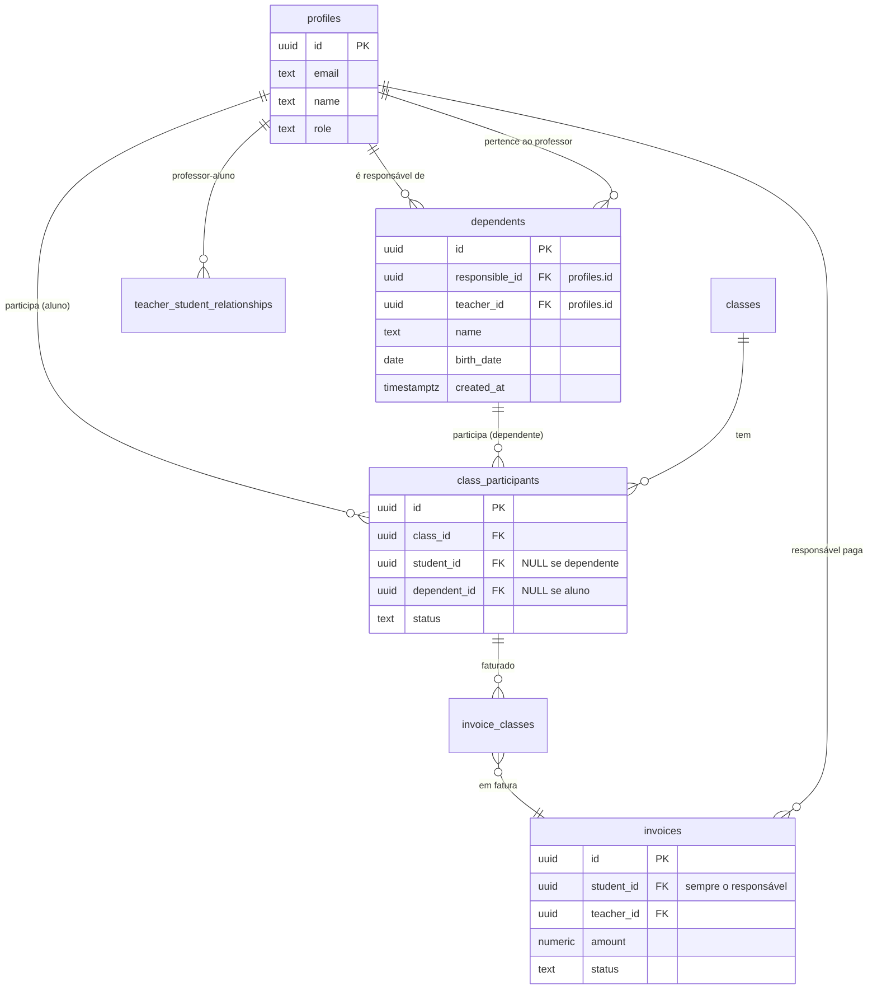
```mermaid
erDiagram
    profiles ||--o{ dependents : "é responsável de"
    profiles ||--o{ teacher_student_relationships : "professor-aluno"
    profiles ||--o{ class_participants : "participa (aluno)"
    dependents ||--o{ class_participants : "participa (dependente)"
    dependents }o--|| profiles : "pertence ao professor"
    classes ||--o{ class_participants : "tem"
    class_participants ||--o{ invoice_classes : "faturado"
    invoice_classes }o--|| invoices : "em fatura"
    invoices }o--|| profiles : "responsável paga"
    
    profiles {
        uuid id PK
        text email
        text name
        text role
    }
    
    dependents {
        uuid id PK
        uuid responsible_id FK "profiles.id"
        uuid teacher_id FK "profiles.id"
        text name
        date birth_date
        timestamptz created_at
    }
    
    class_participants {
        uuid id PK
        uuid class_id FK
        uuid student_id FK "NULL se dependente"
        uuid dependent_id FK "NULL se aluno"
        text status
    }
    
    invoices {
        uuid id PK
        uuid student_id FK "sempre o responsável"
        uuid teacher_id FK
        numeric amount
        text status
    }
```

### 2.2 Fluxo de Criação de Dependente

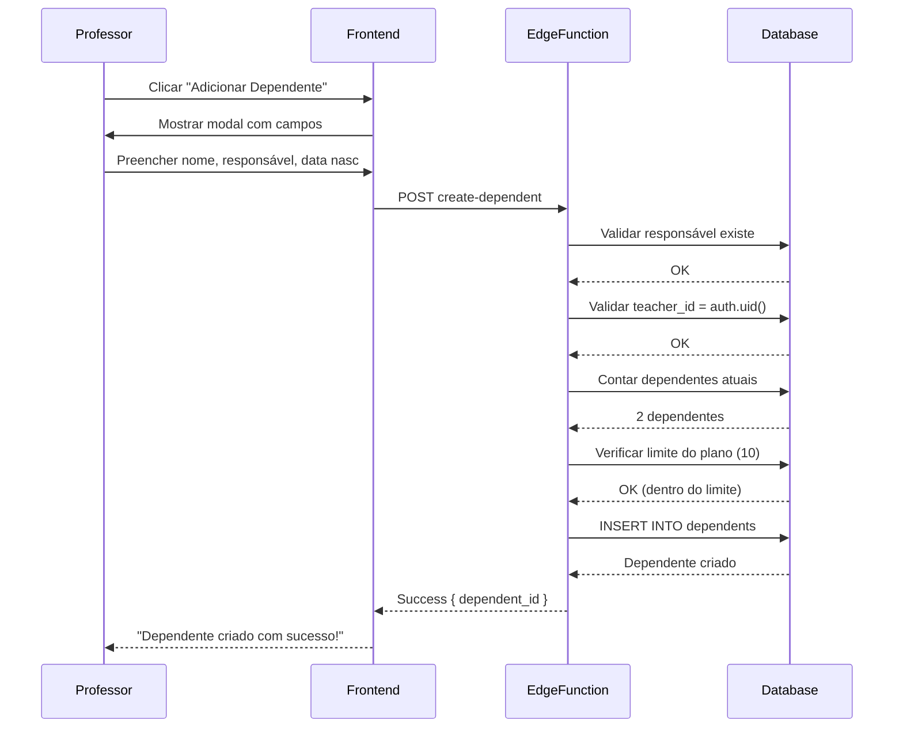
```mermaid
sequenceDiagram
    participant Professor
    participant Frontend
    participant EdgeFunction
    participant Database
    
    Professor->>Frontend: Clicar "Adicionar Dependente"
    Frontend->>Professor: Mostrar modal com campos
    Professor->>Frontend: Preencher nome, responsável, data nasc
    Frontend->>EdgeFunction: POST create-dependent
    
    EdgeFunction->>Database: Validar responsável existe
    Database-->>EdgeFunction: OK
    
    EdgeFunction->>Database: Validar teacher_id = auth.uid()
    Database-->>EdgeFunction: OK
    
    EdgeFunction->>Database: Contar dependentes atuais
    Database-->>EdgeFunction: 2 dependentes
    
    EdgeFunction->>Database: Verificar limite do plano (10)
    Database-->>EdgeFunction: OK (dentro do limite)
    
    EdgeFunction->>Database: INSERT INTO dependents
    Database-->>EdgeFunction: Dependente criado
    
    EdgeFunction-->>Frontend: Success { dependent_id }
    Frontend-->>Professor: "Dependente criado com sucesso!"
```

### 2.3 Fluxo de Faturamento Consolidado

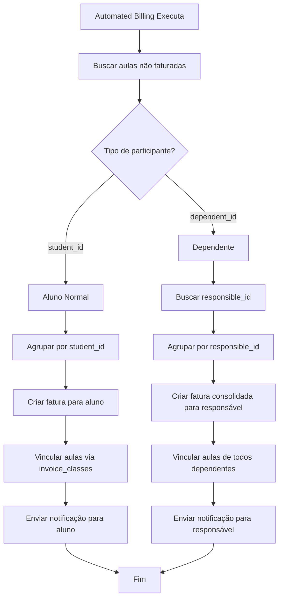
```mermaid
flowchart TD
    Start[Automated Billing Executa] --> GetClasses[Buscar aulas não faturadas]
    GetClasses --> CheckType{Tipo de participante?}
    
    CheckType -->|student_id| NormalStudent[Aluno Normal]
    CheckType -->|dependent_id| DependentStudent[Dependente]
    
    NormalStudent --> GroupByStudent[Agrupar por student_id]
    DependentStudent --> GetResponsible[Buscar responsible_id]
    GetResponsible --> GroupByResponsible[Agrupar por responsible_id]
    
    GroupByStudent --> CreateInvoice1[Criar fatura para aluno]
    GroupByResponsible --> CreateInvoice2[Criar fatura consolidada para responsável]
    
    CreateInvoice1 --> LinkClasses1[Vincular aulas via invoice_classes]
    CreateInvoice2 --> LinkClasses2[Vincular aulas de todos dependentes]
    
    LinkClasses1 --> SendNotif1[Enviar notificação para aluno]
    LinkClasses2 --> SendNotif2[Enviar notificação para responsável]
    
    SendNotif1 --> End[Fim]
    SendNotif2 --> End
```

### 2.4 Decisões Técnicas Importantes

| Decisão | Justificativa |
|---------|---------------|
| **Usar `profiles` para responsável** | Aproveita autenticação, RLS e toda infraestrutura existente |
| **NOT NULL em `dependents.responsible_id`** | Dependente sempre pertence a um responsável |
| **CHECK constraint em `class_participants`** | Garantir que OR student_id OR dependent_id é preenchido |
| **Índices compostos** | Performance em queries que juntam responsible + teacher |
| **Fatura sempre no `responsible_id`** | Simplifica billing, usa `student_id` existente |
| **Dependentes NÃO têm login** | Simplifica segurança, responsável gerencia tudo |

---

## 3. Estrutura de Dados

### 3.1 Nova Tabela: `dependents`

```sql
-- ============================================================
-- TABELA: dependents
-- DESCRIÇÃO: Filhos/dependentes vinculados a um responsável
-- ============================================================

CREATE TABLE public.dependents (
  id UUID PRIMARY KEY DEFAULT gen_random_uuid(),
  
  -- Relacionamentos
  responsible_id UUID NOT NULL REFERENCES public.profiles(id) ON DELETE CASCADE,
  teacher_id UUID NOT NULL REFERENCES public.profiles(id) ON DELETE CASCADE,
  
  -- Dados do dependente
  name TEXT NOT NULL CHECK (char_length(name) >= 2),
  birth_date DATE,
  notes TEXT,
  
  -- Metadados
  created_at TIMESTAMPTZ NOT NULL DEFAULT NOW(),
  updated_at TIMESTAMPTZ NOT NULL DEFAULT NOW(),
  
  -- Constraints
  CONSTRAINT dependents_name_length CHECK (char_length(name) >= 2),
  CONSTRAINT dependents_birth_date_valid CHECK (birth_date <= CURRENT_DATE),
  CONSTRAINT dependents_unique_per_teacher UNIQUE (teacher_id, responsible_id, name)
);

-- Comentários
COMMENT ON TABLE public.dependents IS 'Dependentes (filhos) vinculados a um responsável';
COMMENT ON COLUMN public.dependents.responsible_id IS 'ID do responsável (perfil com login)';
COMMENT ON COLUMN public.dependents.teacher_id IS 'ID do professor que gerencia este dependente';
COMMENT ON COLUMN public.dependents.name IS 'Nome completo do dependente';
COMMENT ON COLUMN public.dependents.birth_date IS 'Data de nascimento (opcional)';

-- Índices para performance
CREATE INDEX idx_dependents_responsible ON public.dependents(responsible_id);
CREATE INDEX idx_dependents_teacher ON public.dependents(teacher_id);
CREATE INDEX idx_dependents_teacher_responsible ON public.dependents(teacher_id, responsible_id);

-- Trigger para updated_at
CREATE TRIGGER update_dependents_updated_at
  BEFORE UPDATE ON public.dependents
  FOR EACH ROW
  EXECUTE FUNCTION public.update_updated_at_column();
```

### 3.2 Modificação: `class_participants`

```sql
-- ============================================================
-- MODIFICAÇÃO: class_participants
-- ADICIONAR: coluna dependent_id
-- ============================================================

-- Adicionar coluna
ALTER TABLE public.class_participants
ADD COLUMN dependent_id UUID REFERENCES public.dependents(id) ON DELETE CASCADE;

-- Índice para performance
CREATE INDEX idx_class_participants_dependent ON public.class_participants(dependent_id);

-- Constraint: deve ter OU student_id OU dependent_id (mas não ambos)
ALTER TABLE public.class_participants
ADD CONSTRAINT check_participant_type 
  CHECK (
    (student_id IS NOT NULL AND dependent_id IS NULL) OR
    (student_id IS NULL AND dependent_id IS NOT NULL)
  );

-- Comentário
COMMENT ON COLUMN public.class_participants.dependent_id IS 'ID do dependente participante (mutuamente exclusivo com student_id)';
```

### 3.3 Modificação: `material_access`

```sql
-- ============================================================
-- MODIFICAÇÃO: material_access
-- ADICIONAR: coluna dependent_id
-- ============================================================

-- Adicionar coluna
ALTER TABLE public.material_access
ADD COLUMN dependent_id UUID REFERENCES public.dependents(id) ON DELETE CASCADE;

-- Índice para performance
CREATE INDEX idx_material_access_dependent ON public.material_access(dependent_id);

-- Constraint: deve ter OU student_id OU dependent_id (mas não ambos)
ALTER TABLE public.material_access
ADD CONSTRAINT check_material_access_type 
  CHECK (
    (student_id IS NOT NULL AND dependent_id IS NULL) OR
    (student_id IS NULL AND dependent_id IS NOT NULL)
  );

-- Comentário
COMMENT ON COLUMN public.material_access.dependent_id IS 'ID do dependente com acesso (mutuamente exclusivo com student_id)';
```

### 3.4 Modificação: `class_report_feedbacks`

```sql
-- ============================================================
-- MODIFICAÇÃO: class_report_feedbacks
-- ADICIONAR: coluna dependent_id
-- ============================================================

-- Adicionar coluna
ALTER TABLE public.class_report_feedbacks
ADD COLUMN dependent_id UUID REFERENCES public.dependents(id) ON DELETE CASCADE;

-- Índice para performance
CREATE INDEX idx_class_report_feedbacks_dependent ON public.class_report_feedbacks(dependent_id);

-- Constraint: deve ter OU student_id OU dependent_id (mas não ambos)
ALTER TABLE public.class_report_feedbacks
ADD CONSTRAINT check_feedback_type 
  CHECK (
    (student_id IS NOT NULL AND dependent_id IS NULL) OR
    (student_id IS NULL AND dependent_id IS NOT NULL)
  );

-- Comentário
COMMENT ON COLUMN public.class_report_feedbacks.dependent_id IS 'ID do dependente que recebeu feedback (mutuamente exclusivo com student_id)';
```

### 3.5 Políticas RLS

```sql
-- ============================================================
-- RLS POLICIES: dependents
-- ============================================================

-- Habilitar RLS
ALTER TABLE public.dependents ENABLE ROW LEVEL SECURITY;

-- 1. Professores podem ver APENAS seus próprios dependentes
CREATE POLICY "Professores veem seus dependentes"
  ON public.dependents
  FOR SELECT
  USING (
    auth.uid() = teacher_id AND
    is_professor(auth.uid())
  );

-- 2. Professores podem inserir dependentes para si
CREATE POLICY "Professores criam dependentes"
  ON public.dependents
  FOR INSERT
  WITH CHECK (
    auth.uid() = teacher_id AND
    is_professor(auth.uid()) AND
    -- Validar que responsible_id existe e é aluno do professor
    EXISTS (
      SELECT 1 FROM teacher_student_relationships tsr
      WHERE tsr.teacher_id = auth.uid()
        AND tsr.student_id = dependents.responsible_id
    )
  );

-- 3. Professores podem atualizar seus dependentes
CREATE POLICY "Professores atualizam dependentes"
  ON public.dependents
  FOR UPDATE
  USING (
    auth.uid() = teacher_id AND
    is_professor(auth.uid())
  )
  WITH CHECK (
    auth.uid() = teacher_id AND
    is_professor(auth.uid())
  );

-- 4. Professores podem deletar seus dependentes
CREATE POLICY "Professores deletam dependentes"
  ON public.dependents
  FOR DELETE
  USING (
    auth.uid() = teacher_id AND
    is_professor(auth.uid())
  );

-- 5. Responsáveis podem ver seus próprios dependentes
CREATE POLICY "Responsáveis veem dependentes"
  ON public.dependents
  FOR SELECT
  USING (
    auth.uid() = responsible_id
  );

-- ============================================================
-- RLS POLICIES: class_participants (atualizar)
-- ============================================================

-- 6. Responsáveis podem ver participações de seus dependentes
CREATE POLICY "Responsáveis veem participações de dependentes"
  ON public.class_participants
  FOR SELECT
  USING (
    dependent_id IN (
      SELECT id FROM dependents WHERE responsible_id = auth.uid()
    )
  );

-- ============================================================
-- RLS POLICIES: material_access (atualizar)
-- ============================================================

-- 7. Responsáveis podem ver materiais compartilhados com dependentes
CREATE POLICY "Responsáveis veem materiais de dependentes"
  ON public.material_access
  FOR SELECT
  USING (
    dependent_id IN (
      SELECT id FROM dependents WHERE responsible_id = auth.uid()
    )
  );

-- ============================================================
-- RLS POLICIES: class_report_feedbacks (atualizar)
-- ============================================================

-- 8. Responsáveis podem ver feedbacks de dependentes
CREATE POLICY "Responsáveis veem feedbacks de dependentes"
  ON public.class_report_feedbacks
  FOR SELECT
  USING (
    dependent_id IN (
      SELECT id FROM dependents WHERE responsible_id = auth.uid()
    )
  );
```

### 3.6 Funções Helper

```sql
-- ============================================================
-- FUNÇÃO: get_dependent_responsible
-- DESCRIÇÃO: Retorna o ID do responsável dado um dependent_id
-- ============================================================

CREATE OR REPLACE FUNCTION public.get_dependent_responsible(p_dependent_id UUID)
RETURNS UUID
LANGUAGE SQL
STABLE
SECURITY DEFINER
SET search_path = public
AS $$
  SELECT responsible_id
  FROM dependents
  WHERE id = p_dependent_id;
$$;

COMMENT ON FUNCTION public.get_dependent_responsible IS 'Retorna o ID do responsável de um dependente';

-- ============================================================
-- FUNÇÃO: get_teacher_dependents
-- DESCRIÇÃO: Retorna todos dependentes de um professor
-- ============================================================

CREATE OR REPLACE FUNCTION public.get_teacher_dependents(p_teacher_id UUID)
RETURNS TABLE(
  dependent_id UUID,
  dependent_name TEXT,
  responsible_id UUID,
  responsible_name TEXT,
  responsible_email TEXT,
  birth_date DATE,
  created_at TIMESTAMPTZ
)
LANGUAGE SQL
STABLE
SECURITY DEFINER
SET search_path = public
AS $$
  SELECT 
    d.id AS dependent_id,
    d.name AS dependent_name,
    d.responsible_id,
    p.name AS responsible_name,
    p.email AS responsible_email,
    d.birth_date,
    d.created_at
  FROM dependents d
  JOIN profiles p ON p.id = d.responsible_id
  WHERE d.teacher_id = p_teacher_id
  ORDER BY p.name, d.name;
$$;

COMMENT ON FUNCTION public.get_teacher_dependents IS 'Retorna todos dependentes de um professor com dados do responsável';

-- ============================================================
-- FUNÇÃO: count_teacher_students_and_dependents
-- DESCRIÇÃO: Conta alunos + dependentes para limite do plano
-- ============================================================

CREATE OR REPLACE FUNCTION public.count_teacher_students_and_dependents(p_teacher_id UUID)
RETURNS INTEGER
LANGUAGE SQL
STABLE
SECURITY DEFINER
SET search_path = public
AS $$
  SELECT (
    -- Contar alunos normais
    (SELECT COUNT(*) FROM teacher_student_relationships WHERE teacher_id = p_teacher_id)::INTEGER
    +
    -- Contar dependentes
    (SELECT COUNT(*) FROM dependents WHERE teacher_id = p_teacher_id)::INTEGER
  );
$$;

COMMENT ON FUNCTION public.count_teacher_students_and_dependents IS 'Conta total de alunos + dependentes de um professor';

-- ============================================================
-- FUNÇÃO: get_unbilled_participants_v2
-- DESCRIÇÃO: Retorna participantes não faturados incluindo dependentes
-- ============================================================

CREATE OR REPLACE FUNCTION public.get_unbilled_participants_v2(
  p_teacher_id UUID,
  p_responsible_id UUID DEFAULT NULL
)
RETURNS TABLE(
  participant_id UUID,
  class_id UUID,
  student_id UUID,
  dependent_id UUID,
  responsible_id UUID,
  class_date TIMESTAMPTZ,
  service_id UUID,
  charge_applied BOOLEAN,
  class_services JSONB
)
LANGUAGE plpgsql
STABLE
SECURITY DEFINER
SET search_path = public
AS $$
BEGIN
  RETURN QUERY
  SELECT 
    cp.id AS participant_id,
    cp.class_id,
    cp.student_id,
    cp.dependent_id,
    CASE
      -- Se for aluno normal, responsável é ele mesmo
      WHEN cp.student_id IS NOT NULL THEN cp.student_id
      -- Se for dependente, buscar responsible_id
      WHEN cp.dependent_id IS NOT NULL THEN d.responsible_id
    END AS responsible_id,
    c.class_date,
    c.service_id,
    cp.charge_applied,
    jsonb_build_object(
      'id', cs.id,
      'name', cs.name,
      'price', cs.price,
      'description', cs.description
    ) AS class_services
  FROM class_participants cp
  JOIN classes c ON cp.class_id = c.id
  LEFT JOIN dependents d ON cp.dependent_id = d.id
  LEFT JOIN class_services cs ON c.service_id = cs.id
  LEFT JOIN invoice_classes ic ON cp.id = ic.participant_id
  WHERE c.teacher_id = p_teacher_id
    AND cp.status = 'concluida'
    AND ic.id IS NULL  -- Não foi faturado ainda
    AND (
      -- Se p_responsible_id fornecido, filtrar por ele
      p_responsible_id IS NULL OR
      (cp.student_id = p_responsible_id OR d.responsible_id = p_responsible_id)
    )
  ORDER BY c.class_date;
END;
$$;

COMMENT ON FUNCTION public.get_unbilled_participants_v2 IS 'Retorna participantes não faturados (alunos + dependentes) com responsible_id resolvido';
```

---

## 4. Pontas Soltas e Soluções

### 4.1 🔴 CRÍTICO: Contagem de Alunos para Limite do Plano

#### Problema
O hook `useStudentCount` e a função `handle-student-overage` contam apenas `teacher_student_relationships`, ignorando dependentes. Isso permite criar ilimitados dependentes sem pagar overage.

#### Arquivos Afetados
- `src/hooks/useStudentCount.ts`
- `supabase/functions/handle-student-overage/index.ts`
- `supabase/functions/create-student/index.ts`

#### Solução

**Passo 1: Criar função SQL helper**

```sql
-- Já definida na seção 3.6
-- public.count_teacher_students_and_dependents(p_teacher_id UUID)
```

**Passo 2: Atualizar `useStudentCount.ts`**

```typescript
// src/hooks/useStudentCount.ts
import { useState, useEffect } from 'react';
import { supabase } from '@/integrations/supabase/client';

export function useStudentCount() {
  const [studentCount, setStudentCount] = useState<number>(0);
  const [loading, setLoading] = useState(true);

  useEffect(() => {
    const loadStudentCount = async () => {
      try {
        setLoading(true);
        
        const { data: { user } } = await supabase.auth.getUser();
        if (!user) return;

        // MUDANÇA: usar função SQL que conta alunos + dependentes
        const { data, error } = await supabase
          .rpc('count_teacher_students_and_dependents', {
            p_teacher_id: user.id
          });
        
        if (!error && data !== null) {
          setStudentCount(data);
        } else {
          console.error('Error loading student count:', error);
        }
      } catch (error) {
        console.error('Error loading student count:', error);
      } finally {
        setLoading(false);
      }
    };

    loadStudentCount();
  }, []);

  const refreshStudentCount = async () => {
    try {
      const { data: { user } } = await supabase.auth.getUser();
      if (!user) return;

      const { data, error } = await supabase
        .rpc('count_teacher_students_and_dependents', {
          p_teacher_id: user.id
        });
      
      if (!error && data !== null) {
        setStudentCount(data);
      }
    } catch (error) {
      console.error('Error refreshing student count:', error);
    }
  };

  return {
    studentCount,
    loading,
    refreshStudentCount
  };
}
```

**Passo 3: Atualizar `handle-student-overage`**

```typescript
// supabase/functions/handle-student-overage/index.ts

// Código existente para autenticação e setup

// MUDANÇA: contar alunos + dependentes
const { data: countData, error: countError } = await supabaseClient
  .rpc('count_teacher_students_and_dependents', {
    p_teacher_id: userId
  });

if (countError) {
  logStep('error', 'Erro ao contar alunos+dependentes', { error: countError });
  throw new Error('Falha ao verificar contagem');
}

const totalStudents = countData as number;
logStep('info', `Total de alunos + dependentes: ${totalStudents}`);

// ... rest of the code remains the same
```

#### Prioridade
🔴 **CRÍTICA** - Impacto financeiro direto

---

### 4.2 🔴 ALTA: Faturamento Automático

#### Problema
A edge function `automated-billing` busca apenas `class_participants.student_id` para agrupar faturas. Com o modelo de **faturamento consolidado**, todas as aulas do responsável (tanto as suas próprias quanto as de seus dependentes) devem ser agrupadas em uma única fatura.

#### Arquivos Afetados
- `supabase/functions/automated-billing/index.ts`

#### Solução

**Estratégia Simplificada:** Usar a nova função SQL `get_unbilled_participants_v2` que já resolve o `responsible_id` automaticamente.

```typescript
// supabase/functions/automated-billing/index.ts

// Código existente para setup e autenticação

// MUDANÇA: Usar função SQL que já resolve responsible_id
const { data: participants, error: participantsError } = await supabaseClient
  .rpc('get_unbilled_participants_v2', {
    p_teacher_id: teacherId,
    p_responsible_id: null  // Buscar todos
  });

if (participantsError) {
  throw new Error('Erro ao buscar participantes não faturados');
}

// Agrupar por (responsible_id, teacher_id)
const grouped = participants.reduce((acc, p) => {
  const key = `${p.responsible_id}_${p.teacher_id}`;
  if (!acc[key]) {
    acc[key] = {
      responsible_id: p.responsible_id,
      teacher_id: p.teacher_id,
      items: []
    };
  }
  acc[key].items.push(p);
  return acc;
}, {});

// Para cada grupo, criar fatura consolidada
for (const group of Object.values(grouped)) {
  const totalAmount = group.items.reduce((sum, item) => 
    sum + parseFloat(item.class_services.price), 0
  );
  
  // Usar a função atomica create_invoice_and_mark_classes_billed
  const invoiceData = {
    student_id: group.responsible_id,  // Sempre o responsável
    teacher_id: group.teacher_id,
    amount: totalAmount,
    description: `Fatura consolidada - ${group.items.length} aula(s)`,
    due_date: calculateDueDate(billingDay),
    status: 'pendente',
    invoice_type: 'automated',
    business_profile_id: businessProfileId
  };
  
  const classItems = group.items.map(item => ({
    participant_id: item.participant_id,
    class_id: item.class_id,
    item_type: 'regular',
    amount: parseFloat(item.class_services.price),
    description: item.class_services.name
  }));
  
  const { data: result } = await supabaseClient
    .rpc('create_invoice_and_mark_classes_billed', {
      p_invoice_data: invoiceData,
      p_class_items: classItems
    });
  
  if (result.success) {
    // Enviar notificação para o responsável
    await supabaseClient.functions.invoke('send-invoice-notification', {
      body: {
        invoice_id: result.invoice_id,
        notification_type: 'invoice_created'
      }
    });
  }
}
```

**Benefícios:**
- ✅ Faturamento consolidado automático (alunos + dependentes)
- ✅ Usa função SQL otimizada
- ✅ Reutiliza função atômica de criação de faturas
- ✅ Código mais simples e manutenível

#### Prioridade
🔴 **ALTA** - Impacto no faturamento

---

### 4.3 🟠 MÉDIA: Criação Manual de Faturas

#### Problema
Com o modelo de **faturamento consolidado**, ao criar faturas manualmente para dependentes, a fatura deve sempre ser vinculada ao responsável, não ao dependente.

#### Arquivos Afetados
- `src/components/CreateInvoiceModal.tsx`
- `supabase/functions/create-invoice/index.ts`

#### Solução

**Impacto Minimizado:** Como as faturas são sempre consolidadas no responsável, as alterações são mínimas:

```typescript
// supabase/functions/create-invoice/index.ts

// Mudança mínima na lógica de billing
const { student_id } = await req.json();

// Verificar se student_id é um dependente
const { data: dependent } = await supabaseClient
  .from('dependents')
  .select('responsible_id')
  .eq('id', student_id)
  .maybeSingle();

// Se for dependente, faturar o responsável; senão, faturar o próprio aluno
const billedStudentId = dependent ? dependent.responsible_id : student_id;

// Criar fatura
const { data: invoice } = await supabaseClient
  .from('invoices')
  .insert({
    student_id: billedStudentId,  // Sempre responsável se for dependente
    teacher_id: teacherId,
    amount,
    description,
    due_date: dueDate,
    status: 'pendente',
    invoice_type: 'manual'
  })
  .select()
  .single();

// ... rest of code
```

**No Frontend (`CreateInvoiceModal`):**
- ✅ Pode listar dependentes normalmente
- ✅ Não precisa indicar tipo ao selecionar
- ✅ Backend resolve automaticamente quem será faturado
- ✅ Mantém simplicidade da interface

**Nota:** Esta é uma **simplificação importante** - o modelo consolidado reduz drasticamente a complexidade de faturamento manual!

#### Prioridade
🟠 **MÉDIA** - Importante mas não bloqueante (faturamento automático é mais crítico)

---

### 4.4 🟠 ALTA: Notificação de Relatório de Aula

#### Problema
A edge function `send-class-report-notification` busca apenas `profiles` para enviar emails. Dependentes não receberão notificações.

#### Arquivos Afetados
- `supabase/functions/send-class-report-notification/index.ts`

#### Solução

```typescript
// supabase/functions/send-class-report-notification/index.ts

// Código existente para setup e autenticação

// Buscar participantes (alunos E dependentes)
const { data: participants, error: participantsError } = await supabaseAdmin
  .from('class_participants')
  .select(`
    id,
    student_id,
    dependent_id,
    profiles:student_id(
      id,
      name,
      email,
      notification_preferences
    )
  `)
  .eq('class_id', classId);

// Para cada participante
for (const participant of participants) {
  let recipientName: string;
  let recipientEmail: string;
  let notificationPrefs: any;
  
  if (participant.student_id) {
    // Aluno normal
    recipientName = participant.profiles.name;
    recipientEmail = participant.profiles.email;
    notificationPrefs = participant.profiles.notification_preferences;
  } else if (participant.dependent_id) {
    // Dependente -> enviar para o responsável
    const { data: dependent } = await supabaseAdmin
      .from('dependents')
      .select(`
        name,
        responsible_id,
        profiles:responsible_id(
          name,
          email,
          notification_preferences
        )
      `)
      .eq('id', participant.dependent_id)
      .single();
    
    recipientName = dependent.profiles.name; // Nome do responsável
    recipientEmail = dependent.profiles.email;
    notificationPrefs = dependent.profiles.notification_preferences;
    
    // Customizar subject para mencionar o dependente
    subject = `📚 Relatório de Aula - ${dependent.name}`;
  }
  
  // Verificar preferências
  if (notificationPrefs?.class_report_created === false) {
    console.log(`Notificação desabilitada para ${recipientEmail}`);
    continue;
  }
  
  // Enviar email
  await sendEmail({
    to: recipientEmail,
    subject,
    html: htmlContent
  });
}

// Código restante existente
```

#### Prioridade
🟠 **ALTA** - Impacto na experiência do responsável

---

### 4.5 🟡 MÉDIA: Notificação de Material Compartilhado

#### Problema
A edge function `send-material-shared-notification` não aceita `dependent_ids` no array de destinatários.

#### Arquivos Afetados
- `supabase/functions/send-material-shared-notification/index.ts`

#### Solução

```typescript
// supabase/functions/send-material-shared-notification/index.ts

interface NotificationRequest {
  material_id: string;
  student_ids: string[];
  dependent_ids: string[]; // NOVO
}

const { material_id, student_ids, dependent_ids } = 
  await req.json() as NotificationRequest;

// Enviar para alunos normais (código existente)
for (const studentId of student_ids) {
  // ... existing code
}

// NOVO: Enviar para responsáveis de dependentes
for (const dependentId of dependent_ids) {
  const { data: dependent, error: depError } = await supabaseClient
    .from('dependents')
    .select(`
      name,
      responsible_id,
      profiles:responsible_id(
        name,
        email,
        notification_preferences
      )
    `)
    .eq('id', dependentId)
    .single();
  
  if (depError || !dependent) {
    console.error(`Dependente ${dependentId} não encontrado`);
    continue;
  }
  
  // Verificar preferências do responsável
  const prefs = dependent.profiles.notification_preferences;
  if (prefs?.material_shared === false) {
    console.log(`Notificação desabilitada para responsável ${dependent.profiles.email}`);
    continue;
  }
  
  // Customizar email para mencionar o dependente
  const htmlContent = `
    <h1>📎 Novo Material Compartilhado</h1>
    <p>Olá ${dependent.profiles.name},</p>
    <p>Um novo material foi compartilhado com <strong>${dependent.name}</strong>:</p>
    <h2>${material.title}</h2>
    <p>${material.description || ''}</p>
    <p><a href="${siteUrl}/materiais">Acessar material</a></p>
  `;
  
  await sendEmail({
    to: dependent.profiles.email,
    subject: `📎 Material para ${dependent.name}`,
    html: htmlContent
  });
}
```

#### Prioridade
🟡 **MÉDIA** - Funcionalidade importante mas não crítica

---

### 4.6 🟡 MÉDIA: Compartilhamento de Materiais

#### Problema
O componente `ShareMaterialModal` e a tabela `material_access` precisam suportar dependentes.

#### Arquivos Afetados
- `src/components/ShareMaterialModal.tsx`
- Tabela `material_access` (já modificada na seção 3.3)

#### Solução

```typescript
// src/components/ShareMaterialModal.tsx

interface Student {
  id: string;
  name: string;
  email: string;
  type: 'student' | 'dependent';
  responsible_name?: string;
}

const ShareMaterialModal = ({ materialId, isOpen, onClose }) => {
  const [students, setStudents] = useState<Student[]>([]);
  const [selectedIds, setSelectedIds] = useState<string[]>([]);
  
  // Buscar alunos E dependentes
  useEffect(() => {
    const fetchStudents = async () => {
      const { data: { user } } = await supabase.auth.getUser();
      
      // Alunos normais
      const { data: normalStudents } = await supabase
        .rpc('get_teacher_students', { teacher_user_id: user.id });
      
      // Dependentes
      const { data: dependents } = await supabase
        .rpc('get_teacher_dependents', { p_teacher_id: user.id });
      
      const combined: Student[] = [
        ...normalStudents.map(s => ({
          id: s.student_id,
          name: s.student_name,
          email: s.student_email,
          type: 'student' as const
        })),
        ...dependents.map(d => ({
          id: d.dependent_id,
          name: d.dependent_name,
          email: d.responsible_email,
          type: 'dependent' as const,
          responsible_name: d.responsible_name
        }))
      ];
      
      setStudents(combined);
    };
    
    fetchStudents();
  }, []);
  
  const handleShare = async () => {
    const studentIds = selectedIds.filter(id => 
      students.find(s => s.id === id && s.type === 'student')
    );
    
    const dependentIds = selectedIds.filter(id => 
      students.find(s => s.id === id && s.type === 'dependent')
    );
    
    // Inserir em material_access
    const accessRecords = [
      ...studentIds.map(id => ({
        material_id: materialId,
        student_id: id,
        dependent_id: null,
        granted_by: user.id
      })),
      ...dependentIds.map(id => ({
        material_id: materialId,
        student_id: null,
        dependent_id: id,
        granted_by: user.id
      }))
    ];
    
    await supabase.from('material_access').insert(accessRecords);
    
    // Enviar notificações
    await supabase.functions.invoke('send-material-shared-notification', {
      body: {
        material_id: materialId,
        student_ids: studentIds,
        dependent_ids: dependentIds
      }
    });
    
    toast.success('Material compartilhado com sucesso!');
    onClose();
  };
  
  return (
    <Dialog open={isOpen} onOpenChange={onClose}>
      <DialogContent>
        <DialogHeader>
          <DialogTitle>Compartilhar Material</DialogTitle>
        </DialogHeader>
        
        <div className="space-y-2">
          {students.map(student => (
            <div key={student.id} className="flex items-center space-x-2">
              <Checkbox
                id={student.id}
                checked={selectedIds.includes(student.id)}
                onCheckedChange={(checked) => {
                  if (checked) {
                    setSelectedIds([...selectedIds, student.id]);
                  } else {
                    setSelectedIds(selectedIds.filter(id => id !== student.id));
                  }
                }}
              />
              <label htmlFor={student.id}>
                {student.name}
                {student.type === 'dependent' && (
                  <span className="text-sm text-muted-foreground ml-2">
                    (filho de {student.responsible_name})
                  </span>
                )}
              </label>
            </div>
          ))}
        </div>
        
        <DialogFooter>
          <Button variant="outline" onClick={onClose}>Cancelar</Button>
          <Button onClick={handleShare}>Compartilhar</Button>
        </DialogFooter>
      </DialogContent>
    </Dialog>
  );
};
```

#### Prioridade
🟡 **MÉDIA** - Funcionalidade importante

---

### 4.7 🟡 MÉDIA: Relatórios de Aula

#### Problema
O componente `ClassReportModal` salva feedback usando `student_id`, mas dependentes não têm esse campo.

#### Arquivos Afetados
- `src/components/ClassReportModal.tsx`
- Tabela `class_report_feedbacks` (já modificada na seção 3.4)

#### Solução

```typescript
// src/components/ClassReportModal.tsx

// Ao buscar participantes da aula
const { data: participants } = await supabase
  .from('class_participants')
  .select(`
    id,
    student_id,
    dependent_id,
    profiles:student_id(name),
    dependents:dependent_id(name)
  `)
  .eq('class_id', classId);

// Renderizar participantes
const participantsList = participants.map(p => ({
  id: p.id,
  participantType: p.student_id ? 'student' : 'dependent',
  studentId: p.student_id,
  dependentId: p.dependent_id,
  name: p.student_id ? p.profiles.name : p.dependents.name
}));

// Ao salvar feedback individual
const handleSaveFeedback = async (participantId: string, feedback: string) => {
  const participant = participantsList.find(p => p.id === participantId);
  
  await supabase.from('class_report_feedbacks').insert({
    report_id: reportId,
    student_id: participant.studentId,
    dependent_id: participant.dependentId,
    feedback
  });
};
```

#### Prioridade
🟡 **MÉDIA** - Funcionalidade importante

---

### 4.8 🟢 BAIXA: Importação em Massa

#### Problema
O componente `StudentImportDialog` não tem opção para importar dependentes.

#### Arquivos Afetados
- `src/components/students/StudentImportDialog.tsx`

#### Solução

**Adicionar coluna "Tipo" na planilha:**

```typescript
// src/components/students/StudentImportDialog.tsx

// Template XLSX
const template = [
  {
    'Nome': 'João Silva',
    'Email': 'joao@email.com',
    'Tipo': 'aluno', // NOVO: 'aluno' ou 'dependente'
    'Responsável': '', // NOVO: email do responsável (se dependente)
    'Data Nascimento': '2010-05-15' // NOVO: para dependentes
  }
];

// Ao processar importação
const processImport = async (rows: any[]) => {
  for (const row of rows) {
    if (row.Tipo === 'aluno' || !row.Tipo) {
      // Criar aluno normal
      await supabase.functions.invoke('create-student', {
        body: {
          name: row.Nome,
          email: row.Email,
          guardianEmail: row['Email Responsável']
        }
      });
    } else if (row.Tipo === 'dependente') {
      // Buscar ID do responsável
      const { data: responsible } = await supabase
        .from('profiles')
        .select('id')
        .eq('email', row.Responsável)
        .single();
      
      if (!responsible) {
        errors.push(`Responsável ${row.Responsável} não encontrado`);
        continue;
      }
      
      // Criar dependente
      await supabase.functions.invoke('create-dependent', {
        body: {
          name: row.Nome,
          responsibleId: responsible.id,
          birthDate: row['Data Nascimento']
        }
      });
    }
  }
};
```

#### Prioridade
🟢 **BAIXA** - Nice to have

---

### 4.9 🟡 MÉDIA: ClassForm - Seleção de Participantes

#### Problema
O componente `ClassForm` não distingue entre alunos normais e dependentes na seleção de participantes.

#### Arquivos Afetados
- `src/components/ClassForm/ClassForm.tsx`

---

#### Diagrama de Fluxo - Seleção de Participantes

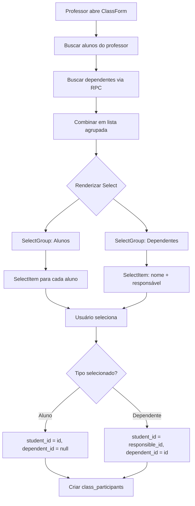
```mermaid
flowchart TD
    A[Professor abre ClassForm] --> B[Buscar alunos do professor]
    B --> C[Buscar dependentes via RPC]
    C --> D[Combinar em lista agrupada]
    D --> E{Renderizar Select}
    
    E --> F[SelectGroup: Alunos]
    F --> G[SelectItem para cada aluno]
    
    E --> H[SelectGroup: Dependentes]
    H --> I[SelectItem: nome + responsável]
    
    G --> J[Usuário seleciona]
    I --> J
    
    J --> K{Tipo selecionado?}
    K -->|Aluno| L[student_id = id, dependent_id = null]
    K -->|Dependente| M[student_id = responsible_id, dependent_id = id]
    
    L --> N[Criar class_participants]
    M --> N
```

---

#### Interfaces TypeScript

```typescript
// src/components/ClassForm/ClassForm.tsx

// Interface para opção de participante no Select
interface ParticipantOption {
  id: string;
  name: string;
  type: 'student' | 'dependent';
  responsibleId?: string;      // Apenas para dependentes
  responsibleName?: string;    // Apenas para dependentes
}

// Interface para dados de dependente vindo da RPC
interface DependentData {
  id: string;
  name: string;
  responsible_id: string;
  birth_date: string | null;
  responsible_name: string;    // Vindo do JOIN com profiles
}

// Interface para seleção de participante no form
interface SelectedParticipant {
  studentId: string | null;
  dependentId: string | null;
}
```

---

#### Função de Agrupamento

```typescript
// src/components/ClassForm/ClassForm.tsx

/**
 * Agrupa alunos e dependentes para exibição no Select
 * @param students - Lista de alunos do professor
 * @param dependents - Lista de dependentes do professor
 * @returns Objeto com grupos separados
 */
const groupParticipantsForSelection = (
  students: Student[],
  dependents: DependentData[]
): { students: ParticipantOption[]; dependents: ParticipantOption[] } => {
  const studentOptions: ParticipantOption[] = students.map(s => ({
    id: s.id,
    name: s.name,
    type: 'student' as const,
  }));

  const dependentOptions: ParticipantOption[] = dependents.map(d => ({
    id: d.id,
    name: d.name,
    type: 'dependent' as const,
    responsibleId: d.responsible_id,
    responsibleName: d.responsible_name,
  }));

  return { students: studentOptions, dependents: dependentOptions };
};
```

---

#### Busca de Dependentes via RPC

```typescript
// No useEffect ou função de carregamento

const loadParticipantOptions = async () => {
  // Buscar alunos (já existente)
  const { data: studentsData } = await supabase
    .from('teacher_student_relationships')
    .select('student_id, profiles:student_id(id, name, email)')
    .eq('teacher_id', teacherId);

  // Buscar dependentes do professor via RPC
  const { data: dependentsData, error: depError } = await supabase
    .rpc('get_teacher_dependents', { p_teacher_id: teacherId });

  if (depError) {
    console.error('Erro ao buscar dependentes:', depError);
  }

  const grouped = groupParticipantsForSelection(
    studentsData?.map(s => s.profiles) || [],
    dependentsData || []
  );

  setStudentOptions(grouped.students);
  setDependentOptions(grouped.dependents);
};
```

---

#### JSX do Select com Grupos

```tsx
// src/components/ClassForm/ClassForm.tsx

<FormField
  control={form.control}
  name="selectedParticipants"
  render={({ field }) => (
    <FormItem>
      <FormLabel>{t('classes.selectParticipants')}</FormLabel>
      <Select
        onValueChange={(value) => {
          // Parsear valor: "student:uuid" ou "dependent:uuid"
          const [type, id] = value.split(':');
          const option = type === 'student'
            ? studentOptions.find(s => s.id === id)
            : dependentOptions.find(d => d.id === id);
          
          if (option) {
            handleParticipantSelect(option);
          }
        }}
      >
        <SelectTrigger>
          <SelectValue placeholder={t('classes.selectParticipantPlaceholder')} />
        </SelectTrigger>
        <SelectContent>
          {/* Grupo: Alunos */}
          {studentOptions.length > 0 && (
            <SelectGroup>
              <SelectLabel className="text-xs font-semibold text-muted-foreground uppercase">
                {t('classes.participantGroups.students')}
              </SelectLabel>
              {studentOptions.map(student => (
                <SelectItem key={`student:${student.id}`} value={`student:${student.id}`}>
                  <div className="flex items-center gap-2">
                    <User className="h-4 w-4 text-muted-foreground" />
                    <span>{student.name}</span>
                  </div>
                </SelectItem>
              ))}
            </SelectGroup>
          )}

          {/* Separador visual */}
          {studentOptions.length > 0 && dependentOptions.length > 0 && (
            <SelectSeparator />
          )}

          {/* Grupo: Dependentes */}
          {dependentOptions.length > 0 && (
            <SelectGroup>
              <SelectLabel className="text-xs font-semibold text-muted-foreground uppercase">
                {t('classes.participantGroups.dependents')}
              </SelectLabel>
              {dependentOptions.map(dep => (
                <SelectItem key={`dependent:${dep.id}`} value={`dependent:${dep.id}`}>
                  <div className="flex items-center gap-2">
                    <Users className="h-4 w-4 text-muted-foreground" />
                    <span>{dep.name}</span>
                    <span className="text-xs text-muted-foreground">
                      ({t('classes.childOf', { name: dep.responsibleName })})
                    </span>
                  </div>
                </SelectItem>
              ))}
            </SelectGroup>
          )}

          {/* Estado vazio */}
          {studentOptions.length === 0 && dependentOptions.length === 0 && (
            <div className="py-6 text-center text-sm text-muted-foreground">
              {t('classes.noParticipantsAvailable')}
            </div>
          )}
        </SelectContent>
      </Select>
      <FormMessage />
    </FormItem>
  )}
/>
```

---

#### Lógica de Seleção de Participante

```typescript
// src/components/ClassForm/ClassForm.tsx

const handleParticipantSelect = (option: ParticipantOption) => {
  // Verificar se já está selecionado
  const isAlreadySelected = selectedParticipants.some(p => 
    (option.type === 'student' && p.studentId === option.id) ||
    (option.type === 'dependent' && p.dependentId === option.id)
  );

  if (isAlreadySelected) {
    toast.warning(t('classes.participantAlreadySelected'));
    return;
  }

  // Adicionar à lista de selecionados
  const newParticipant: SelectedParticipant = {
    studentId: option.type === 'student' ? option.id : option.responsibleId!,
    dependentId: option.type === 'dependent' ? option.id : null,
  };

  setSelectedParticipants(prev => [...prev, newParticipant]);

  // Atualizar badges de participantes selecionados
  const displayInfo = {
    id: option.id,
    name: option.name,
    type: option.type,
    responsibleName: option.responsibleName,
  };
  setSelectedParticipantsDisplay(prev => [...prev, displayInfo]);
};

// Remover participante da seleção
const handleRemoveParticipant = (id: string, type: 'student' | 'dependent') => {
  setSelectedParticipants(prev => prev.filter(p => 
    type === 'student' ? p.studentId !== id : p.dependentId !== id
  ));
  setSelectedParticipantsDisplay(prev => prev.filter(p => p.id !== id));
};
```

---

#### Exibição de Participantes Selecionados

```tsx
{/* Badges dos participantes selecionados */}
{selectedParticipantsDisplay.length > 0 && (
  <div className="flex flex-wrap gap-2 mt-2">
    {selectedParticipantsDisplay.map(p => (
      <Badge 
        key={p.id} 
        variant={p.type === 'student' ? 'default' : 'secondary'}
        className="flex items-center gap-1"
      >
        {p.type === 'dependent' && <Users className="h-3 w-3" />}
        {p.name}
        {p.type === 'dependent' && p.responsibleName && (
          <span className="text-xs opacity-75">
            ({t('classes.childOf', { name: p.responsibleName })})
          </span>
        )}
        <button
          type="button"
          onClick={() => handleRemoveParticipant(p.id, p.type)}
          className="ml-1 hover:text-destructive"
        >
          <X className="h-3 w-3" />
        </button>
      </Badge>
    ))}
  </div>
)}
```

---

#### Submissão do Form com Dependentes

```typescript
// Na função de submit do ClassForm

const onSubmit = async (data: ClassFormData) => {
  // ... validações existentes ...

  // Criar aula
  const { data: classData, error: classError } = await supabase
    .from('classes')
    .insert({
      teacher_id: teacherId,
      class_date: data.datetime,
      service_id: data.serviceId,
      duration_minutes: selectedService?.duration_minutes || 60,
      notes: data.notes,
      status: 'pendente',
      is_group_class: selectedParticipants.length > 1,
    })
    .select()
    .single();

  if (classError) throw classError;

  // Criar participantes (alunos E dependentes)
  const participantsToInsert = selectedParticipants.map(p => ({
    class_id: classData.id,
    student_id: p.studentId,      // Sempre preenchido (aluno ou responsável)
    dependent_id: p.dependentId,  // null para alunos, UUID para dependentes
    status: 'pendente',
  }));

  const { error: participantsError } = await supabase
    .from('class_participants')
    .insert(participantsToInsert);

  if (participantsError) throw participantsError;

  toast.success(t('classes.scheduleSuccess'));
  onSuccess();
};
```

---

#### Traduções i18n

**`src/i18n/locales/pt/classes.json`** (adicionar):
```json
{
  "selectParticipants": "Selecionar Participantes",
  "selectParticipantPlaceholder": "Escolha os alunos ou dependentes",
  "participantGroups": {
    "students": "Alunos",
    "dependents": "Dependentes"
  },
  "childOf": "filho(a) de {{name}}",
  "noParticipantsAvailable": "Nenhum aluno ou dependente disponível",
  "participantAlreadySelected": "Este participante já foi selecionado"
}
```

**`src/i18n/locales/en/classes.json`** (adicionar):
```json
{
  "selectParticipants": "Select Participants",
  "selectParticipantPlaceholder": "Choose students or dependents",
  "participantGroups": {
    "students": "Students",
    "dependents": "Dependents"
  },
  "childOf": "child of {{name}}",
  "noParticipantsAvailable": "No students or dependents available",
  "participantAlreadySelected": "This participant is already selected"
}
```

---

#### Checklist de Validação - ClassForm

| Item | Status | Verificar |
|------|--------|-----------|
| ⬜ | UI | Select exibe grupos separados (Alunos / Dependentes) |
| ⬜ | UI | Dependentes mostram "(filho(a) de X)" |
| ⬜ | UI | Ícones distintos para alunos vs dependentes |
| ⬜ | UI | Badges mostram participantes selecionados |
| ⬜ | UI | Botão X remove participante da seleção |
| ⬜ | Logic | Aluno selecionado: student_id preenchido, dependent_id null |
| ⬜ | Logic | Dependente selecionado: student_id = responsible, dependent_id preenchido |
| ⬜ | DB | class_participants criado corretamente para dependentes |
| ⬜ | Multi | Aula em grupo com alunos + dependentes funciona |
| ⬜ | i18n | Traduções funcionam em PT e EN |
| ⬜ | Empty | Estado vazio quando não há participantes |

#### Prioridade
🟡 **MÉDIA** - Essencial para agendar aulas com dependentes

---

#### Solução (Código Original - Mantido para Referência)

```typescript
// src/components/ClassForm/ClassForm.tsx

interface Participant {
  id: string;
  name: string;
  type: 'student' | 'dependent';
  responsibleName?: string;
}

const ClassForm = () => {
  const [participants, setParticipants] = useState<Participant[]>([]);
  const [selectedParticipants, setSelectedParticipants] = useState<string[]>([]);
  
  // Buscar alunos E dependentes
  useEffect(() => {
    const fetchParticipants = async () => {
      const { data: { user } } = await supabase.auth.getUser();
      
      const { data: students } = await supabase
        .rpc('get_teacher_students', { teacher_user_id: user.id });
      
      const { data: dependents } = await supabase
        .rpc('get_teacher_dependents', { p_teacher_id: user.id });
      
      const combined: Participant[] = [
        ...students.map(s => ({
          id: s.student_id,
          name: s.student_name,
          type: 'student' as const
        })),
        ...dependents.map(d => ({
          id: d.dependent_id,
          name: d.dependent_name,
          type: 'dependent' as const,
          responsibleName: d.responsible_name
        }))
      ];
      
      setParticipants(combined);
    };
    
    fetchParticipants();
  }, []);
  
  const handleSubmit = async () => {
    // Criar aula
    const { data: classData } = await supabase
      .from('classes')
      .insert({
        teacher_id: user.id,
        class_date: formData.date,
        duration_minutes: formData.duration,
        // ... outros campos
      })
      .select()
      .single();
    
    // Criar participantes (alunos E dependentes)
    const participantRecords = selectedParticipants.map(id => {
      const p = participants.find(participant => participant.id === id);
      
      return {
        class_id: classData.id,
        student_id: p.type === 'student' ? p.id : null,
        dependent_id: p.type === 'dependent' ? p.id : null,
        status: 'pendente'
      };
    });
    
    await supabase.from('class_participants').insert(participantRecords);
  };
  
  return (
    <Form>
      {/* ... outros campos */}
      
      <FormField label="Participantes">
        {participants.map(p => (
          <Checkbox
            key={p.id}
            checked={selectedParticipants.includes(p.id)}
            onCheckedChange={(checked) => {
              if (checked) {
                setSelectedParticipants([...selectedParticipants, p.id]);
              } else {
                setSelectedParticipants(selectedParticipants.filter(id => id !== p.id));
              }
            }}
          >
            {p.name}
            {p.type === 'dependent' && (
              <Badge variant="secondary" className="ml-2">
                filho de {p.responsibleName}
              </Badge>
            )}
          </Checkbox>
        ))}
      </FormField>
    </Form>
  );
};
```

#### Prioridade
🟡 **MÉDIA** - Essencial para uso diário

---

### 4.10 🟡 MÉDIA: Histórico de Aulas (Portal do Responsável)

#### Problema
O `StudentDashboard` mostra apenas aulas onde o `student_id = auth.uid()`. Responsáveis não veem aulas dos dependentes.

#### Arquivos Afetados
- `src/pages/StudentDashboard.tsx`

#### Solução

```typescript
// src/pages/StudentDashboard.tsx

const StudentDashboard = () => {
  const [myClasses, setMyClasses] = useState([]);
  const [dependentsClasses, setDependentsClasses] = useState([]);
  const [activeTab, setActiveTab] = useState<'my-classes' | 'dependents'>('my-classes');
  
  useEffect(() => {
    const fetchClasses = async () => {
      const { data: { user } } = await supabase.auth.getUser();
      
      // Minhas aulas (como aluno)
      const { data: myClassesData } = await supabase
        .from('class_participants')
        .select(`
          *,
          classes(*)
        `)
        .eq('student_id', user.id);
      
      setMyClasses(myClassesData);
      
      // Aulas dos meus dependentes
      const { data: dependents } = await supabase
        .from('dependents')
        .select('id, name')
        .eq('responsible_id', user.id);
      
      const dependentIds = dependents.map(d => d.id);
      
      const { data: dependentsClassesData } = await supabase
        .from('class_participants')
        .select(`
          *,
          classes(*),
          dependents(name)
        `)
        .in('dependent_id', dependentIds);
      
      setDependentsClasses(dependentsClassesData);
    };
    
    fetchClasses();
  }, []);
  
  return (
    <div>
      <Tabs value={activeTab} onValueChange={setActiveTab}>
        <TabsList>
          <TabsTrigger value="my-classes">Minhas Aulas</TabsTrigger>
          <TabsTrigger value="dependents">Aulas dos Filhos</TabsTrigger>
        </TabsList>
        
        <TabsContent value="my-classes">
          {/* Renderizar myClasses */}
        </TabsContent>
        
        <TabsContent value="dependents">
          {dependentsClasses.map(c => (
            <Card key={c.id}>
              <CardHeader>
                <CardTitle>{c.dependents.name}</CardTitle>
                <CardDescription>
                  {format(new Date(c.classes.class_date), 'dd/MM/yyyy HH:mm')}
                </CardDescription>
              </CardHeader>
              <CardContent>
                {/* Detalhes da aula */}
              </CardContent>
            </Card>
          ))}
        </TabsContent>
      </Tabs>
    </div>
  );
};
```

#### Prioridade
🟡 **MÉDIA** - Funcionalidade importante para UX

---

### 4.11 🟠 ALTA: Lembretes de Aula

#### Problema
A edge function `send-class-reminders` envia emails apenas para `student_id`, ignorando dependentes.

#### Arquivos Afetados
- `supabase/functions/send-class-reminders/index.ts`

#### Solução

```typescript
// supabase/functions/send-class-reminders/index.ts

// Código existente para setup e autenticação

// Buscar participantes (alunos E dependentes)
const { data: participants, error: participantsError } = await supabaseAdmin
  .from('class_participants')
  .select(`
    id,
    student_id,
    dependent_id,
    class_id,
    profiles:student_id(
      name,
      email,
      notification_preferences
    ),
    classes(
      class_date,
      duration_minutes,
      teacher_id
    )
  `)
  .eq('status', 'confirmada')
  .gte('classes.class_date', tomorrow)
  .lte('classes.class_date', tomorrow + 24h);

// Para cada participante
for (const participant of participants) {
  let recipientName: string;
  let recipientEmail: string;
  let notificationPrefs: any;
  let studentName: string; // Nome do aluno/dependente
  
  if (participant.student_id) {
    // Aluno normal
    recipientName = participant.profiles.name;
    recipientEmail = participant.profiles.email;
    notificationPrefs = participant.profiles.notification_preferences;
    studentName = participant.profiles.name;
  } else if (participant.dependent_id) {
    // Dependente -> enviar para responsável
    const { data: dependent } = await supabaseAdmin
      .from('dependents')
      .select(`
        name,
        responsible_id,
        profiles:responsible_id(
          name,
          email,
          notification_preferences
        )
      `)
      .eq('id', participant.dependent_id)
      .single();
    
    recipientName = dependent.profiles.name;
    recipientEmail = dependent.profiles.email;
    notificationPrefs = dependent.profiles.notification_preferences;
    studentName = dependent.name; // Nome do dependente
  }
  
  // Verificar preferências
  if (notificationPrefs?.class_reminder === false) {
    console.log(`Lembretes desabilitados para ${recipientEmail}`);
    continue;
  }
  
  // Customizar mensagem
  const htmlContent = `
    <h1>🔔 Lembrete de Aula</h1>
    <p>Olá ${recipientName},</p>
    <p>Lembrete: ${studentName} tem aula amanhã às ${formattedTime}.</p>
    <p>Duração: ${participant.classes.duration_minutes} minutos</p>
  `;
  
  await sendEmail({
    to: recipientEmail,
    subject: `🔔 Lembrete: Aula de ${studentName}`,
    html: htmlContent
  });
}
```

#### Prioridade
🟠 **ALTA** - Impacta experiência do responsável

---

### 4.12 🟠 ALTA: Cancelamento de Aulas com Dependentes

#### Problema
As edge functions `process-cancellation` e `send-cancellation-notification` não tratam dependentes corretamente:
- Não buscam `dependent_id` da tabela `class_participants`
- Não resolvem dados do responsável quando o participante é um dependente
- Não validam permissão de responsável para cancelar aulas de dependentes
- Não personalizam emails para mencionar nome do dependente

#### Arquivos Afetados
- `supabase/functions/process-cancellation/index.ts`
- `supabase/functions/send-cancellation-notification/index.ts`
- `src/components/CancellationModal.tsx`
- `src/i18n/locales/pt/cancellation.json`
- `src/i18n/locales/en/cancellation.json`

---

#### Cenários de Cancelamento

| # | Quem Cancela | Para Quem | Notificação Enviada Para | Cobrança Aplicada A |
|---|--------------|-----------|--------------------------|---------------------|
| 1 | Professor | Dependente (aula individual) | Responsável | Responsável |
| 2 | Responsável | Seu dependente | Professor | Responsável |
| 3 | Professor | Aula em grupo mista | Cada destinatário apropriado | Cada responsável/aluno |
| 4 | Aluno normal | Própria aula | Professor | Aluno |
| 5 | Responsável | Aula em grupo (sai da aula) | Professor | Responsável |

---

#### Diagrama de Fluxo

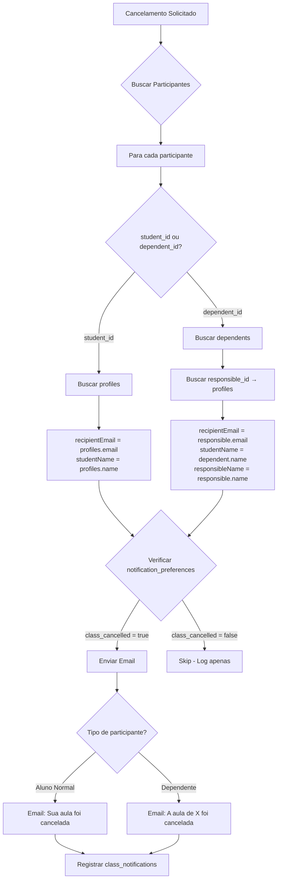
```mermaid
flowchart TD
    A[Cancelamento Solicitado] --> B{Buscar Participantes}
    B --> C[Para cada participante]
    C --> D{student_id ou dependent_id?}
    
    D -->|student_id| E[Buscar profiles]
    E --> F[recipientEmail = profiles.email<br/>studentName = profiles.name]
    
    D -->|dependent_id| G[Buscar dependents]
    G --> H[Buscar responsible_id → profiles]
    H --> I[recipientEmail = responsible.email<br/>studentName = dependent.name<br/>responsibleName = responsible.name]
    
    F --> J{Verificar notification_preferences}
    I --> J
    
    J -->|class_cancelled = true| K[Enviar Email]
    J -->|class_cancelled = false| L[Skip - Log apenas]
    
    K --> M{Tipo de participante?}
    M -->|Aluno Normal| N[Email: Sua aula foi cancelada]
    M -->|Dependente| O[Email: A aula de X foi cancelada]
    
    N --> P[Registrar class_notifications]
    O --> P
```

---

#### Solução Completa

##### 1. `process-cancellation/index.ts`

```typescript
// supabase/functions/process-cancellation/index.ts

// Interface para participante resolvido
interface ResolvedParticipant {
  participantId: string;
  participantType: 'student' | 'dependent';
  studentId: string | null;
  dependentId: string | null;
  recipientEmail: string;
  recipientName: string;
  studentName: string;
  notificationPreferences: any;
  chargeApplied: boolean;
}

// Ao buscar participantes da aula
const { data: participants, error: participantsError } = await supabaseClient
  .from('class_participants')
  .select(`
    id,
    student_id,
    dependent_id,
    status,
    charge_applied
  `)
  .eq('class_id', classId)
  .in('status', ['confirmado', 'pendente']);

if (participantsError) {
  console.error('[PROCESS-CANCELLATION] Error fetching participants:', participantsError);
  throw new Error('Failed to fetch participants');
}

// Resolver dados de cada participante
const resolvedParticipants: ResolvedParticipant[] = [];

for (const participant of participants) {
  let resolved: ResolvedParticipant;

  if (participant.student_id) {
    // Participante é aluno normal
    const { data: profile } = await supabaseClient
      .from('profiles')
      .select('name, email, notification_preferences')
      .eq('id', participant.student_id)
      .single();

    if (!profile) {
      console.warn(`[PROCESS-CANCELLATION] Profile not found for student ${participant.student_id}`);
      continue;
    }

    resolved = {
      participantId: participant.id,
      participantType: 'student',
      studentId: participant.student_id,
      dependentId: null,
      recipientEmail: profile.email,
      recipientName: profile.name,
      studentName: profile.name,
      notificationPreferences: profile.notification_preferences,
      chargeApplied: participant.charge_applied || false
    };

  } else if (participant.dependent_id) {
    // Participante é dependente - buscar dados do dependente e responsável
    const { data: dependent } = await supabaseClient
      .from('dependents')
      .select('id, name, responsible_id')
      .eq('id', participant.dependent_id)
      .single();

    if (!dependent) {
      console.warn(`[PROCESS-CANCELLATION] Dependent not found: ${participant.dependent_id}`);
      continue;
    }

    // Buscar perfil do responsável
    const { data: responsibleProfile } = await supabaseClient
      .from('profiles')
      .select('name, email, notification_preferences')
      .eq('id', dependent.responsible_id)
      .single();

    if (!responsibleProfile) {
      console.warn(`[PROCESS-CANCELLATION] Responsible profile not found: ${dependent.responsible_id}`);
      continue;
    }

    resolved = {
      participantId: participant.id,
      participantType: 'dependent',
      studentId: null,
      dependentId: participant.dependent_id,
      recipientEmail: responsibleProfile.email,
      recipientName: responsibleProfile.name,
      studentName: dependent.name, // Nome do dependente para o email
      notificationPreferences: responsibleProfile.notification_preferences,
      chargeApplied: participant.charge_applied || false
    };

  } else {
    console.warn(`[PROCESS-CANCELLATION] Participant ${participant.id} has no student_id or dependent_id`);
    continue;
  }

  resolvedParticipants.push(resolved);
}

console.log(`[PROCESS-CANCELLATION] Resolved ${resolvedParticipants.length} participants`);

// Atualizar status de cada participante
for (const resolved of resolvedParticipants) {
  await supabaseClient
    .from('class_participants')
    .update({
      status: 'cancelado',
      cancelled_at: new Date().toISOString(),
      cancelled_by: cancelledBy,
      cancellation_reason: cancellationReason,
      charge_applied: chargeApplied
    })
    .eq('id', resolved.participantId);
}

// Enviar notificações
await supabaseClient.functions.invoke('send-cancellation-notification', {
  body: {
    classId,
    classDate: classData.class_date,
    serviceName: serviceData?.name || 'Aula',
    teacherName: teacherProfile.name,
    cancelledByType: cancelledBy === teacherId ? 'teacher' : 'student',
    cancellationReason,
    participants: resolvedParticipants.map(p => ({
      participantId: p.participantId,
      participantType: p.participantType,
      recipientEmail: p.recipientEmail,
      recipientName: p.recipientName,
      studentName: p.studentName,
      chargeApplied: p.chargeApplied,
      notificationPreferences: p.notificationPreferences
    }))
  }
});
```

##### 2. `send-cancellation-notification/index.ts`

```typescript
// supabase/functions/send-cancellation-notification/index.ts

import { serve } from "https://deno.land/std@0.190.0/http/server.ts";
import { createClient } from "https://esm.sh/@supabase/supabase-js@2";
import { sendEmail } from "../_shared/ses-email.ts";

const corsHeaders = {
  'Access-Control-Allow-Origin': '*',
  'Access-Control-Allow-Headers': 'authorization, x-client-info, apikey, content-type',
};

interface ParticipantNotification {
  participantId: string;
  participantType: 'student' | 'dependent';
  recipientEmail: string;
  recipientName: string;
  studentName: string;
  chargeApplied: boolean;
  notificationPreferences: any;
}

interface NotificationRequest {
  classId: string;
  classDate: string;
  serviceName: string;
  teacherName: string;
  cancelledByType: 'teacher' | 'student';
  cancellationReason: string;
  participants: ParticipantNotification[];
}

serve(async (req) => {
  if (req.method === 'OPTIONS') {
    return new Response(null, { headers: corsHeaders });
  }

  try {
    const request: NotificationRequest = await req.json();
    const { classId, classDate, serviceName, teacherName, cancelledByType, cancellationReason, participants } = request;

    console.log(`[SEND-CANCELLATION] Processing ${participants.length} notifications for class ${classId}`);

    const supabaseClient = createClient(
      Deno.env.get('SUPABASE_URL') ?? '',
      Deno.env.get('SUPABASE_SERVICE_ROLE_KEY') ?? ''
    );

    const formattedDate = new Date(classDate).toLocaleDateString('pt-BR', {
      weekday: 'long',
      day: '2-digit',
      month: 'long',
      hour: '2-digit',
      minute: '2-digit'
    });

    const results = { sent: 0, skipped: 0, errors: 0 };

    for (const participant of participants) {
      // Verificar preferências de notificação
      const prefs = participant.notificationPreferences || {};
      if (prefs.class_cancelled === false) {
        console.log(`[SEND-CANCELLATION] Skipping ${participant.recipientEmail} - notifications disabled`);
        results.skipped++;
        continue;
      }

      // Montar assunto do email baseado no tipo de participante
      let subject: string;
      let greeting: string;
      let mainMessage: string;

      if (participant.participantType === 'dependent') {
        // Email para responsável sobre dependente
        subject = `📅 Aula de ${participant.studentName} Cancelada - ${formattedDate}`;
        greeting = `Olá ${participant.recipientName},`;
        mainMessage = `A aula de <strong>${participant.studentName}</strong> foi cancelada.`;
      } else {
        // Email para aluno normal
        subject = `📅 Aula Cancelada - ${formattedDate}`;
        greeting = `Olá ${participant.recipientName},`;
        mainMessage = `Sua aula foi cancelada.`;
      }

      // Montar corpo do email
      const chargeInfo = participant.chargeApplied 
        ? `<p style="color: #dc2626; font-weight: bold;">⚠️ De acordo com a política de cancelamento, uma cobrança será aplicada.</p>`
        : `<p style="color: #16a34a;">✅ Cancelamento gratuito - sem cobrança.</p>`;

      const htmlContent = `
        <!DOCTYPE html>
        <html>
        <head>
          <meta charset="utf-8">
          <title>${subject}</title>
        </head>
        <body style="font-family: Arial, sans-serif; line-height: 1.6; color: #333; max-width: 600px; margin: 0 auto; padding: 20px;">
          <div style="background: linear-gradient(135deg, #6366f1 0%, #8b5cf6 100%); padding: 20px; border-radius: 8px 8px 0 0;">
            <h1 style="color: white; margin: 0; font-size: 24px;">Aula Cancelada</h1>
          </div>
          
          <div style="background: #f9fafb; padding: 20px; border: 1px solid #e5e7eb; border-top: none; border-radius: 0 0 8px 8px;">
            <p>${greeting}</p>
            
            <p>${mainMessage}</p>
            
            <div style="background: white; padding: 15px; border-radius: 8px; margin: 15px 0; border-left: 4px solid #6366f1;">
              <p style="margin: 5px 0;"><strong>📚 Serviço:</strong> ${serviceName}</p>
              <p style="margin: 5px 0;"><strong>📅 Data:</strong> ${formattedDate}</p>
              <p style="margin: 5px 0;"><strong>👨‍🏫 Professor:</strong> ${teacherName}</p>
              ${cancelledByType === 'teacher' 
                ? `<p style="margin: 5px 0;"><strong>ℹ️ Cancelado por:</strong> Professor</p>`
                : `<p style="margin: 5px 0;"><strong>ℹ️ Cancelado por:</strong> Aluno/Responsável</p>`
              }
              ${cancellationReason ? `<p style="margin: 5px 0;"><strong>📝 Motivo:</strong> ${cancellationReason}</p>` : ''}
            </div>
            
            ${chargeInfo}
            
            ${participant.participantType === 'dependent' 
              ? `<p style="font-size: 12px; color: #6b7280; margin-top: 20px;">
                  Este email foi enviado porque você é responsável por ${participant.studentName}.
                </p>`
              : ''
            }
            
            <hr style="border: none; border-top: 1px solid #e5e7eb; margin: 20px 0;">
            
            <p style="font-size: 12px; color: #6b7280;">
              Este é um email automático do Tutor Flow. Por favor, não responda diretamente.
            </p>
          </div>
        </body>
        </html>
      `;

      try {
        await sendEmail({
          to: participant.recipientEmail,
          subject,
          html: htmlContent
        });

        // Registrar notificação
        // Nota: student_id usa o responsável para dependentes (para RLS funcionar)
        await supabaseClient
          .from('class_notifications')
          .insert({
            class_id: classId,
            student_id: participant.participantType === 'dependent' 
              ? (await supabaseClient.from('dependents').select('responsible_id').eq('id', participant.participantId).single()).data?.responsible_id
              : participant.participantId,
            notification_type: participant.chargeApplied ? 'cancellation_with_charge' : 'cancellation_free',
            status: 'sent'
          });

        console.log(`[SEND-CANCELLATION] Email sent to ${participant.recipientEmail}`);
        results.sent++;
      } catch (emailError) {
        console.error(`[SEND-CANCELLATION] Failed to send to ${participant.recipientEmail}:`, emailError);
        results.errors++;
      }
    }

    console.log(`[SEND-CANCELLATION] Completed:`, results);

    return new Response(JSON.stringify({ success: true, results }), {
      headers: { ...corsHeaders, 'Content-Type': 'application/json' }
    });

  } catch (error) {
    console.error('[SEND-CANCELLATION] Error:', error);
    return new Response(JSON.stringify({ error: error.message }), {
      status: 500,
      headers: { ...corsHeaders, 'Content-Type': 'application/json' }
    });
  }
});
```

---

#### Validação de Permissão no Frontend

##### `CancellationModal.tsx`

```typescript
// src/components/CancellationModal.tsx

// Buscar dependentes do usuário logado (se for responsável)
const { data: userDependents } = await supabase
  .from('dependents')
  .select('id')
  .eq('responsible_id', userId);

const userDependentIds = userDependents?.map(d => d.id) || [];

// Verificar se o usuário pode cancelar a aula
const canCancel = useMemo(() => {
  // Professor dono da aula
  if (userId === classData?.teacher_id) return true;
  
  // Aluno participante direto
  if (participants.some(p => p.student_id === userId)) return true;
  
  // Responsável de dependente participante
  if (participants.some(p => 
    p.dependent_id && userDependentIds.includes(p.dependent_id)
  )) return true;
  
  return false;
}, [userId, classData, participants, userDependentIds]);

// Identificar se está cancelando para um dependente
const cancellingForDependent = useMemo(() => {
  const dependentParticipant = participants.find(p => 
    p.dependent_id && userDependentIds.includes(p.dependent_id)
  );
  
  if (dependentParticipant?.dependent_id) {
    // Buscar nome do dependente
    return dependents?.find(d => d.id === dependentParticipant.dependent_id);
  }
  
  return null;
}, [participants, userDependentIds, dependents]);

// No JSX do modal
{cancellingForDependent && (
  <Alert variant="default" className="mb-4">
    <AlertDescription>
      <p className="font-medium">
        {t('cancellation.cancelClassFor', { name: cancellingForDependent.name })}
      </p>
      <p className="text-sm text-muted-foreground mt-1">
        {t('cancellation.chargeAppliedToResponsible')}
      </p>
    </AlertDescription>
  </Alert>
)}
```

---

#### Traduções i18n

##### `pt/cancellation.json` (adicionar)

```json
{
  "cancelClassFor": "Cancelar aula de {{name}}",
  "chargeAppliedToResponsible": "A cobrança será aplicada à sua conta",
  "dependentClassCancelled": "Aula de {{dependentName}} cancelada",
  "dependentEmailNote": "Este email foi enviado porque você é responsável por {{dependentName}}.",
  "cancellingForDependent": "Você está cancelando a aula de {{name}}"
}
```

##### `en/cancellation.json` (adicionar)

```json
{
  "cancelClassFor": "Cancel class for {{name}}",
  "chargeAppliedToResponsible": "The charge will be applied to your account",
  "dependentClassCancelled": "{{dependentName}}'s class cancelled",
  "dependentEmailNote": "This email was sent because you are responsible for {{dependentName}}.",
  "cancellingForDependent": "You are cancelling {{name}}'s class"
}
```

---

#### Validação de Permissão no Frontend

O `CancellationModal.tsx` deve validar se o usuário tem permissão para cancelar a aula:

```typescript
// src/components/CancellationModal.tsx

/**
 * Verifica se o usuário pode cancelar uma aula
 * @param userId - ID do usuário logado
 * @param userRole - Role do usuário ('professor' ou 'aluno')
 * @param classTeacherId - ID do professor da aula
 * @param participants - Lista de participantes da aula
 * @param userDependentIds - IDs dos dependentes do usuário (se for responsável)
 * @returns { canCancel: boolean, reason?: string }
 */
const canUserCancelClass = (
  userId: string,
  userRole: string,
  classTeacherId: string,
  participants: ClassParticipant[],
  userDependentIds: string[]
): { canCancel: boolean; reason?: string } => {
  // Professor pode cancelar qualquer aula sua
  if (userRole === 'professor' && classTeacherId === userId) {
    return { canCancel: true };
  }

  // Aluno pode cancelar se:
  // 1. É participante direto (student_id = userId)
  // 2. É responsável de um dependente participante
  if (userRole === 'aluno') {
    const isDirectParticipant = participants.some(p => p.student_id === userId);
    const hasDependentInClass = participants.some(p => 
      p.dependent_id && userDependentIds.includes(p.dependent_id)
    );

    if (isDirectParticipant || hasDependentInClass) {
      return { canCancel: true };
    }

    return { 
      canCancel: false, 
      reason: 'cancellation.noPermissionToCancel' 
    };
  }

  return { 
    canCancel: false, 
    reason: 'cancellation.unknownUserRole' 
  };
};
```

---

#### Implementação no CancellationModal

```tsx
// src/components/CancellationModal.tsx

// Buscar dependentes do usuário logado (se for aluno)
const { data: userDependents } = await supabase
  .from('dependents')
  .select('id')
  .eq('responsible_id', user.id);

const userDependentIds = userDependents?.map(d => d.id) || [];

// Verificar permissão
const { canCancel, reason } = canUserCancelClass(
  user.id,
  profile.role,
  classData.teacher_id,
  participants,
  userDependentIds
);

// Se não pode cancelar, mostrar erro
if (!canCancel) {
  return (
    <DialogContent>
      <DialogHeader>
        <DialogTitle>{t('cancellation.notAllowed')}</DialogTitle>
      </DialogHeader>
      <Alert variant="destructive">
        <AlertCircle className="h-4 w-4" />
        <AlertDescription>
          {t(reason!)}
        </AlertDescription>
      </Alert>
      <DialogFooter>
        <Button variant="outline" onClick={() => onOpenChange(false)}>
          {t('common.close')}
        </Button>
      </DialogFooter>
    </DialogContent>
  );
}

// Identificar se está cancelando para dependente
const cancellingForDependent = useMemo(() => {
  if (profile?.role !== 'aluno' || !userDependentIds.length) return null;
  
  const dependentParticipant = participants.find(p => 
    p.dependent_id && userDependentIds.includes(p.dependent_id)
  );
  
  if (dependentParticipant) {
    return dependents?.find(d => d.id === dependentParticipant.dependent_id);
  }
  
  return null;
}, [participants, userDependentIds, dependents]);

// Exibir nome do dependente no modal
{cancellingForDependent && (
  <Alert variant="default" className="mb-4">
    <Users className="h-4 w-4" />
    <AlertDescription>
      <p className="font-medium">
        {t('cancellation.cancellingForDependent', { name: cancellingForDependent.name })}
      </p>
      <p className="text-sm text-muted-foreground mt-1">
        {t('cancellation.chargeAppliedToResponsible')}
      </p>
    </AlertDescription>
  </Alert>
)}
```

---

#### Traduções i18n (Adicionar)

**`src/i18n/locales/pt/cancellation.json`:**
```json
{
  "notAllowed": "Cancelamento não permitido",
  "noPermissionToCancel": "Você não tem permissão para cancelar esta aula",
  "unknownUserRole": "Não foi possível verificar sua permissão"
}
```

**`src/i18n/locales/en/cancellation.json`:**
```json
{
  "notAllowed": "Cancellation not allowed",
  "noPermissionToCancel": "You don't have permission to cancel this class",
  "unknownUserRole": "Could not verify your permission"
}
```

---

#### Notas Importantes

| Regra | Descrição |
|-------|-----------|
| **Cobrança** | Sempre aplicada ao responsável, nunca ao dependente (dependentes não têm perfil de pagamento) |
| **Preferências** | Usar `notification_preferences` do responsável, não do dependente |
| **Permissão** | Responsável pode cancelar qualquer aula de seus dependentes |
| **Aulas em Grupo** | Se mista (alunos + dependentes), cada participante recebe email personalizado |
| **Amnistia** | Também deve funcionar para dependentes - aplicada ao responsável |
| **class_notifications** | O `student_id` registrado é o do responsável (para RLS funcionar) |

---

#### Checklist de Validação - Frontend

| Item | Status | Verificar |
|------|--------|-----------|
| ⬜ | Permission | Professor pode cancelar suas aulas |
| ⬜ | Permission | Aluno pode cancelar própria aula |
| ⬜ | Permission | Responsável pode cancelar aula de dependente |
| ⬜ | Permission | Aluno NÃO pode cancelar aula de outro aluno |
| ⬜ | UI | Modal mostra nome do dependente quando aplicável |
| ⬜ | UI | Alerta informa que cobrança vai para responsável |
| ⬜ | Error | Erro exibido quando sem permissão |
| ⬜ | i18n | Traduções funcionam em PT e EN |

#### Checklist de Validação - Backend

- [ ] Professor cancela aula individual de dependente → Responsável recebe email com nome do dependente
- [ ] Responsável cancela aula de dependente → Professor recebe notificação
- [ ] Aula em grupo com aluno + dependente → Cada um recebe email personalizado
- [ ] Cobrança é aplicada corretamente ao responsável
- [ ] Preferências do responsável são respeitadas
- [ ] class_notifications registra corretamente para dependentes

#### Prioridade
🟠 **ALTA** - Impacto direto na comunicação e experiência do responsável

---

### 4.13 🔴 CRÍTICO: Edge Function de Criação de Dependentes

#### Problema
Não existe uma edge function para criar dependentes. Professores não podem criar dependentes via interface.

#### Arquivos Afetados
- `supabase/functions/create-dependent/index.ts` (NOVO)

#### Solução

```typescript
// supabase/functions/create-dependent/index.ts

import { serve } from 'https://deno.land/std@0.168.0/http/server.ts';
import { createClient } from 'https://esm.sh/@supabase/supabase-js@2';

const corsHeaders = {
  'Access-Control-Allow-Origin': '*',
  'Access-Control-Allow-Headers': 'authorization, x-client-info, apikey, content-type',
};

interface CreateDependentRequest {
  name: string;
  responsibleId: string;
  birthDate?: string;
  notes?: string;
}

serve(async (req) => {
  if (req.method === 'OPTIONS') {
    return new Response(null, { headers: corsHeaders });
  }

  try {
    const supabaseClient = createClient(
      Deno.env.get('SUPABASE_URL') ?? '',
      Deno.env.get('SUPABASE_ANON_KEY') ?? '',
      {
        global: {
          headers: { Authorization: req.headers.get('Authorization')! },
        },
      }
    );

    // Verificar autenticação
    const { data: { user }, error: userError } = await supabaseClient.auth.getUser();
    if (userError || !user) {
      throw new Error('Não autenticado');
    }

    // Verificar se é professor
    const { data: profile } = await supabaseClient
      .from('profiles')
      .select('role')
      .eq('id', user.id)
      .single();

    if (profile?.role !== 'professor') {
      throw new Error('Apenas professores podem criar dependentes');
    }

    const { name, responsibleId, birthDate, notes } = await req.json() as CreateDependentRequest;

    // Validações
    if (!name || name.trim().length < 2) {
      throw new Error('Nome do dependente é obrigatório (mín. 2 caracteres)');
    }

    if (!responsibleId) {
      throw new Error('ID do responsável é obrigatório');
    }

    // Verificar se responsável existe e é aluno do professor
    const { data: relationship, error: relError } = await supabaseClient
      .from('teacher_student_relationships')
      .select('id')
      .eq('teacher_id', user.id)
      .eq('student_id', responsibleId)
      .single();

    if (relError || !relationship) {
      throw new Error('Responsável não é aluno deste professor');
    }

    // Contar alunos + dependentes atuais
    const { data: countData, error: countError } = await supabaseClient
      .rpc('count_teacher_students_and_dependents', {
        p_teacher_id: user.id
      });

    if (countError) {
      console.error('Erro ao contar alunos+dependentes:', countError);
      throw new Error('Erro ao verificar limite de alunos');
    }

    // Verificar limite do plano
    const { data: subscription } = await supabaseClient
      .from('user_subscriptions')
      .select(`
        plan_id,
        subscription_plans(student_limit)
      `)
      .eq('user_id', user.id)
      .eq('status', 'active')
      .single();

    const currentCount = countData as number;
    const planLimit = subscription?.subscription_plans?.student_limit || 5;

    if (currentCount >= planLimit) {
      // TODO: Chamar handle-student-overage
      throw new Error(`Limite de ${planLimit} alunos atingido. Faça upgrade ou adicione aluno extra.`);
    }

    // Criar dependente
    const { data: dependent, error: insertError } = await supabaseClient
      .from('dependents')
      .insert({
        name: name.trim(),
        responsible_id: responsibleId,
        teacher_id: user.id,
        birth_date: birthDate || null,
        notes: notes || null
      })
      .select()
      .single();

    if (insertError) {
      console.error('Erro ao criar dependente:', insertError);
      throw new Error('Falha ao criar dependente');
    }

    return new Response(
      JSON.stringify({
        success: true,
        dependent
      }),
      {
        headers: { ...corsHeaders, 'Content-Type': 'application/json' },
        status: 201
      }
    );

  } catch (error) {
    console.error('Erro:', error);
    return new Response(
      JSON.stringify({
        success: false,
        error: error.message
      }),
      {
        headers: { ...corsHeaders, 'Content-Type': 'application/json' },
        status: 400
      }
    );
  }
});
```

#### Prioridade
🔴 **CRÍTICO** - Bloqueador para funcionalidade básica

---

### 4.14 🟠 ALTA: Deleção de Responsável com Dependentes

#### Problema
A edge function `smart-delete-student` não verifica se o aluno é responsável de dependentes antes de deletar.

#### Arquivos Afetados
- `supabase/functions/smart-delete-student/index.ts`

#### Solução

```typescript
// supabase/functions/smart-delete-student/index.ts

// ADICIONAR: Verificar se é responsável de dependentes
const { data: dependents, error: depsError } = await supabaseClient
  .from('dependents')
  .select('id, name')
  .eq('responsible_id', studentId);

if (depsError) {
  throw new Error('Erro ao verificar dependentes');
}

if (dependents && dependents.length > 0) {
  const dependentNames = dependents.map(d => d.name).join(', ');
  
  return new Response(
    JSON.stringify({
      success: false,
      canDelete: false,
      reason: 'responsible_has_dependents',
      message: `Este aluno é responsável por ${dependents.length} dependente(s): ${dependentNames}. Delete os dependentes primeiro ou transfira para outro responsável.`,
      dependents
    }),
    {
      headers: { ...corsHeaders, 'Content-Type': 'application/json' },
      status: 400
    }
  );
}

// ... continuar com a lógica de deleção normal
```

#### Prioridade
🟠 **ALTA** - Prevenir inconsistência de dados

---

### 4.15 🟢 BAIXA: Validação de Dados de Dependentes

#### Problema
Não há validação frontend consistente para dados de dependentes (nome mínimo, data de nascimento futura, etc.).

#### Arquivos Afetados
- Componente de criação de dependentes (NOVO)

#### Solução

```typescript
// src/components/DependentFormModal.tsx

import { z } from 'zod';
import { useForm } from 'react-hook-form';
import { zodResolver } from '@hookform/resolvers/zod';

const dependentSchema = z.object({
  name: z.string()
    .min(2, 'Nome deve ter pelo menos 2 caracteres')
    .max(100, 'Nome muito longo'),
  responsibleId: z.string().uuid('Selecione um responsável válido'),
  birthDate: z.string()
    .optional()
    .refine((date) => {
      if (!date) return true;
      return new Date(date) <= new Date();
    }, 'Data de nascimento não pode ser futura'),
  notes: z.string().max(500, 'Notas muito longas').optional()
});

type DependentFormData = z.infer<typeof dependentSchema>;

const DependentFormModal = ({ isOpen, onClose }) => {
  const form = useForm<DependentFormData>({
    resolver: zodResolver(dependentSchema),
    defaultValues: {
      name: '',
      responsibleId: '',
      birthDate: '',
      notes: ''
    }
  });

  const handleSubmit = async (data: DependentFormData) => {
    const { error } = await supabase.functions.invoke('create-dependent', {
      body: data
    });
    
    if (error) {
      toast.error(error.message);
      return;
    }
    
    toast.success('Dependente criado com sucesso!');
    onClose();
  };

  return (
    <Dialog open={isOpen} onOpenChange={onClose}>
      <DialogContent>
        <Form {...form}>
          <form onSubmit={form.handleSubmit(handleSubmit)}>
            <FormField
              control={form.control}
              name="name"
              render={({ field }) => (
                <FormItem>
                  <FormLabel>Nome do Dependente</FormLabel>
                  <FormControl>
                    <Input {...field} />
                  </FormControl>
                  <FormMessage />
                </FormItem>
              )}
            />
            
            {/* Outros campos */}
          </form>
        </Form>
      </DialogContent>
    </Dialog>
  );
};
```

#### Prioridade
🟢 **BAIXA** - Melhoria de UX

---

### 4.16 🔴 ALTA: Solicitação de Aula pelo Responsável

#### Problema
A edge function `request-class` não suporta que o responsável solicite aulas para seus dependentes. Atualmente, apenas alunos podem solicitar aulas para si mesmos.

#### Arquivos Afetados
- `supabase/functions/request-class/index.ts`

#### Solução

```typescript
// supabase/functions/request-class/index.ts

interface RequestClassPayload {
  teacherId: string;
  datetime: string;
  serviceId: string;
  notes?: string;
  dependentId?: string; // NOVO - se responsável está solicitando para dependente
}

const { teacherId, datetime, serviceId, notes, dependentId } = 
  await req.json() as RequestClassPayload;

// Obter usuário autenticado
const { data: { user } } = await supabaseClient.auth.getUser();
if (!user) throw new Error('Não autenticado');

// Verificar se é aluno
const { data: profile } = await supabaseClient
  .from('profiles')
  .select('role')
  .eq('id', user.id)
  .single();

if (profile.role !== 'aluno') {
  throw new Error('Apenas alunos podem solicitar aulas');
}

let participantStudentId: string | null = null;
let participantDependentId: string | null = null;

if (dependentId) {
  // Validar que o dependente pertence ao responsável
  const { data: dependent, error: depError } = await supabaseClient
    .from('dependents')
    .select('id, responsible_id')
    .eq('id', dependentId)
    .eq('responsible_id', user.id)  // Garante que é filho deste responsável
    .single();
  
  if (depError || !dependent) {
    throw new Error('Dependente não encontrado ou não pertence a você');
  }
  
  participantDependentId = dependentId;
} else {
  // Aula para o próprio aluno
  participantStudentId = user.id;
}

// Verificar relacionamento professor-aluno
const { data: relationship } = await supabaseClient
  .from('teacher_student_relationships')
  .select('id')
  .eq('teacher_id', teacherId)
  .eq('student_id', user.id)  // Sempre validar com o responsável
  .single();

if (!relationship) {
  throw new Error('Você não é aluno deste professor');
}

// Criar aula
const { data: classData } = await supabaseClient
  .from('classes')
  .insert({
    teacher_id: teacherId,
    class_date: datetime,
    service_id: serviceId,
    notes: notes || null,
    status: 'pendente',
    duration_minutes: 60
  })
  .select()
  .single();

// Criar participante
const { data: participant } = await supabaseClient
  .from('class_participants')
  .insert({
    class_id: classData.id,
    student_id: participantStudentId,
    dependent_id: participantDependentId,
    status: 'pendente'
  })
  .select()
  .single();

// Enviar notificação para o professor
await supabaseClient.functions.invoke('send-class-request-notification', {
  body: {
    class_id: classData.id,
    teacher_id: teacherId,
    is_dependent: !!dependentId
  }
});

return new Response(
  JSON.stringify({ success: true, class: classData }),
  { headers: { ...corsHeaders, 'Content-Type': 'application/json' } }
);
```

---

#### Implementação Frontend - StudentScheduleRequest.tsx

```tsx
// src/components/StudentScheduleRequest.tsx

import { useState, useEffect } from 'react';
import { useTranslation } from 'react-i18next';
import { supabase } from '@/integrations/supabase/client';
import { useAuth } from '@/hooks/useAuth';
import { Select, SelectContent, SelectItem, SelectTrigger, SelectValue } from '@/components/ui/select';
import { Label } from '@/components/ui/label';
import { Users, User } from 'lucide-react';

interface Dependent {
  id: string;
  name: string;
}

export function StudentScheduleRequest({ teacherId, onSubmit }: Props) {
  const { t } = useTranslation(['classes', 'students']);
  const { user } = useAuth();
  
  // Estado para dependentes e seleção
  const [dependents, setDependents] = useState<Dependent[]>([]);
  const [selectedRecipient, setSelectedRecipient] = useState<string>('self');
  const [loadingDependents, setLoadingDependents] = useState(false);

  // Buscar dependentes do responsável logado
  useEffect(() => {
    const fetchDependents = async () => {
      if (!user?.id) return;
      
      setLoadingDependents(true);
      const { data, error } = await supabase
        .from('dependents')
        .select('id, name')
        .eq('responsible_id', user.id)
        .eq('teacher_id', teacherId);

      if (!error && data) {
        setDependents(data);
      }
      setLoadingDependents(false);
    };

    fetchDependents();
  }, [user?.id, teacherId]);

  // Handler do submit
  const handleSubmit = async (formData: ClassRequestData) => {
    const dependentId = selectedRecipient !== 'self' ? selectedRecipient : undefined;
    
    await supabase.functions.invoke('request-class', {
      body: {
        teacherId,
        datetime: formData.datetime,
        serviceId: formData.serviceId,
        notes: formData.notes,
        dependentId, // null se for para si mesmo
      },
    });

    onSubmit();
  };

  return (
    <form onSubmit={handleSubmit}>
      {/* Seleção de destinatário (se tem dependentes) */}
      {dependents.length > 0 && (
        <div className="space-y-2 mb-4">
          <Label>{t('classes.requestFor')}</Label>
          <Select
            value={selectedRecipient}
            onValueChange={setSelectedRecipient}
          >
            <SelectTrigger>
              <SelectValue />
            </SelectTrigger>
            <SelectContent>
              {/* Opção: Para mim */}
              <SelectItem value="self">
                <div className="flex items-center gap-2">
                  <User className="h-4 w-4" />
                  <span>{t('classes.forMyself')}</span>
                </div>
              </SelectItem>
              
              {/* Opções: Para cada dependente */}
              {dependents.map(dep => (
                <SelectItem key={dep.id} value={dep.id}>
                  <div className="flex items-center gap-2">
                    <Users className="h-4 w-4" />
                    <span>{t('classes.forDependent', { name: dep.name })}</span>
                  </div>
                </SelectItem>
              ))}
            </SelectContent>
          </Select>
          
          {/* Nota informativa */}
          {selectedRecipient !== 'self' && (
            <p className="text-xs text-muted-foreground">
              {t('classes.dependentRequestNote')}
            </p>
          )}
        </div>
      )}

      {/* ... resto do formulário existente ... */}
    </form>
  );
}
```

---

#### Diagrama de Fluxo - Solicitação de Aula

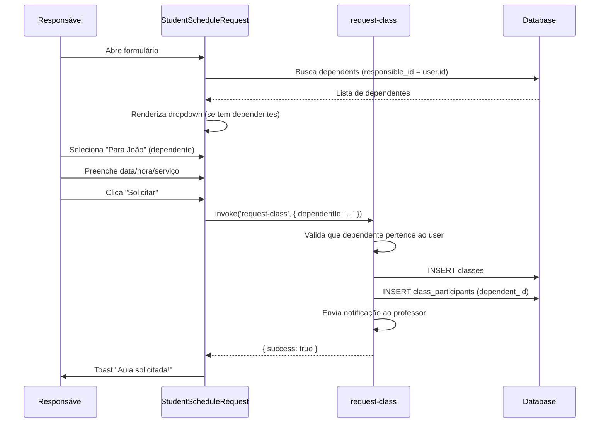
```mermaid
sequenceDiagram
    participant R as Responsável
    participant F as StudentScheduleRequest
    participant E as request-class
    participant DB as Database

    R->>F: Abre formulário
    F->>DB: Busca dependents (responsible_id = user.id)
    DB-->>F: Lista de dependentes
    F->>F: Renderiza dropdown (se tem dependentes)
    
    R->>F: Seleciona "Para João" (dependente)
    R->>F: Preenche data/hora/serviço
    R->>F: Clica "Solicitar"
    
    F->>E: invoke('request-class', { dependentId: '...' })
    E->>E: Valida que dependente pertence ao user
    E->>DB: INSERT classes
    E->>DB: INSERT class_participants (dependent_id)
    E->>E: Envia notificação ao professor
    E-->>F: { success: true }
    
    F->>R: Toast "Aula solicitada!"
```

---

#### Traduções i18n

**`src/i18n/locales/pt/classes.json`** (adicionar):
```json
{
  "requestFor": "Para quem é a aula?",
  "forMyself": "Para mim",
  "forDependent": "Para {{name}}",
  "dependentRequestNote": "A solicitação será enviada ao professor em nome do dependente selecionado."
}
```

**`src/i18n/locales/en/classes.json`** (adicionar):
```json
{
  "requestFor": "Who is the class for?",
  "forMyself": "For myself",
  "forDependent": "For {{name}}",
  "dependentRequestNote": "The request will be sent to the teacher on behalf of the selected dependent."
}
```

---

#### Checklist de Validação - StudentScheduleRequest

| Item | Status | Verificar |
|------|--------|-----------|
| ⬜ | Data | Dependentes do responsável são carregados |
| ⬜ | UI | Dropdown aparece apenas se tem dependentes |
| ⬜ | UI | Opção "Para mim" está sempre disponível |
| ⬜ | UI | Cada dependente aparece com ícone diferente |
| ⬜ | Logic | "Para mim" envia dependentId = null |
| ⬜ | Logic | Dependente selecionado envia dependentId correto |
| ⬜ | Backend | request-class valida que dependente pertence ao user |
| ⬜ | Backend | class_participants criado com dependent_id |
| ⬜ | Notification | Professor recebe notificação com nome do dependente |
| ⬜ | i18n | Traduções funcionam em PT e EN |

#### Prioridade
🔴 **ALTA** - Funcionalidade essencial para responsáveis

---

### 4.17 🔴 ALTA: Notificações para Dependentes

#### Problema
A tabela `class_notifications` possui `student_id NOT NULL`, o que impede registrar notificações para dependentes, já que eles não possuem perfil em `profiles`.

#### Arquivos Afetados
- Tabela `class_notifications`
- Edge functions de notificação

#### Solução

**Opção 1: Adicionar coluna `dependent_id` (RECOMENDADO)**

```sql
-- Adicionar coluna dependent_id na tabela class_notifications
ALTER TABLE public.class_notifications
ADD COLUMN dependent_id UUID REFERENCES public.dependents(id) ON DELETE CASCADE;

-- Criar índice
CREATE INDEX idx_class_notifications_dependent ON public.class_notifications(dependent_id);

-- Atualizar constraint: student_id OU dependent_id (mas não ambos)
ALTER TABLE public.class_notifications
DROP CONSTRAINT IF EXISTS check_notification_recipient_type;

ALTER TABLE public.class_notifications
ADD CONSTRAINT check_notification_recipient_type 
  CHECK (
    (student_id IS NOT NULL AND dependent_id IS NULL) OR
    (student_id IS NULL AND dependent_id IS NOT NULL)
  );

-- Tornar student_id NULLABLE
ALTER TABLE public.class_notifications
ALTER COLUMN student_id DROP NOT NULL;

COMMENT ON COLUMN public.class_notifications.dependent_id IS 'ID do dependente notificado (mutuamente exclusivo com student_id)';
```

**Opção 2: Usar `student_id` do responsável (ALTERNATIVA MAIS SIMPLES)**

Neste caso, quando uma notificação é para um dependente, usamos o `student_id` do **responsável** e adicionamos informação no `notification_type` ou em um campo JSON de metadados.

```sql
-- Adicionar coluna metadata para contexto adicional
ALTER TABLE public.class_notifications
ADD COLUMN metadata JSONB DEFAULT '{}'::jsonb;

CREATE INDEX idx_class_notifications_metadata ON public.class_notifications USING GIN(metadata);

COMMENT ON COLUMN public.class_notifications.metadata IS 'Metadados como dependent_id, dependent_name, etc.';
```

**Recomendação:** Usar **Opção 1** para consistência com outras tabelas (`class_participants`, `material_access`, `class_report_feedbacks`).

#### Prioridade
🔴 **ALTA** - Bloqueador para notificações de dependentes

---

### 4.18 🟡 MÉDIA: Histórico Arquivado com Dependentes

#### Problema
A página `Historico.tsx` e a edge function `fetch-archived-data` não consideram dependentes ao buscar aulas arquivadas.

#### Arquivos Afetados
- `src/pages/Historico.tsx`
- `supabase/functions/fetch-archived-data/index.ts`

#### Solução

```typescript
// supabase/functions/fetch-archived-data/index.ts

// Atualizar interface
interface ArchivedClass {
  id: string;
  class_date: string;
  student_id: string | null;
  dependent_id: string | null;  // NOVO
  student_name: string;
  // ... outros campos
}

// Modificar query
const { data: archivedClasses } = await supabaseClient
  .from('archived_classes')  // Assumindo tabela de arquivo
  .select(`
    *,
    profiles:student_id(name, email),
    dependents:dependent_id(name, responsible_id, profiles:responsible_id(name, email))
  `)
  .eq('teacher_id', teacherId)
  .gte('class_date', startDate)
  .lte('class_date', endDate);

// Processar dados
const processed = archivedClasses.map(c => ({
  ...c,
  student_name: c.student_id 
    ? c.profiles?.name 
    : `${c.dependents?.name} (filho de ${c.dependents?.profiles?.name})`
}));
```

**No Frontend (`Historico.tsx`):**
- Exibir badge "Dependente" quando `dependent_id` presente
- Mostrar nome do responsável quando for dependente

#### Prioridade
🟡 **MÉDIA** - Importante para completude, mas não crítico

---

### 4.19 🔴 CRÍTICA: Função RPC `get_unbilled_participants`

#### Problema
A função RPC `get_unbilled_participants` existente filtra apenas por `student_id`, não considerando dependentes. Isso impede o faturamento consolidado correto.

#### Arquivos Afetados
- Função SQL `get_unbilled_participants` (existente)
- Nova função `get_unbilled_participants_v2`

#### Solução

**Já implementada na Seção 3.6!**

A função `get_unbilled_participants_v2` já foi criada na Seção 3 com suporte completo a dependentes, incluindo:
- ✅ Resolução automática de `responsible_id`
- ✅ Filtro por `p_responsible_id` opcional
- ✅ Join com `dependents` para dependentes
- ✅ Retorna todas as participações não faturadas (alunos + dependentes)

**Ação Necessária:**
- Substituir chamadas de `get_unbilled_participants` por `get_unbilled_participants_v2` em:
  - `automated-billing`
  - `create-invoice` (se aplicável)

#### Prioridade
🔴 **CRÍTICA** - Bloqueador para faturamento consolidado

---

### 4.20 🟡 MÉDIA: Verificação de Inadimplência

#### Problema
A função `has_overdue_invoices` verifica apenas se um `student_id` possui faturas vencidas. Com dependentes, é necessário garantir que o sistema valida corretamente a inadimplência do **responsável**.

#### Arquivos Afetados
- Função SQL `has_overdue_invoices`

#### Solução

**Boa notícia:** Com o modelo de **faturamento consolidado**, as faturas de dependentes **já são vinculadas ao `responsible_id`** (que está em `invoices.student_id`). 

Portanto, `has_overdue_invoices` **já funciona naturalmente** para dependentes, pois:
1. Fatura de dependente é criada com `student_id = responsible_id`
2. Função verifica `WHERE student_id = p_student_id`
3. Logo, a inadimplência é verificada no responsável automaticamente

**Validação necessária:**
```sql
-- Testar que has_overdue_invoices funciona para responsável com dependentes
SELECT has_overdue_invoices('<responsible_id>');
-- Deve retornar TRUE se houver faturas vencidas de qualquer filho
```

**Nenhuma alteração necessária!** ✅

#### Prioridade
🟡 **MÉDIA** - Validação de comportamento existente, não requer implementação

---

### 4.21 🟢 BAIXA: Rastreabilidade de Dependentes em Faturas

#### Problema
A tabela `invoice_classes` não possui `dependent_id`, dificultando rastrear **qual dependente específico** gerou cada item da fatura consolidada.

#### Arquivos Afetados
- Tabela `invoice_classes`

#### Solução

**Opcional, mas recomendado para auditoria:**

```sql
-- Adicionar coluna dependent_id em invoice_classes
ALTER TABLE public.invoice_classes
ADD COLUMN dependent_id UUID REFERENCES public.dependents(id) ON DELETE SET NULL;

CREATE INDEX idx_invoice_classes_dependent ON public.invoice_classes(dependent_id);

COMMENT ON COLUMN public.invoice_classes.dependent_id IS 'ID do dependente que gerou este item (NULL se for aluno normal) - usado para rastreabilidade';
```

**Benefícios:**
- ✅ Permite relatórios detalhados por dependente
- ✅ Facilita auditoria e reconciliação
- ✅ Histórico completo de faturamento por criança

**Impacto:**
- ⚠️ Modificação em `automated-billing` para preencher `dependent_id` ao criar `invoice_classes`

**Decisão:** Implementar apenas se necessário para relatórios. Não é bloqueador.

#### Prioridade
🟢 **BAIXA** - Melhoria de rastreabilidade, não essencial

---

### 4.22 🟠 ALTA: Perfil do Aluno (PerfilAluno.tsx)

#### Problema
A página `PerfilAluno.tsx` exibe informações apenas do aluno visualizado (normal). Quando o professor acessa o perfil de um **responsável**, não há visualização dos **dependentes** vinculados a ele, nem acesso ao histórico de aulas e relatórios de cada filho.

#### Arquivos Afetados
- `src/pages/PerfilAluno.tsx`

#### Cenários de Exibição

**1. Aluno Normal:**
- Exibição padrão atual (sem alterações)
- Informações de contato
- Histórico de aulas
- Faturas

**2. Responsável (com dependentes):**
- **Nova seção:** "Dependentes" logo após as informações básicas
- Lista de dependentes com estatísticas individuais
- Cada dependente pode ser expandido para ver:
  - Histórico de aulas do dependente
  - Relatórios de aulas do dependente
- Botão "Adicionar Dependente" visível

**3. Dependente:**
- Dependentes NÃO têm página própria em `/alunos/:id`
- São exibidos apenas na página do responsável (cenário 2)

#### Solução: Seção Expansível no Perfil do Responsável

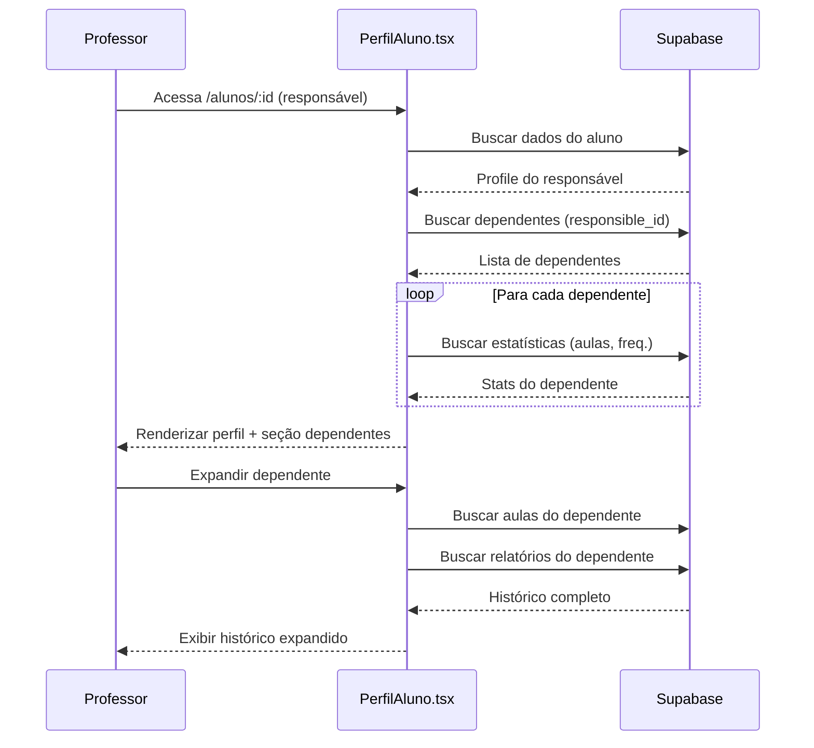
```mermaid
sequenceDiagram
    participant Professor
    participant Frontend as PerfilAluno.tsx
    participant Supabase
    
    Professor->>Frontend: Acessa /alunos/:id (responsável)
    Frontend->>Supabase: Buscar dados do aluno
    Supabase-->>Frontend: Profile do responsável
    
    Frontend->>Supabase: Buscar dependentes (responsible_id)
    Supabase-->>Frontend: Lista de dependentes
    
    loop Para cada dependente
        Frontend->>Supabase: Buscar estatísticas (aulas, freq.)
        Supabase-->>Frontend: Stats do dependente
    end
    
    Frontend-->>Professor: Renderizar perfil + seção dependentes
    
    Professor->>Frontend: Expandir dependente
    Frontend->>Supabase: Buscar aulas do dependente
    Frontend->>Supabase: Buscar relatórios do dependente
    Supabase-->>Frontend: Histórico completo
    Frontend-->>Professor: Exibir histórico expandido
```

#### Implementação

**Interface de Dados:**

```typescript
// src/pages/PerfilAluno.tsx

interface Dependent {
  id: string;
  name: string;
  birth_date: string | null;
  notes: string | null;
  created_at: string;
}

interface DependentStats {
  dependent_id: string;
  total_classes: number;
  attended_classes: number;
  attendance_rate: number;
}

interface DependentClass {
  id: string;
  class_date: string;
  status: string;
  duration_minutes: number;
  notes: string | null;
  service_name: string | null;
  has_report: boolean;
  report_id: string | null;
}
```

**State Management:**

```typescript
// Adicionar ao state existente do componente
const [dependents, setDependents] = useState<Dependent[]>([]);
const [dependentsStats, setDependentsStats] = useState<Record<string, DependentStats>>({});
const [expandedDependent, setExpandedDependent] = useState<string | null>(null);
const [selectedDependentClasses, setSelectedDependentClasses] = useState<DependentClass[]>([]);
const [loadingDependentHistory, setLoadingDependentHistory] = useState(false);
```

**Função de Carregamento:**

```typescript
// Função para carregar dependentes do responsável
const loadDependents = async (responsibleId: string) => {
  try {
    // Buscar dependentes
    const { data: dependentsData, error: depsError } = await supabase
      .from('dependents')
      .select('*')
      .eq('responsible_id', responsibleId)
      .order('name');
    
    if (depsError) throw depsError;
    
    setDependents(dependentsData || []);
    
    // Buscar estatísticas de cada dependente
    const statsPromises = (dependentsData || []).map(async (dep) => {
      const { data: classesData } = await supabase
        .from('class_participants')
        .select('id, status')
        .eq('dependent_id', dep.id);
      
      const total = classesData?.length || 0;
      const attended = classesData?.filter(c => c.status === 'concluida').length || 0;
      const rate = total > 0 ? (attended / total) * 100 : 0;
      
      return {
        dependent_id: dep.id,
        total_classes: total,
        attended_classes: attended,
        attendance_rate: rate
      };
    });
    
    const stats = await Promise.all(statsPromises);
    const statsMap = stats.reduce((acc, stat) => {
      acc[stat.dependent_id] = stat;
      return acc;
    }, {} as Record<string, DependentStats>);
    
    setDependentsStats(statsMap);
  } catch (error) {
    console.error('Erro ao carregar dependentes:', error);
    toast.error('Erro ao carregar dependentes');
  }
};

// Função para expandir dependente e carregar histórico
const handleExpandDependent = async (dependentId: string) => {
  if (expandedDependent === dependentId) {
    // Fechar se já está expandido
    setExpandedDependent(null);
    setSelectedDependentClasses([]);
    return;
  }
  
  setExpandedDependent(dependentId);
  setLoadingDependentHistory(true);
  
  try {
    const { data: classesData, error } = await supabase
      .from('class_participants')
      .select(`
        id,
        status,
        classes!inner(
          id,
          class_date,
          duration_minutes,
          notes,
          service_id,
          class_services(name)
        ),
        class_reports!left(
          id
        )
      `)
      .eq('dependent_id', dependentId)
      .order('classes.class_date', { ascending: false })
      .limit(20);
    
    if (error) throw error;
    
    const processed = classesData?.map(p => ({
      id: p.id,
      class_date: p.classes.class_date,
      status: p.status,
      duration_minutes: p.classes.duration_minutes,
      notes: p.classes.notes,
      service_name: p.classes.class_services?.[0]?.name || 'Aula',
      has_report: p.class_reports?.length > 0,
      report_id: p.class_reports?.[0]?.id || null
    })) || [];
    
    setSelectedDependentClasses(processed);
  } catch (error) {
    console.error('Erro ao carregar histórico:', error);
    toast.error('Erro ao carregar histórico do dependente');
  } finally {
    setLoadingDependentHistory(false);
  }
};
```

**Integração no useEffect:**

```typescript
useEffect(() => {
  const loadStudentData = async () => {
    // ... código existente para carregar dados do aluno
    
    if (studentData) {
      setStudent(studentData);
      
      // NOVO: Verificar se tem dependentes
      await loadDependents(studentData.id);
    }
    
    // ... resto do código
  };
  
  loadStudentData();
}, [id]);
```

**Renderização da Seção de Dependentes:**

```tsx
{/* NOVA SEÇÃO: Dependentes (exibir apenas se houver) */}
{dependents.length > 0 && (
  <Card className="mt-6">
    <CardHeader>
      <CardTitle className="flex items-center gap-2">
        <Users className="h-5 w-5" />
        Dependentes ({dependents.length})
      </CardTitle>
      <CardDescription>
        Filhos/dependentes vinculados a este responsável
      </CardDescription>
    </CardHeader>
    <CardContent className="space-y-4">
      {dependents.map((dependent) => {
        const stats = dependentsStats[dependent.id];
        const isExpanded = expandedDependent === dependent.id;
        
        return (
          <div key={dependent.id} className="border rounded-lg p-4">
            {/* Header do Dependente */}
            <div className="flex items-center justify-between">
              <div className="flex items-center gap-3">
                <Badge variant="secondary">Dependente</Badge>
                <div>
                  <h4 className="font-medium">{dependent.name}</h4>
                  {dependent.birth_date && (
                    <p className="text-sm text-muted-foreground">
                      Nascimento: {format(new Date(dependent.birth_date), 'dd/MM/yyyy')}
                    </p>
                  )}
                </div>
              </div>
              
              <div className="flex items-center gap-2">
                {stats && (
                  <div className="flex gap-4 text-sm text-muted-foreground mr-4">
                    <span>{stats.total_classes} aulas</span>
                    <span>{stats.attendance_rate.toFixed(0)}% freq.</span>
                  </div>
                )}
                
                <Button
                  variant="ghost"
                  size="sm"
                  onClick={() => handleExpandDependent(dependent.id)}
                >
                  {isExpanded ? (
                    <>
                      <ChevronUp className="h-4 w-4 mr-1" />
                      Recolher
                    </>
                  ) : (
                    <>
                      <ChevronDown className="h-4 w-4 mr-1" />
                      Ver Histórico
                    </>
                  )}
                </Button>
              </div>
            </div>
            
            {/* Histórico Expandido */}
            {isExpanded && (
              <div className="mt-4 border-t pt-4">
                {loadingDependentHistory ? (
                  <div className="flex items-center justify-center py-8">
                    <div className="animate-spin rounded-full h-8 w-8 border-b-2 border-primary"></div>
                  </div>
                ) : (
                  <div className="space-y-2">
                    <h5 className="font-medium text-sm mb-3">
                      Histórico de Aulas - {dependent.name}
                    </h5>
                    
                    {selectedDependentClasses.length === 0 ? (
                      <p className="text-sm text-muted-foreground py-4 text-center">
                        Nenhuma aula registrada ainda
                      </p>
                    ) : (
                      <div className="space-y-2">
                        {selectedDependentClasses.map((classItem) => (
                          <div
                            key={classItem.id}
                            className="flex items-center justify-between p-3 bg-muted/50 rounded-md"
                          >
                            <div className="flex-1">
                              <div className="flex items-center gap-2">
                                <span className="font-medium text-sm">
                                  {format(new Date(classItem.class_date), 'dd/MM/yyyy HH:mm')}
                                </span>
                                <Badge variant={getStatusVariant(classItem.status)}>
                                  {classItem.status}
                                </Badge>
                              </div>
                              <p className="text-sm text-muted-foreground mt-1">
                                {classItem.service_name} • {classItem.duration_minutes}min
                              </p>
                            </div>
                            
                            {classItem.has_report && (
                              <Button
                                variant="outline"
                                size="sm"
                                onClick={() => {
                                  setSelectedReportId(classItem.report_id);
                                  setIsReportModalOpen(true);
                                }}
                              >
                                <FileText className="h-4 w-4 mr-1" />
                                Ver Relato
                              </Button>
                            )}
                          </div>
                        ))}
                      </div>
                    )}
                  </div>
                )}
              </div>
            )}
          </div>
        );
      })}
      
      {/* Botão Adicionar Dependente */}
      <Button
        variant="outline"
        className="w-full mt-4"
        onClick={() => {
          // TODO: Abrir modal de criação de dependente
          toast.info('Modal de criação de dependente (implementar)');
        }}
      >
        <Plus className="h-4 w-4 mr-2" />
        Adicionar Dependente
      </Button>
    </CardContent>
  </Card>
)}
```

**Helpers (adicionar se não existirem):**

```typescript
// Helper para variant do badge de status
const getStatusVariant = (status: string) => {
  switch (status) {
    case 'concluida':
      return 'default';
    case 'confirmada':
      return 'secondary';
    case 'pendente':
      return 'outline';
    case 'cancelada':
      return 'destructive';
    default:
      return 'outline';
  }
};
```

#### Benefícios

- ✅ **Visualização consolidada:** Professor vê responsável + todos os filhos em um só lugar
- ✅ **Histórico individual:** Cada dependente tem seu histórico de aulas visível
- ✅ **Estatísticas por dependente:** Frequência e total de aulas por filho
- ✅ **Acesso a relatórios:** Relatórios de aula específicos de cada dependente
- ✅ **Gerenciamento facilitado:** Botão para adicionar novos dependentes
- ✅ **UX intuitiva:** Seções expansíveis mantém interface limpa

#### Integração com DependentManager

O botão "Adicionar Dependente" deve:
1. Abrir um modal com formulário de criação (reutilizar `DependentFormModal`)
2. Pré-preencher `responsible_id` com o ID do aluno visualizado
3. Após criação bem-sucedida, recarregar a lista de dependentes

```typescript
// State para modal
const [isDependentModalOpen, setIsDependentModalOpen] = useState(false);

// No botão
<Button
  variant="outline"
  className="w-full mt-4"
  onClick={() => setIsDependentModalOpen(true)}
>
  <Plus className="h-4 w-4 mr-2" />
  Adicionar Dependente
</Button>

// Componente modal
<DependentFormModal
  isOpen={isDependentModalOpen}
  onClose={() => setIsDependentModalOpen(false)}
  preselectedResponsibleId={student?.id}
  onSuccess={() => {
    loadDependents(student?.id);
    setIsDependentModalOpen(false);
  }}
/>
```

#### Prioridade
🟠 **ALTA** - Funcionalidade essencial para gerenciamento de famílias

---

### 4.23 🟠 ALTA: Listagem de Alunos com Dependentes (Alunos.tsx)

#### Problema

A página `Alunos.tsx` exibe apenas alunos normais em uma tabela flat. Após a implementação do sistema de dependentes, é necessário visualizar **responsáveis com seus dependentes** de forma hierárquica e clara, permitindo expansão inline.

#### Arquivos Afetados

- `src/pages/Alunos.tsx`
- Nova função RPC: `get_teacher_dependents`

---

#### Design Escolhido: Linhas Expansíveis (Accordion)

**Mockup Visual da Tabela:**

```
┌───────────────────────────────────────────────────────────────────────────────────────┐
│  Nome              │ E-mail           │ Tipo      │ Responsável │ Cadastro │ Ações   │
├───────────────────────────────────────────────────────────────────────────────────────┤
│ ▼ 👨 João Silva    │ joao@email.com   │ Aluno     │ Próprio     │ 01/12/24 │ 👁✏🔄🗑 │
├───────────────────────────────────────────────────────────────────────────────────────┤
│ ▼ 👨‍👩‍👧 Ana Costa     │ ana@email.com    │ Família   │ Própria     │ 15/11/24 │ 👁✏➕🗑 │
│    └─ 📌 Pedro Jr  │ —                │ Dependente│ Ana Costa   │ 15/11/24 │ 👁✏🗑   │
│    └─ 📌 Maria Jr  │ —                │ Dependente│ Ana Costa   │ 20/11/24 │ 👁✏🗑   │
├───────────────────────────────────────────────────────────────────────────────────────┤
│   👨 Carlos Santos │ carlos@email.com │ Aluno     │ Próprio     │ 10/11/24 │ 👁✏🔄🗑 │
└───────────────────────────────────────────────────────────────────────────────────────┘
```

**Características do Design:**
- ▼ Chevron expansível apenas em responsáveis com dependentes
- Badges visuais diferenciando tipos (Aluno, Família, Dependente)
- Sub-linhas indentadas para dependentes
- Botão ➕ "Adicionar Dependente" nas linhas de responsáveis
- Contador de dependentes no badge "Família (N)"

---

#### Diagrama de Fluxo de Dados

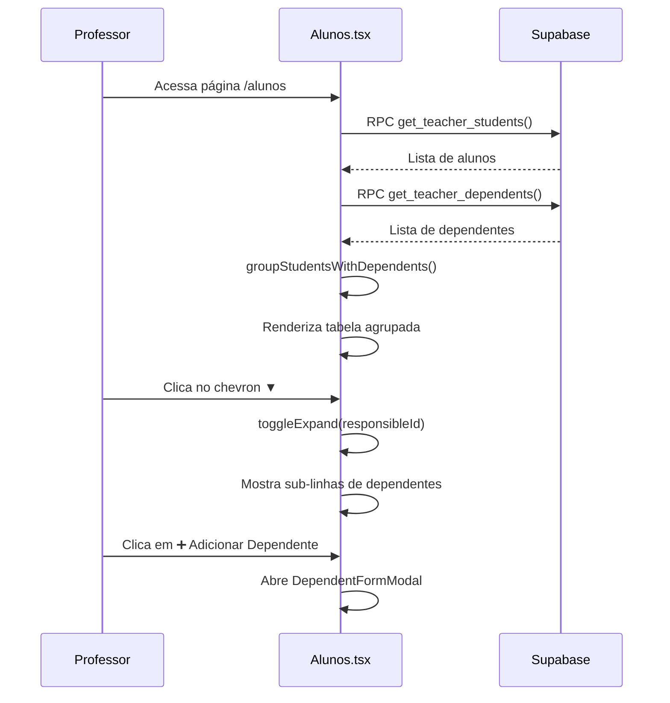
```mermaid
sequenceDiagram
    participant U as Professor
    participant A as Alunos.tsx
    participant S as Supabase
    
    U->>A: Acessa página /alunos
    A->>S: RPC get_teacher_students()
    S-->>A: Lista de alunos
    A->>S: RPC get_teacher_dependents()
    S-->>A: Lista de dependentes
    A->>A: groupStudentsWithDependents()
    A->>A: Renderiza tabela agrupada
    
    U->>A: Clica no chevron ▼
    A->>A: toggleExpand(responsibleId)
    A->>A: Mostra sub-linhas de dependentes
    
    U->>A: Clica em ➕ Adicionar Dependente
    A->>A: Abre DependentFormModal
```

---

#### Nova Função RPC: `get_teacher_dependents`

```sql
-- Função para buscar todos os dependentes dos alunos de um professor
CREATE OR REPLACE FUNCTION get_teacher_dependents(teacher_user_id UUID)
RETURNS TABLE (
  dependent_id UUID,
  dependent_name TEXT,
  birth_date DATE,
  notes TEXT,
  responsible_id UUID,
  responsible_name TEXT,
  responsible_email TEXT,
  created_at TIMESTAMPTZ
)
LANGUAGE plpgsql
SECURITY DEFINER
SET search_path = public
AS $$
BEGIN
  RETURN QUERY
  SELECT 
    d.id AS dependent_id,
    d.name AS dependent_name,
    d.birth_date,
    d.notes,
    d.responsible_id,
    p.name AS responsible_name,
    p.email AS responsible_email,
    d.created_at
  FROM dependents d
  INNER JOIN profiles p ON p.id = d.responsible_id
  WHERE d.teacher_id = teacher_user_id
  ORDER BY p.name, d.name;
END;
$$;

-- Permissão
GRANT EXECUTE ON FUNCTION get_teacher_dependents(UUID) TO authenticated;
```

---

#### Novas Interfaces TypeScript

```typescript
// Interface para dependentes
interface Dependent {
  id: string;
  name: string;
  birth_date?: string;
  notes?: string;
  responsible_id: string;
  responsible_name: string;
  responsible_email: string;
  created_at: string;
}

// Interface para aluno agrupado (com dependentes)
interface StudentWithDependents extends Student {
  type: 'student' | 'responsible';  // 'responsible' se tem dependentes
  dependents: Dependent[];
  dependentCount: number;
}
```

---

#### Novos Estados no Componente

```typescript
// Estados existentes
const [students, setStudents] = useState<Student[]>([]);

// Novos estados
const [dependents, setDependents] = useState<Dependent[]>([]);
const [expandedResponsibles, setExpandedResponsibles] = useState<Set<string>>(new Set());
const [isDependentModalOpen, setIsDependentModalOpen] = useState(false);
const [selectedResponsible, setSelectedResponsible] = useState<Student | null>(null);

// Estado derivado: alunos agrupados com dependentes
const studentsWithDependents = useMemo(() => {
  return groupStudentsWithDependents(students, dependents);
}, [students, dependents]);
```

---

#### Função de Agrupamento

```typescript
function groupStudentsWithDependents(
  students: Student[], 
  dependents: Dependent[]
): StudentWithDependents[] {
  // Criar mapa de dependentes por responsible_id
  const dependentsByResponsible = dependents.reduce((acc, dep) => {
    if (!acc[dep.responsible_id]) {
      acc[dep.responsible_id] = [];
    }
    acc[dep.responsible_id].push(dep);
    return acc;
  }, {} as Record<string, Dependent[]>);

  // Mapear alunos adicionando seus dependentes
  return students.map(student => ({
    ...student,
    type: dependentsByResponsible[student.id] ? 'responsible' : 'student',
    dependents: dependentsByResponsible[student.id] || [],
    dependentCount: (dependentsByResponsible[student.id] || []).length
  }));
}
```

---

#### Função para Carregar Dependentes

```typescript
const loadDependents = async () => {
  if (!profile?.id) return;
  
  try {
    const { data, error } = await supabase.rpc('get_teacher_dependents', {
      teacher_user_id: profile.id
    });
    
    if (error) throw error;
    setDependents(data || []);
  } catch (error) {
    console.error('Erro ao carregar dependentes:', error);
  }
};

// Chamar no useEffect junto com loadStudents
useEffect(() => {
  if (profile?.id) {
    loadStudents();
    loadDependents();
  }
}, [profile]);
```

---

#### Função Toggle de Expansão

```typescript
const toggleExpand = (responsibleId: string) => {
  setExpandedResponsibles(prev => {
    const next = new Set(prev);
    if (next.has(responsibleId)) {
      next.delete(responsibleId);
    } else {
      next.add(responsibleId);
    }
    return next;
  });
};
```

---

#### Renderização da Tabela Expansível (JSX Completo)

```tsx
import { ChevronDown, ChevronRight, Users, UserPlus, User, Eye, Edit, RefreshCcw, Trash2, Mail } from "lucide-react";

// Colunas da tabela atualizadas
<TableHeader>
  <TableRow>
    <TableHead>Nome</TableHead>
    <TableHead>E-mail</TableHead>
    <TableHead>Tipo</TableHead>  {/* NOVA COLUNA */}
    <TableHead>Responsável</TableHead>
    {hasFeature('financial_module') && (
      <>
        <TableHead>Negócio Recebimento</TableHead>
        <TableHead>Dia Cobrança</TableHead>
      </>
    )}
    <TableHead>Data de Cadastro</TableHead>
    <TableHead className="w-[140px]">Ações</TableHead>
  </TableRow>
</TableHeader>

// Corpo da tabela
<TableBody>
  {studentsWithDependents.map(student => (
    <React.Fragment key={student.id}>
      {/* Linha Principal do Aluno/Responsável */}
      <TableRow className={student.type === 'responsible' ? 'bg-muted/30' : ''}>
        <TableCell className="font-medium">
          <div className="flex items-center gap-2">
            {/* Botão de expansão (apenas para responsáveis) */}
            {student.type === 'responsible' ? (
              <Button
                variant="ghost"
                size="sm"
                className="h-6 w-6 p-0"
                onClick={() => toggleExpand(student.id)}
              >
                {expandedResponsibles.has(student.id) 
                  ? <ChevronDown className="h-4 w-4" />
                  : <ChevronRight className="h-4 w-4" />
                }
              </Button>
            ) : (
              <div className="w-6" /> {/* Espaçador para alinhamento */}
            )}
            
            {/* Avatar */}
            <div className="h-8 w-8 rounded-full bg-primary/10 flex items-center justify-center">
              {student.type === 'responsible' 
                ? <Users className="h-4 w-4 text-primary" />
                : <User className="h-4 w-4 text-primary" />
              }
            </div>
            
            {/* Nome */}
            <span>{student.name}</span>
          </div>
        </TableCell>
        
        <TableCell>
          <div className="flex items-center gap-2 text-muted-foreground">
            <Mail className="h-4 w-4" />
            {student.email}
          </div>
        </TableCell>
        
        {/* Badge de Tipo */}
        <TableCell>
          {student.type === 'responsible' ? (
            <Badge variant="secondary" className="bg-purple-100 text-purple-800 dark:bg-purple-900 dark:text-purple-200">
              <Users className="h-3 w-3 mr-1" />
              {t('students.types.family')} ({student.dependentCount})
            </Badge>
          ) : (
            <Badge variant="outline">
              <User className="h-3 w-3 mr-1" />
              {t('students.types.student')}
            </Badge>
          )}
        </TableCell>
        
        {/* Coluna Responsável */}
        <TableCell>
          <span className="text-muted-foreground">{t('students.self')}</span>
        </TableCell>
        
        {/* Colunas de Financial Module (se aplicável) */}
        {hasFeature('financial_module') && (
          <>
            <TableCell>{student.business_name || '—'}</TableCell>
            <TableCell>{student.billing_day || '—'}</TableCell>
          </>
        )}
        
        {/* Data de Cadastro */}
        <TableCell>
          {new Date(student.created_at).toLocaleDateString('pt-BR')}
        </TableCell>
        
        {/* Ações */}
        <TableCell>
          <div className="flex items-center gap-1">
            <Button variant="ghost" size="sm" onClick={() => navigate(`/alunos/${student.id}`)}>
              <Eye className="h-4 w-4" />
            </Button>
            <Button variant="ghost" size="sm" onClick={() => handleEditStudent(student)}>
              <Edit className="h-4 w-4" />
            </Button>
            
            {/* Botão Adicionar Dependente (apenas responsáveis) */}
            {student.type === 'responsible' && (
              <Button 
                variant="ghost" 
                size="sm"
                onClick={() => {
                  setSelectedResponsible(student);
                  setIsDependentModalOpen(true);
                }}
                title={t('students.dependents.addDependent')}
                className="hover:bg-purple-50 dark:hover:bg-purple-950"
              >
                <UserPlus className="h-4 w-4" />
              </Button>
            )}
            
            {/* Reenviar convite (apenas alunos não confirmados) */}
            {!student.email_confirmed && student.type === 'student' && (
              <Button variant="ghost" size="sm" onClick={() => handleResendInvitation(student)}>
                <RefreshCcw className="h-4 w-4" />
              </Button>
            )}
            
            <Button variant="ghost" size="sm" onClick={() => handleConfirmSmartDelete(student)}>
              <Trash2 className="h-4 w-4" />
            </Button>
          </div>
        </TableCell>
      </TableRow>
      
      {/* Sub-linhas de Dependentes (expansíveis) */}
      {student.type === 'responsible' && expandedResponsibles.has(student.id) && (
        student.dependents.map(dep => (
          <TableRow key={dep.id} className="bg-muted/10">
            <TableCell className="font-medium">
              <div className="flex items-center gap-2 pl-10">
                {/* Indicador de hierarquia */}
                <span className="text-muted-foreground">└─</span>
                
                {/* Avatar de dependente */}
                <div className="h-7 w-7 rounded-full bg-purple-100 dark:bg-purple-900 flex items-center justify-center">
                  <User className="h-3 w-3 text-purple-600 dark:text-purple-300" />
                </div>
                
                {/* Nome do dependente */}
                <span className="text-sm">{dep.name}</span>
              </div>
            </TableCell>
            
            <TableCell>
              <span className="text-muted-foreground text-sm">{t('students.dependents.noEmail')}</span>
            </TableCell>
            
            <TableCell>
              <Badge variant="outline" className="text-xs border-purple-200 text-purple-700 dark:border-purple-700 dark:text-purple-300">
                📌 {t('students.types.dependent')}
              </Badge>
            </TableCell>
            
            <TableCell>
              <span className="text-sm text-muted-foreground">{dep.responsible_name}</span>
            </TableCell>
            
            {hasFeature('financial_module') && (
              <>
                <TableCell>
                  <span className="text-muted-foreground text-sm">—</span>
                </TableCell>
                <TableCell>
                  <span className="text-muted-foreground text-sm">—</span>
                </TableCell>
              </>
            )}
            
            <TableCell>
              {new Date(dep.created_at).toLocaleDateString('pt-BR')}
            </TableCell>
            
            <TableCell>
              <div className="flex items-center gap-1">
                <Button variant="ghost" size="sm" onClick={() => navigate(`/dependentes/${dep.id}`)}>
                  <Eye className="h-4 w-4" />
                </Button>
                <Button variant="ghost" size="sm" onClick={() => handleEditDependent(dep)}>
                  <Edit className="h-4 w-4" />
                </Button>
                <Button variant="ghost" size="sm" onClick={() => handleDeleteDependent(dep)}>
                  <Trash2 className="h-4 w-4" />
                </Button>
              </div>
            </TableCell>
          </TableRow>
        ))
      )}
    </React.Fragment>
  ))}
</TableBody>
```

---

#### Atualização do Contador de Alunos

```typescript
// O contador deve incluir dependentes para limite do plano
const totalCount = students.length + dependents.length;

// No CardTitle
<CardTitle className="flex items-center gap-2">
  <User className="h-5 w-5" />
  {t('students.list')} ({students.length})
  {dependents.length > 0 && (
    <span className="text-sm font-normal text-muted-foreground">
      + {dependents.length} {t('students.dependents.label')}
    </span>
  )}
</CardTitle>
```

---

#### Integração com DependentFormModal

```tsx
{/* Modal para adicionar dependente */}
<DependentFormModal
  isOpen={isDependentModalOpen}
  onOpenChange={setIsDependentModalOpen}
  responsible={selectedResponsible}
  onSuccess={() => {
    loadDependents();
    setIsDependentModalOpen(false);
  }}
/>
```

---

#### Edição de Dependentes (Modal Unificado)

O mesmo `DependentFormModal` é usado tanto para criação quanto para edição, seguindo o padrão já estabelecido pelo `StudentFormModal`. A diferença está na prop `dependent` que, quando preenchida, coloca o modal em modo edição.

##### Novo Estado para Edição

```typescript
// Em Alunos.tsx - Estados adicionais para edição
const [selectedDependent, setSelectedDependent] = useState<Dependent | null>(null);
```

##### Função handleEditDependent

```typescript
/**
 * Abre o modal de dependente em modo edição
 * @param dep - Dependente a ser editado
 */
const handleEditDependent = (dep: Dependent) => {
  // Encontra o responsável correspondente
  const responsible = students.find(s => s.id === dep.responsible_id);
  if (responsible) {
    setSelectedResponsible(responsible);
    setSelectedDependent(dep);
    setIsDependentModalOpen(true);
  }
};
```

##### Integração Atualizada do DependentFormModal

```tsx
{/* Modal para adicionar/editar dependente */}
<DependentFormModal
  isOpen={isDependentModalOpen}
  onOpenChange={(open) => {
    setIsDependentModalOpen(open);
    if (!open) {
      setSelectedDependent(null);  // Limpa seleção ao fechar
    }
  }}
  responsible={selectedResponsible}
  dependent={selectedDependent}  // ← NOVA PROP para modo edição
  onSuccess={() => {
    loadDependents();
    setIsDependentModalOpen(false);
    setSelectedDependent(null);
  }}
/>
```

##### Diagrama de Fluxo de Edição

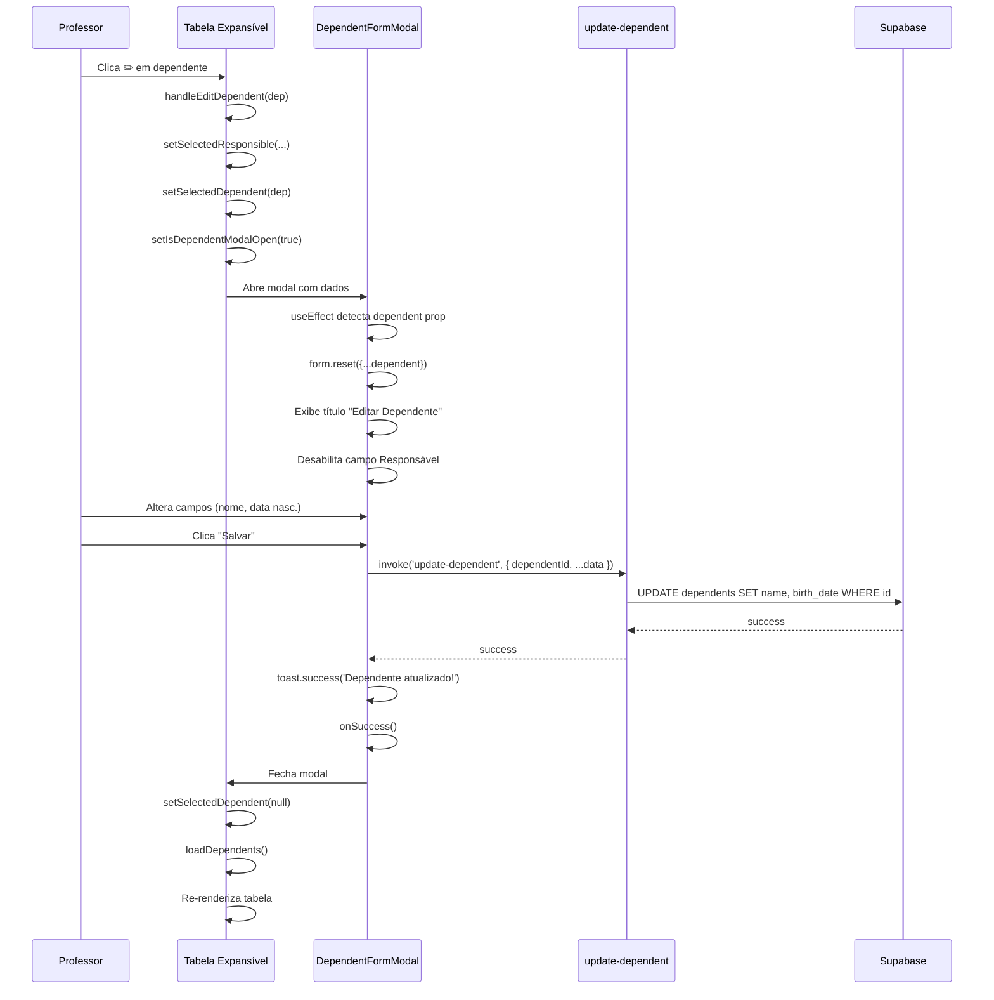
```mermaid
sequenceDiagram
    participant U as Professor
    participant T as Tabela Expansível
    participant M as DependentFormModal
    participant API as update-dependent
    participant DB as Supabase

    U->>T: Clica ✏️ em dependente
    T->>T: handleEditDependent(dep)
    T->>T: setSelectedResponsible(...)
    T->>T: setSelectedDependent(dep)
    T->>T: setIsDependentModalOpen(true)
    T->>M: Abre modal com dados
    
    M->>M: useEffect detecta dependent prop
    M->>M: form.reset({...dependent})
    M->>M: Exibe título "Editar Dependente"
    M->>M: Desabilita campo Responsável
    
    U->>M: Altera campos (nome, data nasc.)
    U->>M: Clica "Salvar"
    
    M->>API: invoke('update-dependent', { dependentId, ...data })
    API->>DB: UPDATE dependents SET name, birth_date WHERE id
    DB-->>API: success
    API-->>M: success
    
    M->>M: toast.success('Dependente atualizado!')
    M->>M: onSuccess()
    M->>T: Fecha modal
    T->>T: setSelectedDependent(null)
    T->>T: loadDependents()
    T->>T: Re-renderiza tabela
```

##### Modificação no JSX da Sub-linha de Dependente

```tsx
{/* Ações na sub-linha de dependente */}
<TableCell className="text-right">
  <div className="flex justify-end gap-1">
    {/* Botão Editar */}
    <Button 
      variant="ghost" 
      size="sm" 
      onClick={() => handleEditDependent(dep)}
      title={t('common.edit')}
    >
      <Edit className="h-4 w-4" />
    </Button>
    
    {/* Botão Ver Perfil */}
    <Button 
      variant="ghost" 
      size="sm" 
      onClick={() => navigate(`/alunos/${dep.responsible_id}?dependent=${dep.id}`)}
      title={t('students.viewProfile')}
    >
      <Eye className="h-4 w-4" />
    </Button>
    
    {/* Botão Excluir */}
    <Button 
      variant="ghost" 
      size="sm" 
      onClick={() => handleDeleteDependent(dep)}
      className="text-destructive hover:text-destructive"
      title={t('common.delete')}
    >
      <Trash2 className="h-4 w-4" />
    </Button>
  </div>
</TableCell>
```

##### Comportamento do Modal: Criação vs Edição

| Aspecto | Criação (`dependent={null}`) | Edição (`dependent={...}`) |
|---------|------------------------------|----------------------------|
| **Título** | "Adicionar Dependente" | "Editar Dependente" |
| **Campo Responsável** | Dropdown habilitado | Dropdown desabilitado (readonly) |
| **Valores iniciais** | Campos vazios | Preenchidos do `dependent` |
| **Botão Submit** | "Adicionar" | "Salvar" |
| **Edge Function** | `create-dependent` | `update-dependent` |
| **Toast sucesso** | "Dependente adicionado!" | "Dependente atualizado!" |

##### Lógica Interna do DependentFormModal (Modo Edição)

```tsx
// Em DependentFormModal.tsx

interface DependentFormModalProps {
  isOpen: boolean;
  onOpenChange: (open: boolean) => void;
  responsible: Student | null;
  dependent?: Dependent | null;  // ← Prop para edição
  onSuccess: () => void;
}

export function DependentFormModal({ 
  isOpen, 
  onOpenChange, 
  responsible,
  dependent,  // ← Pode ser null (criação) ou objeto (edição)
  onSuccess 
}: DependentFormModalProps) {
  const { t } = useTranslation('students');
  const isEditMode = !!dependent;
  
  const form = useForm<DependentFormData>({
    resolver: zodResolver(dependentSchema),
    defaultValues: {
      name: '',
      birth_date: null,
    },
  });
  
  // Preenche form quando abre em modo edição
  useEffect(() => {
    if (isOpen && dependent) {
      form.reset({
        name: dependent.name,
        birth_date: dependent.birth_date ? new Date(dependent.birth_date) : null,
      });
    } else if (isOpen && !dependent) {
      form.reset({ name: '', birth_date: null });
    }
  }, [isOpen, dependent, form]);
  
  const onSubmit = async (data: DependentFormData) => {
    try {
      if (isEditMode) {
        // Modo edição
        await supabase.functions.invoke('update-dependent', {
          body: {
            dependentId: dependent.id,
            name: data.name,
            birthDate: data.birth_date?.toISOString().split('T')[0] || null,
          },
        });
        toast.success(t('dependents.editSuccess'));
      } else {
        // Modo criação
        await supabase.functions.invoke('create-dependent', {
          body: {
            responsibleId: responsible?.id,
            name: data.name,
            birthDate: data.birth_date?.toISOString().split('T')[0] || null,
          },
        });
        toast.success(t('dependents.createSuccess'));
      }
      onSuccess();
    } catch (error) {
      toast.error(isEditMode ? t('dependents.editError') : t('dependents.createError'));
    }
  };
  
  return (
    <Dialog open={isOpen} onOpenChange={onOpenChange}>
      <DialogContent>
        <DialogHeader>
          <DialogTitle>
            {isEditMode ? t('dependents.edit') : t('dependents.addDependent')}
          </DialogTitle>
        </DialogHeader>
        
        <Form {...form}>
          <form onSubmit={form.handleSubmit(onSubmit)} className="space-y-4">
            {/* Campo Responsável - desabilitado em edição */}
            <FormField
              control={form.control}
              name="responsible"
              render={() => (
                <FormItem>
                  <FormLabel>{t('dependents.responsible')}</FormLabel>
                  <Input 
                    value={responsible?.name || ''} 
                    disabled 
                    className={isEditMode ? 'opacity-60' : ''}
                  />
                </FormItem>
              )}
            />
            
            {/* Campo Nome */}
            <FormField
              control={form.control}
              name="name"
              render={({ field }) => (
                <FormItem>
                  <FormLabel>{t('dependents.name')}</FormLabel>
                  <Input {...field} placeholder={t('dependents.namePlaceholder')} />
                  <FormMessage />
                </FormItem>
              )}
            />
            
            {/* Campo Data de Nascimento */}
            <FormField
              control={form.control}
              name="birth_date"
              render={({ field }) => (
                <FormItem>
                  <FormLabel>{t('dependents.birthDate')}</FormLabel>
                  <DatePicker
                    date={field.value}
                    onDateChange={field.onChange}
                  />
                  <FormMessage />
                </FormItem>
              )}
            />
            
            <DialogFooter>
              <Button type="button" variant="outline" onClick={() => onOpenChange(false)}>
                {t('common.cancel')}
              </Button>
              <Button type="submit">
                {isEditMode ? t('common.save') : t('dependents.add')}
              </Button>
            </DialogFooter>
          </form>
        </Form>
      </DialogContent>
    </Dialog>
  );
}
```

---

#### Traduções i18n

**`src/i18n/locales/pt/students.json`:**
```json
{
  "types": {
    "student": "Aluno",
    "family": "Família",
    "dependent": "Dependente"
  },
  "self": "Próprio",
  "dependents": {
    "label": "dependentes",
    "count": "({count} dependentes)",
    "noDependents": "Nenhum dependente",
    "addDependent": "Adicionar Dependente",
    "noEmail": "—",
    "edit": "Editar Dependente",
    "editSuccess": "Dependente atualizado com sucesso",
    "editError": "Erro ao atualizar dependente",
    "createSuccess": "Dependente adicionado com sucesso",
    "createError": "Erro ao adicionar dependente",
    "name": "Nome do Dependente",
    "namePlaceholder": "Digite o nome completo",
    "birthDate": "Data de Nascimento",
    "responsible": "Responsável",
    "add": "Adicionar"
  },
  "badges": {
    "student": "Aluno",
    "family": "Família",
    "dependent": "Dependente"
  }
}
```

**`src/i18n/locales/en/students.json`:**
```json
{
  "types": {
    "student": "Student",
    "family": "Family",
    "dependent": "Dependent"
  },
  "self": "Self",
  "dependents": {
    "label": "dependents",
    "count": "({count} dependents)",
    "noDependents": "No dependents",
    "addDependent": "Add Dependent",
    "noEmail": "—",
    "edit": "Edit Dependent",
    "editSuccess": "Dependent updated successfully",
    "editError": "Error updating dependent",
    "createSuccess": "Dependent added successfully",
    "createError": "Error adding dependent",
    "name": "Dependent Name",
    "namePlaceholder": "Enter full name",
    "birthDate": "Date of Birth",
    "responsible": "Guardian",
    "add": "Add"
  },
  "badges": {
    "student": "Student",
    "family": "Family",
    "dependent": "Dependent"
  }
}
```

---

#### Checklist de Validação - Listagem

| Item | Status | Verificar |
|------|--------|-----------|
| ⬜ | RPC | `get_teacher_dependents` criada e funcionando |
| ⬜ | Data | Dependentes carregam junto com alunos |
| ⬜ | UI | Responsáveis exibem chevron expansível |
| ⬜ | UI | Alunos sem dependentes não têm chevron |
| ⬜ | UI | Sub-linhas indentadas corretamente |
| ⬜ | UI | Badge "Família (N)" mostra contagem correta |
| ⬜ | UI | Botão "Adicionar Dependente" apenas em responsáveis |
| ⬜ | Ações | Ações de dependente funcionam (ver, editar, excluir) |
| ⬜ | Contador | Contador total inclui dependentes |
| ⬜ | i18n | Traduções funcionam em PT e EN |
| ⬜ | Responsivo | Layout funciona em mobile |

---

#### Checklist de Validação - Edição de Dependentes

| Item | Status | Verificar |
|------|--------|-----------|
| ⬜ | UI | Clique no ✏️ abre modal com dados preenchidos |
| ⬜ | UI | Nome do dependente está preenchido e editável |
| ⬜ | UI | Data de nascimento está preenchida e editável |
| ⬜ | UI | Campo "Responsável" exibe nome e está desabilitado |
| ⬜ | UI | Título do modal mostra "Editar Dependente" |
| ⬜ | UI | Botão submit mostra "Salvar" (não "Adicionar") |
| ⬜ | API | Submissão chama `update-dependent` (não create) |
| ⬜ | Feedback | Toast de sucesso "Dependente atualizado" aparece |
| ⬜ | Flow | Modal fecha automaticamente após sucesso |
| ⬜ | Refresh | Tabela atualiza refletindo alterações |
| ⬜ | State | `selectedDependent` é limpo ao fechar modal |
| ⬜ | i18n | Traduções de edição funcionam em PT e EN |

---

#### Notas Importantes

> 📌 **Contagem para Limite de Plano**  
> O contador para verificar limite do plano deve usar `students.length + dependents.length`, não apenas alunos.

> 📌 **Dependentes não têm Email**  
> Dependentes nunca terão email próprio. A coluna de email deve mostrar "—" para eles.

> 📌 **Ações de Responsável**  
> - Ver perfil → navega para `/alunos/{id}` (onde mostra dependentes)
> - Editar → abre `StudentFormModal` 
> - Adicionar Dependente → abre `DependentFormModal`
> - Remover → remove apenas o responsável (dependentes órfãos são tratados pela regra de cascade)

> 📌 **Ações de Dependente**  
> - Ver perfil → navega para `/alunos/{responsibleId}?tab=dependentes&highlight={dependentId}` (redireciona para perfil do responsável com aba de dependentes ativa)
> - Editar → abre `DependentFormModal` em modo edição
> - Remover → confirma e chama `delete-dependent`

> 📌 **Rota `/dependentes/:id` - DECISÃO**  
> Não criar rota separada para dependentes. Em vez disso, redirecionar para o perfil do responsável com parâmetros de query:
> - `/alunos/{responsibleId}?tab=dependentes&highlight={dependentId}`
> - Isso mantém a hierarquia clara e evita proliferação de rotas
> - O highlight pode ser usado para scroll automático ou destaque visual do dependente

> 📌 **Expansão Automática (Opcional)**  
> Considerar expandir automaticamente responsáveis com apenas 1-2 dependentes para melhor UX.

---

### 4.23.2 Exclusão de Dependentes (handleDeleteDependent)

#### Problema
A documentação não incluía a implementação de exclusão de dependentes na tabela de alunos.

#### Solução

##### Estado e Função

```typescript
// Em Alunos.tsx - Adicionar estado
const [dependentToDelete, setDependentToDelete] = useState<Dependent | null>(null);
const [isDeleting, setIsDeleting] = useState(false);

// Função para iniciar exclusão
const handleDeleteDependent = (dep: Dependent) => {
  setDependentToDelete(dep);
};

// Função para confirmar exclusão
const handleConfirmDeleteDependent = async () => {
  if (!dependentToDelete) return;
  
  setIsDeleting(true);
  try {
    const { error } = await supabase.functions.invoke('delete-dependent', {
      body: { dependentId: dependentToDelete.id },
    });

    if (error) throw error;

    toast.success(t('dependents.deleteSuccess', { name: dependentToDelete.name }));
    
    // Atualizar lista de dependentes
    setDependents(prev => prev.filter(d => d.id !== dependentToDelete.id));
    setDependentToDelete(null);
    
    // Recarregar lista completa para atualizar contadores
    loadDependents();
  } catch (error) {
    console.error('Erro ao excluir dependente:', error);
    toast.error(t('dependents.deleteError'));
  } finally {
    setIsDeleting(false);
  }
};
```

##### Dialog de Confirmação

```tsx
// Em Alunos.tsx - Dialog de confirmação de exclusão

<AlertDialog 
  open={!!dependentToDelete} 
  onOpenChange={(open) => !open && setDependentToDelete(null)}
>
  <AlertDialogContent>
    <AlertDialogHeader>
      <AlertDialogTitle>
        {t('dependents.deleteConfirmTitle')}
      </AlertDialogTitle>
      <AlertDialogDescription>
        {t('dependents.deleteConfirmMessage', { 
          name: dependentToDelete?.name 
        })}
      </AlertDialogDescription>
    </AlertDialogHeader>
    
    {/* Aviso se dependente tem aulas futuras */}
    <Alert variant="warning" className="mt-4">
      <AlertTriangle className="h-4 w-4" />
      <AlertDescription>
        {t('dependents.deleteWarning')}
      </AlertDescription>
    </Alert>
    
    <AlertDialogFooter>
      <AlertDialogCancel disabled={isDeleting}>
        {t('common.cancel')}
      </AlertDialogCancel>
      <AlertDialogAction
        onClick={handleConfirmDeleteDependent}
        disabled={isDeleting}
        className="bg-destructive text-destructive-foreground hover:bg-destructive/90"
      >
        {isDeleting ? (
          <>
            <Loader2 className="mr-2 h-4 w-4 animate-spin" />
            {t('common.deleting')}
          </>
        ) : (
          t('common.delete')
        )}
      </AlertDialogAction>
    </AlertDialogFooter>
  </AlertDialogContent>
</AlertDialog>
```

##### Botão de Exclusão na Sub-linha

```tsx
{/* Botão de exclusão na linha do dependente */}
<Button 
  variant="ghost" 
  size="sm" 
  onClick={() => handleDeleteDependent(dep)}
  className="text-destructive hover:text-destructive hover:bg-destructive/10"
  title={t('common.delete')}
>
  <Trash2 className="h-4 w-4" />
</Button>
```

##### Traduções i18n

**`src/i18n/locales/pt/students.json`** (adicionar):
```json
{
  "dependents": {
    "deleteConfirmTitle": "Excluir Dependente",
    "deleteConfirmMessage": "Tem certeza que deseja excluir {{name}}? Esta ação não pode ser desfeita.",
    "deleteWarning": "Se este dependente tiver aulas futuras agendadas, elas também serão canceladas.",
    "deleteSuccess": "{{name}} foi excluído com sucesso",
    "deleteError": "Erro ao excluir dependente. Tente novamente."
  }
}
```

**`src/i18n/locales/en/students.json`** (adicionar):
```json
{
  "dependents": {
    "deleteConfirmTitle": "Delete Dependent",
    "deleteConfirmMessage": "Are you sure you want to delete {{name}}? This action cannot be undone.",
    "deleteWarning": "If this dependent has future scheduled classes, they will also be cancelled.",
    "deleteSuccess": "{{name}} was successfully deleted",
    "deleteError": "Error deleting dependent. Please try again."
  }
}
```

##### Checklist de Validação - Exclusão

| Item | Status | Verificar |
|------|--------|-----------|
| ⬜ | UI | Botão 🗑️ aparece na linha do dependente |
| ⬜ | UI | Clique abre AlertDialog de confirmação |
| ⬜ | UI | Nome do dependente aparece na mensagem |
| ⬜ | UI | Aviso sobre aulas futuras é exibido |
| ⬜ | UI | Loading state no botão durante exclusão |
| ⬜ | API | Chama `delete-dependent` com ID correto |
| ⬜ | Update | Lista atualiza removendo dependente |
| ⬜ | Update | Contador do responsável atualiza |
| ⬜ | Toast | Mensagem de sucesso exibida |
| ⬜ | Error | Erro tratado com mensagem amigável |
| ⬜ | i18n | Traduções funcionam em PT e EN |

---

#### Prioridade

🟠 **ALTA** - Funcionalidade essencial para visualização e gerenciamento de famílias na listagem principal

---

### 4.24 🟡 MÉDIA: Importação em Massa de Famílias (StudentImportDialog.tsx)

#### Problema
O componente `StudentImportDialog` não suporta importação de famílias (responsável + dependentes) em lote.

#### Arquivos Afetados
- `src/components/students/StudentImportDialog.tsx`

---

#### Formato Esperado da Planilha

| Nome | Email | Tipo | Responsável Email | Data Nascimento |
|------|-------|------|-------------------|-----------------|
| Maria Silva | maria@email.com | aluno | | |
| João Santos | joao@email.com | responsavel | | |
| Pedro Santos | | dependente | joao@email.com | 2015-03-20 |
| Ana Santos | | dependente | joao@email.com | 2018-07-15 |

**Tipos válidos:**
- `aluno` - Aluno individual com email próprio
- `responsavel` - Responsável por dependentes (igual a aluno, mas indica que terá filhos)
- `dependente` - Menor sem email, vinculado a um responsável

---

#### Diagrama de Fluxo

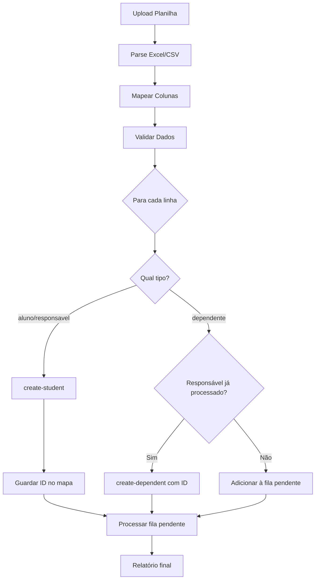
```mermaid
flowchart TD
    A[Upload Planilha] --> B[Parse Excel/CSV]
    B --> C[Mapear Colunas]
    C --> D[Validar Dados]
    
    D --> E{Para cada linha}
    E --> F{Qual tipo?}
    
    F -->|aluno/responsavel| G[create-student]
    G --> H[Guardar ID no mapa]
    
    F -->|dependente| I{Responsável já processado?}
    I -->|Sim| J[create-dependent com ID]
    I -->|Não| K[Adicionar à fila pendente]
    
    H --> L[Processar fila pendente]
    J --> L
    K --> L
    
    L --> M[Relatório final]
```

---

#### Modificações no Código

```typescript
// src/components/students/StudentImportDialog.tsx

// Novos campos no mapeamento
const SYSTEM_FIELDS = [
  { key: 'name', label: 'Nome', required: true },
  { key: 'email', label: 'Email', required: false }, // Não obrigatório para dependentes
  { key: 'type', label: 'Tipo (aluno/responsavel/dependente)', required: false },
  { key: 'responsibleEmail', label: 'Email do Responsável', required: false },
  { key: 'birthDate', label: 'Data de Nascimento', required: false },
  { key: 'phone', label: 'Telefone', required: false },
];

// Processar importação com famílias
const handleImport = async () => {
  const responsibleMap = new Map<string, string>(); // email -> id
  const pendingDependents: any[] = [];
  const results = { success: 0, errors: [] as string[] };

  // Primeira passada: criar alunos e responsáveis
  for (const row of mappedData) {
    const type = (row.type || 'aluno').toLowerCase();
    
    if (type === 'aluno' || type === 'responsavel') {
      if (!row.email) {
        results.errors.push(`${row.name}: Email obrigatório para alunos`);
        continue;
      }
      
      try {
        const { data } = await supabase.functions.invoke('create-student', {
          body: { name: row.name, email: row.email, phone: row.phone },
        });
        
        responsibleMap.set(row.email, data.student.id);
        results.success++;
      } catch (e) {
        results.errors.push(`${row.name}: ${e.message}`);
      }
    } else if (type === 'dependente') {
      pendingDependents.push(row);
    }
  }

  // Segunda passada: criar dependentes
  for (const dep of pendingDependents) {
    const responsibleId = responsibleMap.get(dep.responsibleEmail);
    
    if (!responsibleId) {
      results.errors.push(`${dep.name}: Responsável ${dep.responsibleEmail} não encontrado`);
      continue;
    }
    
    try {
      await supabase.functions.invoke('create-dependent', {
        body: {
          name: dep.name,
          responsibleId,
          birthDate: dep.birthDate,
        },
      });
      results.success++;
    } catch (e) {
      results.errors.push(`${dep.name}: ${e.message}`);
    }
  }

  return results;
};
```

---

#### Traduções i18n

**PT:**
```json
{
  "import": {
    "typeColumn": "Tipo",
    "responsibleColumn": "Email do Responsável",
    "typeHint": "Use: aluno, responsavel ou dependente",
    "dependentRequiresResponsible": "Dependentes precisam do email do responsável"
  }
}
```

**EN:**
```json
{
  "import": {
    "typeColumn": "Type",
    "responsibleColumn": "Guardian Email",
    "typeHint": "Use: student, guardian or dependent",
    "dependentRequiresResponsible": "Dependents require guardian email"
  }
}
```

---

#### Checklist de Validação

| Item | Status | Verificar |
|------|--------|-----------|
| ⬜ | UI | Campo "Tipo" aparece no mapeamento |
| ⬜ | UI | Campo "Email do Responsável" aparece |
| ⬜ | Validation | Email obrigatório apenas para alunos |
| ⬜ | Validation | Dependente sem responsável gera erro |
| ⬜ | Logic | Responsáveis criados antes de dependentes |
| ⬜ | Logic | Dependentes vinculados ao ID correto |
| ⬜ | Report | Relatório mostra sucessos e erros |
| ⬜ | i18n | Traduções funcionam em PT e EN |

#### Prioridade
🟡 **MÉDIA** - Nice to have para escala

---

## 5. Implementação Frontend

### 5.0 UX de Cadastro: Fluxo Unificado com Seleção de Tipo

#### 5.0.1 Visão Geral do Fluxo

O cadastro de alunos foi redesenhado para oferecer uma experiência clara e otimizada, com **seleção inicial do tipo de cadastro** antes de apresentar o formulário específico.

**Diagrama do Fluxo:**

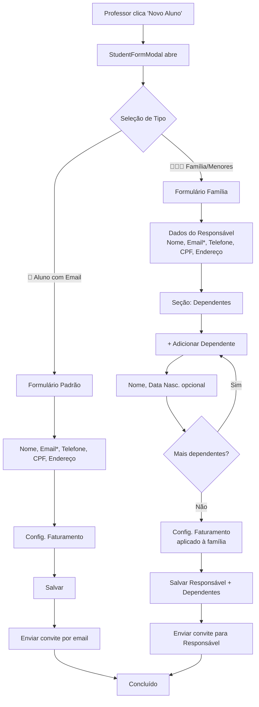
```mermaid
flowchart TD
    Start[Professor clica 'Novo Aluno'] --> Modal[StudentFormModal abre]
    Modal --> TypeSelect{Seleção de Tipo}
    
    TypeSelect -->|"👤 Aluno com Email"| AdultForm[Formulário Padrão]
    TypeSelect -->|"👨‍👩‍👧 Família/Menores"| FamilyForm[Formulário Família]
    
    AdultForm --> AdultFields[Nome, Email*, Telefone, CPF, Endereço]
    AdultFields --> AdultBilling[Config. Faturamento]
    AdultBilling --> AdultSave[Salvar]
    AdultSave --> InviteEmail[Enviar convite por email]
    InviteEmail --> End[Concluído]
    
    FamilyForm --> ResponsibleFields[Dados do Responsável<br/>Nome, Email*, Telefone, CPF, Endereço]
    ResponsibleFields --> DependentsSection[Seção: Dependentes]
    DependentsSection --> AddDependent[+ Adicionar Dependente]
    AddDependent --> DepFields[Nome, Data Nasc. opcional]
    DepFields --> MoreDeps{Mais dependentes?}
    MoreDeps -->|Sim| AddDependent
    MoreDeps -->|Não| FamilyBilling[Config. Faturamento<br/>aplicado à família]
    FamilyBilling --> FamilySave[Salvar Responsável + Dependentes]
    FamilySave --> InviteResponsible[Enviar convite para Responsável]
    InviteResponsible --> End
```

**Princípios de Design:**
- ✅ **Decisão explícita:** Professor escolhe o tipo antes de ver campos
- ✅ **Formulários otimizados:** Cada tipo tem campos relevantes
- ✅ **Cadastro em lote:** Família permite adicionar N dependentes de uma vez
- ✅ **Clareza visual:** Cards grandes com ícones e descrições claras
- ✅ **Reversibilidade:** Botão "Voltar" permite mudar de tipo

---

#### 5.0.2 Design dos Cards de Seleção

**Visual dos Cards:**

```
┌─────────────────────────────────────────────────────────────────┐
│  Que tipo de aluno você quer cadastrar?                         │
└─────────────────────────────────────────────────────────────────┘

┌──────────────────────────────┐  ┌──────────────────────────────┐
│  👤                           │  │  👨‍👩‍👧                          │
│  Aluno com Email             │  │  Família / Menores           │
│                              │  │                              │
│  Adulto ou criança com       │  │  Responsável + filhos.       │
│  email próprio. Terá login   │  │  Um único login, fatura      │
│  individual.                 │  │  consolidada.                │
│                              │  │                              │
│  [Selecionar]                │  │  [Selecionar]                │
└──────────────────────────────┘  └──────────────────────────────┘
```

**Especificações Técnicas:**
- Componente: `StudentTypeSelector` (novo)
- Layout: Grid 2 colunas em desktop, stack em mobile
- Ícones: `User` (Aluno) e `Users` (Família) do lucide-react
- Estados:
  - Hover: Border + shadow
  - Selected: Border accent + background subtle
  - Disabled: Opacity 50%

---

#### 5.0.3 Formulário Expandido: Família/Menores

Quando o professor seleciona "Família/Menores", o formulário é expandido com 3 seções:

**Estrutura do Formulário:**

```
┌─────────────────────────────────────────────────────────────────┐
│  📋 Cadastrar Família                               [← Voltar]  │
├─────────────────────────────────────────────────────────────────┤
│                                                                  │
│  🔹 Seção 1: Dados do Responsável                                │
│     ┌──────────────────────────────────────────────────────┐   │
│     │  Nome *: [____________________]                       │   │
│     │  Email *: [____________________]                      │   │
│     │  Telefone: [____________________]                     │   │
│     │  CPF: [____________________]                          │   │
│     │  Endereço (opcional):                                 │   │
│     │    Rua: [__________________]  CEP: [________]         │   │
│     │    Cidade: [______________]  Estado: [___]            │   │
│     └──────────────────────────────────────────────────────┘   │
│                                                                  │
│  🔹 Seção 2: Dependentes                                         │
│     ┌──────────────────────────────────────────────────────┐   │
│     │  📌 Dependente #1                            [🗑️]     │   │
│     │     Nome: [____________________]                      │   │
│     │     Data de Nascimento (opcional): [__/__/____]       │   │
│     ├──────────────────────────────────────────────────────┤   │
│     │  📌 Dependente #2                            [🗑️]     │   │
│     │     Nome: [____________________]                      │   │
│     │     Data de Nascimento (opcional): [__/__/____]       │   │
│     └──────────────────────────────────────────────────────┘   │
│     [+ Adicionar outro dependente]                              │
│                                                                  │
│     ⚠️  Mínimo 1 dependente necessário                           │
│                                                                  │
│  🔹 Seção 3: Configurações de Faturamento                        │
│     ┌──────────────────────────────────────────────────────┐   │
│     │  Negócio de Recebimento: [Minha Conta Stripe    ▼]   │   │
│     │  Dia de Cobrança: [5 ▼]                              │   │
│     │                                                       │   │
│     │  ℹ️  A fatura será enviada para o responsável com     │   │
│     │     todas as aulas dos dependentes.                  │   │
│     └──────────────────────────────────────────────────────┘   │
│                                                                  │
│  [Cancelar]                               [Salvar Família]     │
└─────────────────────────────────────────────────────────────────┘
```

**Regras de Validação:**
- ✅ Nome e email do responsável são obrigatórios
- ✅ Mínimo de 1 dependente
- ✅ Nome do dependente é obrigatório
- ✅ Data de nascimento é opcional
- ✅ Negócio de recebimento é obrigatório

---

#### 5.0.4 Componente: StudentTypeSelector

**Arquivo:** `src/components/StudentTypeSelector.tsx` (novo)

**Responsabilidades:**
- Renderizar os 2 cards de seleção
- Gerenciar estado de hover/seleção
- Emitir evento de escolha para o componente pai

**Interface:**

```typescript
export interface StudentTypeSelectorProps {
  selectedType: 'adult' | 'family' | null;
  onSelect: (type: 'adult' | 'family') => void;
  disabled?: boolean;
}

export function StudentTypeSelector({ 
  selectedType, 
  onSelect, 
  disabled = false 
}: StudentTypeSelectorProps) {
  // Implementação
}
```

**Estrutura Interna:**

```typescript
const typeOptions = [
  {
    id: 'adult',
    icon: User,
    title: t('students.typeSelection.adult.title'),
    description: t('students.typeSelection.adult.description'),
    color: 'text-blue-500'
  },
  {
    id: 'family',
    icon: Users,
    title: t('students.typeSelection.family.title'),
    description: t('students.typeSelection.family.description'),
    color: 'text-purple-500'
  }
];
```

**Rendering:**
- Card component do shadcn/ui
- Hover effect com border accent
- Click handler para `onSelect(type)`

---

#### 5.0.5 Modificação: StudentFormModal

**Arquivo:** `src/components/StudentFormModal.tsx` (existente)

**Mudanças Necessárias:**

**1. Estado do Componente:**

```typescript
const [studentType, setStudentType] = useState<'adult' | 'family' | null>(null);
const [dependents, setDependents] = useState<Array<{
  id: string; // temp ID para React keys
  name: string;
  birthDate?: string;
}>>([{ id: crypto.randomUUID(), name: '', birthDate: '' }]);
```

**2. Fluxo de Renderização:**

```typescript
return (
  <Dialog open={isOpen} onOpenChange={onClose}>
    <DialogContent>
      {/* STEP 1: Seleção de Tipo */}
      {studentType === null && (
        <StudentTypeSelector 
          selectedType={null}
          onSelect={(type) => setStudentType(type)}
        />
      )}

      {/* STEP 2: Formulário Aluno Normal */}
      {studentType === 'adult' && (
        <>
          <Button variant="ghost" onClick={() => setStudentType(null)}>
            ← Voltar
          </Button>
          {/* Formulário existente de aluno */}
        </>
      )}

      {/* STEP 3: Formulário Família */}
      {studentType === 'family' && (
        <>
          <Button variant="ghost" onClick={() => setStudentType(null)}>
            ← Voltar
          </Button>
          
          {/* Seção 1: Dados do Responsável */}
          <div className="space-y-4">
            <h3>Dados do Responsável</h3>
            {/* Campos do responsável (mesmo do formulário normal) */}
          </div>

          {/* Seção 2: Dependentes */}
          <div className="space-y-4">
            <h3>Dependentes</h3>
            {dependents.map((dep, index) => (
              <Card key={dep.id}>
                <CardHeader>
                  <div className="flex justify-between">
                    <span>Dependente #{index + 1}</span>
                    {dependents.length > 1 && (
                      <Button 
                        variant="ghost" 
                        size="icon"
                        onClick={() => removeDependent(dep.id)}
                      >
                        <Trash2 className="h-4 w-4" />
                      </Button>
                    )}
                  </div>
                </CardHeader>
                <CardContent>
                  <Input 
                    label="Nome *"
                    value={dep.name}
                    onChange={(e) => updateDependent(dep.id, 'name', e.target.value)}
                  />
                  <Input 
                    label="Data de Nascimento (opcional)"
                    type="date"
                    value={dep.birthDate}
                    onChange={(e) => updateDependent(dep.id, 'birthDate', e.target.value)}
                  />
                </CardContent>
              </Card>
            ))}
            
            <Button 
              variant="outline" 
              onClick={addDependent}
              className="w-full"
            >
              + Adicionar outro dependente
            </Button>

            {dependents.length === 0 && (
              <Alert variant="warning">
                Adicione pelo menos um dependente
              </Alert>
            )}
          </div>

          {/* Seção 3: Faturamento */}
          <div className="space-y-4">
            <h3>Configurações de Faturamento</h3>
            <Alert variant="info">
              A fatura será enviada para o responsável com todas as aulas dos dependentes.
            </Alert>
            {/* Campos de faturamento existentes */}
          </div>
        </>
      )}
    </DialogContent>
  </Dialog>
);
```

**3. Lógica de Submit:**

```typescript
const handleSubmit = async () => {
  if (studentType === 'adult') {
    // Fluxo existente: create-student
    await supabase.functions.invoke('create-student', {
      body: { /* dados do aluno */ }
    });
  } else if (studentType === 'family') {
    // NOVO FLUXO: Criar responsável + dependentes
    try {
      // 1. Criar responsável
      const { data: responsibleData, error: respError } = await supabase.functions.invoke(
        'create-student',
        { body: { /* dados do responsável */ } }
      );

      if (respError) throw respError;

      const responsibleId = responsibleData.student_id;

      // 2. Criar cada dependente
      const dependentPromises = dependents
        .filter(d => d.name.trim())
        .map(dep => 
          supabase.functions.invoke('create-dependent', {
            body: {
              responsible_id: responsibleId,
              name: dep.name,
              birth_date: dep.birthDate || null
            }
          })
        );

      await Promise.all(dependentPromises);

      toast.success('Família cadastrada com sucesso!');
      onSuccess();
      onClose();
    } catch (error) {
      console.error('Erro ao cadastrar família:', error);
      toast.error('Erro ao cadastrar família');
      // TODO: Rollback? Ou deixar o professor deletar manualmente?
    }
  }
};
```

**4. Helpers:**

```typescript
const addDependent = () => {
  setDependents([...dependents, { 
    id: crypto.randomUUID(), 
    name: '', 
    birthDate: '' 
  }]);
};

const removeDependent = (id: string) => {
  setDependents(dependents.filter(d => d.id !== id));
};

const updateDependent = (id: string, field: 'name' | 'birthDate', value: string) => {
  setDependents(dependents.map(d => 
    d.id === id ? { ...d, [field]: value } : d
  ));
};
```

---

#### 5.0.6 Fluxo de Dados no Submit

**Sequência de Operações (Família):**

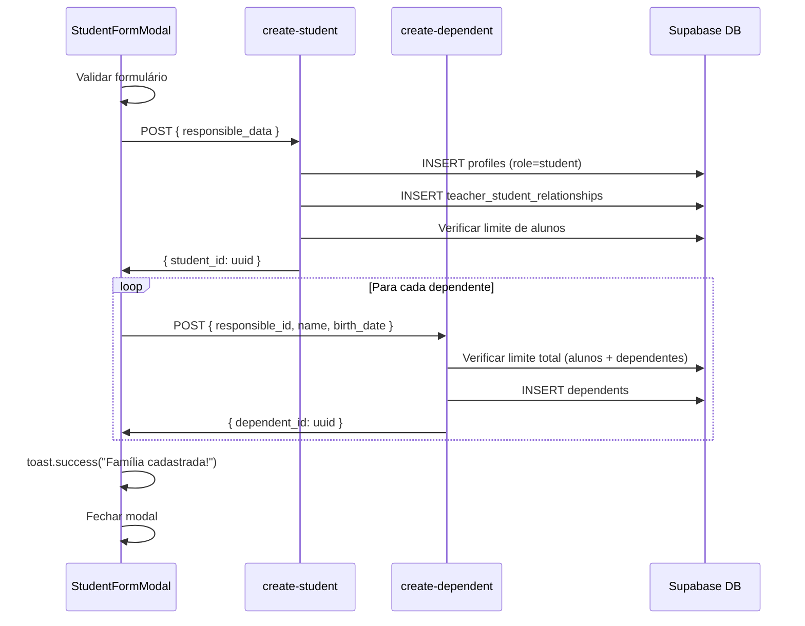
```mermaid
sequenceDiagram
    participant UI as StudentFormModal
    participant CreateStudent as create-student
    participant CreateDependent as create-dependent
    participant DB as Supabase DB

    UI->>UI: Validar formulário
    UI->>CreateStudent: POST { responsible_data }
    CreateStudent->>DB: INSERT profiles (role=student)
    CreateStudent->>DB: INSERT teacher_student_relationships
    CreateStudent->>DB: Verificar limite de alunos
    CreateStudent->>UI: { student_id: uuid }

    loop Para cada dependente
        UI->>CreateDependent: POST { responsible_id, name, birth_date }
        CreateDependent->>DB: Verificar limite total (alunos + dependentes)
        CreateDependent->>DB: INSERT dependents
        CreateDependent->>UI: { dependent_id: uuid }
    end

    UI->>UI: toast.success("Família cadastrada!")
    UI->>UI: Fechar modal
```

**Tratamento de Erros:**

| Cenário | Ação |
|---------|------|
| Erro ao criar responsável | Mostrar erro, não criar dependentes |
| Erro ao criar dependente #1 | Mostrar erro, perguntar se quer continuar |
| Erro ao criar dependente #2+ | Mostrar erro parcial, listar quem foi criado |
| Limite de alunos excedido | Bloquear submit, mostrar modal de upgrade |

**Rollback:**
- ❌ **Não implementar rollback automático** (complexidade alta)
- ✅ **Permitir que professor delete manualmente** se algo der errado
- ✅ **Logar erros detalhados** para debugging

---

#### 5.0.7 Estados do Formulário

**Tabela de Estados:**

| Estado | Condição | Campos Visíveis | Ação Principal | Validação |
|--------|----------|-----------------|----------------|-----------|
| **Seleção** | `studentType === null` | 2 cards de seleção | Escolher tipo | - |
| **Aluno Normal** | `studentType === 'adult'` | Nome, Email*, Telefone, CPF, Endereço, Billing | Salvar aluno | Email obrigatório |
| **Família** | `studentType === 'family'` | Responsável + Lista de dependentes + Billing | Salvar família | Email obrigatório + min 1 dependente |
| **Loading** | `isSubmitting === true` | Spinner + mensagem | - | - |
| **Erro** | `error !== null` | Alert de erro + retry | Tentar novamente | - |

**Transições de Estado:**

```
[Inicial] 
  → Clica "Novo Aluno" 
  → [Seleção]
  
[Seleção] 
  → Clica "Aluno com Email" 
  → [Aluno Normal]
  
[Seleção] 
  → Clica "Família/Menores" 
  → [Família]
  
[Aluno Normal] 
  → Clica "Voltar" 
  → [Seleção]
  
[Família] 
  → Clica "Voltar" 
  → [Seleção]
  
[Aluno Normal/Família] 
  → Clica "Salvar" 
  → [Loading] 
  → [Sucesso] ou [Erro]
```

---

#### 5.0.8 Traduções i18n

**Arquivo:** `src/i18n/locales/pt/students.json`

**Novas chaves a adicionar:**

```json
{
  "typeSelection": {
    "title": "Que tipo de aluno você quer cadastrar?",
    "adult": {
      "title": "Aluno com Email",
      "description": "Adulto ou criança com email próprio. Terá login individual.",
      "icon": "user"
    },
    "family": {
      "title": "Família / Menores",
      "description": "Responsável + filhos. Um único login, fatura consolidada.",
      "icon": "users"
    }
  },
  "family": {
    "title": "Cadastrar Família",
    "responsibleSection": "Dados do Responsável",
    "responsibleInfo": "O responsável receberá as faturas e terá acesso ao portal para acompanhar todos os dependentes.",
    "dependentsSection": "Dependentes",
    "dependentNumberLabel": "Dependente #{number}",
    "addDependent": "Adicionar outro dependente",
    "removeDependent": "Remover dependente",
    "dependentName": "Nome do dependente",
    "dependentBirthDate": "Data de nascimento (opcional)",
    "noDependents": "Adicione pelo menos um dependente para continuar",
    "minOneDependentRequired": "É necessário cadastrar pelo menos um dependente",
    "billingSection": "Configurações de Faturamento",
    "billingNote": "A fatura será enviada para o responsável com todas as aulas dos dependentes.",
    "saveFamily": "Salvar Família",
    "familyCreatedSuccess": "Família cadastrada com sucesso!",
    "familyCreatedError": "Erro ao cadastrar família",
    "partialCreationWarning": "Responsável criado, mas alguns dependentes falharam. Você pode adicioná-los depois."
  },
  "backToSelection": "Voltar para seleção de tipo"
}
```

**Arquivo:** `src/i18n/locales/en/students.json`

```json
{
  "typeSelection": {
    "title": "What type of student do you want to register?",
    "adult": {
      "title": "Student with Email",
      "description": "Adult or child with their own email. Will have individual login.",
      "icon": "user"
    },
    "family": {
      "title": "Family / Minors",
      "description": "Guardian + children. Single login, consolidated billing.",
      "icon": "users"
    }
  },
  "family": {
    "title": "Register Family",
    "responsibleSection": "Guardian Information",
    "responsibleInfo": "The guardian will receive invoices and have portal access to monitor all dependents.",
    "dependentsSection": "Dependents",
    "dependentNumberLabel": "Dependent #{number}",
    "addDependent": "Add another dependent",
    "removeDependent": "Remove dependent",
    "dependentName": "Dependent's name",
    "dependentBirthDate": "Birth date (optional)",
    "noDependents": "Add at least one dependent to continue",
    "minOneDependentRequired": "At least one dependent is required",
    "billingSection": "Billing Settings",
    "billingNote": "The invoice will be sent to the guardian with all dependents' classes.",
    "saveFamily": "Save Family",
    "familyCreatedSuccess": "Family registered successfully!",
    "familyCreatedError": "Error registering family",
    "partialCreationWarning": "Guardian created, but some dependents failed. You can add them later."
  },
  "backToSelection": "Back to type selection"
}
```

---

#### 5.0.9 Checklist de Implementação

**Fase 3.1: Componente StudentTypeSelector (0.5 dia)**
- [ ] Criar `src/components/StudentTypeSelector.tsx`
- [ ] Implementar layout de cards com shadcn/ui
- [ ] Adicionar ícones lucide-react (User, Users)
- [ ] Implementar hover states e click handlers
- [ ] Adicionar traduções i18n
- [ ] Testar responsividade (desktop + mobile)

**Fase 3.2: Modificar StudentFormModal (1 dia)**
- [ ] Adicionar estado `studentType`
- [ ] Adicionar estado `dependents` (array)
- [ ] Implementar renderização condicional (3 estados: selection, adult, family)
- [ ] Implementar seção de dependentes com add/remove
- [ ] Implementar validação de mínimo 1 dependente
- [ ] Adaptar lógica de submit para fluxo de família
- [ ] Adicionar botão "Voltar" para cada formulário
- [ ] Implementar tratamento de erros parciais
- [ ] Adicionar loading states
- [ ] Testar fluxo completo

**Fase 3.3: Testes de UX (0.5 dia)**
- [ ] Testar fluxo aluno normal (existente)
- [ ] Testar fluxo família (novo)
- [ ] Testar transições entre estados
- [ ] Testar validações
- [ ] Testar rollback/erro parcial
- [ ] Feedback de professora sobre clareza

**Total Estimado: 2 dias**

---

### 5.1 Componente: DependentManager

**Arquivo:** `src/components/DependentManager.tsx`

**Descrição:** Interface principal do professor para gerenciar dependentes.

**Funcionalidades:**
- Listar todos os dependentes agrupados por responsável
- Criar novo dependente
- Editar dependente
- Deletar dependente
- Visualizar histórico de aulas do dependente

**Código:**

```typescript
// src/components/DependentManager.tsx

import { useState, useEffect } from 'react';
import { supabase } from '@/integrations/supabase/client';
import { useTranslation } from 'react-i18next';
import {
  Card,
  CardContent,
  CardDescription,
  CardHeader,
  CardTitle
} from '@/components/ui/card';
import { Button } from '@/components/ui/button';
import { Badge } from '@/components/ui/badge';
import { Users, Plus, Edit, Trash2, Calendar } from 'lucide-react';
import { DependentFormModal } from './DependentFormModal';
import { toast } from 'sonner';

interface Dependent {
  dependent_id: string;
  dependent_name: string;
  responsible_id: string;
  responsible_name: string;
  responsible_email: string;
  birth_date: string | null;
  created_at: string;
}

interface GroupedDependents {
  [responsibleId: string]: {
    responsible_name: string;
    responsible_email: string;
    dependents: Dependent[];
  };
}

export const DependentManager = () => {
  const { t } = useTranslation();
  const [dependents, setDependents] = useState<Dependent[]>([]);
  const [groupedDependents, setGroupedDependents] = useState<GroupedDependents>({});
  const [loading, setLoading] = useState(true);
  const [isFormOpen, setIsFormOpen] = useState(false);
  const [editingDependent, setEditingDependent] = useState<Dependent | null>(null);

  const loadDependents = async () => {
    try {
      setLoading(true);
      const { data: { user } } = await supabase.auth.getUser();
      if (!user) return;

      const { data, error } = await supabase
        .rpc('get_teacher_dependents', { p_teacher_id: user.id });

      if (error) throw error;

      setDependents(data || []);

      // Agrupar por responsável
      const grouped = (data || []).reduce((acc, dep) => {
        if (!acc[dep.responsible_id]) {
          acc[dep.responsible_id] = {
            responsible_name: dep.responsible_name,
            responsible_email: dep.responsible_email,
            dependents: []
          };
        }
        acc[dep.responsible_id].dependents.push(dep);
        return acc;
      }, {} as GroupedDependents);

      setGroupedDependents(grouped);
    } catch (error) {
      console.error('Erro ao carregar dependentes:', error);
      toast.error(t('dependents.error.load'));
    } finally {
      setLoading(false);
    }
  };

  useEffect(() => {
    loadDependents();
  }, []);

  const handleDelete = async (dependentId: string) => {
    if (!confirm(t('dependents.confirm.delete'))) return;

    try {
      const { error } = await supabase.functions.invoke('delete-dependent', {
        body: { dependentId }
      });

      if (error) throw error;

      toast.success(t('dependents.success.delete'));
      loadDependents();
    } catch (error) {
      console.error('Erro ao deletar dependente:', error);
      toast.error(t('dependents.error.delete'));
    }
  };

  if (loading) {
    return <div>Carregando...</div>;
  }

  return (
    <div className="space-y-6">
      <div className="flex justify-between items-center">
        <div>
          <h2 className="text-2xl font-bold">
            {t('dependents.title')}
          </h2>
          <p className="text-muted-foreground">
            {t('dependents.subtitle')}
          </p>
        </div>
        <Button onClick={() => setIsFormOpen(true)}>
          <Plus className="mr-2 h-4 w-4" />
          {t('dependents.actions.add')}
        </Button>
      </div>

      {Object.keys(groupedDependents).length === 0 ? (
        <Card>
          <CardContent className="flex flex-col items-center justify-center py-12">
            <Users className="h-12 w-12 text-muted-foreground mb-4" />
            <p className="text-muted-foreground">
              {t('dependents.empty')}
            </p>
          </CardContent>
        </Card>
      ) : (
        <div className="space-y-6">
          {Object.entries(groupedDependents).map(([responsibleId, group]) => (
            <Card key={responsibleId}>
              <CardHeader>
                <CardTitle className="flex items-center gap-2">
                  <Users className="h-5 w-5" />
                  {group.responsible_name}
                </CardTitle>
                <CardDescription>{group.responsible_email}</CardDescription>
              </CardHeader>
              <CardContent>
                <div className="space-y-3">
                  {group.dependents.map((dep) => (
                    <div
                      key={dep.dependent_id}
                      className="flex items-center justify-between p-3 border rounded-lg"
                    >
                      <div>
                        <p className="font-medium">{dep.dependent_name}</p>
                        {dep.birth_date && (
                          <p className="text-sm text-muted-foreground">
                            {t('dependents.fields.birthDate')}: {' '}
                            {new Date(dep.birth_date).toLocaleDateString()}
                          </p>
                        )}
                      </div>
                      <div className="flex gap-2">
                        <Button
                          variant="ghost"
                          size="icon"
                          onClick={() => {
                            setEditingDependent(dep);
                            setIsFormOpen(true);
                          }}
                        >
                          <Edit className="h-4 w-4" />
                        </Button>
                        <Button
                          variant="ghost"
                          size="icon"
                          onClick={() => handleDelete(dep.dependent_id)}
                        >
                          <Trash2 className="h-4 w-4" />
                        </Button>
                      </div>
                    </div>
                  ))}
                </div>
              </CardContent>
            </Card>
          ))}
        </div>
      )}

      <DependentFormModal
        isOpen={isFormOpen}
        onClose={() => {
          setIsFormOpen(false);
          setEditingDependent(null);
        }}
        dependent={editingDependent}
        onSuccess={loadDependents}
      />
    </div>
  );
};
```

### 5.2 Componente: DependentFormModal

**Arquivo:** `src/components/DependentFormModal.tsx`

**Descrição:** Modal para criar/editar dependentes.

```typescript
// src/components/DependentFormModal.tsx

import { useForm } from 'react-hook-form';
import { zodResolver } from '@hookform/resolvers/zod';
import { z } from 'zod';
import { supabase } from '@/integrations/supabase/client';
import { useTranslation } from 'react-i18next';
import {
  Dialog,
  DialogContent,
  DialogHeader,
  DialogTitle
} from '@/components/ui/dialog';
import {
  Form,
  FormControl,
  FormField,
  FormItem,
  FormLabel,
  FormMessage
} from '@/components/ui/form';
import {
  Select,
  SelectContent,
  SelectItem,
  SelectTrigger,
  SelectValue
} from '@/components/ui/select';
import { Input } from '@/components/ui/input';
import { Textarea } from '@/components/ui/textarea';
import { Button } from '@/components/ui/button';
import { toast } from 'sonner';
import { useEffect, useState } from 'react';

const dependentSchema = z.object({
  name: z.string().min(2, 'Nome deve ter pelo menos 2 caracteres'),
  responsibleId: z.string().uuid('Selecione um responsável'),
  birthDate: z.string().optional(),
  notes: z.string().max(500).optional()
});

type DependentFormData = z.infer<typeof dependentSchema>;

interface DependentFormModalProps {
  isOpen: boolean;
  onClose: () => void;
  dependent?: any | null;
  onSuccess: () => void;
}

export const DependentFormModal = ({
  isOpen,
  onClose,
  dependent,
  onSuccess
}: DependentFormModalProps) => {
  const { t } = useTranslation();
  const [responsibles, setResponsibles] = useState([]);
  const [loading, setLoading] = useState(false);

  const form = useForm<DependentFormData>({
    resolver: zodResolver(dependentSchema),
    defaultValues: {
      name: dependent?.dependent_name || '',
      responsibleId: dependent?.responsible_id || '',
      birthDate: dependent?.birth_date || '',
      notes: dependent?.notes || ''
    }
  });

  // Carregar responsáveis (alunos do professor)
  useEffect(() => {
    const loadResponsibles = async () => {
      const { data: { user } } = await supabase.auth.getUser();
      if (!user) return;

      const { data } = await supabase
        .rpc('get_teacher_students', { teacher_user_id: user.id });

      setResponsibles(data || []);
    };

    loadResponsibles();
  }, []);

  const handleSubmit = async (data: DependentFormData) => {
    try {
      setLoading(true);

      const endpoint = dependent ? 'update-dependent' : 'create-dependent';
      const body = dependent
        ? { dependentId: dependent.dependent_id, ...data }
        : data;

      const { error } = await supabase.functions.invoke(endpoint, {
        body
      });

      if (error) throw error;

      toast.success(
        dependent
          ? t('dependents.success.update')
          : t('dependents.success.create')
      );
      onSuccess();
      onClose();
    } catch (error) {
      console.error('Erro:', error);
      toast.error(
        dependent
          ? t('dependents.error.update')
          : t('dependents.error.create')
      );
    } finally {
      setLoading(false);
    }
  };

  return (
    <Dialog open={isOpen} onOpenChange={onClose}>
      <DialogContent>
        <DialogHeader>
          <DialogTitle>
            {dependent
              ? t('dependents.edit.title')
              : t('dependents.create.title')}
          </DialogTitle>
        </DialogHeader>

        <Form {...form}>
          <form onSubmit={form.handleSubmit(handleSubmit)} className="space-y-4">
            <FormField
              control={form.control}
              name="name"
              render={({ field }) => (
                <FormItem>
                  <FormLabel>{t('dependents.fields.name')}</FormLabel>
                  <FormControl>
                    <Input {...field} />
                  </FormControl>
                  <FormMessage />
                </FormItem>
              )}
            />

            <FormField
              control={form.control}
              name="responsibleId"
              render={({ field }) => (
                <FormItem>
                  <FormLabel>{t('dependents.fields.responsible')}</FormLabel>
                  <Select
                    onValueChange={field.onChange}
                    defaultValue={field.value}
                  >
                    <FormControl>
                      <SelectTrigger>
                        <SelectValue placeholder={t('dependents.placeholders.responsible')} />
                      </SelectTrigger>
                    </FormControl>
                    <SelectContent>
                      {responsibles.map((resp) => (
                        <SelectItem key={resp.student_id} value={resp.student_id}>
                          {resp.student_name} ({resp.student_email})
                        </SelectItem>
                      ))}
                    </SelectContent>
                  </Select>
                  <FormMessage />
                </FormItem>
              )}
            />

            <FormField
              control={form.control}
              name="birthDate"
              render={({ field }) => (
                <FormItem>
                  <FormLabel>{t('dependents.fields.birthDate')}</FormLabel>
                  <FormControl>
                    <Input type="date" {...field} />
                  </FormControl>
                  <FormMessage />
                </FormItem>
              )}
            />

            <FormField
              control={form.control}
              name="notes"
              render={({ field }) => (
                <FormItem>
                  <FormLabel>{t('dependents.fields.notes')}</FormLabel>
                  <FormControl>
                    <Textarea {...field} />
                  </FormControl>
                  <FormMessage />
                </FormItem>
              )}
            />

            <div className="flex justify-end gap-2">
              <Button type="button" variant="outline" onClick={onClose}>
                {t('common.cancel')}
              </Button>
              <Button type="submit" disabled={loading}>
                {loading
                  ? t('common.loading')
                  : dependent
                  ? t('common.save')
                  : t('dependents.actions.create')}
              </Button>
            </div>
          </form>
        </Form>
      </DialogContent>
    </Dialog>
  );
};
```

### 5.3 Modificação: StudentDashboard

Ver solução detalhada na seção 4.10.

### 5.4 Modificação: ClassForm

Ver solução detalhada na seção 4.9.

### 5.5 Modificação: ShareMaterialModal

Ver solução detalhada na seção 4.6.

---

## 6. Implementação Backend

### 6.1 Edge Function: create-dependent

Ver código completo na seção 4.13.

### 6.2 Edge Function: update-dependent

```typescript
// supabase/functions/update-dependent/index.ts

import { serve } from 'https://deno.land/std@0.168.0/http/server.ts';
import { createClient } from 'https://esm.sh/@supabase/supabase-js@2';

const corsHeaders = {
  'Access-Control-Allow-Origin': '*',
  'Access-Control-Allow-Headers': 'authorization, x-client-info, apikey, content-type',
};

interface UpdateDependentRequest {
  dependentId: string;
  name?: string;
  birthDate?: string;
  notes?: string;
}

serve(async (req) => {
  if (req.method === 'OPTIONS') {
    return new Response(null, { headers: corsHeaders });
  }

  try {
    const supabaseClient = createClient(
      Deno.env.get('SUPABASE_URL') ?? '',
      Deno.env.get('SUPABASE_ANON_KEY') ?? '',
      {
        global: {
          headers: { Authorization: req.headers.get('Authorization')! },
        },
      }
    );

    const { data: { user }, error: userError } = await supabaseClient.auth.getUser();
    if (userError || !user) {
      throw new Error('Não autenticado');
    }

    const { dependentId, name, birthDate, notes } = await req.json() as UpdateDependentRequest;

    if (!dependentId) {
      throw new Error('ID do dependente é obrigatório');
    }

    // Verificar se dependente pertence ao professor
    const { data: existing, error: fetchError } = await supabaseClient
      .from('dependents')
      .select('id')
      .eq('id', dependentId)
      .eq('teacher_id', user.id)
      .single();

    if (fetchError || !existing) {
      throw new Error('Dependente não encontrado ou não pertence a você');
    }

    // Atualizar
    const updates: any = {};
    if (name !== undefined) updates.name = name.trim();
    if (birthDate !== undefined) updates.birth_date = birthDate || null;
    if (notes !== undefined) updates.notes = notes || null;

    const { data: dependent, error: updateError } = await supabaseClient
      .from('dependents')
      .update(updates)
      .eq('id', dependentId)
      .select()
      .single();

    if (updateError) {
      console.error('Erro ao atualizar dependente:', updateError);
      throw new Error('Falha ao atualizar dependente');
    }

    return new Response(
      JSON.stringify({
        success: true,
        dependent
      }),
      {
        headers: { ...corsHeaders, 'Content-Type': 'application/json' },
        status: 200
      }
    );

  } catch (error) {
    console.error('Erro:', error);
    return new Response(
      JSON.stringify({
        success: false,
        error: error.message
      }),
      {
        headers: { ...corsHeaders, 'Content-Type': 'application/json' },
        status: 400
      }
    );
  }
});
```

### 6.3 Edge Function: delete-dependent

```typescript
// supabase/functions/delete-dependent/index.ts

import { serve } from 'https://deno.land/std@0.168.0/http/server.ts';
import { createClient } from 'https://esm.sh/@supabase/supabase-js@2';

const corsHeaders = {
  'Access-Control-Allow-Origin': '*',
  'Access-Control-Allow-Headers': 'authorization, x-client-info, apikey, content-type',
};

interface DeleteDependentRequest {
  dependentId: string;
}

serve(async (req) => {
  if (req.method === 'OPTIONS') {
    return new Response(null, { headers: corsHeaders });
  }

  try {
    const supabaseClient = createClient(
      Deno.env.get('SUPABASE_URL') ?? '',
      Deno.env.get('SUPABASE_ANON_KEY') ?? '',
      {
        global: {
          headers: { Authorization: req.headers.get('Authorization')! },
        },
      }
    );

    const { data: { user }, error: userError } = await supabaseClient.auth.getUser();
    if (userError || !user) {
      throw new Error('Não autenticado');
    }

    const { dependentId } = await req.json() as DeleteDependentRequest;

    if (!dependentId) {
      throw new Error('ID do dependente é obrigatório');
    }

    // Verificar se dependente tem aulas agendadas futuras
    const { data: futureClasses, error: classesError } = await supabaseClient
      .from('class_participants')
      .select(`
        id,
        classes!inner(class_date)
      `)
      .eq('dependent_id', dependentId)
      .gte('classes.class_date', new Date().toISOString());

    if (classesError) {
      throw new Error('Erro ao verificar aulas futuras');
    }

    if (futureClasses && futureClasses.length > 0) {
      throw new Error(
        `Não é possível deletar: dependente tem ${futureClasses.length} aula(s) futura(s). Cancele as aulas primeiro.`
      );
    }

    // Deletar (CASCADE vai deletar class_participants, material_access, etc.)
    const { error: deleteError } = await supabaseClient
      .from('dependents')
      .delete()
      .eq('id', dependentId)
      .eq('teacher_id', user.id);

    if (deleteError) {
      console.error('Erro ao deletar dependente:', deleteError);
      throw new Error('Falha ao deletar dependente');
    }

    return new Response(
      JSON.stringify({
        success: true,
        message: 'Dependente deletado com sucesso'
      }),
      {
        headers: { ...corsHeaders, 'Content-Type': 'application/json' },
        status: 200
      }
    );

  } catch (error) {
    console.error('Erro:', error);
    return new Response(
      JSON.stringify({
        success: false,
        error: error.message
      }),
      {
        headers: { ...corsHeaders, 'Content-Type': 'application/json' },
        status: 400
      }
    );
  }
});
```

### 6.4 Modificações em Funções Existentes

| Função | Modificação | Seção Referência |
|--------|-------------|------------------|
| `handle-student-overage` | Contar alunos + dependentes | 4.1 |
| `automated-billing` | Faturar dependentes (usar `get_unbilled_participants_v2`) | 4.2, 4.19 |
| `create-invoice` | Suportar dependentes (faturamento consolidado) | 4.3 |
| `send-class-report-notification` | Notificar responsáveis | 4.4 |
| `send-material-shared-notification` | Notificar responsáveis | 4.5 |
| `send-class-reminders` | Lembrar responsáveis | 4.11 |
| `process-cancellation` | Tratar dependentes | 4.12 |
| `send-cancellation-notification` | Notificar responsáveis | 4.12 |
| `smart-delete-student` | Prevenir deleção de responsáveis | 4.14 |
| `request-class` | Permitir solicitação para dependentes | 4.16 |
| `fetch-archived-data` | Incluir dependentes no histórico | 4.18 |

---

## 7. Traduções i18n

### 7.1 Português (pt/dependents.json)

```json
{
  "title": "Dependentes",
  "subtitle": "Gerencie filhos e dependentes vinculados aos responsáveis",
  "empty": "Nenhum dependente cadastrado ainda",
  
  "actions": {
    "add": "Adicionar Dependente",
    "create": "Criar Dependente",
    "edit": "Editar",
    "delete": "Excluir",
    "viewClasses": "Ver Aulas"
  },
  
  "fields": {
    "name": "Nome do Dependente",
    "responsible": "Responsável",
    "birthDate": "Data de Nascimento",
    "notes": "Observações"
  },
  
  "placeholders": {
    "name": "Digite o nome completo",
    "responsible": "Selecione o responsável",
    "birthDate": "dd/mm/aaaa",
    "notes": "Informações adicionais sobre o dependente"
  },
  
  "create": {
    "title": "Novo Dependente",
    "description": "Adicione um filho/dependente vinculado a um aluno responsável"
  },
  
  "edit": {
    "title": "Editar Dependente",
    "description": "Altere as informações do dependente"
  },
  
  "success": {
    "create": "Dependente criado com sucesso!",
    "update": "Dependente atualizado com sucesso!",
    "delete": "Dependente removido com sucesso!"
  },
  
  "error": {
    "create": "Erro ao criar dependente",
    "update": "Erro ao atualizar dependente",
    "delete": "Erro ao excluir dependente",
    "load": "Erro ao carregar dependentes",
    "limitReached": "Limite de alunos atingido. Faça upgrade do plano.",
    "futureClasses": "Não é possível deletar: existem aulas futuras agendadas",
    "notFound": "Dependente não encontrado"
  },
  
  "confirm": {
    "delete": "Tem certeza que deseja excluir este dependente? Esta ação não pode ser desfeita."
  },
  
  "info": {
    "childOf": "filho(a) de",
    "responsible": "Responsável",
    "classCount": "{{count}} aula(s)",
    "age": "{{years}} anos"
  }
}
```

### 7.2 Inglês (en/dependents.json)

```json
{
  "title": "Dependents",
  "subtitle": "Manage children and dependents linked to responsible adults",
  "empty": "No dependents registered yet",
  
  "actions": {
    "add": "Add Dependent",
    "create": "Create Dependent",
    "edit": "Edit",
    "delete": "Delete",
    "viewClasses": "View Classes"
  },
  
  "fields": {
    "name": "Dependent's Name",
    "responsible": "Responsible Adult",
    "birthDate": "Date of Birth",
    "notes": "Notes"
  },
  
  "placeholders": {
    "name": "Enter full name",
    "responsible": "Select responsible adult",
    "birthDate": "mm/dd/yyyy",
    "notes": "Additional information about the dependent"
  },
  
  "create": {
    "title": "New Dependent",
    "description": "Add a child/dependent linked to a responsible student"
  },
  
  "edit": {
    "title": "Edit Dependent",
    "description": "Update dependent information"
  },
  
  "success": {
    "create": "Dependent created successfully!",
    "update": "Dependent updated successfully!",
    "delete": "Dependent removed successfully!"
  },
  
  "error": {
    "create": "Error creating dependent",
    "update": "Error updating dependent",
    "delete": "Error deleting dependent",
    "load": "Error loading dependents",
    "limitReached": "Student limit reached. Please upgrade your plan.",
    "futureClasses": "Cannot delete: there are scheduled future classes",
    "notFound": "Dependent not found"
  },
  
  "confirm": {
    "delete": "Are you sure you want to delete this dependent? This action cannot be undone."
  },
  
  "info": {
    "childOf": "child of",
    "responsible": "Responsible",
    "classCount": "{{count}} class(es)",
    "age": "{{years}} years old"
  }
}
```

---

## 8. Testes e Validações

### 8.1 Cenários de Teste

#### Teste 1: Criação de Dependente
**Precondições:**
- Professor logado
- Tem pelo menos 1 aluno cadastrado
- Não atingiu limite do plano

**Passos:**
1. Acessar página de gerenciamento de dependentes
2. Clicar em "Adicionar Dependente"
3. Preencher nome, selecionar responsável
4. Clicar em "Criar"

**Resultado Esperado:**
- ✅ Dependente criado com sucesso
- ✅ Toast de confirmação exibido
- ✅ Dependente aparece na lista agrupado por responsável
- ✅ Contagem de alunos aumenta

---

#### Teste 2: Limite de Alunos + Dependentes
**Precondições:**
- Professor com plano de 5 alunos
- Tem 3 alunos e 2 dependentes (total = 5)

**Passos:**
1. Tentar criar mais 1 dependente

**Resultado Esperado:**
- ❌ Erro exibido: "Limite de 5 alunos atingido"
- ✅ Sugestão de upgrade ou overage

---

#### Teste 3: Faturamento Consolidado
**Precondições:**
- Responsável "Maria" tem 2 dependentes: "João" e "Ana"
- Ambos tiveram aulas no mês

**Passos:**
1. Executar `automated-billing`

**Resultado Esperado:**
- ✅ 1 fatura criada para "Maria" (responsável)
- ✅ Fatura contém aulas de "João" e "Ana"
- ✅ Total = soma de todas as aulas
- ✅ Email enviado para Maria

---

#### Teste 4: Notificação de Relatório
**Precondições:**
- Dependente "João" teve aula
- Professor criou relatório com feedback individual

**Passos:**
1. Salvar relatório

**Resultado Esperado:**
- ✅ Email enviado para o responsável
- ✅ Subject menciona o nome do dependente
- ✅ Corpo do email contém feedback específico do João

---

#### Teste 5: Compartilhamento de Material
**Precondições:**
- Professor tem material
- Responsável "Maria" tem dependente "João"

**Passos:**
1. Compartilhar material selecionando "João"

**Resultado Esperado:**
- ✅ Registro criado em `material_access` com `dependent_id`
- ✅ Email enviado para Maria mencionando João
- ✅ Maria consegue acessar material pelo portal

---

#### Teste 6: Deleção de Responsável com Dependentes
**Precondições:**
- Aluno "Maria" é responsável por "João"

**Passos:**
1. Tentar deletar aluno "Maria"

**Resultado Esperado:**
- ❌ Erro: "Aluno é responsável por 1 dependente"
- ✅ Lista nome do dependente
- ✅ Sugestão: deletar dependente primeiro

---

#### Teste 7: Portal do Responsável - Histórico
**Precondições:**
- Maria (responsável) logada
- Tem dependentes "João" e "Ana"

**Passos:**
1. Acessar dashboard
2. Clicar na aba "Aulas dos Filhos"

**Resultado Esperado:**
- ✅ Vê aulas de João e Ana
- ✅ Aulas agrupadas por dependente
- ✅ Pode ver relatórios e tarefas

---

#### Teste 8: Solicitação de Aula pelo Responsável

**Precondições:**
- Responsável "Maria" logado
- Tem dependente "João" cadastrado
- Tem relacionamento ativo com professor

**Passos:**
1. Acessar portal de solicitação de aulas
2. Selecionar "Para dependente: João"
3. Escolher professor, data e serviço
4. Enviar solicitação

**Resultado Esperado:**
- ✅ Aula criada com `dependent_id` preenchido
- ✅ `class_participants` tem `dependent_id`, não `student_id`
- ✅ Professor recebe notificação mencionando João
- ✅ Aula aparece na agenda do professor

---

#### Teste 9: Histórico Arquivado com Dependentes

**Precondições:**
- Professor tem aulas arquivadas
- Algumas aulas são de dependentes

**Passos:**
1. Acessar página de Histórico
2. Buscar aulas arquivadas

**Resultado Esperado:**
- ✅ Aulas de dependentes são exibidas
- ✅ Nome do dependente + "filho de [responsável]" aparece
- ✅ Badge "Dependente" é exibida
- ✅ Filtros funcionam corretamente

---

#### Teste 10: Visualização de Dependentes no Perfil do Responsável

**Precondições:**
- Professor logado
- Aluno "Maria" cadastrado como responsável
- "Maria" tem 2 dependentes: "João" (10 anos) e "Ana" (8 anos)
- Ambos dependentes têm histórico de aulas

**Passos:**
1. Acessar `/alunos/:id` (perfil de Maria)
2. Visualizar seção "Dependentes"
3. Clicar para expandir histórico de "João"
4. Verificar estatísticas exibidas
5. Clicar em "Adicionar Dependente"

**Resultado Esperado:**
- ✅ Seção "Dependentes (2)" visível após informações básicas
- ✅ Cards de "João" e "Ana" exibidos com badges "Dependente"
- ✅ Estatísticas corretas: total de aulas e % de frequência
- ✅ Ao expandir "João": lista de aulas aparece com datas, status e serviços
- ✅ Botão "Ver Relato" visível para aulas com relatórios
- ✅ Botão "Adicionar Dependente" abre modal de criação
- ✅ Após criar novo dependente, lista atualiza automaticamente

---

### 8.2 Checklist de Validação

#### Database
- [ ] Tabela `dependents` criada
- [ ] Coluna `dependent_id` em `class_participants`
- [ ] Coluna `dependent_id` em `material_access`
- [ ] Coluna `dependent_id` em `class_report_feedbacks`
- [ ] Coluna `dependent_id` em `class_notifications` (4.17)
- [ ] Coluna `dependent_id` em `invoice_classes` (opcional - 4.21)
- [ ] Políticas RLS ativas e testadas
- [ ] Funções helper funcionando
- [ ] Função `get_unbilled_participants_v2` criada (4.19)
- [ ] Índices criados para performance

#### Backend
- [ ] `create-dependent` funcionando
- [ ] `update-dependent` funcionando
- [ ] `delete-dependent` funcionando
- [ ] `handle-student-overage` conta dependentes
- [ ] `automated-billing` fatura dependentes via `get_unbilled_participants_v2`
- [ ] `create-invoice` aceita dependentes
- [ ] `request-class` permite solicitação para dependentes (4.16)
- [ ] `fetch-archived-data` inclui dependentes (4.18)
- [ ] Notificações funcionam para dependentes
- [ ] `smart-delete-student` previne deleção

#### Frontend
- [ ] `DependentManager` exibe lista correta
- [ ] Criação de dependente funciona
- [ ] Edição de dependente funciona
- [ ] Deleção de dependente funciona
- [ ] `ClassForm` lista dependentes
- [ ] `ShareMaterialModal` lista dependentes
- [ ] `StudentDashboard` mostra aulas dos dependentes
- [ ] `StudentScheduleRequest` permite solicitar para dependentes (4.16)
- [ ] `ClassReportModal` aceita feedback de dependentes
- [ ] `Historico.tsx` exibe dependentes com badge (4.18)
- [ ] **NOVO:** `PerfilAluno.tsx` exibe seção de dependentes para responsável (4.22)
- [ ] **NOVO:** Histórico de aulas expandido por dependente funciona (4.22)
- [ ] **NOVO:** Estatísticas de dependentes exibidas corretamente (4.22)
- [ ] **NOVO:** Botão "Adicionar Dependente" no perfil funciona (4.22)

#### UX
- [ ] Traduções completas (pt + en)
- [ ] Mensagens de erro claras
- [ ] Toasts informativos
- [ ] Validação de formulários
- [ ] Loading states adequados
- [ ] Confirmações em ações destrutivas

#### Integração
- [ ] Lembretes de aula para responsáveis
- [ ] Relatórios enviados para responsáveis
- [ ] Materiais compartilhados com dependentes
- [ ] Faturas consolidadas corretas
- [ ] Cancelamentos notificam responsáveis
- [ ] Notificações registradas com `dependent_id` (4.17)
- [ ] Solicitação de aula para dependentes (4.16)

---

## 9. Cronograma de Implementação

### Fase 1: Estrutura de Dados (Prioridade CRÍTICA) - 1-2 dias

**Objetivo:** Criar toda a base de dados necessária.

**Tarefas:**
- [ ] Criar tabela `dependents`
- [ ] Alterar `class_participants` (adicionar `dependent_id`)
- [ ] Alterar `material_access` (adicionar `dependent_id`)
- [ ] Alterar `class_report_feedbacks` (adicionar `dependent_id`)
- [ ] Criar todas as políticas RLS
- [ ] Criar funções helper SQL
- [ ] Criar índices para performance
- [ ] Testar políticas RLS manualmente

**Entrega:**
- ✅ Schema completo funcionando
- ✅ RLS validado
- ✅ Funções SQL testadas

---

### Fase 2: Backend - Edge Functions (Prioridade ALTA) - 2-3 dias

**Objetivo:** Implementar todas as edge functions necessárias.

**Tarefas:**
- [ ] Criar `create-dependent`
- [ ] Criar `update-dependent`
- [ ] Criar `delete-dependent`
- [ ] Modificar `handle-student-overage`
- [ ] Modificar `automated-billing`
- [ ] Modificar `create-invoice`
- [ ] Modificar `smart-delete-student`
- [ ] Testar todas as funções via Postman/Insomnia

**Entrega:**
- ✅ CRUD de dependentes funcionando
- ✅ Faturamento consolidado testado
- ✅ Limite de alunos considerando dependentes

---

### Fase 3: Frontend - Interface do Professor (Prioridade ALTA) - 3-4 dias

**Objetivo:** Criar interface para professor gerenciar dependentes.

**Tarefas:**
- [ ] **UX de Cadastro (2 dias)**
  - [ ] Criar `StudentTypeSelector` component (0.5 dia)
    - [ ] Layout de cards com shadcn/ui
    - [ ] Ícones lucide-react (User, Users)
    - [ ] Hover states e click handlers
    - [ ] Traduções i18n (typeSelection.*)
    - [ ] Testes de responsividade
  - [ ] Modificar `StudentFormModal` (1 dia)
    - [ ] Adicionar estado `studentType` e `dependents`
    - [ ] Implementar renderização condicional (3 estados)
    - [ ] Implementar seção de dependentes com add/remove
    - [ ] Validação de mínimo 1 dependente
    - [ ] Adaptar lógica de submit para fluxo de família
    - [ ] Tratamento de erros parciais
    - [ ] Loading states
  - [ ] Testes de UX (0.5 dia)
    - [ ] Testar fluxo aluno normal
    - [ ] Testar fluxo família
    - [ ] Testar transições entre estados
    - [ ] Validações e rollback
- [ ] **Gerenciamento de Dependentes (0.5-1 dia)**
  - [ ] Criar `DependentManager` component
  - [ ] Criar `DependentFormModal` component
  - [ ] Adicionar rota para gerenciamento de dependentes
- [ ] **Integrações com Componentes Existentes (1-1.5 dias)**
  - [ ] Modificar `ClassForm` (adicionar dependentes)
  - [ ] Modificar `ShareMaterialModal` (adicionar dependentes)
  - [ ] Modificar `ClassReportModal` (adicionar dependentes)
  - [ ] **NOVO:** Modificar `PerfilAluno.tsx` (seção expansível de dependentes - 4.22) (0.5 dia)
    - [ ] Adicionar state para dependentes e estatísticas
    - [ ] Criar função `loadDependents`
    - [ ] Criar função `handleExpandDependent`
    - [ ] Renderizar seção "Dependentes" com cards expansíveis
    - [ ] Exibir histórico de aulas por dependente
    - [ ] Integrar botão "Adicionar Dependente" com modal
- [ ] Testar fluxo completo de criação/edição/deleção

**Entrega:**
- ✅ Professor escolhe tipo de aluno (normal ou família) no cadastro
- ✅ Professor consegue cadastrar responsável + dependentes em um único fluxo
- ✅ Professor consegue gerenciar dependentes após cadastro
- ✅ Professor consegue agendar aulas com dependentes
- ✅ Professor consegue criar relatórios para dependentes
- ✅ Professor visualiza dependentes no perfil do responsável

**Duração estimada:** 3-4 dias (aumento de 0.5 dia devido à nova UX + 0.5 dia para PerfilAluno)

---

### Fase 4: Integrações - Notificações e Billing (Prioridade MÉDIA) - 2-3 dias

**Objetivo:** Garantir que dependentes sejam incluídos em todas as integrações.

**Tarefas:**
- [ ] Modificar `send-class-reminders`
- [ ] Modificar `send-class-report-notification`
- [ ] Modificar `send-material-shared-notification`
- [ ] Modificar `process-cancellation`
- [ ] Modificar `send-cancellation-notification`
- [ ] Modificar `request-class` (suporte a solicitação para dependentes - 4.16)
- [ ] Modificar `fetch-archived-data` (histórico arquivado - 4.18)
- [ ] Atualizar tabela `class_notifications` (adicionar `dependent_id` - 4.17)
- [ ] Atualizar `useStudentCount` hook
- [ ] Testar todos os fluxos de notificação

**Entrega:**
- ✅ Responsáveis recebem lembretes de aulas dos filhos
- ✅ Responsáveis recebem relatórios dos filhos
- ✅ Responsáveis recebem notificações de cancelamento
- ✅ Responsáveis podem solicitar aulas para dependentes
- ✅ Histórico arquivado inclui dependentes

---

### Fase 5: Portal do Responsável (Prioridade MÉDIA) - 1-2 dias

**Objetivo:** Permitir que responsáveis vejam dados dos dependentes.

**Tarefas:**
- [ ] Modificar `StudentDashboard` (adicionar aba de dependentes)
- [ ] Criar visualização de aulas dos dependentes
- [ ] Criar visualização de tarefas dos dependentes
- [ ] Criar visualização de materiais compartilhados
- [ ] Testar acesso e permissões

**Entrega:**
- ✅ Responsável vê histórico de aulas dos filhos
- ✅ Responsável vê tarefas dos filhos
- ✅ Responsável acessa materiais compartilhados

---

### Fase 6: Polimento e Testes (Prioridade BAIXA) - 1 dia

**Objetivo:** Finalizar traduções, testes e documentação.

**Tarefas:**
- [ ] Adicionar traduções completas (pt + en)
- [ ] Executar todos os cenários de teste
- [ ] Validar checklist completo
- [ ] Criar documentação de uso
- [ ] Revisar código para best practices

**Entrega:**
- ✅ Sistema 100% funcional
- ✅ Traduções completas
- ✅ Documentação atualizada

---

### Resumo do Cronograma

| Fase | Duração | Prioridade | Dependências |
|------|---------|-----------|--------------|
| Fase 1: Estrutura de Dados | 1-2 dias | 🔴 CRÍTICA | Nenhuma |
| Fase 2: Backend | 2-3 dias | 🔴 ALTA | Fase 1 |
| Fase 3: Frontend - Professor | 3-4 dias | 🔴 ALTA | Fase 2 |
| Fase 4: Integrações | 2-3 dias | 🟡 MÉDIA | Fase 2 |
| Fase 5: Portal Responsável | 1-2 dias | 🟡 MÉDIA | Fase 3 |
| Fase 6: Polimento | 1 dia | 🟢 BAIXA | Todas |

**Total Estimado: 10-15 dias**

**Mudanças em relação à versão anterior (Revisão 3 → Revisão 4):**
- Fase 3 aumentada de 2.5-3.5 dias para 3-4 dias devido à nova funcionalidade:
  - 4.22: Modificação do `PerfilAluno.tsx` com seção expansível de dependentes (0.5 dia)
  - Exibição de dependentes no perfil do responsável
  - Histórico de aulas por dependente
  - Integração com modal de criação de dependentes
- Total geral aumentou de 9.5-14.5 dias para 10-15 dias

---

## 10. Riscos e Mitigações

### Risco 1: Performance com Muitos Dependentes
**Probabilidade:** Baixa  
**Impacto:** Médio

**Descrição:**
Queries que juntam `dependents` com outras tabelas podem ficar lentas com muitos registros.

**Mitigação:**
- ✅ Índices compostos criados (`idx_dependents_teacher_responsible`)
- ✅ Usar funções SQL otimizadas ao invés de queries complexas no frontend
- ✅ Implementar paginação se necessário

---

### Risco 2: Migração de Dados Existentes
**Probabilidade:** Baixa  
**Impacto:** Médio

**Descrição:**
Se houver alunos menores já cadastrados, não há como migrar automaticamente.

**Mitigação:**
- ✅ Feature é totalmente nova, não há migração necessária
- ✅ Professores podem criar dependentes gradualmente
- ✅ Não há impacto em alunos existentes

---

### Risco 3: Conflito com Fluxo Existente
**Probabilidade:** Média  
**Impacto:** Alto

**Descrição:**
Modificações em `class_participants`, `material_access` e `class_report_feedbacks` podem quebrar código existente.

**Mitigação:**
- ✅ Constraint CHECK garante OR student_id OR dependent_id
- ✅ Queries existentes continuam funcionando (filtram `student_id IS NOT NULL`)
- ✅ RLS policies mantêm comportamento anterior
- ✅ Testes extensivos antes de deploy

---

### Risco 4: Limite de Alunos Não Contabilizado
**Probabilidade:** Alta (se não implementado corretamente)  
**Impacto:** Alto (financeiro)

**Descrição:**
Professores podem criar ilimitados dependentes sem pagar.

**Mitigação:**
- ✅ Função `count_teacher_students_and_dependents` soma ambos
- ✅ `handle-student-overage` validado
- ✅ `create-dependent` verifica limite antes de criar
- ✅ Testes específicos para este cenário

---

### Risco 5: Complexidade de UX para Professores
**Probabilidade:** Média  
**Impacto:** Médio

**Descrição:**
Professores podem ficar confusos com a diferença entre "aluno" e "dependente".

**Mitigação:**
- ✅ UI clara com badges e labels descritivas
- ✅ Documentação de uso
- ✅ Tooltips e mensagens de ajuda
- ✅ Feedback da professora durante implementação

---

## Apêndice A: SQL Completo

```sql
-- ============================================================
-- SISTEMA DE DEPENDENTES - SQL COMPLETO
-- Executar APENAS em banco de desenvolvimento primeiro!
-- ============================================================

-- ============================================================
-- 1. CRIAR TABELA DEPENDENTS
-- ============================================================

CREATE TABLE public.dependents (
  id UUID PRIMARY KEY DEFAULT gen_random_uuid(),
  
  responsible_id UUID NOT NULL REFERENCES public.profiles(id) ON DELETE CASCADE,
  teacher_id UUID NOT NULL REFERENCES public.profiles(id) ON DELETE CASCADE,
  
  name TEXT NOT NULL CHECK (char_length(name) >= 2),
  birth_date DATE,
  notes TEXT,
  
  created_at TIMESTAMPTZ NOT NULL DEFAULT NOW(),
  updated_at TIMESTAMPTZ NOT NULL DEFAULT NOW(),
  
  CONSTRAINT dependents_name_length CHECK (char_length(name) >= 2),
  CONSTRAINT dependents_birth_date_valid CHECK (birth_date <= CURRENT_DATE),
  CONSTRAINT dependents_unique_per_teacher UNIQUE (teacher_id, responsible_id, name)
);

COMMENT ON TABLE public.dependents IS 'Dependentes (filhos) vinculados a um responsável';
COMMENT ON COLUMN public.dependents.responsible_id IS 'ID do responsável (perfil com login)';
COMMENT ON COLUMN public.dependents.teacher_id IS 'ID do professor que gerencia este dependente';

CREATE INDEX idx_dependents_responsible ON public.dependents(responsible_id);
CREATE INDEX idx_dependents_teacher ON public.dependents(teacher_id);
CREATE INDEX idx_dependents_teacher_responsible ON public.dependents(teacher_id, responsible_id);

CREATE TRIGGER update_dependents_updated_at
  BEFORE UPDATE ON public.dependents
  FOR EACH ROW
  EXECUTE FUNCTION public.update_updated_at_column();

-- ============================================================
-- 2. MODIFICAR CLASS_PARTICIPANTS
-- ============================================================

ALTER TABLE public.class_participants
ADD COLUMN dependent_id UUID REFERENCES public.dependents(id) ON DELETE CASCADE;

CREATE INDEX idx_class_participants_dependent ON public.class_participants(dependent_id);

ALTER TABLE public.class_participants
ADD CONSTRAINT check_participant_type 
  CHECK (
    (student_id IS NOT NULL AND dependent_id IS NULL) OR
    (student_id IS NULL AND dependent_id IS NOT NULL)
  );

COMMENT ON COLUMN public.class_participants.dependent_id IS 'ID do dependente participante (mutuamente exclusivo com student_id)';

-- ============================================================
-- 3. MODIFICAR MATERIAL_ACCESS
-- ============================================================

ALTER TABLE public.material_access
ADD COLUMN dependent_id UUID REFERENCES public.dependents(id) ON DELETE CASCADE;

CREATE INDEX idx_material_access_dependent ON public.material_access(dependent_id);

ALTER TABLE public.material_access
ADD CONSTRAINT check_material_access_type 
  CHECK (
    (student_id IS NOT NULL AND dependent_id IS NULL) OR
    (student_id IS NULL AND dependent_id IS NOT NULL)
  );

COMMENT ON COLUMN public.material_access.dependent_id IS 'ID do dependente com acesso (mutuamente exclusivo com student_id)';

-- ============================================================
-- 4. MODIFICAR CLASS_REPORT_FEEDBACKS
-- ============================================================

ALTER TABLE public.class_report_feedbacks
ADD COLUMN dependent_id UUID REFERENCES public.dependents(id) ON DELETE CASCADE;

CREATE INDEX idx_class_report_feedbacks_dependent ON public.class_report_feedbacks(dependent_id);

ALTER TABLE public.class_report_feedbacks
ADD CONSTRAINT check_feedback_type 
  CHECK (
    (student_id IS NOT NULL AND dependent_id IS NULL) OR
    (student_id IS NULL AND dependent_id IS NOT NULL)
  );

COMMENT ON COLUMN public.class_report_feedbacks.dependent_id IS 'ID do dependente que recebeu feedback (mutuamente exclusivo com student_id)';

-- ============================================================
-- 5. RLS POLICIES - DEPENDENTS
-- ============================================================

ALTER TABLE public.dependents ENABLE ROW LEVEL SECURITY;

CREATE POLICY "Professores veem seus dependentes"
  ON public.dependents
  FOR SELECT
  USING (
    auth.uid() = teacher_id AND
    is_professor(auth.uid())
  );

CREATE POLICY "Professores criam dependentes"
  ON public.dependents
  FOR INSERT
  WITH CHECK (
    auth.uid() = teacher_id AND
    is_professor(auth.uid()) AND
    EXISTS (
      SELECT 1 FROM teacher_student_relationships tsr
      WHERE tsr.teacher_id = auth.uid()
        AND tsr.student_id = dependents.responsible_id
    )
  );

CREATE POLICY "Professores atualizam dependentes"
  ON public.dependents
  FOR UPDATE
  USING (
    auth.uid() = teacher_id AND
    is_professor(auth.uid())
  )
  WITH CHECK (
    auth.uid() = teacher_id AND
    is_professor(auth.uid())
  );

CREATE POLICY "Professores deletam dependentes"
  ON public.dependents
  FOR DELETE
  USING (
    auth.uid() = teacher_id AND
    is_professor(auth.uid())
  );

CREATE POLICY "Responsáveis veem dependentes"
  ON public.dependents
  FOR SELECT
  USING (
    auth.uid() = responsible_id
  );

-- ============================================================
-- 6. RLS POLICIES - CLASS_PARTICIPANTS (adicionar)
-- ============================================================

CREATE POLICY "Responsáveis veem participações de dependentes"
  ON public.class_participants
  FOR SELECT
  USING (
    dependent_id IN (
      SELECT id FROM dependents WHERE responsible_id = auth.uid()
    )
  );

-- ============================================================
-- 7. RLS POLICIES - MATERIAL_ACCESS (adicionar)
-- ============================================================

CREATE POLICY "Responsáveis veem materiais de dependentes"
  ON public.material_access
  FOR SELECT
  USING (
    dependent_id IN (
      SELECT id FROM dependents WHERE responsible_id = auth.uid()
    )
  );

-- ============================================================
-- 8. RLS POLICIES - CLASS_REPORT_FEEDBACKS (adicionar)
-- ============================================================

CREATE POLICY "Responsáveis veem feedbacks de dependentes"
  ON public.class_report_feedbacks
  FOR SELECT
  USING (
    dependent_id IN (
      SELECT id FROM dependents WHERE responsible_id = auth.uid()
    )
  );

-- ============================================================
-- 9. FUNÇÕES HELPER
-- ============================================================

-- Função: get_dependent_responsible
CREATE OR REPLACE FUNCTION public.get_dependent_responsible(p_dependent_id UUID)
RETURNS UUID
LANGUAGE SQL
STABLE
SECURITY DEFINER
SET search_path = public
AS $$
  SELECT responsible_id
  FROM dependents
  WHERE id = p_dependent_id;
$$;

COMMENT ON FUNCTION public.get_dependent_responsible IS 'Retorna o ID do responsável de um dependente';

-- Função: get_teacher_dependents
CREATE OR REPLACE FUNCTION public.get_teacher_dependents(p_teacher_id UUID)
RETURNS TABLE(
  dependent_id UUID,
  dependent_name TEXT,
  responsible_id UUID,
  responsible_name TEXT,
  responsible_email TEXT,
  birth_date DATE,
  created_at TIMESTAMPTZ
)
LANGUAGE SQL
STABLE
SECURITY DEFINER
SET search_path = public
AS $$
  SELECT 
    d.id AS dependent_id,
    d.name AS dependent_name,
    d.responsible_id,
    p.name AS responsible_name,
    p.email AS responsible_email,
    d.birth_date,
    d.created_at
  FROM dependents d
  JOIN profiles p ON p.id = d.responsible_id
  WHERE d.teacher_id = p_teacher_id
  ORDER BY p.name, d.name;
$$;

COMMENT ON FUNCTION public.get_teacher_dependents IS 'Retorna todos dependentes de um professor com dados do responsável';

-- Função: count_teacher_students_and_dependents
CREATE OR REPLACE FUNCTION public.count_teacher_students_and_dependents(p_teacher_id UUID)
RETURNS INTEGER
LANGUAGE SQL
STABLE
SECURITY DEFINER
SET search_path = public
AS $$
  SELECT (
    (SELECT COUNT(*) FROM teacher_student_relationships WHERE teacher_id = p_teacher_id)::INTEGER
    +
    (SELECT COUNT(*) FROM dependents WHERE teacher_id = p_teacher_id)::INTEGER
  );
$$;

COMMENT ON FUNCTION public.count_teacher_students_and_dependents IS 'Conta total de alunos + dependentes de um professor';

-- Função: get_unbilled_participants_v2
CREATE OR REPLACE FUNCTION public.get_unbilled_participants_v2(
  p_teacher_id UUID,
  p_responsible_id UUID DEFAULT NULL
)
RETURNS TABLE(
  participant_id UUID,
  class_id UUID,
  student_id UUID,
  dependent_id UUID,
  responsible_id UUID,
  class_date TIMESTAMPTZ,
  service_id UUID,
  charge_applied BOOLEAN,
  class_services JSONB
)
LANGUAGE plpgsql
STABLE
SECURITY DEFINER
SET search_path = public
AS $$
BEGIN
  RETURN QUERY
  SELECT 
    cp.id AS participant_id,
    cp.class_id,
    cp.student_id,
    cp.dependent_id,
    CASE
      WHEN cp.student_id IS NOT NULL THEN cp.student_id
      WHEN cp.dependent_id IS NOT NULL THEN d.responsible_id
    END AS responsible_id,
    c.class_date,
    c.service_id,
    cp.charge_applied,
    jsonb_build_object(
      'id', cs.id,
      'name', cs.name,
      'price', cs.price,
      'description', cs.description
    ) AS class_services
  FROM class_participants cp
  JOIN classes c ON cp.class_id = c.id
  LEFT JOIN dependents d ON cp.dependent_id = d.id
  LEFT JOIN class_services cs ON c.service_id = cs.id
  LEFT JOIN invoice_classes ic ON cp.id = ic.participant_id
  WHERE c.teacher_id = p_teacher_id
    AND cp.status = 'concluida'
    AND ic.id IS NULL
    AND (
      p_responsible_id IS NULL OR
      (cp.student_id = p_responsible_id OR d.responsible_id = p_responsible_id)
    )
  ORDER BY c.class_date;
END;
$$;

COMMENT ON FUNCTION public.get_unbilled_participants_v2 IS 'Retorna participantes não faturados (alunos + dependentes) com responsible_id resolvido';

-- ============================================================
-- 10. MODIFICAR CLASS_NOTIFICATIONS (Ponta Solta 4.17)
-- ============================================================

-- Adicionar coluna dependent_id
ALTER TABLE public.class_notifications
ADD COLUMN dependent_id UUID REFERENCES public.dependents(id) ON DELETE CASCADE;

-- Criar índice
CREATE INDEX idx_class_notifications_dependent ON public.class_notifications(dependent_id);

-- Tornar student_id NULLABLE
ALTER TABLE public.class_notifications
ALTER COLUMN student_id DROP NOT NULL;

-- Adicionar constraint: student_id OU dependent_id
ALTER TABLE public.class_notifications
ADD CONSTRAINT check_notification_recipient_type 
  CHECK (
    (student_id IS NOT NULL AND dependent_id IS NULL) OR
    (student_id IS NULL AND dependent_id IS NOT NULL)
  );

COMMENT ON COLUMN public.class_notifications.dependent_id IS 'ID do dependente notificado (mutuamente exclusivo com student_id)';

-- ============================================================
-- 11. MODIFICAR INVOICE_CLASSES (Opcional - Ponta Solta 4.21)
-- ============================================================

-- Adicionar coluna dependent_id para rastreabilidade (OPCIONAL)
ALTER TABLE public.invoice_classes
ADD COLUMN dependent_id UUID REFERENCES public.dependents(id) ON DELETE SET NULL;

CREATE INDEX idx_invoice_classes_dependent ON public.invoice_classes(dependent_id);

COMMENT ON COLUMN public.invoice_classes.dependent_id IS 'ID do dependente que gerou este item (NULL se aluno normal) - rastreabilidade';

-- ============================================================
-- FIM DO SQL
-- ============================================================
```

---

## Apêndice B: Checklist de Deploy

### Pré-Deploy
- [ ] Backup completo do banco de dados
- [ ] Revisão de código completa
- [ ] Todos os testes passando
- [ ] Documentação atualizada
- [ ] Traduções validadas

### Deploy - Database
- [ ] Executar SQL em staging primeiro
- [ ] Validar policies RLS em staging
- [ ] Testar funções SQL em staging
- [ ] Executar SQL em produção
- [ ] Validar queries de performance

### Deploy - Backend
- [ ] Deploy de `create-dependent`
- [ ] Deploy de `update-dependent`
- [ ] Deploy de `delete-dependent`
- [ ] Deploy de funções modificadas
- [ ] Testar todas as edge functions

### Deploy - Frontend
- [ ] Build de produção sem erros
- [ ] Deploy de novos componentes
- [ ] Deploy de componentes modificados
- [ ] Validar rotas
- [ ] Testar em diferentes browsers

### Pós-Deploy
- [ ] Smoke tests em produção
- [ ] Monitorar logs de erro
- [ ] Validar métricas de performance
- [ ] Coletar feedback de usuários
- [ ] Documentar issues encontradas

### Rollback Plan
- [ ] Backup do banco disponível
- [ ] Scripts de rollback preparados
- [ ] Comunicação com usuários preparada
- [ ] Equipe de suporte alertada

---

---

## 4.25 Materialização de Aulas Virtuais com Dependentes

### Problema Identificado
A edge function `materialize-virtual-class` não copia o `dependent_id` ao materializar participações de aulas virtuais (templates recorrentes). Isso causa perda de contexto sobre qual dependente participou da aula.

### Localização
`supabase/functions/materialize-virtual-class/index.ts`

### Solução

```typescript
// Buscar participantes do template INCLUINDO dependent_id
const { data: templateParticipants, error: participantsError } = await supabaseClient
  .from('class_participants')
  .select('student_id, dependent_id, status')
  .eq('class_id', classTemplateId);

if (participantsError) throw participantsError;

// Criar participantes para a aula materializada COM dependent_id
const participantsToInsert = templateParticipants.map(p => ({
  class_id: materializedClass.id,
  student_id: p.student_id,
  dependent_id: p.dependent_id, // ✅ CRÍTICO: preservar dependent_id
  status: 'confirmada'
}));

const { error: insertParticipantsError } = await supabaseClient
  .from('class_participants')
  .insert(participantsToInsert);
```

### Diagrama de Fluxo

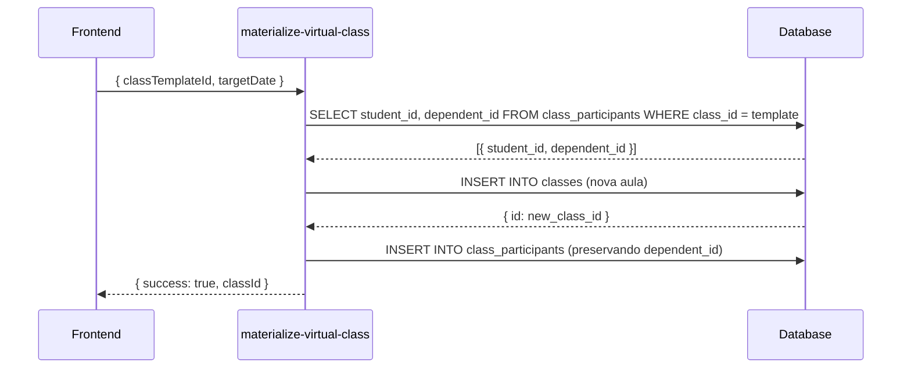
```mermaid
sequenceDiagram
    participant F as Frontend
    participant EF as materialize-virtual-class
    participant DB as Database
    
    F->>EF: { classTemplateId, targetDate }
    EF->>DB: SELECT student_id, dependent_id FROM class_participants WHERE class_id = template
    DB-->>EF: [{ student_id, dependent_id }]
    EF->>DB: INSERT INTO classes (nova aula)
    DB-->>EF: { id: new_class_id }
    EF->>DB: INSERT INTO class_participants (preservando dependent_id)
    EF-->>F: { success: true, classId }
```

### Checklist de Validação
- [ ] Query de participantes inclui `dependent_id`
- [ ] Insert de participantes preserva `dependent_id`
- [ ] Aula materializada reflete corretamente o dependente
- [ ] Faturamento funciona para aulas materializadas de dependentes

---

## 4.26 Verificação de Disponibilidade para Responsáveis

### Problema Identificado
A edge function `get-teacher-availability` não permite que responsáveis verifiquem a disponibilidade de professores para solicitar aulas em nome de seus dependentes.

### Localização
`supabase/functions/get-teacher-availability/index.ts`

### Solução

```typescript
// Verificar se o usuário pode acessar o professor
async function canAccessTeacher(
  supabase: SupabaseClient,
  userId: string,
  teacherId: string
): Promise<boolean> {
  // 1. Verificar se é aluno direto do professor
  const { data: directRelation } = await supabase
    .from('teacher_student_relationships')
    .select('id')
    .eq('teacher_id', teacherId)
    .eq('student_id', userId)
    .maybeSingle();

  if (directRelation) return true;

  // 2. Verificar se é responsável de algum dependente vinculado ao professor
  const { data: dependentRelation } = await supabase
    .from('dependents')
    .select('id')
    .eq('responsible_id', userId)
    .eq('teacher_id', teacherId)
    .limit(1);

  return dependentRelation && dependentRelation.length > 0;
}

// No handler principal
const canAccess = await canAccessTeacher(supabaseClient, userId, teacherId);
if (!canAccess) {
  return new Response(
    JSON.stringify({ error: 'Você não tem permissão para acessar este professor' }),
    { status: 403, headers: corsHeaders }
  );
}
```

### Cenários

| Usuário | Relação com Professor | Pode Verificar Disponibilidade |
|---------|----------------------|-------------------------------|
| Aluno direto | `teacher_student_relationships` | ✅ Sim |
| Responsável | Dependente em `dependents` | ✅ Sim |
| Usuário sem relação | Nenhuma | ❌ Não |

### Checklist de Validação
- [ ] Aluno direto pode verificar disponibilidade
- [ ] Responsável pode verificar disponibilidade para solicitar aula de dependente
- [ ] Usuário sem relação recebe erro 403

---

## 4.27 Arquivamento de Dados com Dependentes

### Problema Identificado
A edge function `archive-old-data` não inclui `dependent_id` ao arquivar `class_participants`, perdendo contexto histórico.

### Localização
`supabase/functions/archive-old-data/index.ts`

### Solução

```typescript
// Buscar participantes INCLUINDO dependent_id
const { data: participants, error: participantsError } = await supabaseClient
  .from('class_participants')
  .select(`
    id,
    class_id,
    student_id,
    dependent_id,
    status,
    confirmed_at,
    completed_at,
    cancelled_at,
    cancelled_by,
    cancellation_reason,
    charge_applied,
    created_at,
    updated_at
  `)
  .in('class_id', classIds);

// Estrutura do arquivo JSON inclui dependent_id
const archivedData = {
  classes: classesToArchive,
  participants: participants.map(p => ({
    ...p,
    dependent_id: p.dependent_id, // ✅ Preservar
    dependent_name: null // Será preenchido abaixo se houver
  })),
  // ... resto do arquivo
};

// Enriquecer com nome do dependente para legibilidade
if (participants.some(p => p.dependent_id)) {
  const dependentIds = participants
    .filter(p => p.dependent_id)
    .map(p => p.dependent_id);
  
  const { data: dependents } = await supabaseClient
    .from('dependents')
    .select('id, name')
    .in('id', dependentIds);
  
  const dependentMap = new Map(dependents.map(d => [d.id, d.name]));
  
  archivedData.participants = archivedData.participants.map(p => ({
    ...p,
    dependent_name: p.dependent_id ? dependentMap.get(p.dependent_id) : null
  }));
}
```

### Estrutura do Arquivo Arquivado

```json
{
  "archived_at": "2025-12-10T00:00:00Z",
  "participants": [
    {
      "id": "uuid",
      "class_id": "uuid",
      "student_id": null,
      "dependent_id": "uuid-dependente",
      "dependent_name": "João Silva Jr.",
      "status": "concluida",
      "charge_applied": false
    }
  ]
}
```

### Checklist de Validação
- [ ] Select inclui `dependent_id`
- [ ] Arquivo JSON preserva `dependent_id`
- [ ] Nome do dependente incluído para legibilidade
- [ ] Histórico arquivado pode ser consultado com contexto de dependente

---

## 4.28 Dashboard - Contagem Correta de Alunos

### Problema Identificado
`Dashboard.tsx` usa `get_teacher_students` que retorna apenas alunos diretos, não incluindo dependentes na contagem total. Isso afeta a exibição de métricas e pode confundir professores.

### Localização
`src/pages/Dashboard.tsx`

### Solução

```typescript
// ANTES (incorreto):
const { count: studentCount } = await supabase
  .from('teacher_student_relationships')
  .select('id', { count: 'exact', head: true })
  .eq('teacher_id', profile.id);

// DEPOIS (correto):
// Opção 1: Usar nova RPC
const { data: countData } = await supabase
  .rpc('count_teacher_students_and_dependents', { p_teacher_id: profile.id });

const totalCount = countData?.total_count ?? 0;

// Opção 2: Query direta (se RPC não existir)
const { count: studentCount } = await supabase
  .from('teacher_student_relationships')
  .select('id', { count: 'exact', head: true })
  .eq('teacher_id', profile.id);

const { count: dependentCount } = await supabase
  .from('dependents')
  .select('id', { count: 'exact', head: true })
  .eq('teacher_id', profile.id);

const totalCount = (studentCount ?? 0) + (dependentCount ?? 0);
```

### Nova RPC (SQL)

```sql
CREATE OR REPLACE FUNCTION public.count_teacher_students_and_dependents(p_teacher_id UUID)
RETURNS TABLE(student_count INTEGER, dependent_count INTEGER, total_count INTEGER)
LANGUAGE plpgsql SECURITY DEFINER
SET search_path TO public
AS $$
BEGIN
  RETURN QUERY
  SELECT 
    (SELECT COUNT(*)::INTEGER FROM teacher_student_relationships WHERE teacher_id = p_teacher_id) AS student_count,
    (SELECT COUNT(*)::INTEGER FROM dependents WHERE teacher_id = p_teacher_id) AS dependent_count,
    (
      (SELECT COUNT(*)::INTEGER FROM teacher_student_relationships WHERE teacher_id = p_teacher_id) +
      (SELECT COUNT(*)::INTEGER FROM dependents WHERE teacher_id = p_teacher_id)
    ) AS total_count;
END;
$$;
```

### Exibição no Dashboard

```tsx
// Exibir com breakdown
<Card>
  <CardHeader>
    <CardTitle>Alunos</CardTitle>
  </CardHeader>
  <CardContent>
    <div className="text-3xl font-bold">{totalCount}</div>
    <p className="text-xs text-muted-foreground">
      {studentCount} alunos • {dependentCount} dependentes
    </p>
  </CardContent>
</Card>
```

### Checklist de Validação
- [ ] Contagem inclui dependentes
- [ ] Breakdown exibido (alunos vs dependentes)
- [ ] Limite de plano considera total (alunos + dependentes)
- [ ] Métricas consistentes com página Alunos

---

## 4.29 ClassReportModal - Feedbacks para Dependentes

### Problema Identificado
`ClassReportModal.tsx` inicializa feedbacks apenas para `student_id`, ignorando participantes que são dependentes (`dependent_id`).

### Localização
`src/components/ClassReportModal.tsx`

### Solução

```typescript
interface ParticipantForFeedback {
  participant_id: string;
  student_id: string | null;
  dependent_id: string | null;
  name: string;
  type: 'student' | 'dependent';
}

// Buscar participantes incluindo dependentes
const loadParticipants = async () => {
  const { data: participants, error } = await supabase
    .from('class_participants')
    .select(`
      id,
      student_id,
      dependent_id,
      profiles!class_participants_student_id_fkey(name)
    `)
    .eq('class_id', classId)
    .in('status', ['confirmada', 'concluida']);

  if (error) throw error;

  // Buscar nomes dos dependentes
  const dependentIds = participants
    .filter(p => p.dependent_id)
    .map(p => p.dependent_id);

  let dependentNames: Map<string, string> = new Map();
  if (dependentIds.length > 0) {
    const { data: dependents } = await supabase
      .from('dependents')
      .select('id, name')
      .in('id', dependentIds);
    
    dependentNames = new Map(dependents?.map(d => [d.id, d.name]) ?? []);
  }

  // Montar lista unificada
  const participantsForFeedback: ParticipantForFeedback[] = participants.map(p => ({
    participant_id: p.id,
    student_id: p.student_id,
    dependent_id: p.dependent_id,
    name: p.dependent_id 
      ? dependentNames.get(p.dependent_id) ?? 'Dependente'
      : p.profiles?.name ?? 'Aluno',
    type: p.dependent_id ? 'dependent' : 'student'
  }));

  return participantsForFeedback;
};

// Inicializar feedbacks para todos os participantes
const initializeFeedbacks = (participants: ParticipantForFeedback[]) => {
  const feedbacks: Record<string, string> = {};
  participants.forEach(p => {
    const key = p.dependent_id ?? p.student_id;
    if (key) feedbacks[key] = '';
  });
  return feedbacks;
};
```

### Renderização

```tsx
{participants.map(participant => (
  <div key={participant.participant_id} className="space-y-2">
    <div className="flex items-center gap-2">
      {participant.type === 'dependent' && (
        <Badge variant="secondary">Dependente</Badge>
      )}
      <Label>{participant.name}</Label>
    </div>
    <Textarea
      placeholder={t('reports.view.feedbackPlaceholder')}
      value={feedbacks[participant.dependent_id ?? participant.student_id ?? ''] ?? ''}
      onChange={(e) => handleFeedbackChange(
        participant.dependent_id ?? participant.student_id ?? '',
        e.target.value
      )}
    />
  </div>
))}
```

### Salvamento

```typescript
// Salvar feedback usando dependent_id quando aplicável
const saveFeedback = async (participantKey: string, feedback: string) => {
  const participant = participants.find(p => 
    (p.dependent_id ?? p.student_id) === participantKey
  );
  
  if (!participant) return;

  await supabase.from('class_report_feedbacks').upsert({
    report_id: reportId,
    student_id: participant.student_id, // NULL se for dependente
    dependent_id: participant.dependent_id, // NULL se for aluno
    feedback
  }, {
    onConflict: 'report_id,student_id,dependent_id'
  });
};
```

### Checklist de Validação
- [ ] Query busca participantes com `dependent_id`
- [ ] Nomes de dependentes são buscados separadamente
- [ ] Feedbacks inicializados para dependentes
- [ ] Badge "Dependente" exibido no modal
- [ ] Salvamento usa `dependent_id` quando aplicável

---

## 4.30 Recibo - Exibir Informações de Dependente

### Problema Identificado
`Recibo.tsx` não exibe qual dependente gerou a cobrança quando a fatura é de aulas de dependentes.

### Localização
`src/pages/Recibo.tsx`

### Solução

```typescript
interface InvoiceClassWithDependent {
  id: string;
  class_id: string;
  amount: number;
  item_type: string;
  dependent_id: string | null;
  dependent?: {
    id: string;
    name: string;
  };
  classes: {
    class_date: string;
    duration_minutes: number;
    service_id: string;
  };
}

// Buscar itens da fatura incluindo dependent_id
const loadInvoiceDetails = async () => {
  const { data: invoiceClasses, error } = await supabase
    .from('invoice_classes')
    .select(`
      id,
      class_id,
      amount,
      item_type,
      dependent_id,
      classes!inner(
        class_date,
        duration_minutes,
        service_id
      )
    `)
    .eq('invoice_id', invoiceId);

  if (error) throw error;

  // Buscar nomes dos dependentes
  const dependentIds = invoiceClasses
    .filter(ic => ic.dependent_id)
    .map(ic => ic.dependent_id);

  if (dependentIds.length > 0) {
    const { data: dependents } = await supabase
      .from('dependents')
      .select('id, name')
      .in('id', dependentIds);
    
    const dependentMap = new Map(dependents?.map(d => [d.id, d]) ?? []);
    
    return invoiceClasses.map(ic => ({
      ...ic,
      dependent: ic.dependent_id ? dependentMap.get(ic.dependent_id) : null
    }));
  }

  return invoiceClasses;
};
```

### Renderização no Recibo

```tsx
{/* Itens da Fatura */}
<table className="w-full">
  <thead>
    <tr>
      <th>Data</th>
      <th>Descrição</th>
      <th>Aluno/Dependente</th>
      <th>Valor</th>
    </tr>
  </thead>
  <tbody>
    {invoiceClasses.map(item => (
      <tr key={item.id}>
        <td>{format(new Date(item.classes.class_date), 'dd/MM/yyyy')}</td>
        <td>
          {item.item_type === 'completed' ? 'Aula realizada' : 'Cancelamento'}
        </td>
        <td>
          {item.dependent ? (
            <span className="flex items-center gap-1">
              <span className="text-xs text-muted-foreground">📌</span>
              {item.dependent.name}
            </span>
          ) : (
            studentName
          )}
        </td>
        <td>{formatCurrency(item.amount)}</td>
      </tr>
    ))}
  </tbody>
</table>

{/* Resumo por dependente (se houver múltiplos) */}
{hasDependents && (
  <div className="mt-4 p-3 bg-muted rounded-lg">
    <h4 className="font-medium mb-2">Resumo por Dependente</h4>
    {Object.entries(groupByDependent(invoiceClasses)).map(([depId, items]) => (
      <div key={depId} className="flex justify-between text-sm">
        <span>{getDependentName(depId)}</span>
        <span>{formatCurrency(sumAmounts(items))}</span>
      </div>
    ))}
  </div>
)}
```

### Checklist de Validação
- [ ] Query busca `dependent_id` de `invoice_classes`
- [ ] Nome do dependente exibido na coluna apropriada
- [ ] Ícone 📌 diferencia dependentes de alunos
- [ ] Resumo por dependente quando houver múltiplos
- [ ] Fatura consolidada mostra total correto

---

## 4.31 Smart Delete Student - Contagem com Dependentes

### Problema Identificado
`smart-delete-student` não considera dependentes ao atualizar a quantidade da assinatura Stripe, podendo resultar em cobrança incorreta.

### Localização
`supabase/functions/smart-delete-student/index.ts`

### Solução

```typescript
// ANTES (incorreto):
const { count: remainingStudents } = await supabaseClient
  .from('teacher_student_relationships')
  .select('id', { count: 'exact', head: true })
  .eq('teacher_id', teacherId);

// DEPOIS (correto):
async function countTeacherStudentsAndDependents(
  supabase: SupabaseClient,
  teacherId: string
): Promise<number> {
  const { count: studentCount } = await supabase
    .from('teacher_student_relationships')
    .select('id', { count: 'exact', head: true })
    .eq('teacher_id', teacherId);

  const { count: dependentCount } = await supabase
    .from('dependents')
    .select('id', { count: 'exact', head: true })
    .eq('teacher_id', teacherId);

  return (studentCount ?? 0) + (dependentCount ?? 0);
}

// No handler principal
const totalStudents = await countTeacherStudentsAndDependents(supabaseClient, teacherId);

// Atualizar Stripe com total correto
await stripe.subscriptions.update(subscriptionId, {
  items: [{
    id: subscriptionItemId,
    quantity: totalStudents
  }]
});
```

### Cenários de Deleção

| Ação | Impacto na Contagem |
|------|---------------------|
| Deletar aluno sem dependentes | -1 aluno |
| Deletar responsável com 2 dependentes | -1 aluno, -2 dependentes = -3 total |
| Deletar dependente individual | -1 dependente |

### Checklist de Validação
- [ ] Contagem inclui alunos + dependentes
- [ ] Stripe atualizado com quantidade correta
- [ ] Deleção de responsável cascata para dependentes
- [ ] Cobrança de overage reflete total correto

---

## 4.32 Notificações de Fatura - Detalhamento de Dependentes

### Problema Identificado
Notificações de fatura para responsáveis não mencionam quais dependentes geraram as cobranças.

### Localização
`supabase/functions/send-invoice-notification/index.ts`

### Solução

```typescript
// Buscar itens da fatura com dependentes
const { data: invoiceClasses } = await supabaseClient
  .from('invoice_classes')
  .select(`
    id,
    amount,
    item_type,
    dependent_id,
    classes(class_date)
  `)
  .eq('invoice_id', invoiceId);

// Buscar nomes dos dependentes
const dependentIds = invoiceClasses
  ?.filter(ic => ic.dependent_id)
  .map(ic => ic.dependent_id) ?? [];

let dependentNames: Map<string, string> = new Map();
if (dependentIds.length > 0) {
  const { data: dependents } = await supabaseClient
    .from('dependents')
    .select('id, name')
    .in('id', dependentIds);
  
  dependentNames = new Map(dependents?.map(d => [d.id, d.name]) ?? []);
}

// Agrupar por dependente para o email
const itemsByDependent = invoiceClasses?.reduce((acc, item) => {
  const key = item.dependent_id ?? 'aluno_principal';
  if (!acc[key]) {
    acc[key] = {
      name: item.dependent_id 
        ? dependentNames.get(item.dependent_id) ?? 'Dependente'
        : studentName,
      items: [],
      total: 0
    };
  }
  acc[key].items.push(item);
  acc[key].total += item.amount;
  return acc;
}, {} as Record<string, { name: string; items: any[]; total: number }>);

// Template de email atualizado
const emailHtml = `
  <h2>Nova Fatura - ${teacherName}</h2>
  
  <p>Olá ${responsibleName},</p>
  
  <p>Segue o detalhamento da sua fatura:</p>
  
  ${Object.values(itemsByDependent ?? {}).map(group => `
    <h3>📌 ${group.name}</h3>
    <ul>
      ${group.items.map(item => `
        <li>${format(new Date(item.classes.class_date), 'dd/MM')} - 
            ${formatCurrency(item.amount)}</li>
      `).join('')}
    </ul>
    <p><strong>Subtotal: ${formatCurrency(group.total)}</strong></p>
  `).join('')}
  
  <h3>Total: ${formatCurrency(totalAmount)}</h3>
  
  <p>Vencimento: ${format(new Date(dueDate), 'dd/MM/yyyy')}</p>
`;
```

### Checklist de Validação
- [ ] Email lista itens agrupados por dependente
- [ ] Nome do dependente exibido com ícone 📌
- [ ] Subtotal por dependente calculado
- [ ] Total geral correto
- [ ] Respeita `notification_preferences` do responsável

---

## 4.33 End Recurrence - Notificação para Responsáveis

### Problema Identificado
Ao encerrar uma recorrência de aulas, a edge function `end-recurrence` não notifica responsáveis de dependentes que eram participantes.

### Localização
`supabase/functions/end-recurrence/index.ts`

### Solução

```typescript
// Buscar participantes incluindo dependentes
const { data: participants } = await supabaseClient
  .from('class_participants')
  .select(`
    student_id,
    dependent_id,
    profiles!class_participants_student_id_fkey(email, name)
  `)
  .eq('class_id', templateClassId)
  .in('status', ['confirmada', 'pendente']);

// Separar alunos diretos de dependentes
const directStudents = participants?.filter(p => p.student_id && !p.dependent_id) ?? [];
const dependentParticipants = participants?.filter(p => p.dependent_id) ?? [];

// Buscar responsáveis dos dependentes
const dependentIds = dependentParticipants.map(p => p.dependent_id);
const { data: dependents } = await supabaseClient
  .from('dependents')
  .select(`
    id,
    name,
    responsible_id,
    responsible:profiles!dependents_responsible_id_fkey(email, name)
  `)
  .in('id', dependentIds);

// Notificar alunos diretos
for (const student of directStudents) {
  await sendEndRecurrenceNotification({
    recipientEmail: student.profiles?.email,
    recipientName: student.profiles?.name,
    className: className,
    endDate: endDate
  });
}

// Notificar responsáveis (agrupando por responsável)
const responsibleMap = new Map<string, { 
  email: string; 
  name: string; 
  dependentNames: string[] 
}>();

for (const dep of dependents ?? []) {
  const existing = responsibleMap.get(dep.responsible_id);
  if (existing) {
    existing.dependentNames.push(dep.name);
  } else {
    responsibleMap.set(dep.responsible_id, {
      email: dep.responsible?.email,
      name: dep.responsible?.name,
      dependentNames: [dep.name]
    });
  }
}

for (const [_, responsible] of responsibleMap) {
  await sendEndRecurrenceNotification({
    recipientEmail: responsible.email,
    recipientName: responsible.name,
    className: className,
    endDate: endDate,
    dependentNames: responsible.dependentNames // Lista de dependentes afetados
  });
}
```

### Template de Email para Responsável

```html
<p>Olá ${responsibleName},</p>

<p>A série de aulas "${className}" foi encerrada.</p>

<p>Esta alteração afeta os seguintes dependentes:</p>
<ul>
  ${dependentNames.map(name => `<li>📌 ${name}</li>`).join('')}
</ul>

<p>Última aula: ${format(new Date(endDate), 'dd/MM/yyyy')}</p>
```

### Checklist de Validação
- [ ] Query busca participantes com `dependent_id`
- [ ] Responsáveis identificados via tabela `dependents`
- [ ] Notificações agrupadas por responsável (evita múltiplos emails)
- [ ] Email lista dependentes afetados
- [ ] Respeita `notification_preferences`

---

## 4.34 Manage Class Exception - Notificações para Dependentes

### Problema Identificado
Ao criar exceções de aula (reagendamento ou cancelamento pontual), a edge function `manage-class-exception` não envia notificações customizadas para responsáveis de dependentes.

### Localização
`supabase/functions/manage-class-exception/index.ts`

### Solução

```typescript
// Após criar a exceção, buscar participantes
const { data: participants } = await supabaseClient
  .from('class_participants')
  .select(`
    student_id,
    dependent_id,
    profiles!class_participants_student_id_fkey(
      email, 
      name,
      notification_preferences
    )
  `)
  .eq('class_id', classId)
  .in('status', ['confirmada', 'pendente']);

// Processar participantes
for (const participant of participants ?? []) {
  if (participant.dependent_id) {
    // É dependente - buscar responsável
    const { data: dependent } = await supabaseClient
      .from('dependents')
      .select(`
        name,
        responsible_id,
        responsible:profiles!dependents_responsible_id_fkey(
          email,
          name,
          notification_preferences
        )
      `)
      .eq('id', participant.dependent_id)
      .single();

    // Verificar preferência do responsável
    const prefs = dependent?.responsible?.notification_preferences;
    if (prefs?.class_cancelled === false && action === 'cancel') continue;
    
    await sendExceptionNotification({
      recipientEmail: dependent?.responsible?.email,
      recipientName: dependent?.responsible?.name,
      dependentName: dependent?.name, // Incluir nome do dependente
      action: action, // 'reschedule' ou 'cancel'
      originalDate: originalDate,
      newDate: newDate,
      className: className
    });
  } else {
    // É aluno direto
    const prefs = participant.profiles?.notification_preferences;
    if (prefs?.class_cancelled === false && action === 'cancel') continue;
    
    await sendExceptionNotification({
      recipientEmail: participant.profiles?.email,
      recipientName: participant.profiles?.name,
      dependentName: null,
      action: action,
      originalDate: originalDate,
      newDate: newDate,
      className: className
    });
  }
}
```

### Templates de Email

**Reagendamento - Aluno Direto:**
```
Assunto: Aula "${className}" Reagendada

Sua aula foi reagendada de ${originalDate} para ${newDate}.
```

**Reagendamento - Responsável:**
```
Assunto: Aula de ${dependentName} Reagendada

A aula de ${dependentName} foi reagendada de ${originalDate} para ${newDate}.
```

**Cancelamento - Aluno Direto:**
```
Assunto: Aula "${className}" Cancelada

Sua aula do dia ${originalDate} foi cancelada.
```

**Cancelamento - Responsável:**
```
Assunto: Aula de ${dependentName} Cancelada

A aula de ${dependentName} do dia ${originalDate} foi cancelada.
```

### Checklist de Validação
- [ ] Query busca participantes com `dependent_id`
- [ ] Responsável identificado para dependentes
- [ ] Email menciona nome do dependente
- [ ] Ação (reagendamento/cancelamento) tratada corretamente
- [ ] Respeita `notification_preferences` do responsável

---

## 4.35 (🔴 CRÍTICA) handle-student-overage - Contagem Correta

### Problema Identificado
A edge function `handle-student-overage` conta apenas registros em `teacher_student_relationships` para calcular overage de alunos, ignorando completamente dependentes. Isso resulta em:
- **Cobrança incorreta**: Professor com 10 alunos + 5 dependentes é cobrado como se tivesse apenas 10
- **Violação de limite de plano**: Limite de 15 alunos pode ser excedido sem cobrança

### Localização
`supabase/functions/handle-student-overage/index.ts` (linhas 74-82)

### Código Atual (Problemático)
```typescript
// Conta total de alunos do professor - IGNORA DEPENDENTES
const { count: totalStudents } = await supabaseClient
  .from('teacher_student_relationships')
  .select('*', { count: 'exact', head: true })
  .eq('teacher_id', userId);
```

### Solução: Usar RPC `count_teacher_students_and_dependents`

```typescript
// Contar alunos + dependentes usando RPC
const { data: countData, error: countError } = await supabaseClient
  .rpc('count_teacher_students_and_dependents', {
    p_teacher_id: userId
  });

if (countError) {
  console.error('Erro ao contar alunos/dependentes:', countError);
  throw new Error('Falha ao contar total de alunos');
}

const totalStudents = countData?.total || 0;
const totalDirectStudents = countData?.direct_students || 0;
const totalDependents = countData?.dependents || 0;

logStep('Contagem total', {
  totalStudents,
  totalDirectStudents,
  totalDependents,
  planLimit,
  extraStudents: totalStudents - planLimit
});

// Atualizar subscription quantity com total correto
await stripe.subscriptions.update(stripeSubscription.id, {
  items: [{
    id: mainItem.id,
    quantity: totalStudents // Inclui dependentes
  }]
});
```

### SQL da RPC (Já Documentada em Seção 3)
```sql
CREATE OR REPLACE FUNCTION count_teacher_students_and_dependents(p_teacher_id uuid)
RETURNS TABLE (
  direct_students bigint,
  dependents bigint,
  total bigint
) AS $$
BEGIN
  RETURN QUERY
  SELECT 
    (SELECT COUNT(*) FROM teacher_student_relationships WHERE teacher_id = p_teacher_id) as direct_students,
    (SELECT COUNT(*) FROM dependents WHERE teacher_id = p_teacher_id) as dependents,
    (SELECT COUNT(*) FROM teacher_student_relationships WHERE teacher_id = p_teacher_id) +
    (SELECT COUNT(*) FROM dependents WHERE teacher_id = p_teacher_id) as total;
END;
$$ LANGUAGE plpgsql SECURITY DEFINER SET search_path = public;
```

### Checklist de Validação
- [ ] RPC `count_teacher_students_and_dependents` criada no banco
- [ ] Edge function usa RPC em vez de query direta
- [ ] Log registra breakdown (diretos vs dependentes)
- [ ] Quantity do Stripe atualizado com total correto
- [ ] Teste: criar dependente deve disparar overage se exceder limite

---

## 4.36 (🔴 CRÍTICA) handle-plan-downgrade-selection - Incluir Dependentes

### Problema Identificado
Ao fazer downgrade de plano, a edge function `handle-plan-downgrade-selection` busca apenas alunos diretos para que o professor selecione quais manter. Dependentes são ignorados, causando:
- **Dados órfãos**: Dependentes de alunos excluídos ficam sem responsável
- **Contagem incorreta**: Validação de limite não considera dependentes
- **Experiência confusa**: Professor não sabe que está perdendo acesso aos dependentes

### Localização
`supabase/functions/handle-plan-downgrade-selection/index.ts` (linhas 67-80)

### Código Atual (Problemático)
```typescript
// Busca apenas alunos diretos - IGNORA DEPENDENTES
const { data: students, error: studentsError } = await supabase
  .from('teacher_student_relationships')
  .select('student_id, student_name')
  .eq('teacher_id', userId);
```

### Solução Completa

```typescript
interface StudentWithDependents {
  id: string;
  name: string;
  type: 'student' | 'dependent';
  responsible_id?: string;
  responsible_name?: string;
}

// 1. Buscar alunos diretos
const { data: directStudents } = await supabase
  .from('teacher_student_relationships')
  .select('student_id, student_name')
  .eq('teacher_id', userId);

// 2. Buscar dependentes
const { data: dependents } = await supabase
  .from('dependents')
  .select(`
    id,
    name,
    responsible_id,
    responsible:profiles!dependents_responsible_id_fkey(name)
  `)
  .eq('teacher_id', userId);

// 3. Combinar em lista unificada
const allStudents: StudentWithDependents[] = [
  ...(directStudents || []).map(s => ({
    id: s.student_id,
    name: s.student_name || 'Sem nome',
    type: 'student' as const
  })),
  ...(dependents || []).map(d => ({
    id: d.id,
    name: d.name,
    type: 'dependent' as const,
    responsible_id: d.responsible_id,
    responsible_name: d.responsible?.name
  }))
];

logStep('Listagem para seleção', {
  directStudents: directStudents?.length || 0,
  dependents: dependents?.length || 0,
  total: allStudents.length
});
```

### Validação de Limite Considerando Dependentes

```typescript
// Validar que seleção não excede limite do novo plano
const selectedTotal = selectedIds.length;
const planLimit = newPlan.student_limit;

if (selectedTotal > planLimit) {
  throw new Error(
    `Seleção excede limite do plano. ` +
    `Selecionados: ${selectedTotal}, Limite: ${planLimit}. ` +
    `Inclua apenas ${planLimit} alunos/dependentes.`
  );
}
```

### Exclusão de Dependentes Não Selecionados

```typescript
// Identificar dependentes para excluir
const dependentIdsToRemove = allStudents
  .filter(s => s.type === 'dependent' && !selectedIds.includes(s.id))
  .map(s => s.id);

// Deletar dependentes não selecionados
if (dependentIdsToRemove.length > 0) {
  const { error: deleteDependentsError } = await supabase
    .from('dependents')
    .delete()
    .in('id', dependentIdsToRemove);

  if (deleteDependentsError) {
    console.error('Erro ao deletar dependentes:', deleteDependentsError);
  }

  logStep('Dependentes removidos', {
    count: dependentIdsToRemove.length,
    ids: dependentIdsToRemove
  });
}

// Continuar com exclusão de alunos diretos (código existente)
const studentIdsToRemove = allStudents
  .filter(s => s.type === 'student' && !selectedIds.includes(s.id))
  .map(s => s.id);

for (const studentId of studentIdsToRemove) {
  await supabase.functions.invoke('smart-delete-student', {
    body: { studentId }
  });
}
```

### Checklist de Validação
- [ ] Query busca dependentes junto com alunos diretos
- [ ] Lista retornada inclui tipo (student/dependent)
- [ ] Validação de limite considera total (alunos + dependentes)
- [ ] Dependentes não selecionados são deletados
- [ ] Cascade deletar dependentes de alunos removidos
- [ ] Log registra breakdown de exclusões

---

## 4.37 (🔴 CRÍTICA) process-payment-failure-downgrade - Suporte a Dependentes

### Problema Identificado
A edge function `process-payment-failure-downgrade` tem o mesmo problema da função de downgrade: ao processar falha de pagamento e fazer downgrade forçado, ignora dependentes na seleção e contagem.

### Localização
`supabase/functions/process-payment-failure-downgrade/index.ts` (linhas 71-88)

### Código Atual (Problemático)
```typescript
// Busca apenas alunos diretos
const { data: allStudents } = await supabaseClient
  .from('teacher_student_relationships')
  .select('student_id, student_name')
  .eq('teacher_id', user.id);

// Validação não considera dependentes
if (selectedStudentIds.length > freePlan.student_limit) {
  return new Response(
    JSON.stringify({ error: 'Exceeded student limit' }),
    { status: 400 }
  );
}
```

### Solução

Aplicar mesma lógica da seção 4.36, adaptada para contexto de falha de pagamento:

```typescript
// 1. Buscar alunos diretos
const { data: directStudents } = await supabaseClient
  .from('teacher_student_relationships')
  .select('student_id, student_name')
  .eq('teacher_id', user.id);

// 2. Buscar dependentes
const { data: dependents } = await supabaseClient
  .from('dependents')
  .select(`
    id,
    name,
    responsible_id,
    responsible:profiles!dependents_responsible_id_fkey(name)
  `)
  .eq('teacher_id', user.id);

// 3. Combinar para validação
const allEntities = [
  ...(directStudents || []).map(s => ({
    id: s.student_id,
    name: s.student_name,
    type: 'student' as const
  })),
  ...(dependents || []).map(d => ({
    id: d.id,
    name: d.name,
    type: 'dependent' as const,
    responsible_id: d.responsible_id
  }))
];

// 4. Validar seleção
const selectedTotal = selectedStudentIds.length;
if (selectedTotal > freePlan.student_limit) {
  return new Response(
    JSON.stringify({
      error: `Selecione no máximo ${freePlan.student_limit} alunos/dependentes`
    }),
    { status: 400, headers: corsHeaders }
  );
}

// 5. Remover não selecionados
const entitiesToRemove = allEntities.filter(e => !selectedStudentIds.includes(e.id));

// Remover dependentes primeiro (para evitar FK issues)
const dependentsToRemove = entitiesToRemove.filter(e => e.type === 'dependent');
if (dependentsToRemove.length > 0) {
  await supabaseClient
    .from('dependents')
    .delete()
    .in('id', dependentsToRemove.map(d => d.id));
}

// Remover alunos diretos
const studentsToRemove = entitiesToRemove.filter(e => e.type === 'student');
for (const student of studentsToRemove) {
  await supabaseClient.functions.invoke('smart-delete-student', {
    body: { studentId: student.id }
  });
}

logStep('Downgrade por falha de pagamento', {
  totalBefore: allEntities.length,
  selected: selectedTotal,
  dependentsRemoved: dependentsToRemove.length,
  studentsRemoved: studentsToRemove.length
});
```

### Checklist de Validação
- [ ] Busca dependentes junto com alunos diretos
- [ ] Validação de limite considera total
- [ ] Dependentes são deletados antes de alunos (FK cascade)
- [ ] Log detalhado de remoções
- [ ] Teste: falha de pagamento com dependentes processa corretamente

---

## 4.38 (🔴 CRÍTICA) PlanDowngradeSelectionModal - UI para Dependentes

### Problema Identificado
O modal `PlanDowngradeSelectionModal.tsx` exibe apenas alunos diretos para seleção durante downgrade de plano, não mostrando dependentes. Isso causa:
- Professor não sabe que está perdendo acesso aos dependentes
- Seleção incompleta resulta em dados inconsistentes
- Experiência do usuário confusa

### Localização
`src/components/PlanDowngradeSelectionModal.tsx`

### Interface Atualizada

```typescript
interface Student {
  id: string;
  name: string;
  type: 'student' | 'dependent';
  responsible_id?: string;
  responsible_name?: string;
}

interface PlanDowngradeSelectionModalProps {
  open: boolean;
  onClose: () => void;
  students: Student[]; // Agora inclui dependentes
  newPlanLimit: number;
  onConfirm: (selectedIds: string[]) => Promise<void>;
}
```

### Renderização com Agrupamento

```tsx
// Agrupar por tipo para exibição organizada
const directStudents = students.filter(s => s.type === 'student');
const dependentStudents = students.filter(s => s.type === 'dependent');

// Agrupar dependentes por responsável
const dependentsByResponsible = dependentStudents.reduce((acc, dep) => {
  const key = dep.responsible_id || 'unknown';
  if (!acc[key]) {
    acc[key] = {
      responsible_name: dep.responsible_name || 'Responsável desconhecido',
      dependents: []
    };
  }
  acc[key].dependents.push(dep);
  return acc;
}, {} as Record<string, { responsible_name: string; dependents: Student[] }>);

return (
  <Dialog open={open} onOpenChange={onClose}>
    <DialogContent className="max-w-lg max-h-[80vh] overflow-y-auto">
      <DialogHeader>
        <DialogTitle>{t('subscription.downgrade.selectStudents')}</DialogTitle>
        <DialogDescription>
          {t('subscription.downgrade.selectDescription', { limit: newPlanLimit })}
        </DialogDescription>
      </DialogHeader>

      <div className="space-y-4">
        {/* Contador de seleção */}
        <div className="flex items-center justify-between p-3 bg-muted rounded-lg">
          <span>{t('subscription.downgrade.selected')}</span>
          <Badge variant={selectedIds.length > newPlanLimit ? 'destructive' : 'default'}>
            {selectedIds.length} / {newPlanLimit}
          </Badge>
        </div>

        {/* Alunos Diretos */}
        {directStudents.length > 0 && (
          <div className="space-y-2">
            <h4 className="font-medium text-sm text-muted-foreground">
              {t('dependents.labels.directStudents')} ({directStudents.length})
            </h4>
            {directStudents.map(student => (
              <div
                key={student.id}
                className={cn(
                  "flex items-center gap-3 p-3 rounded-lg border cursor-pointer transition-colors",
                  selectedIds.includes(student.id)
                    ? "border-primary bg-primary/5"
                    : "border-border hover:border-primary/50"
                )}
                onClick={() => toggleSelection(student.id)}
              >
                <Checkbox checked={selectedIds.includes(student.id)} />
                <User className="h-4 w-4 text-muted-foreground" />
                <span>{student.name}</span>
                <Badge variant="outline" className="ml-auto">
                  {t('dependents.badges.student')}
                </Badge>
              </div>
            ))}
          </div>
        )}

        {/* Dependentes (agrupados por responsável) */}
        {Object.entries(dependentsByResponsible).map(([responsibleId, group]) => (
          <div key={responsibleId} className="space-y-2">
            <h4 className="font-medium text-sm text-muted-foreground flex items-center gap-2">
              <Users className="h-4 w-4" />
              {t('dependents.labels.familyOf', { name: group.responsible_name })}
              ({group.dependents.length})
            </h4>
            {group.dependents.map(dependent => (
              <div
                key={dependent.id}
                className={cn(
                  "flex items-center gap-3 p-3 rounded-lg border cursor-pointer transition-colors ml-4",
                  selectedIds.includes(dependent.id)
                    ? "border-primary bg-primary/5"
                    : "border-border hover:border-primary/50"
                )}
                onClick={() => toggleSelection(dependent.id)}
              >
                <Checkbox checked={selectedIds.includes(dependent.id)} />
                <span className="text-muted-foreground">📌</span>
                <span>{dependent.name}</span>
                <Badge variant="secondary" className="ml-auto">
                  {t('dependents.badges.dependent')}
                </Badge>
              </div>
            ))}
          </div>
        ))}

        {/* Aviso sobre limite */}
        {selectedIds.length > newPlanLimit && (
          <Alert variant="destructive">
            <AlertCircle className="h-4 w-4" />
            <AlertDescription>
              {t('subscription.downgrade.exceedsLimit', {
                selected: selectedIds.length,
                limit: newPlanLimit
              })}
            </AlertDescription>
          </Alert>
        )}
      </div>

      <DialogFooter>
        <Button variant="outline" onClick={onClose}>
          {t('common.cancel')}
        </Button>
        <Button
          onClick={handleConfirm}
          disabled={selectedIds.length > newPlanLimit || selectedIds.length === 0}
        >
          {t('subscription.downgrade.confirmSelection')}
        </Button>
      </DialogFooter>
    </DialogContent>
  </Dialog>
);
```

### Traduções Necessárias

```json
// pt/subscription.json
{
  "downgrade": {
    "selectStudents": "Selecione os alunos que deseja manter",
    "selectDescription": "Seu novo plano permite até {limit} alunos/dependentes. Selecione quais deseja manter.",
    "selected": "Selecionados",
    "exceedsLimit": "Você selecionou {selected} mas o limite é {limit}. Remova alguns para continuar.",
    "confirmSelection": "Confirmar Seleção"
  }
}

// pt/dependents.json
{
  "labels": {
    "directStudents": "Alunos Diretos",
    "familyOf": "Família de {name}"
  },
  "badges": {
    "student": "Aluno",
    "dependent": "Dependente"
  }
}
```

### Checklist de Validação
- [ ] Modal recebe lista com alunos E dependentes
- [ ] Dependentes agrupados visualmente por responsável
- [ ] Badge diferencia aluno de dependente
- [ ] Contador mostra total selecionado vs limite
- [ ] Botão desabilitado se exceder limite
- [ ] Seleção enviada inclui IDs de dependentes

---

## 4.39 (🔴 CRÍTICA) PaymentFailureStudentSelectionModal - UI para Dependentes

### Problema Identificado
O modal `PaymentFailureStudentSelectionModal.tsx` tem o mesmo problema do modal de downgrade: não exibe dependentes para seleção quando o pagamento falha e o usuário precisa escolher quais alunos manter no plano gratuito.

### Localização
`src/components/PaymentFailureStudentSelectionModal.tsx`

### Solução
Aplicar a mesma lógica da seção 4.38, reutilizando o padrão de interface e renderização:

```typescript
interface Student {
  id: string;
  name: string;
  type: 'student' | 'dependent';
  responsible_id?: string;
  responsible_name?: string;
}

interface PaymentFailureStudentSelectionModalProps {
  open: boolean;
  onClose: () => void;
  students: Student[]; // Inclui dependentes
  freeLimit: number;
  onConfirm: (selectedIds: string[]) => Promise<void>;
}
```

### Integração com SubscriptionContext

O `SubscriptionContext` que abre este modal deve ser atualizado para buscar dependentes:

```typescript
// Em SubscriptionContext.tsx - loadSubscription()
const loadStudentsWithDependents = async (teacherId: string) => {
  // Buscar alunos diretos
  const { data: directStudents } = await supabase
    .from('teacher_student_relationships')
    .select('student_id, student_name')
    .eq('teacher_id', teacherId);

  // Buscar dependentes
  const { data: dependents } = await supabase
    .from('dependents')
    .select(`
      id,
      name,
      responsible_id,
      responsible:profiles!dependents_responsible_id_fkey(name)
    `)
    .eq('teacher_id', teacherId);

  return [
    ...(directStudents || []).map(s => ({
      id: s.student_id,
      name: s.student_name || 'Sem nome',
      type: 'student' as const
    })),
    ...(dependents || []).map(d => ({
      id: d.id,
      name: d.name,
      type: 'dependent' as const,
      responsible_id: d.responsible_id,
      responsible_name: d.responsible?.name
    }))
  ];
};
```

### Componente com Suporte a Dependentes

```tsx
export function PaymentFailureStudentSelectionModal({
  open,
  onClose,
  students,
  freeLimit,
  onConfirm
}: PaymentFailureStudentSelectionModalProps) {
  const { t } = useTranslation(['subscription', 'dependents']);
  const [selectedIds, setSelectedIds] = useState<string[]>([]);
  const [isSubmitting, setIsSubmitting] = useState(false);

  // Agrupar por tipo
  const directStudents = students.filter(s => s.type === 'student');
  const dependentsByResponsible = useMemo(() => {
    const deps = students.filter(s => s.type === 'dependent');
    return deps.reduce((acc, dep) => {
      const key = dep.responsible_id || 'unknown';
      if (!acc[key]) {
        acc[key] = {
          responsible_name: dep.responsible_name || 'Responsável',
          dependents: []
        };
      }
      acc[key].dependents.push(dep);
      return acc;
    }, {} as Record<string, { responsible_name: string; dependents: Student[] }>);
  }, [students]);

  const toggleSelection = (id: string) => {
    setSelectedIds(prev =>
      prev.includes(id)
        ? prev.filter(i => i !== id)
        : [...prev, id]
    );
  };

  const handleConfirm = async () => {
    setIsSubmitting(true);
    try {
      await onConfirm(selectedIds);
    } finally {
      setIsSubmitting(false);
    }
  };

  return (
    <Dialog open={open} onOpenChange={onClose}>
      <DialogContent className="max-w-lg max-h-[80vh] overflow-y-auto">
        <DialogHeader>
          <DialogTitle className="flex items-center gap-2">
            <AlertCircle className="h-5 w-5 text-destructive" />
            {t('subscription.paymentFailure.selectStudentsTitle')}
          </DialogTitle>
          <DialogDescription>
            {t('subscription.paymentFailure.selectStudentsDescription', { limit: freeLimit })}
          </DialogDescription>
        </DialogHeader>

        <div className="space-y-4">
          {/* Contador */}
          <div className="flex items-center justify-between p-3 bg-muted rounded-lg">
            <span>{t('subscription.downgrade.selected')}</span>
            <Badge variant={selectedIds.length > freeLimit ? 'destructive' : 'default'}>
              {selectedIds.length} / {freeLimit}
            </Badge>
          </div>

          {/* Lista de alunos diretos */}
          {directStudents.length > 0 && (
            <div className="space-y-2">
              <h4 className="font-medium text-sm text-muted-foreground">
                {t('dependents:labels.directStudents')} ({directStudents.length})
              </h4>
              {directStudents.map(student => (
                <StudentSelectionItem
                  key={student.id}
                  student={student}
                  selected={selectedIds.includes(student.id)}
                  onToggle={() => toggleSelection(student.id)}
                />
              ))}
            </div>
          )}

          {/* Lista de dependentes por responsável */}
          {Object.entries(dependentsByResponsible).map(([respId, group]) => (
            <div key={respId} className="space-y-2">
              <h4 className="font-medium text-sm text-muted-foreground flex items-center gap-2">
                <Users className="h-4 w-4" />
                {t('dependents:labels.familyOf', { name: group.responsible_name })}
              </h4>
              {group.dependents.map(dep => (
                <StudentSelectionItem
                  key={dep.id}
                  student={dep}
                  selected={selectedIds.includes(dep.id)}
                  onToggle={() => toggleSelection(dep.id)}
                  className="ml-4"
                />
              ))}
            </div>
          ))}

          {/* Alerta de limite excedido */}
          {selectedIds.length > freeLimit && (
            <Alert variant="destructive">
              <AlertCircle className="h-4 w-4" />
              <AlertDescription>
                {t('subscription.downgrade.exceedsLimit', {
                  selected: selectedIds.length,
                  limit: freeLimit
                })}
              </AlertDescription>
            </Alert>
          )}
        </div>

        <DialogFooter>
          <Button
            onClick={handleConfirm}
            disabled={selectedIds.length > freeLimit || selectedIds.length === 0 || isSubmitting}
          >
            {isSubmitting ? (
              <Loader2 className="h-4 w-4 animate-spin mr-2" />
            ) : null}
            {t('subscription.downgrade.confirmSelection')}
          </Button>
        </DialogFooter>
      </DialogContent>
    </Dialog>
  );
}

// Componente auxiliar reutilizável
function StudentSelectionItem({
  student,
  selected,
  onToggle,
  className
}: {
  student: Student;
  selected: boolean;
  onToggle: () => void;
  className?: string;
}) {
  const { t } = useTranslation('dependents');

  return (
    <div
      className={cn(
        "flex items-center gap-3 p-3 rounded-lg border cursor-pointer transition-colors",
        selected
          ? "border-primary bg-primary/5"
          : "border-border hover:border-primary/50",
        className
      )}
      onClick={onToggle}
    >
      <Checkbox checked={selected} />
      {student.type === 'dependent' ? (
        <span className="text-muted-foreground">📌</span>
      ) : (
        <User className="h-4 w-4 text-muted-foreground" />
      )}
      <span className="flex-1">{student.name}</span>
      <Badge variant={student.type === 'dependent' ? 'secondary' : 'outline'}>
        {t(`badges.${student.type}`)}
      </Badge>
    </div>
  );
}
```

### Checklist de Validação
- [ ] Modal recebe lista com alunos E dependentes
- [ ] Dependentes agrupados por responsável
- [ ] Badges diferenciam tipos
- [ ] Contador mostra seleção vs limite
- [ ] SubscriptionContext busca dependentes
- [ ] Confirmação envia IDs corretos para edge function

---

## 4.40 (🟠 MÉDIA) handle-teacher-subscription-cancellation - Corrigir Query

### Problema Identificado
A edge function `handle-teacher-subscription-cancellation` tenta buscar `guardian_email` da tabela `profiles`, que não existe. O campo correto é `student_guardian_email` na tabela `teacher_student_relationships`.

### Localização
`supabase/functions/handle-teacher-subscription-cancellation/index.ts`

### Código Problemático (se existir)
```typescript
// ERRADO: profiles não tem guardian_email
const { data: students } = await supabaseClient
  .from('profiles')
  .select('email, guardian_email, name')
  .eq('role', 'aluno');
```

### Solução

```typescript
// Buscar alunos do professor com emails de responsáveis
const { data: studentRelationships } = await supabaseClient
  .from('teacher_student_relationships')
  .select(`
    student_id,
    student_name,
    student_guardian_email,
    student_guardian_name,
    student:profiles!teacher_student_relationships_student_id_fkey(
      email,
      name
    )
  `)
  .eq('teacher_id', teacherId);

// Buscar também os dependentes do professor
const { data: dependents } = await supabaseClient
  .from('dependents')
  .select(`
    id,
    name,
    responsible_id,
    responsible:profiles!dependents_responsible_id_fkey(
      email,
      name
    )
  `)
  .eq('teacher_id', teacherId);

// Preparar lista de notificações
const notifications: Array<{
  email: string;
  name: string;
  dependentNames?: string[];
}> = [];

// Adicionar alunos diretos
for (const rel of studentRelationships || []) {
  const email = rel.student_guardian_email || rel.student?.email;
  const name = rel.student_guardian_name || rel.student?.name || rel.student_name;
  
  if (email) {
    notifications.push({ email, name });
  }
}

// Agrupar dependentes por responsável
const dependentsByResponsible = new Map<string, {
  email: string;
  name: string;
  dependentNames: string[];
}>();

for (const dep of dependents || []) {
  if (dep.responsible?.email) {
    const existing = dependentsByResponsible.get(dep.responsible_id);
    if (existing) {
      existing.dependentNames.push(dep.name);
    } else {
      dependentsByResponsible.set(dep.responsible_id, {
        email: dep.responsible.email,
        name: dep.responsible.name,
        dependentNames: [dep.name]
      });
    }
  }
}

// Adicionar responsáveis com seus dependentes
for (const resp of dependentsByResponsible.values()) {
  notifications.push(resp);
}

// Enviar notificações
for (const notification of notifications) {
  await sendCancellationEmail({
    to: notification.email,
    recipientName: notification.name,
    teacherName: teacherProfile.name,
    dependentNames: notification.dependentNames, // Lista de dependentes afetados
    cancellationReason: reason
  });
}
```

### Template de Email para Responsável com Dependentes

```html
<p>Olá ${recipientName},</p>

<p>Informamos que o professor(a) <strong>${teacherName}</strong> cancelou sua assinatura na plataforma Tutor Flow.</p>

<p>Esta alteração afeta os seguintes dependentes vinculados a você:</p>
<ul>
  ${dependentNames.map(name => `<li>📌 ${name}</li>`).join('')}
</ul>

<p>As aulas programadas foram canceladas e você não receberá mais cobranças relacionadas.</p>

<p>Atenciosamente,<br>Equipe Tutor Flow</p>
```

### Checklist de Validação
- [ ] Query usa `teacher_student_relationships.student_guardian_email`
- [ ] Busca dependentes separadamente
- [ ] Agrupa dependentes por responsável
- [ ] Email para responsável lista todos dependentes afetados
- [ ] Não tenta acessar `profiles.guardian_email`

---

### 4.41 🔴 CRÍTICA: `useStudentCount.ts` - Contagem Incorreta no Frontend

#### Problema Identificado
O hook `useStudentCount.ts` conta apenas registros em `teacher_student_relationships`, ignorando completamente os dependentes. Isso afeta:
- Banner de upgrade mostrando contagem incorreta
- Validação de limite de plano no frontend
- Decisões de UX baseadas em contagem de alunos

#### Localização
- `src/hooks/useStudentCount.ts` (linhas 16-24 e 41-47)

#### Código Atual (Problema)
```typescript
// Contagem incorreta - ignora dependentes
const { data, error } = await supabase
  .from('teacher_student_relationships')
  .select('id')
  .eq('teacher_id', user.id);

if (!error) {
  setStudentCount(data?.length || 0);
}
```

#### Solução Proposta

```typescript
// src/hooks/useStudentCount.ts - VERSÃO CORRIGIDA

import { useState, useEffect } from 'react';
import { supabase } from '@/integrations/supabase/client';

export function useStudentCount() {
  const [studentCount, setStudentCount] = useState<number>(0);
  const [loading, setLoading] = useState(true);

  useEffect(() => {
    const loadStudentCount = async () => {
      try {
        setLoading(true);
        
        const { data: { user } } = await supabase.auth.getUser();
        if (!user) return;

        // CORREÇÃO: Usar RPC que conta alunos + dependentes
        const { data, error } = await supabase
          .rpc('count_teacher_students_and_dependents', {
            p_teacher_id: user.id
          });
        
        if (!error && data !== null) {
          setStudentCount(data);
        } else {
          console.error('Error loading student count:', error);
          // Fallback: contagem manual
          await loadManualCount(user.id);
        }
      } catch (error) {
        console.error('Error loading student count:', error);
      } finally {
        setLoading(false);
      }
    };

    // Fallback para contagem manual caso RPC não exista ainda
    const loadManualCount = async (userId: string) => {
      const [studentsResult, dependentsResult] = await Promise.all([
        supabase
          .from('teacher_student_relationships')
          .select('id', { count: 'exact', head: true })
          .eq('teacher_id', userId),
        supabase
          .from('dependents')
          .select('id', { count: 'exact', head: true })
          .eq('teacher_id', userId)
      ]);

      const studentsCount = studentsResult.count || 0;
      const dependentsCount = dependentsResult.count || 0;
      setStudentCount(studentsCount + dependentsCount);
    };

    loadStudentCount();
  }, []);

  const refreshStudentCount = async () => {
    try {
      const { data: { user } } = await supabase.auth.getUser();
      if (!user) return;

      const { data, error } = await supabase
        .rpc('count_teacher_students_and_dependents', {
          p_teacher_id: user.id
        });
      
      if (!error && data !== null) {
        setStudentCount(data);
      }
    } catch (error) {
      console.error('Error refreshing student count:', error);
    }
  };

  return {
    studentCount,
    loading,
    refreshStudentCount
  };
}
```

#### Prioridade
🔴 **CRÍTICA** - Afeta UX e decisões de upgrade em todo o sistema

#### Checklist de Validação
- [ ] Hook usa RPC `count_teacher_students_and_dependents`
- [ ] Fallback implementado para compatibilidade
- [ ] Banner de upgrade mostra contagem correta
- [ ] Teste com professor sem dependentes (contagem = só alunos)
- [ ] Teste com professor com dependentes (contagem = alunos + dependentes)

---

### 4.42 🔴 CRÍTICA: `create-subscription-checkout` - Quantidade Incorreta no Stripe

#### Problema Identificado
A edge function `create-subscription-checkout` conta apenas `teacher_student_relationships` para definir a quantidade inicial da assinatura no Stripe, ignorando dependentes.

#### Localização
- `supabase/functions/create-subscription-checkout/index.ts` (linhas ~60-70)

#### Código Atual (Problema)
```typescript
// Contagem incorreta - ignora dependentes
const { data: students, error: studentsError } = await supabaseClient
  .from('teacher_student_relationships')
  .select('id')
  .eq('teacher_id', user.id);

const studentCount = students?.length || 0;
```

#### Solução Proposta

```typescript
// supabase/functions/create-subscription-checkout/index.ts

// SUBSTITUIR contagem por RPC
const { data: totalCount, error: countError } = await supabaseClient
  .rpc('count_teacher_students_and_dependents', {
    p_teacher_id: user.id
  });

if (countError) {
  logStep('Erro ao contar alunos e dependentes', { error: countError.message });
  throw new Error('Falha ao verificar quantidade de alunos');
}

const studentCount = totalCount || 0;
logStep('Contagem total (alunos + dependentes)', { studentCount });

// Resto do código permanece igual...
// A quantidade studentCount agora reflete o total real
```

#### Prioridade
🔴 **CRÍTICA** - Quantidade incorreta afeta cobrança de overage no Stripe

#### Checklist de Validação
- [ ] Usa RPC `count_teacher_students_and_dependents`
- [ ] Log registra contagem total
- [ ] Stripe recebe quantidade correta
- [ ] Teste: criar assinatura com 3 alunos + 2 dependentes = quantity 5

---

### 4.43 🔴 CRÍTICA: `check-subscription-status` - Listagem Incompleta para Downgrade

#### Problema Identificado
A função `checkNeedsStudentSelection` dentro de `check-subscription-status` não lista dependentes quando o usuário precisa selecionar quais alunos manter durante um downgrade.

#### Localização
- `supabase/functions/check-subscription-status/index.ts` (função `checkNeedsStudentSelection`)

#### Código Atual (Problema)
```typescript
async function checkNeedsStudentSelection(...) {
  // Só busca alunos diretos
  const { data: students } = await supabaseClient
    .from('teacher_student_relationships')
    .select('student_id, student_name')
    .eq('teacher_id', userId);
  
  // Não inclui dependentes na lista
}
```

#### Solução Proposta

```typescript
// supabase/functions/check-subscription-status/index.ts

interface StudentOrDependent {
  id: string;
  name: string;
  type: 'student' | 'dependent';
  responsible_name?: string;
}

async function checkNeedsStudentSelection(
  supabaseClient: any,
  userId: string,
  newPlanLimit: number
): Promise<{ needsSelection: boolean; students: StudentOrDependent[]; currentCount: number }> {
  
  // 1. Buscar alunos diretos
  const { data: students, error: studentsError } = await supabaseClient
    .from('teacher_student_relationships')
    .select('student_id, student_name')
    .eq('teacher_id', userId);

  if (studentsError) {
    console.error('Erro ao buscar alunos:', studentsError);
    return { needsSelection: false, students: [], currentCount: 0 };
  }

  // 2. Buscar dependentes
  const { data: dependents, error: dependentsError } = await supabaseClient
    .from('dependents')
    .select(`
      id,
      name,
      responsible_id,
      responsible:profiles!dependents_responsible_id_fkey(name)
    `)
    .eq('teacher_id', userId);

  if (dependentsError) {
    console.error('Erro ao buscar dependentes:', dependentsError);
  }

  // 3. Montar lista unificada
  const allStudents: StudentOrDependent[] = [];

  // Adicionar alunos
  for (const student of (students || [])) {
    allStudents.push({
      id: student.student_id,
      name: student.student_name || 'Sem nome',
      type: 'student'
    });
  }

  // Adicionar dependentes
  for (const dep of (dependents || [])) {
    allStudents.push({
      id: dep.id,
      name: dep.name,
      type: 'dependent',
      responsible_name: dep.responsible?.name || 'Responsável desconhecido'
    });
  }

  const currentCount = allStudents.length;
  const needsSelection = currentCount > newPlanLimit;

  return {
    needsSelection,
    students: allStudents,
    currentCount
  };
}
```

#### Integração com Response

```typescript
// No corpo principal da função, atualizar a resposta:

if (result.needsSelection) {
  return new Response(
    JSON.stringify({
      ...subscriptionData,
      needsStudentSelection: true,
      students: result.students, // Agora inclui dependentes com tipo
      currentCount: result.currentCount,
      newPlanLimit: newPlan.student_limit
    }),
    { headers: { ...corsHeaders, 'Content-Type': 'application/json' } }
  );
}
```

#### Interface TypeScript para Frontend

```typescript
// src/types/subscription.ts (ou inline no componente)

export interface StudentForSelection {
  id: string;
  name: string;
  type: 'student' | 'dependent';
  responsible_name?: string;
}

export interface SubscriptionStatusResponse {
  // ... campos existentes ...
  needsStudentSelection?: boolean;
  students?: StudentForSelection[];
  currentCount?: number;
  newPlanLimit?: number;
}
```

#### Prioridade
🔴 **CRÍTICA** - Sem isso, dependentes não aparecem na seleção de downgrade

#### Checklist de Validação
- [ ] Função busca tanto alunos quanto dependentes
- [ ] Lista retornada inclui `type` para diferenciar
- [ ] Dependentes incluem `responsible_name`
- [ ] Frontend recebe lista completa para seleção
- [ ] Teste: professor com 5 alunos + 3 dependentes fazendo downgrade para plano de 5

---

### 4.44 🟡 MÉDIA: RPC `count_teacher_students_and_dependents` - Criar Função

#### Problema Identificado
Várias partes do sistema precisam contar alunos + dependentes, mas não existe uma RPC centralizada para isso. Esta seção documenta a criação da função que será usada por:
- `useStudentCount.ts`
- `create-subscription-checkout`
- `handle-student-overage`
- `create-dependent`

#### SQL para Criar a Função

```sql
-- RPC: Contar total de alunos + dependentes de um professor
CREATE OR REPLACE FUNCTION public.count_teacher_students_and_dependents(p_teacher_id uuid)
RETURNS integer
LANGUAGE sql
STABLE
SECURITY DEFINER
SET search_path = 'public'
AS $$
  SELECT (
    -- Contar alunos diretos
    (SELECT COUNT(*)::integer FROM teacher_student_relationships WHERE teacher_id = p_teacher_id)
    +
    -- Contar dependentes
    (SELECT COUNT(*)::integer FROM dependents WHERE teacher_id = p_teacher_id)
  );
$$;

-- Comentário explicativo
COMMENT ON FUNCTION public.count_teacher_students_and_dependents(uuid) IS 
'Retorna o total de alunos (diretos + dependentes) de um professor. Usado para verificar limites de plano.';

-- Grant para uso via API
GRANT EXECUTE ON FUNCTION public.count_teacher_students_and_dependents(uuid) TO authenticated;
```

#### Notas de Implementação
- Função é `STABLE` pois só lê dados
- `SECURITY DEFINER` garante acesso às tabelas
- Retorna `integer` para compatibilidade com contagens existentes
- Deve ser criada ANTES de modificar as edge functions que a utilizam

#### Prioridade
🟡 **MÉDIA** - Pré-requisito para outras correções, mas simples de implementar

#### Checklist de Validação
- [ ] Função criada no banco
- [ ] Grant aplicado para `authenticated`
- [ ] Teste: professor sem dependentes retorna só contagem de alunos
- [ ] Teste: professor com dependentes retorna soma correta
- [ ] Teste: professor sem alunos nem dependentes retorna 0

---

### 4.45 🟡 BAIXA: `process-orphan-cancellation-charges` - Incluir Dependente na Descrição

#### Problema Identificado
A função que processa cobranças órfãs de cancelamentos não inclui `dependent_id` na query de `class_participants`, resultando em descrições de fatura genéricas que não mencionam qual dependente gerou a cobrança.

**Localização:** `supabase/functions/process-orphan-cancellation-charges/index.ts`

#### Código Atual (Problemático)
```typescript
// Linha ~33-57 - Query não inclui dependent_id
const { data: orphanParticipants } = await supabaseAdmin
  .from('class_participants')
  .select(`
    id,
    class_id,
    student_id,
    cancelled_at,
    charge_applied,
    classes!inner(
      id,
      teacher_id,
      service_id,
      class_services(id, name, price)
    )
  `)
  .eq('status', 'cancelada')
  .eq('charge_applied', true)
  // ...
```

#### Solução

##### 1. Adicionar `dependent_id` no SELECT
```typescript
const { data: orphanParticipants } = await supabaseAdmin
  .from('class_participants')
  .select(`
    id,
    class_id,
    student_id,
    dependent_id,  // ← NOVO: Incluir dependent_id
    cancelled_at,
    charge_applied,
    classes!inner(
      id,
      teacher_id,
      service_id,
      class_services(id, name, price)
    )
  `)
  .eq('status', 'cancelada')
  .eq('charge_applied', true)
  // ...
```

##### 2. Buscar Nome do Dependente (se aplicável)
```typescript
// Dentro do loop de processamento
for (const participant of orphanParticipants) {
  let dependentName: string | null = null;
  
  // Se for dependente, buscar nome
  if (participant.dependent_id) {
    const { data: dependent } = await supabaseAdmin
      .from('dependents')
      .select('name')
      .eq('id', participant.dependent_id)
      .single();
    
    dependentName = dependent?.name || null;
  }
  
  // Criar descrição customizada
  const serviceName = participant.classes?.class_services?.name || 'Aula';
  const description = dependentName 
    ? `Cancelamento (${dependentName}) - ${serviceName}`
    : `Cancelamento - ${serviceName}`;
  
  // Usar description no item da fatura
  invoiceItems.push({
    class_id: participant.class_id,
    participant_id: participant.id,
    dependent_id: participant.dependent_id,  // ← Incluir na fatura
    description,
    amount: calculatedAmount,
    // ...
  });
}
```

##### 3. Atualizar RPC `create_invoice_and_mark_classes_billed`
Se a RPC receber `dependent_id` nos itens, garantir que ele seja persistido em `invoice_classes`:

```sql
-- Já deve estar preparado se invoice_classes tem coluna dependent_id
INSERT INTO public.invoice_classes (
  invoice_id,
  class_id,
  participant_id,
  dependent_id,  -- ← Incluir se existir na tabela
  item_type,
  amount,
  description,
  -- ...
) VALUES (
  v_invoice_id,
  (v_item->>'class_id')::uuid,
  (v_item->>'participant_id')::uuid,
  (v_item->>'dependent_id')::uuid,  -- ← Pode ser NULL
  -- ...
);
```

#### Impacto
- **Transparência:** Professor vê exatamente qual dependente gerou a cobrança órfã
- **Auditoria:** Histórico mais claro em faturas consolidadas de famílias
- **Sem impacto no faturamento:** Cobrança sempre vai para o responsável (correto)

#### Prioridade
🟡 **BAIXA** - Funcionalidade já funciona, apenas falta clareza na descrição

#### Checklist de Validação
- [ ] Query inclui `dependent_id` no SELECT
- [ ] Nome do dependente buscado quando `dependent_id` existe
- [ ] Descrição da fatura inclui nome do dependente
- [ ] Cobrança continua indo para o responsável (não para o dependente)
- [ ] Teste: cobrança órfã de dependente mostra nome correto na fatura

---

### 4.46 🟡 MÉDIA: `ClassReportView.tsx` - Visualização de Feedbacks para Dependentes

#### Problema Identificado
Responsáveis não conseguem ver feedbacks individuais de seus dependentes em relatórios de aula. A filtragem atual só mostra feedbacks do `profile.id` direto.

**Localização:** `src/components/ClassReportView.tsx` (linhas 119-127)

#### Código Atual (Problemático)
```typescript
// Linha ~119-127 - Apenas filtra por profile.id do usuário logado
if (profile?.role === 'aluno') {
  feedbackData = feedbackData.filter(f => f.student_id === profile.id);
}
```

#### Solução

##### 1. Buscar IDs dos Dependentes do Responsável
```typescript
// No início do componente, buscar dependentes
const [myDependentIds, setMyDependentIds] = useState<string[]>([]);

useEffect(() => {
  const loadMyDependents = async () => {
    if (!profile || profile.role !== 'aluno') return;
    
    const { data } = await supabase
      .from('dependents')
      .select('id')
      .eq('responsible_id', profile.id);
    
    if (data) {
      setMyDependentIds(data.map(d => d.id));
    }
  };
  
  loadMyDependents();
}, [profile]);
```

##### 2. Expandir Filtragem de Feedbacks
```typescript
// Modificar a filtragem para incluir dependentes
if (profile?.role === 'aluno') {
  feedbackData = feedbackData.filter(f => 
    f.student_id === profile.id || 
    myDependentIds.includes(f.student_id) ||
    (f.dependent_id && myDependentIds.includes(f.dependent_id))
  );
}
```

##### 3. Adicionar Badge de Identificação
```typescript
// Na renderização, mostrar de quem é o feedback
{feedbacks.map((feedback) => {
  const isMyFeedback = feedback.student_id === profile?.id;
  const dependentName = !isMyFeedback 
    ? dependentsMap.get(feedback.dependent_id || feedback.student_id)?.name 
    : null;
  
  return (
    <Card key={feedback.id}>
      <CardContent>
        {dependentName && (
          <Badge variant="outline" className="mb-2">
            📌 {dependentName}
          </Badge>
        )}
        <p>{feedback.feedback}</p>
      </CardContent>
    </Card>
  );
})}
```

#### Prioridade
🟡 **MÉDIA** - Afeta experiência do responsável ao visualizar relatórios

#### Checklist de Validação
- [ ] Responsável vê feedbacks de seus dependentes
- [ ] Badge mostra nome do dependente em cada feedback
- [ ] Feedbacks próprios (do responsável direto) não mostram badge
- [ ] Alunos normais (sem dependentes) veem apenas seu feedback
- [ ] Professor continua vendo todos os feedbacks normalmente

---

### 4.47 🟡 MÉDIA: `MeusMateriais.tsx` - Materiais Compartilhados com Dependentes

#### Problema Identificado
A página "Meus Materiais" só mostra materiais compartilhados diretamente com o `profile.id`, não incluindo materiais compartilhados com dependentes do responsável.

**Localização:** `src/pages/MeusMateriais.tsx` (linhas 62-69)

#### Código Atual (Problemático)
```typescript
// Linha ~62-69 - Query filtra apenas por student_id do usuário logado
const { data: access } = await supabase
  .from('material_access')
  .select('material_id')
  .eq('student_id', profile.id);
```

#### Solução

##### 1. Buscar Dependentes do Responsável
```typescript
// Adicionar estado para dependentes
const [dependents, setDependents] = useState<Array<{id: string; name: string}>>([]);

// No useEffect inicial, buscar dependentes
const loadDependents = async () => {
  if (!profile) return;
  
  const { data } = await supabase
    .from('dependents')
    .select('id, name')
    .eq('responsible_id', profile.id);
  
  setDependents(data || []);
};
```

##### 2. Expandir Query de Material Access
```typescript
// Buscar materiais do responsável + materiais dos dependentes
const allStudentIds = [profile.id, ...dependents.map(d => d.id)];

const { data: access } = await supabase
  .from('material_access')
  .select('material_id, student_id')
  .in('student_id', allStudentIds);
```

##### 3. Agrupar Materiais na UI
```typescript
// Agrupar materiais por destinatário
const myMaterials = materials.filter(m => 
  accessMap.get(m.id)?.student_id === profile.id
);

const dependentMaterials = dependents.map(dep => ({
  dependent: dep,
  materials: materials.filter(m => 
    accessMap.get(m.id)?.student_id === dep.id
  )
})).filter(g => g.materials.length > 0);
```

##### 4. Renderização com Seções
```typescript
{/* Meus Materiais */}
{myMaterials.length > 0 && (
  <section>
    <h2 className="text-lg font-semibold mb-4">Meus Materiais</h2>
    <div className="grid gap-4">
      {myMaterials.map(material => <MaterialCard key={material.id} {...material} />)}
    </div>
  </section>
)}

{/* Materiais dos Dependentes */}
{dependentMaterials.map(group => (
  <section key={group.dependent.id}>
    <h2 className="text-lg font-semibold mb-4 flex items-center gap-2">
      <span>📌</span> Materiais de {group.dependent.name}
    </h2>
    <div className="grid gap-4">
      {group.materials.map(material => <MaterialCard key={material.id} {...material} />)}
    </div>
  </section>
))}
```

#### Prioridade
🟡 **MÉDIA** - Essencial para responsáveis acessarem materiais dos filhos

#### Checklist de Validação
- [ ] Responsável vê materiais próprios na seção "Meus Materiais"
- [ ] Responsável vê materiais de cada dependente em seções separadas
- [ ] Nome do dependente aparece no título de cada seção
- [ ] Materiais duplicados (compartilhados com responsável E dependente) aparecem em ambas seções
- [ ] Alunos sem dependentes veem interface normal (sem seções extras)
- [ ] Download funciona corretamente para materiais de dependentes

---

### 4.48 🟠 ALTA: `Agenda.tsx` (Portal do Aluno) - Aulas de Dependentes no Calendário

#### Problema Identificado
Responsáveis não veem as aulas de seus dependentes no calendário. Múltiplas queries filtram apenas por `student_id = profile.id`, excluindo completamente os dependentes.

**Localização:** `src/pages/Agenda.tsx` (múltiplas queries - linhas ~312, 360, 408, 455)

#### Código Atual (Problemático)
```typescript
// Múltiplas ocorrências - Query filtra apenas por profile.id
const { data: classes } = await supabase
  .from('class_participants')
  .select(`
    id,
    class_id,
    status,
    ...
  `)
  .eq('student_id', profile.id)
  // ...
```

#### Solução

##### 1. Adicionar Estado para Dependentes
```typescript
// No início do componente
const [myDependents, setMyDependents] = useState<Array<{id: string; name: string}>>([]);

// Buscar dependentes do responsável
useEffect(() => {
  const loadDependents = async () => {
    if (!profile || profile.role !== 'aluno') return;
    
    const { data } = await supabase
      .from('dependents')
      .select('id, name')
      .eq('responsible_id', profile.id);
    
    setMyDependents(data || []);
  };
  
  loadDependents();
}, [profile]);
```

##### 2. Modificar Queries para Incluir Dependentes
```typescript
// Construir array de IDs (responsável + dependentes)
const allParticipantIds = [profile.id, ...myDependents.map(d => d.id)];

// Modificar a query principal
const { data: participations } = await supabase
  .from('class_participants')
  .select(`
    id,
    class_id,
    student_id,
    dependent_id,  // ← Novo campo
    status,
    classes!inner(
      id,
      class_date,
      duration_minutes,
      status,
      teacher_id
    )
  `)
  .or(`student_id.in.(${allParticipantIds.join(',')}),dependent_id.in.(${myDependents.map(d => d.id).join(',')})`)
  // ...
```

##### 3. Adicionar Identificação Visual nos Eventos
```typescript
// Interface estendida para eventos
interface CalendarEvent {
  // ... campos existentes
  isDependent?: boolean;
  dependentName?: string;
}

// Ao mapear eventos
const events = participations.map(p => {
  const isDependent = p.dependent_id !== null || p.student_id !== profile.id;
  const dependentName = isDependent 
    ? myDependents.find(d => d.id === p.dependent_id || d.id === p.student_id)?.name
    : null;
  
  return {
    ...eventData,
    isDependent,
    dependentName,
    title: dependentName 
      ? `📌 ${dependentName} - ${eventData.title}`
      : eventData.title
  };
});
```

##### 4. Estilização Diferenciada no Calendário
```typescript
// No componente de evento do calendário
const eventStyleGetter = (event: CalendarEvent) => {
  if (event.isDependent) {
    return {
      className: 'dependent-class-event',
      style: {
        borderLeft: '3px solid hsl(var(--primary))',
        backgroundColor: 'hsl(var(--primary) / 0.1)'
      }
    };
  }
  return {};
};
```

##### 5. Legenda no Calendário
```typescript
{/* Adicionar legenda se houver dependentes */}
{myDependents.length > 0 && (
  <div className="flex items-center gap-4 text-sm text-muted-foreground mb-4">
    <div className="flex items-center gap-2">
      <div className="w-3 h-3 rounded bg-primary/20 border-l-2 border-primary" />
      <span>Aulas de dependentes</span>
    </div>
    <div className="flex items-center gap-2">
      <div className="w-3 h-3 rounded bg-primary" />
      <span>Minhas aulas</span>
    </div>
  </div>
)}
```

#### Considerações Especiais
- **Performance:** Usar `.or()` pode ser menos eficiente que queries separadas. Considerar alternativa com RPC se houver muitos dependentes.
- **Filtros:** Se existir filtro por aluno, adicionar opção "Todos" + cada dependente individual.
- **Notificações:** Ações de confirmação/cancelamento devem respeitar permissões do responsável.

#### Prioridade
🟠 **ALTA** - Funcionalidade core do portal do responsável

#### Checklist de Validação
- [ ] Responsável vê suas aulas próprias no calendário
- [ ] Responsável vê aulas de TODOS os dependentes no calendário
- [ ] Eventos de dependentes têm estilo visual diferenciado
- [ ] Nome do dependente aparece no título do evento
- [ ] Legenda aparece quando há dependentes
- [ ] Click no evento abre detalhes corretos (do dependente)
- [ ] Confirmação/cancelamento funciona para aulas de dependentes
- [ ] Alunos sem dependentes veem interface normal
- [ ] Performance aceitável com múltiplos dependentes

---

**FIM DO DOCUMENTO**

---

Este documento consolidou todo o planejamento da implementação do Sistema de Dependentes Vinculados ao Responsável, incluindo:

✅ **48 pontas soltas** identificadas e solucionadas (15 originais + 33 adicionais)  
✅ Estrutura completa de dados (SQL com `class_notifications` e `invoice_classes`)  
✅ Implementação frontend (6 componentes + modificações em 14 páginas)  
✅ Implementação backend (3 edge functions novas + 23 modificadas + 4 RPCs novas)
✅ Função SQL `get_unbilled_participants_v2` para faturamento consolidado  
✅ Função SQL `get_teacher_dependents` para listagem de dependentes  
✅ Função SQL `count_teacher_students_and_dependents` para contagem total
✅ Traduções i18n (pt + en)  
✅ Cenários de teste (9 cenários principais)  
✅ Cronograma de implementação (6 fases, **15-21 dias**)  
✅ Análise de riscos e mitigações  
✅ SQL completo para deploy  
✅ Checklist de deploy

**Revisão 9 - 10/12/2025 - Portal do Aluno/Responsável:**
- Adicionadas 3 novas pontas soltas (4.46-4.48):
  - 4.46: `ClassReportView.tsx` - visualização de feedbacks para dependentes
  - 4.47: `MeusMateriais.tsx` - materiais compartilhados com dependentes
  - 4.48: `Agenda.tsx` (portal aluno) - aulas de dependentes no calendário
- Total de páginas frontend afetadas: 12 → 14
- Total de pontas soltas: 45 → 48
- Tempo estimado: 14-20 dias → 15-21 dias

**Revisão 8 - 10/12/2025:**
- Adicionada 1 nova ponta solta (4.45):
  - 4.45: `process-orphan-cancellation-charges` - incluir dependent_id na descrição
- Total de edge functions modificadas: 22 → 23
- Total de pontas soltas: 44 → 45

**Revisão 7 - 10/12/2025:**
- Adicionadas 4 novas pontas soltas (4.41-4.44):
  - 4.41: `useStudentCount.ts` - contagem correta no frontend com RPC
  - 4.42: `create-subscription-checkout` - quantidade correta para Stripe
  - 4.43: `check-subscription-status` - listagem completa para downgrade
  - 4.44: RPC `count_teacher_students_and_dependents` - função centralizada
- Cronograma atualizado: 13-18 dias → **14-20 dias**
- Total de edge functions modificadas: 20 → 22
- Total de páginas/componentes frontend afetados: 10 → 12
- Total de RPCs: 3 → 4

**Revisão 6 - 10/12/2025:**
- Adicionadas 6 novas pontas soltas (4.35-4.40):
  - 4.35: `handle-student-overage` - contagem correta com RPC
  - 4.36: `handle-plan-downgrade-selection` - incluir dependentes na seleção
  - 4.37: `process-payment-failure-downgrade` - suporte a dependentes
  - 4.38: `PlanDowngradeSelectionModal.tsx` - UI para selecionar dependentes
  - 4.39: `PaymentFailureStudentSelectionModal.tsx` - UI para falha de pagamento
  - 4.40: `handle-teacher-subscription-cancellation` - corrigir query de email

**Revisão 5 - 10/12/2025 - Documentação Completa:**
- Adicionadas 10 novas pontas soltas (4.25-4.34):
  - 4.25: `materialize-virtual-class` - preservar `dependent_id`
  - 4.26: `get-teacher-availability` - acesso por responsáveis
  - 4.27: `archive-old-data` - incluir dependentes no arquivo
  - 4.28: `Dashboard.tsx` - contagem correta (alunos + dependentes)
  - 4.29: `ClassReportModal.tsx` - feedbacks para dependentes
  - 4.30: `Recibo.tsx` - exibir informações de dependente
  - 4.31: `smart-delete-student` - contagem Stripe com dependentes
  - 4.32: Notificações de fatura - detalhamento por dependente
  - 4.33: `end-recurrence` - notificar responsáveis
  - 4.34: `manage-class-exception` - notificações customizadas
- Nova RPC: `count_teacher_students_and_dependents`
- Cronograma atualizado: 9-14 dias → 11-16 dias
- Total de edge functions modificadas: 11 → 17
- Total de páginas frontend afetadas: 6 → 8

**Próximos Passos:**
1. Revisar este documento com a equipe
2. Ajustar estimativas se necessário
3. Começar pela Fase 1 (Estrutura de Dados)
