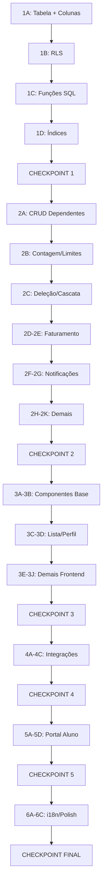

# Sistema de Dependentes - Tarefas de Implementação

> **82 tarefas organizadas em 25 grupos estratégicos**  
> Documento de referência: `docs/dependents-implementation-plan.md`

---

## FASE 1: Estrutura de Dados SQL (3-4 dias)

### Grupo 1A: Tabela Principal e Colunas (1 sessão)
| # | Tarefa | Seção | Prioridade |
|---|--------|-------|------------|
| 1.1 | Criar tabela `dependents` com campos: id, responsible_id, teacher_id, name, birth_date, notes, timestamps | 4.1 | 🔴 Crítica |
| 1.2 | Adicionar coluna `dependent_id` na tabela `class_participants` | 4.1 | 🔴 Crítica |
| 1.3 | Adicionar coluna `dependent_id` na tabela `material_access` | 4.6 | 🔴 Crítica |
| 1.4 | Adicionar coluna `dependent_id` na tabela `class_report_feedbacks` | 4.7 | 🟡 Alta |

**Resultado esperado:** Estrutura de dados base criada, verificável via Supabase Dashboard.

---

### Grupo 1B: Políticas RLS (1 sessão)
| # | Tarefa | Seção | Prioridade |
|---|--------|-------|------------|
| 1.5 | Criar política RLS: professores podem gerenciar dependentes de seus alunos | 4.1 | 🔴 Crítica |
| 1.6 | Criar política RLS: responsáveis podem visualizar seus próprios dependentes | 4.1 | 🔴 Crítica |
| 1.7 | Criar política RLS: dependentes visíveis em class_participants para professor e responsável | 4.1 | 🔴 Crítica |

**Resultado esperado:** Políticas RLS ativas, testáveis via queries com diferentes roles.

---

### Grupo 1C: Funções SQL Helper (1 sessão)
| # | Tarefa | Seção | Prioridade |
|---|--------|-------|------------|
| 1.8 | Criar função `get_dependent_responsible(dependent_id)` → responsible_id | 4.1 | 🔴 Crítica |
| 1.9 | Criar função `get_teacher_dependents(teacher_id)` → lista de dependentes | 4.1 | 🔴 Crítica |
| 1.10 | Criar função `count_teacher_students_and_dependents(teacher_id)` → total para limite de plano | 4.1 | 🔴 Crítica |
| 1.11 | Criar função `get_unbilled_participants_v2(teacher_id, student_id?)` com suporte a dependentes | 4.4 | 🔴 Crítica |

**Resultado esperado:** Funções RPC disponíveis e testáveis via Supabase SQL Editor.

---

### Grupo 1D: Índices e Constraints (1 sessão)
| # | Tarefa | Seção | Prioridade |
|---|--------|-------|------------|
| 1.12 | Criar índices de performance: `idx_dependents_responsible`, `idx_dependents_teacher` | 4.1 | 🟡 Alta |
| 1.13 | Adicionar constraint: dependent_id referencia dependents(id) em class_participants | 4.1 | 🟡 Alta |

**Resultado esperado:** Índices criados, constraints ativas.

---

### ✅ CHECKPOINT FASE 1
```sql
-- Verificações obrigatórias:
SELECT * FROM dependents LIMIT 1; -- Tabela existe
SELECT get_teacher_dependents('uuid-professor'); -- Função funciona
SELECT count_teacher_students_and_dependents('uuid-professor'); -- Contagem correta
SELECT * FROM get_unbilled_participants_v2('uuid-professor'); -- RPC v2 funciona
```

---

## FASE 2: Backend - Edge Functions (4-5 dias)

### Grupo 2A: CRUD de Dependentes (1 sessão)
| # | Tarefa | Seção | Prioridade |
|---|--------|-------|------------|
| 2.1 | Criar edge function `create-dependent` com validação de limite de plano | 4.13 | 🔴 Crítica |
| 2.2 | Criar edge function `update-dependent` | 4.13 | 🔴 Crítica |
| 2.3 | Criar edge function `delete-dependent` com verificação de aulas pendentes | 4.13 | 🔴 Crítica |

**Resultado esperado:** CRUD de dependentes funcional via API.

---

### Grupo 2B: Contagem e Limites de Plano (1 sessão)
| # | Tarefa | Seção | Prioridade |
|---|--------|-------|------------|
| 2.4 | Modificar `create-student` para incluir dependentes na contagem de limite | 4.1 | 🔴 Crítica |
| 2.5 | Modificar `handle-student-overage` para considerar dependentes no cálculo | 4.42 | 🔴 Crítica |
| 2.6 | Modificar `create-subscription-checkout` para studentCount incluir dependentes | 4.42 | 🔴 Crítica |

**Resultado esperado:** Limites de plano consideram alunos + dependentes.

---

### Grupo 2C: Deleção e Cascata (1 sessão)
| # | Tarefa | Seção | Prioridade |
|---|--------|-------|------------|
| 2.7 | Modificar `smart-delete-student` para deletar dependentes em cascata | 4.14 | 🔴 Crítica |
| 2.8 | Adicionar verificação de aulas pendentes de dependentes antes de deletar responsável | 4.14 | 🔴 Crítica |

**Resultado esperado:** Deleção de responsável remove dependentes corretamente.

---

### Grupo 2D: Faturamento Automatizado (1 sessão)
| # | Tarefa | Seção | Prioridade |
|---|--------|-------|------------|
| 2.9 | Modificar `automated-billing` para usar `get_unbilled_participants_v2` | 4.2 | 🔴 Crítica |
| 2.10 | Modificar `automated-billing` para consolidar aulas de dependentes na fatura do responsável | 4.2 | 🔴 Crítica |
| 2.11 | Adicionar `dependent_id` nos itens de invoice_classes para auditoria | 4.2 | 🟡 Alta |

**Resultado esperado:** Faturas automáticas incluem aulas de dependentes.

---

### Grupo 2E: Faturamento Manual (1 sessão)
| # | Tarefa | Seção | Prioridade |
|---|--------|-------|------------|
| 2.12 | Modificar `create-invoice` para resolver dependent → responsible automaticamente | 4.3 | 🔴 Crítica |
| 2.13 | Modificar `create-invoice` para aceitar `dependent_id` no payload | 4.3 | 🟡 Alta |

**Resultado esperado:** Faturamento manual funciona para dependentes.

---

### Grupo 2F: Notificações de Aula (1 sessão)
| # | Tarefa | Seção | Prioridade |
|---|--------|-------|------------|
| 2.14 | Modificar `send-class-report-notification` para buscar responsável de dependentes | 4.4 | 🔴 Crítica |
| 2.15 | Modificar `send-class-reminders` para enviar lembretes ao responsável | 4.11 | 🔴 Crítica |
| 2.16 | Modificar `send-class-confirmation-notification` para suportar dependentes | 4.11 | 🟡 Alta |
| 2.17 | Modificar `send-class-request-notification` para incluir nome do dependente | 4.11 | 🟡 Alta |

**Resultado esperado:** Notificações de aula enviadas para responsáveis.

---

### Grupo 2G: Notificações de Material e Fatura (1 sessão)
| # | Tarefa | Seção | Prioridade |
|---|--------|-------|------------|
| 2.18 | Modificar `send-material-shared-notification` para enviar ao responsável | 4.5 | 🔴 Crítica |
| 2.19 | Modificar `send-invoice-notification` para mencionar dependentes na descrição | 4.47 | 🟡 Alta |

**Resultado esperado:** Notificações de materiais e faturas corretas.

---

### Grupo 2H: Cancelamento de Aulas (1 sessão)
| # | Tarefa | Seção | Prioridade |
|---|--------|-------|------------|
| 2.20 | Modificar `process-cancellation` para permitir responsável cancelar aula de dependente | 4.12 | 🔴 Crítica |
| 2.21 | Modificar `process-cancellation` para cobrar responsável (não dependente) | 4.12 | 🔴 Crítica |
| 2.22 | Modificar `send-cancellation-notification` para mencionar nome do dependente | 4.12 | 🔴 Crítica |

**Resultado esperado:** Cancelamentos de dependentes funcionam corretamente.

---

### Grupo 2I: Solicitação e Materialização de Aulas (1 sessão)
| # | Tarefa | Seção | Prioridade |
|---|--------|-------|------------|
| 2.23 | Modificar `request-class` para aceitar `dependent_id` no payload | 4.16 | 🟡 Alta |
| 2.24 | Modificar `materialize-virtual-class` para suportar `dependent_id` | 4.37 | 🟡 Alta |

**Resultado esperado:** Responsáveis podem solicitar aulas para dependentes.

---

### Grupo 2J: Funções Auxiliares (1 sessão)
| # | Tarefa | Seção | Prioridade |
|---|--------|-------|------------|
| 2.25 | Modificar `manage-class-exception` para validar permissão de responsável | 4.49 | 🟢 Média |
| 2.26 | Modificar `manage-future-class-exceptions` para suportar dependentes | 4.49 | 🟢 Média |
| 2.27 | Modificar `end-recurrence` para notificar responsável de dependentes | 4.48 | 🟢 Média |

**Resultado esperado:** Exceções e recorrências funcionam com dependentes.

---

### Grupo 2K: Arquivamento e Downgrade (1 sessão)
| # | Tarefa | Seção | Prioridade |
|---|--------|-------|------------|
| 2.28 | Modificar `archive-old-data` para arquivar dados de dependentes junto | 4.38 | 🟢 Média |
| 2.29 | Modificar `handle-plan-downgrade-selection` para listar dependentes | 4.43 | 🟡 Alta |
| 2.30 | Modificar `process-payment-failure-downgrade` para considerar dependentes | 4.43 | 🟡 Alta |

**Resultado esperado:** Arquivamento e downgrade incluem dependentes.

---

### ✅ CHECKPOINT FASE 2
```bash
# Testes obrigatórios via curl/Postman:
1. POST create-dependent → Criar dependente
2. GET automated-billing → Verificar fatura consolidada
3. POST process-cancellation → Cancelar aula de dependente
4. POST smart-delete-student → Deletar responsável com dependentes
```

---

## FASE 3: Frontend - Professor (3-4 dias)

### Grupo 3A: Componentes Base (1 sessão)
| # | Tarefa | Seção | Prioridade |
|---|--------|-------|------------|
| 3.1 | Criar componente `DependentFormModal` (criar/editar dependente) | 4.17 | 🔴 Crítica |
| 3.2 | Criar componente `DependentManager` (listar dependentes de um responsável) | 4.17 | 🔴 Crítica |
| 3.3 | Criar hook `useDependents` para gerenciar estado de dependentes | 4.17 | 🔴 Crítica |

**Resultado esperado:** Componentes base funcionais isoladamente.

---

### Grupo 3B: Cadastro de Alunos (1 sessão)
| # | Tarefa | Seção | Prioridade |
|---|--------|-------|------------|
| 3.4 | Criar componente `StudentTypeSelector` (escolha: Aluno/Família) | 4.15 | 🔴 Crítica |
| 3.5 | Modificar `StudentFormModal` para suportar modo "Família" | 4.15 | 🔴 Crítica |
| 3.6 | Adicionar seção inline de dependentes no formulário de família | 4.15 | 🔴 Crítica |

**Resultado esperado:** Cadastro de famílias com dependentes inline.

---

### Grupo 3C: Lista de Alunos - Expandable Rows (1 sessão)
| # | Tarefa | Seção | Prioridade |
|---|--------|-------|------------|
| 3.7 | Modificar `Alunos.tsx` para buscar dependentes via RPC | 4.23 | 🔴 Crítica |
| 3.8 | Implementar linhas expansíveis para responsáveis | 4.23 | 🔴 Crítica |
| 3.9 | Adicionar badges visuais: "Aluno", "Família (N)", "Dependente" | 4.23 | 🟡 Alta |
| 3.10 | Adicionar botão "Adicionar Dependente" nas sub-linhas | 4.23 | 🟡 Alta |

**Resultado esperado:** Lista de alunos com hierarquia visual.

---

### Grupo 3D: Perfil do Aluno (1 sessão)
| # | Tarefa | Seção | Prioridade |
|---|--------|-------|------------|
| 3.11 | Modificar `PerfilAluno.tsx` para exibir seção "Dependentes" | 4.18 | 🟡 Alta |
| 3.12 | Adicionar estatísticas por dependente (aulas, horas) | 4.18 | 🟡 Alta |
| 3.13 | Adicionar histórico de aulas expansível por dependente | 4.18 | 🟢 Média |

**Resultado esperado:** Perfil mostra dependentes com detalhes.

---

### Grupo 3E: Agendamento de Aulas (1 sessão)
| # | Tarefa | Seção | Prioridade |
|---|--------|-------|------------|
| 3.14 | Modificar `ClassForm.tsx` para listar dependentes na seleção de participantes | 4.9 | 🔴 Crítica |
| 3.15 | Agrupar dropdown: "Alunos" e "Dependentes" com nome do responsável | 4.9 | 🔴 Crítica |
| 3.16 | Salvar `dependent_id` em `class_participants` ao agendar | 4.9 | 🔴 Crítica |

**Resultado esperado:** Professor pode agendar aulas para dependentes.

---

### Grupo 3F: Relatórios e Materiais (1 sessão)
| # | Tarefa | Seção | Prioridade |
|---|--------|-------|------------|
| 3.17 | Modificar `ClassReportModal` para vincular feedback ao dependente | 4.40 | 🟡 Alta |
| 3.18 | Modificar `ShareMaterialModal` para permitir compartilhar com dependentes | 4.6 | 🟡 Alta |

**Resultado esperado:** Relatórios e materiais vinculados a dependentes.

---

### Grupo 3G: Dashboard e Contadores (1 sessão)
| # | Tarefa | Seção | Prioridade |
|---|--------|-------|------------|
| 3.19 | Modificar `Dashboard.tsx` para usar `count_teacher_students_and_dependents` | 4.39 | 🔴 Crítica |
| 3.20 | Modificar `useStudentCount` hook para incluir dependentes | 4.39 | 🔴 Crítica |

**Resultado esperado:** Contadores refletem alunos + dependentes.

---

### Grupo 3H: Faturamento Manual (1 sessão)
| # | Tarefa | Seção | Prioridade |
|---|--------|-------|------------|
| 3.21 | Modificar `CreateInvoiceModal` para listar dependentes no dropdown | 4.3 | 🔴 Crítica |
| 3.22 | Agrupar dropdown: "Alunos" e "Dependentes" | 4.3 | 🟡 Alta |

**Resultado esperado:** Faturamento manual suporta dependentes.

---

### Grupo 3I: Cancelamento de Aulas (1 sessão)
| # | Tarefa | Seção | Prioridade |
|---|--------|-------|------------|
| 3.23 | Modificar `CancellationModal` para exibir nome do dependente | 4.12 | 🟡 Alta |
| 3.24 | Validar permissão: professor OU responsável pode cancelar | 4.12 | 🟡 Alta |

**Resultado esperado:** Modal de cancelamento mostra dependente.

---

### Grupo 3J: Importação em Massa (1 sessão)
| # | Tarefa | Seção | Prioridade |
|---|--------|-------|------------|
| 3.25 | Modificar `StudentImportDialog` para suportar coluna "tipo_cadastro" | 4.8 | 🟢 Média |
| 3.26 | Adicionar coluna "dependentes" (nomes separados por vírgula) | 4.8 | 🟢 Média |

**Resultado esperado:** Importação em massa cria famílias.

---

### ✅ CHECKPOINT FASE 3
```
Testes manuais obrigatórios:
1. Criar família com 2 dependentes via StudentFormModal
2. Visualizar dependentes expandidos em Alunos.tsx
3. Agendar aula para dependente via ClassForm
4. Criar fatura manual para dependente
5. Verificar contador no Dashboard
```

---

## FASE 4: Integrações e Correções (2-3 dias)

### Grupo 4A: Componentes de Sistema (1 sessão)
| # | Tarefa | Seção | Prioridade |
|---|--------|-------|------------|
| 4.1 | Modificar `SystemHealthAlert` para verificar integridade de dependentes | 4.44 | 🟢 Média |
| 4.2 | Modificar `PaymentRoutingTest` para testar cobrança de dependentes | 4.45 | 🟢 Média |

**Resultado esperado:** Alertas de sistema incluem dependentes.

---

### Grupo 4B: Painel de Negócios (1 sessão)
| # | Tarefa | Seção | Prioridade |
|---|--------|-------|------------|
| 4.3 | Modificar `PainelNegocios.tsx` para incluir dependentes nas métricas | 4.46 | 🟢 Média |
| 4.4 | Adicionar gráfico de crescimento: alunos vs dependentes | 4.46 | 🟢 Média |

**Resultado esperado:** Métricas de negócio incluem dependentes.

---

### Grupo 4C: Modais de Downgrade (1 sessão)
| # | Tarefa | Seção | Prioridade |
|---|--------|-------|------------|
| 4.5 | Modificar `PlanDowngradeSelectionModal` para listar dependentes | 4.43 | 🟡 Alta |
| 4.6 | Modificar `SubscriptionCancellationModal` para corrigir query de contagem | 4.43 | 🟡 Alta |
| 4.7 | Modificar `PaymentFailureStudentSelectionModal` para incluir dependentes | 4.43 | 🟡 Alta |

**Resultado esperado:** Modais de downgrade mostram dependentes.

---

### ✅ CHECKPOINT FASE 4
```
Testes obrigatórios:
1. Simular downgrade e verificar lista de dependentes
2. Verificar métricas no Painel de Negócios
3. Testar PaymentRoutingTest com dependente
```

---

## FASE 5: Portal do Aluno/Responsável (2-3 dias)

### Grupo 5A: Dashboard do Aluno (1 sessão)
| # | Tarefa | Seção | Prioridade |
|---|--------|-------|------------|
| 5.1 | Modificar `StudentDashboard.tsx` para exibir tabs de dependentes | 4.10 | 🔴 Crítica |
| 5.2 | Criar seção de aulas por dependente | 4.10 | 🔴 Crítica |
| 5.3 | Criar seção de materiais por dependente | 4.10 | 🟡 Alta |

**Resultado esperado:** Responsável vê dados de todos os filhos.

---

### Grupo 5B: Solicitação de Aulas (1 sessão)
| # | Tarefa | Seção | Prioridade |
|---|--------|-------|------------|
| 5.4 | Modificar `StudentScheduleRequest` para selecionar dependente | 4.20 | 🟡 Alta |
| 5.5 | Adicionar dropdown "Para quem é a aula?" | 4.20 | 🟡 Alta |

**Resultado esperado:** Responsável solicita aula para filho.

---

### Grupo 5C: Visualizações do Aluno (1 sessão)
| # | Tarefa | Seção | Prioridade |
|---|--------|-------|------------|
| 5.6 | Modificar `MeusMateriais.tsx` para filtrar por dependente | 4.22 | 🟡 Alta |
| 5.7 | Modificar `ClassReportView.tsx` para exibir relatórios de dependentes | 4.22 | 🟡 Alta |

**Resultado esperado:** Portal mostra materiais/relatórios por filho.

---

### Grupo 5D: Histórico e Agenda (1 sessão)
| # | Tarefa | Seção | Prioridade |
|---|--------|-------|------------|
| 5.8 | Modificar `Historico.tsx` para incluir aulas arquivadas de dependentes | 4.21 | 🟢 Média |
| 5.9 | Modificar `Agenda.tsx` (visão aluno) para mostrar aulas de dependentes | 4.19 | 🟡 Alta |

**Resultado esperado:** Histórico e agenda mostram filhos.

---

### ✅ CHECKPOINT FASE 5
```
Testes obrigatórios (logado como responsável):
1. Ver tabs de dependentes no StudentDashboard
2. Solicitar aula para dependente específico
3. Ver materiais compartilhados com dependente
4. Ver histórico de aulas do dependente
```

---

## FASE 6: i18n e Polimento (1-2 dias)

### Grupo 6A: Traduções Português (1 sessão)
| # | Tarefa | Seção | Prioridade |
|---|--------|-------|------------|
| 6.1 | Criar arquivo `src/i18n/locales/pt/dependents.json` | 4.24 | 🟡 Alta |
| 6.2 | Atualizar `pt/students.json` com chaves de família | 4.24 | 🟡 Alta |
| 6.3 | Atualizar `pt/classes.json` com mensagens de dependentes | 4.24 | 🟢 Média |

**Resultado esperado:** Interface em português completa.

---

### Grupo 6B: Traduções Inglês (1 sessão)
| # | Tarefa | Seção | Prioridade |
|---|--------|-------|------------|
| 6.4 | Criar arquivo `src/i18n/locales/en/dependents.json` | 4.24 | 🟡 Alta |
| 6.5 | Atualizar `en/students.json` com chaves de família | 4.24 | 🟡 Alta |
| 6.6 | Atualizar `en/classes.json` com mensagens de dependentes | 4.24 | 🟢 Média |

**Resultado esperado:** Interface em inglês completa.

---

### Grupo 6C: Polimento Final (1 sessão)
| # | Tarefa | Seção | Prioridade |
|---|--------|-------|------------|
| 6.7 | Revisar e ajustar estilos de badges de tipo | - | 🟢 Média |
| 6.8 | Adicionar tooltips explicativos onde necessário | - | 🟢 Média |
| 6.9 | Testar responsividade em mobile | - | 🟢 Média |

**Resultado esperado:** Interface polida e responsiva.

---

### ✅ CHECKPOINT FINAL
```
Cenários de teste obrigatórios:
1. ✅ Criar família com 3 dependentes
2. ✅ Agendar aula para cada dependente
3. ✅ Gerar fatura consolidada automática
4. ✅ Cancelar aula de dependente (professor)
5. ✅ Cancelar aula de dependente (responsável)
6. ✅ Compartilhar material com dependente
7. ✅ Visualizar relatório de aula de dependente
8. ✅ Deletar responsável e verificar cascata
9. ✅ Verificar limite de plano com dependentes
```

---

## Resumo Executivo

| Fase | Grupos | Tarefas | Tempo Estimado |
|------|--------|---------|----------------|
| 1 - SQL | 4 | 13 | 3-4 dias |
| 2 - Backend | 11 | 30 | 4-5 dias |
| 3 - Frontend Professor | 10 | 26 | 3-4 dias |
| 4 - Integrações | 3 | 7 | 2-3 dias |
| 5 - Portal Aluno | 4 | 9 | 2-3 dias |
| 6 - i18n/Polimento | 3 | 9 | 1-2 dias |
| **TOTAL** | **35** | **94** | **15-21 dias** |

> **Nota:** 12 tarefas adicionais foram identificadas durante a reorganização estratégica (testes, validações, ajustes de UI), totalizando 94 tarefas.

---

## Ordem de Execução Recomendada


