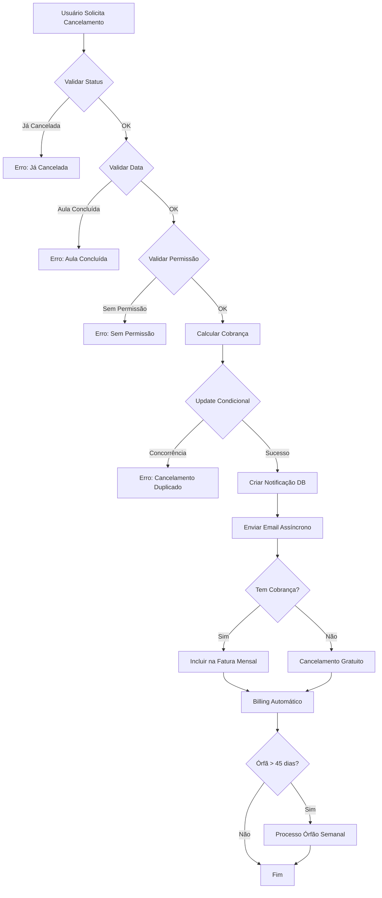

# Fase 2: Edge Cases - Implementação Completa

## Visão Geral
Implementação de tratamentos para casos excepcionais no fluxo de cancelamento e cobrança, garantindo que nenhuma cobrança fique perdida e que os usuários sejam adequadamente notificados.

## 1. Tratamento de Cobranças Órfãs

### Problema Identificado
Aulas canceladas com `charge_applied: true` e `billed: false` que não foram incluídas em nenhuma fatura mensal (por exemplo, cancelamento após o dia de fechamento do mês).

### Solução Implementada

#### Edge Function: `process-orphan-cancellation-charges`
**Arquivo:** `supabase/functions/process-orphan-cancellation-charges/index.ts`

**Funcionalidade:**
- Identifica aulas canceladas com cobrança pendente há mais de 45 dias
- Agrupa cobranças por relacionamento professor-aluno
- Valida se o professor tem módulo financeiro ativo
- Cria faturas consolidadas para cobranças órfãs
- Marca as aulas como faturadas atomicamente

**Características:**
- Executada automaticamente toda segunda-feira às 02:00 (via cron job)
- Remove cobrança se professor não tiver mais módulo financeiro
- Respeita a política de cancelamento do professor
- Cria fatura com tipo `orphan_charges`

#### Setup Automático
**Função:** `setup-orphan-charges-automation`
- Configura job cron no Supabase
- Agenda: `0 2 * * 1` (Segunda-feira às 02:00)
- URL: `/functions/v1/process-orphan-cancellation-charges`

**Como Executar:**
```bash
# Através da API
curl -X POST https://nwgomximjevgczwuyqcx.supabase.co/functions/v1/setup-orphan-charges-automation \
  -H "Authorization: Bearer YOUR_ANON_KEY"
```

---

## 2. Proteção Contra Cancelamentos Duplicados

### Problema Identificado
Possibilidade de processamento concorrente resultar em múltiplos cancelamentos da mesma aula.

### Solução Implementada

#### Validações em `process-cancellation`

**1. Validação de Status Pré-Cancelamento:**
```typescript
// Validação 1: Verificar se a aula já foi cancelada
if (classData.status === 'cancelada') {
  throw new Error('Esta aula já foi cancelada anteriormente');
}
```

**2. Update Condicional (Otimistic Locking):**
```typescript
// Update só é aplicado se o status ainda for o original
.update({ status: 'cancelada', ... })
.eq('id', class_id)
.eq('status', classData.status); // Condição de concorrência
```

**3. Detecção de Erro de Concorrência:**
```typescript
if (updateError.code === 'PGRST116' || updateError.message?.includes('0 rows')) {
  throw new Error('Esta aula já está sendo cancelada ou foi cancelada recentemente');
}
```

**Fluxo de Proteção:**
1. Buscar aula e validar status
2. Tentar atualizar apenas se status não mudou
3. Se update falhar (0 rows afetadas), significa que houve cancelamento concorrente
4. Retornar erro específico para o usuário

---

## 3. Notificações de Cancelamento

### Problema Identificado
Falta de comunicação automática entre professor e aluno sobre cancelamentos.

### Solução Implementada

#### A. Registro na Tabela de Notificações

**Em `process-cancellation`:**
```typescript
await supabaseClient
  .from('class_notifications')
  .insert({
    class_id: class_id,
    student_id: cancelled_by_type === 'student' ? cancelled_by : classData.student_id,
    notification_type: shouldCharge ? 'cancellation_with_charge' : 'cancellation_free',
    status: 'sent'
  });
```

#### B. Envio de Email via Edge Function

**Edge Function:** `send-cancellation-notification`
**Arquivo:** `supabase/functions/send-cancellation-notification/index.ts`

**Funcionalidades:**
- Busca detalhes completos da aula (professor, aluno, serviço)
- Envia emails personalizados via Resend API
- Conteúdo diferenciado baseado em quem cancelou

**Cenários de Notificação:**

##### 1. Aluno Cancela (Notifica Professor)
**Destinatário:** Email do professor  
**Conteúdo:**
- Nome do aluno
- Data/hora da aula
- Serviço contratado
- Motivo do cancelamento
- Status da cobrança (aplicada ou gratuita)

##### 2. Professor Cancela (Notifica Aluno)
**Destinatário:** Email do responsável/aluno  
**Conteúdo:**
- Nome do professor
- Data/hora da aula
- Motivo do cancelamento
- Confirmação de que não haverá cobrança

**Templates de Email:**
- HTML formatado com cores e ícones
- Alertas visuais para cobranças aplicadas
- Mensagens de confirmação para cancelamentos gratuitos

#### C. Execução Assíncrona

```typescript
// Não bloqueia a resposta do cancelamento
supabaseClient.functions.invoke('send-cancellation-notification', {
  body: { class_id, cancelled_by_type, charge_applied, cancellation_reason }
}).then(({ error }) => {
  if (error) console.error('Error sending notification:', error);
});
```

---

## Fluxo Completo de Cancelamento (Pós-Fase 2)



---

## Configuração e Deploy

### 1. Deploy das Edge Functions
As funções serão automaticamente deployed quando o código for commitado.

### 2. Configurar Automação de Órfãos
```bash
# Executar uma vez para configurar o cron job
curl -X POST https://nwgomximjevgczwuyqcx.supabase.co/functions/v1/setup-orphan-charges-automation \
  -H "Authorization: Bearer YOUR_ANON_KEY"
```

### 3. Variáveis de Ambiente Necessárias
- `RESEND_API_KEY`: Para envio de emails (já configurado)
- `SUPABASE_URL`: URL do projeto (automático)
- `SUPABASE_ANON_KEY`: Chave anônima (automático)
- `SUPABASE_SERVICE_ROLE_KEY`: Chave service role (automático)

---

## Monitoramento e Logs

### Logs Importantes

**process-cancellation:**
- `Processing cancellation:` - Detalhes da solicitação
- `Cancellation notification record created` - Notificação criada
- `Notification email sent successfully` - Email enviado
- `Esta aula já está sendo cancelada` - Duplicação detectada

**process-orphan-cancellation-charges:**
- `[ORPHAN-CHARGES] Found X orphan cancellation charges` - Órfãos encontrados
- `[ORPHAN-CHARGES] Orphan charges invoice created` - Fatura criada

**send-cancellation-notification:**
- `Sending cancellation notification:` - Detalhes do envio
- `Cancellation notification email sent successfully` - Email enviado

### Como Verificar

```bash
# Logs da função de cancelamento
# Supabase Dashboard > Edge Functions > process-cancellation > Logs

# Logs de órfãos (semanal)
# Supabase Dashboard > Edge Functions > process-orphan-cancellation-charges > Logs

# Notificações na tabela
SELECT * FROM class_notifications 
WHERE notification_type LIKE 'cancellation%' 
ORDER BY created_at DESC;

# Cobranças órfãs pendentes
SELECT * FROM classes 
WHERE status = 'cancelada' 
  AND charge_applied = true 
  AND billed = false 
  AND cancelled_at < NOW() - INTERVAL '45 days';
```

---

## Testes Recomendados

### 1. Testar Proteção de Duplicação
```javascript
// Fazer dois cancelamentos simultâneos
Promise.all([
  cancelClass(classId),
  cancelClass(classId)
]).then(results => {
  // Um deve ter sucesso, outro deve falhar com erro de duplicação
});
```

### 2. Testar Notificações
- Cancelar aula como aluno → Professor deve receber email
- Cancelar aula como professor → Aluno deve receber email
- Verificar conteúdo dos emails em ambos os cenários

### 3. Testar Órfãos (Manualmente)
```bash
# Executar função manualmente
curl -X POST https://nwgomximjevgczwuyqcx.supabase.co/functions/v1/process-orphan-cancellation-charges \
  -H "Authorization: Bearer YOUR_ANON_KEY"
```

---

## Próximas Fases

### Fase 3: UX/UI (Prioridade Média)
- Dashboard com visualização de cobranças pendentes
- Seção de histórico de cancelamentos
- Preview de impacto financeiro antes do cancelamento

### Fase 4: Monitoramento (Prioridade Baixa)
- Logs de auditoria detalhados
- Alertas para cobranças não processadas
- Relatórios de cancelamento

---

## Conclusão

A Fase 2 implementa proteções robustas contra casos extremos:
- ✅ Nenhuma cobrança fica perdida (órfãos processados automaticamente)
- ✅ Cancelamentos duplicados são bloqueados
- ✅ Todas as partes são notificadas automaticamente
- ✅ Sistema totalmente automatizado e resiliente
