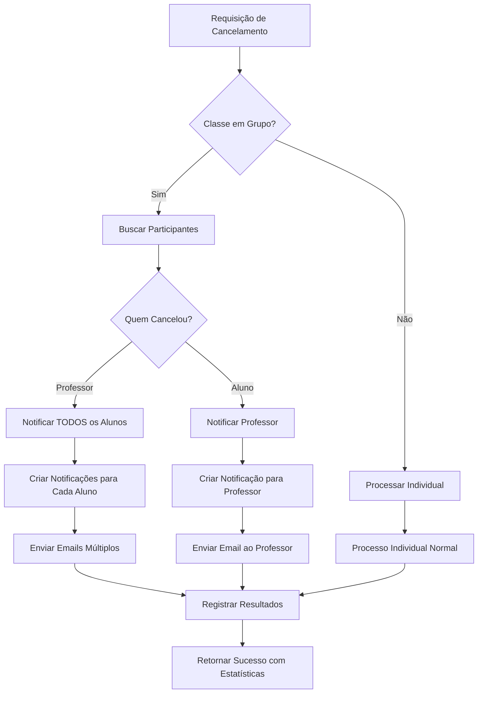

# Implementação de Cancelamento para Classes em Grupo

## Visão Geral

Esta implementação adiciona suporte completo para cancelamento de aulas em grupo, incluindo validações, notificações múltiplas e tratamento adequado de participantes.

## O que foi implementado

### 1. Detecção de Classes em Grupo

- **`process-cancellation/index.ts`**: Agora verifica o campo `is_group_class` e busca todos os participantes da tabela `class_participants`
- Logs indicam quando uma classe é em grupo e quantos participantes existem

### 2. Notificações Múltiplas

#### Para cancelamento pelo aluno:
- **Notifica o professor** informando que um dos alunos cancelou
- Indica que é uma aula em grupo e quantos participantes existem
- Informa os outros participantes sobre o cancelamento

#### Para cancelamento pelo professor:
- **Notifica TODOS os participantes** (alunos/responsáveis)
- Cada participante recebe um email personalizado
- Email indica que é uma aula em grupo e que foi cancelada

### 3. Criação de Registros de Notificação

- Cria um registro em `class_notifications` para **cada aluno afetado**
- Em aulas em grupo, múltiplos registros são criados (um por participante)
- Em aulas individuais, apenas um registro é criado

### 4. Personalização de Mensagens

Os emails agora incluem:
- Indicação clara de "aula em grupo" vs "aula individual"
- Número de participantes afetados
- Informação sobre notificação aos demais participantes (quando relevante)
- Avisos especiais sobre cobranças em aulas em grupo

## Estrutura de Dados

### Interface `NotificationRequest` atualizada

```typescript
interface NotificationRequest {
  class_id: string;
  cancelled_by_type: 'student' | 'teacher';
  charge_applied: boolean;
  cancellation_reason: string;
  is_group_class?: boolean;
  participants?: Array<{
    student_id: string;
    profile: {
      name: string;
      email: string;
      guardian_email?: string;
    };
  }>;
}
```

## Fluxo de Cancelamento (Classes em Grupo)



## Regras de Negócio Implementadas

### 1. Permissões de Cancelamento

- **Professor**: Pode cancelar qualquer aula em grupo que ele ministra
- **Aluno**: Pode cancelar apenas se:
  - For o `student_id` principal da aula (aulas individuais)
  - OU for um participante listado em `class_participants` (aulas em grupo)

### 2. Cobranças

- Cobranças de cancelamento seguem as mesmas regras de aulas individuais
- Se um aluno cancela uma aula em grupo fora do prazo, a cobrança é aplicada
- Professor cancelando nunca gera cobrança (independente de ser grupo ou individual)

### 3. Notificações

- **Cancelamento pelo professor**: TODOS os participantes são notificados
- **Cancelamento por aluno**: Apenas o professor é notificado
- Emails incluem informação contextual sobre ser aula em grupo

## Validações de Email

Implementamos validações robustas:

1. **Verificação de emails válidos**: Antes de tentar enviar, verifica se há emails disponíveis
2. **Fallback para responsável**: Usa `guardian_email` se disponível, senão usa `email` do aluno
3. **Relatório de resultados**: Retorna quantos emails foram enviados com sucesso e quantos falharam
4. **Não-bloqueante**: Falhas no envio de email não impedem o cancelamento

## Exemplo de Resposta

```json
{
  "success": true,
  "message": "Sent 3/4 notifications (1 failed)",
  "results": [
    {
      "email": "aluno1@example.com",
      "success": true
    },
    {
      "email": "aluno2@example.com",
      "success": true
    },
    {
      "email": "aluno3@example.com",
      "success": true
    },
    {
      "email": "invalid-email",
      "success": false,
      "error": "Invalid email format"
    }
  ]
}
```

## Logs e Monitoramento

### Logs Importantes

```
Group class with 5 participants
Created 5 notification record(s)
Email sent successfully to aluno1@example.com
Email sent successfully to aluno2@example.com
...
Sent 5/5 notifications
```

### Pontos de Monitoramento

1. **Taxa de sucesso de notificações** em aulas em grupo vs individuais
2. **Tempo de processamento** para cancelamentos em grupo (múltiplos emails)
3. **Falhas de email** por participante
4. **Cancelamentos em grupo** por período

## Próximos Passos Recomendados

### Curto Prazo

1. ✅ **Implementado**: Suporte básico para classes em grupo
2. ✅ **Implementado**: Notificações múltiplas
3. ✅ **Implementado**: Validações de email

### Médio Prazo (Melhorias Futuras)

1. **Interface no frontend** para mostrar participantes na modal de cancelamento
2. **Confirmação especial** ao cancelar aulas em grupo (avisar que afetará outros)
3. **Histórico de cancelamentos** por aula em grupo
4. **Estatísticas** de cancelamentos em grupo vs individual

### Longo Prazo (Recursos Avançados)

1. **Cancelamento parcial**: Permitir que apenas um aluno saia da aula em grupo
2. **Notificações push** além de email
3. **Agrupamento de notificações**: Se múltiplas aulas do mesmo grupo forem canceladas
4. **Sistema de votação**: Permitir que grupo vote sobre reagendar vs cancelar

## Testes Recomendados

### Cenário 1: Professor cancela aula em grupo
```bash
# Deve notificar todos os 3 alunos
POST /process-cancellation
{
  "class_id": "uuid-aula-grupo",
  "cancelled_by": "uuid-professor",
  "cancelled_by_type": "teacher",
  "reason": "Compromisso inesperado"
}
```

**Resultado esperado**: 3 emails enviados para os alunos/responsáveis

### Cenário 2: Aluno cancela participação em aula em grupo
```bash
# Deve notificar apenas o professor
POST /process-cancellation
{
  "class_id": "uuid-aula-grupo",
  "cancelled_by": "uuid-aluno",
  "cancelled_by_type": "student",
  "reason": "Não poderei comparecer"
}
```

**Resultado esperado**: 1 email enviado para o professor

### Cenário 3: Aula em grupo sem emails válidos
```bash
# Deve lidar graciosamente com falta de emails
POST /process-cancellation
{
  "class_id": "uuid-aula-grupo-sem-emails",
  "cancelled_by": "uuid-professor",
  "cancelled_by_type": "teacher",
  "reason": "Teste"
}
```

**Resultado esperado**: Cancelamento bem-sucedido com aviso sobre falta de emails

## Compatibilidade

Esta implementação é **retrocompatível** com aulas individuais:
- Se `is_group_class` é `false` ou `null`, funciona como antes
- Se não há participantes, funciona como aula individual
- Mantém todas as validações e regras existentes

## Links Úteis

- [Logs do process-cancellation](https://supabase.com/dashboard/project/nwgomximjevgczwuyqcx/functions/process-cancellation/logs)
- [Logs do send-cancellation-notification](https://supabase.com/dashboard/project/nwgomximjevgczwuyqcx/functions/send-cancellation-notification/logs)
- [Documentação de Edge Functions](https://supabase.com/dashboard/project/nwgomximjevgczwuyqcx/functions)
