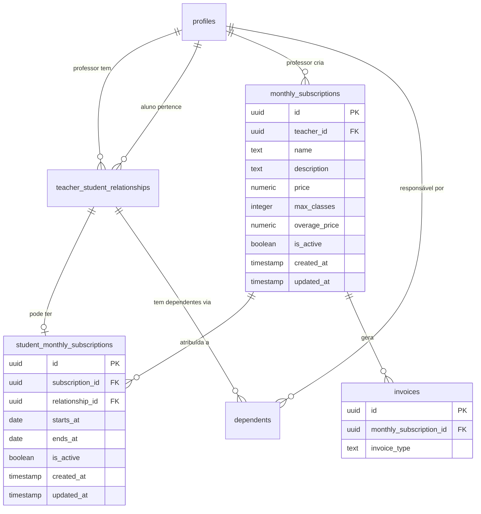
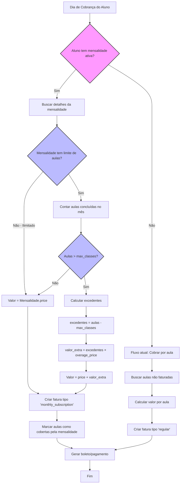
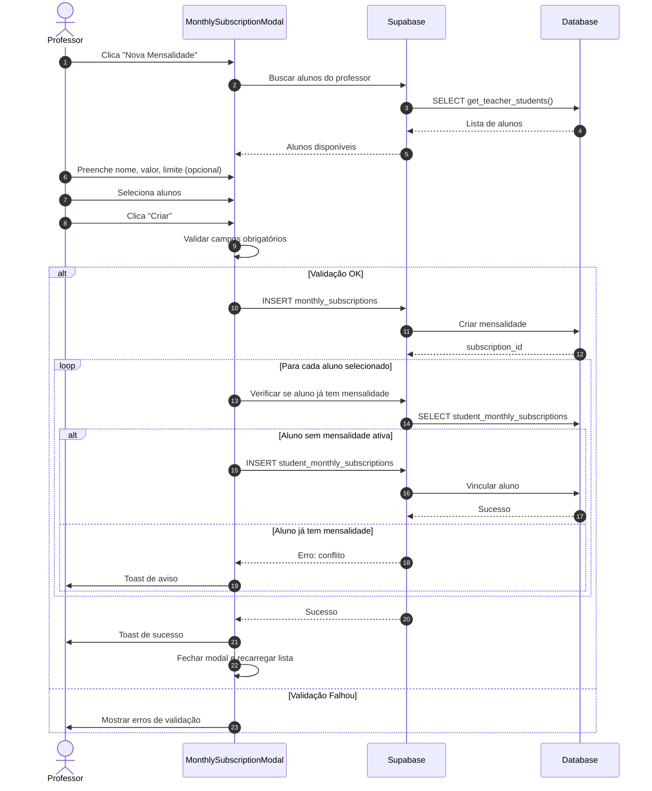

# Plano de Implementação: Mensalidade Fixa

## Sumário

1. [Visão Geral](#1-visão-geral)
   - 1.1 [Contexto do Problema](#11-contexto-do-problema)
   - 1.2 [Requisitos Funcionais](#12-requisitos-funcionais)
   - 1.3 [Requisitos Não-Funcionais](#13-requisitos-não-funcionais)
   - 1.4 [Decisões de Design](#14-decisões-de-design)
2. [Arquitetura da Solução](#2-arquitetura-da-solução)
   - 2.1 [Diagrama Entidade-Relacionamento](#21-diagrama-entidade-relacionamento)
   - 2.2 [Fluxo de Faturamento](#22-fluxo-de-faturamento)
   - 2.3 [Fluxo de Criação de Mensalidade](#23-fluxo-de-criação-de-mensalidade)
3. [Estrutura de Dados](#3-estrutura-de-dados)
   - 3.1 [Nova Tabela: monthly_subscriptions](#31-nova-tabela-monthly_subscriptions)
   - 3.2 [Nova Tabela: student_monthly_subscriptions](#32-nova-tabela-student_monthly_subscriptions)
   - 3.3 [Alteração: invoices](#33-alteração-invoices)
   - 3.4 [Funções SQL](#34-funções-sql)
   - 3.5 [Índices e Constraints](#35-índices-e-constraints)
4. [Pontas Soltas e Soluções](#4-pontas-soltas-e-soluções)
5. [Casos de Uso Adicionais](#5-casos-de-uso-adicionais)
   - 5.1 [Histórico de Mudanças na Mensalidade](#51-histórico-de-mudanças-na-mensalidade)
   - 5.2 [Mensalidades com Data de Início Futura](#52-mensalidades-com-data-de-início-futura)
   - 5.3 [Exclusão de Aulas Experimentais do Limite](#53-exclusão-de-aulas-experimentais-do-limite)
   - 5.4 [Soft Delete de Mensalidades](#54-soft-delete-de-mensalidades)
6. [Implementação Frontend](#6-implementação-frontend)
   - 6.1 [Estrutura de Arquivos](#61-estrutura-de-arquivos)
   - 6.2 [Componentes](#62-componentes)
   - 6.3 [Alterações em Componentes Existentes](#63-alterações-em-componentes-existentes)
7. [Implementação Backend](#7-implementação-backend)
   - 7.1 [Alteração no Faturamento Automatizado](#71-alteração-no-faturamento-automatizado)
   - 7.2 [Pseudocódigo do Novo Fluxo](#72-pseudocódigo-do-novo-fluxo)
8. [Internacionalização (i18n)](#8-internacionalização-i18n)
   - 8.1 [Português (pt)](#81-português-pt)
   - 8.2 [English (en)](#82-english-en)
9. [Testes e Validações](#9-testes-e-validações)
10. [Cronograma de Implementação](#10-cronograma-de-implementação)
11. [Riscos e Mitigações](#11-riscos-e-mitigações)
12. [Apêndice A: SQL Completo](#12-apêndice-a-sql-completo)
13. [Apêndice B: Checklist de Deploy](#13-apêndice-b-checklist-de-deploy)

---

## 1. Visão Geral

### 1.1 Contexto do Problema

Atualmente, o sistema Tutor Flow cobra os alunos exclusivamente por aula realizada. No entanto, muitos professores preferem trabalhar com **mensalidades fixas**, onde o aluno paga um valor mensal independente da quantidade de aulas.

Esta funcionalidade permite que professores ofereçam:
- Pacotes mensais com valor fixo
- Opcionalmente, limite de aulas por mês
- Cobrança de aulas excedentes quando há limite

### 1.2 Requisitos Funcionais

| ID | Requisito | Prioridade |
|----|-----------|------------|
| RF01 | Professor pode criar mensalidades com nome, descrição e valor fixo | Alta |
| RF02 | Professor pode definir limite de aulas por mês (opcional) | Alta |
| RF03 | Professor pode definir valor por aula excedente | Média |
| RF04 | Professor pode atribuir alunos à mensalidade na mesma tela | Alta |
| RF05 | Um aluno só pode ter uma mensalidade ativa por relacionamento | Alta |
| RF06 | Mensalidade cobre responsável + todos os dependentes (cobrança familiar) | Alta |
| RF07 | Cancelamentos de aula NÃO geram cobrança adicional | Alta |
| RF08 | Cobrança usa o billing_day do relacionamento existente | Alta |
| RF09 | Mensalidade tem vigência indeterminada (sem data fim) | Média |
| RF10 | Professor pode desativar mensalidade a qualquer momento | Alta |

### 1.3 Requisitos Não-Funcionais

| ID | Requisito | Métrica |
|----|-----------|---------|
| RNF01 | Verificação de mensalidade deve ser rápida | < 50ms por aluno |
| RNF02 | Interface deve ser responsiva | Mobile-first |
| RNF03 | Retrocompatibilidade com cobrança por aula | 100% mantida |
| RNF04 | Internacionalização completa | PT e EN |

### 1.4 Decisões de Design

| Decisão | Opções Consideradas | Escolha | Justificativa |
|---------|---------------------|---------|---------------|
| Limite de aulas | Nenhum / Flexível | **Flexível** | Permite pacotes como "8 aulas/mês" |
| Escopo da mensalidade | Por aluno / Por relacionamento | **Por relacionamento** | Consistente com billing_day existente |
| Cobertura de dependentes | Individual / Familiar | **Familiar** | Uma mensalidade cobre todos |
| Cancelamentos | Cobrar / Ignorar | **Ignorar** | Mensalidade fixa = preço fixo |
| Dia de cobrança | Novo campo / billing_day | **billing_day** | Reutiliza lógica existente |
| Vigência | Com datas / Indeterminada | **Indeterminada** | Simplifica gestão |
| Atribuição de alunos | Tela separada / Mesma tela | **Mesma tela** | UX mais fluida |

---

## 2. Arquitetura da Solução

### 2.1 Diagrama Entidade-Relacionamento



### 2.2 Fluxo de Faturamento



### 2.3 Fluxo de Criação de Mensalidade



---

## 3. Estrutura de Dados

### 3.1 Nova Tabela: monthly_subscriptions

```sql
-- ============================================
-- TABELA: monthly_subscriptions
-- Armazena os planos de mensalidade criados pelos professores
-- ============================================

CREATE TABLE public.monthly_subscriptions (
  id UUID PRIMARY KEY DEFAULT gen_random_uuid(),
  teacher_id UUID NOT NULL REFERENCES public.profiles(id) ON DELETE CASCADE,
  
  -- Informações básicas
  name TEXT NOT NULL,
  description TEXT,
  
  -- Valores
  price NUMERIC NOT NULL CHECK (price >= 0),
  
  -- Limite de aulas (NULL = ilimitado)
  max_classes INTEGER CHECK (max_classes IS NULL OR max_classes > 0),
  overage_price NUMERIC CHECK (overage_price IS NULL OR overage_price >= 0),
  
  -- Status
  is_active BOOLEAN NOT NULL DEFAULT true,
  
  -- Timestamps
  created_at TIMESTAMP WITH TIME ZONE NOT NULL DEFAULT now(),
  updated_at TIMESTAMP WITH TIME ZONE NOT NULL DEFAULT now()
);

-- Comentários
COMMENT ON TABLE public.monthly_subscriptions IS 'Planos de mensalidade fixa criados por professores';
COMMENT ON COLUMN public.monthly_subscriptions.max_classes IS 'Limite de aulas por mês. NULL = ilimitado';
COMMENT ON COLUMN public.monthly_subscriptions.overage_price IS 'Valor por aula excedente. Só aplicável se max_classes definido';

-- Índices
CREATE INDEX idx_monthly_subscriptions_teacher_id ON public.monthly_subscriptions(teacher_id);
CREATE INDEX idx_monthly_subscriptions_active ON public.monthly_subscriptions(teacher_id, is_active) WHERE is_active = true;

-- RLS
ALTER TABLE public.monthly_subscriptions ENABLE ROW LEVEL SECURITY;

CREATE POLICY "Professores podem gerenciar suas mensalidades"
ON public.monthly_subscriptions
FOR ALL
USING (auth.uid() = teacher_id)
WITH CHECK (auth.uid() = teacher_id);

-- Trigger para updated_at
CREATE TRIGGER update_monthly_subscriptions_updated_at
BEFORE UPDATE ON public.monthly_subscriptions
FOR EACH ROW EXECUTE FUNCTION update_updated_at_column();
```

### 3.2 Nova Tabela: student_monthly_subscriptions

```sql
-- ============================================
-- TABELA: student_monthly_subscriptions
-- Vincula alunos (via relationship) a uma mensalidade
-- ============================================

CREATE TABLE public.student_monthly_subscriptions (
  id UUID PRIMARY KEY DEFAULT gen_random_uuid(),
  
  -- Referências
  subscription_id UUID NOT NULL REFERENCES public.monthly_subscriptions(id) ON DELETE CASCADE,
  relationship_id UUID NOT NULL REFERENCES public.teacher_student_relationships(id) ON DELETE CASCADE,
  
  -- Vigência
  starts_at DATE NOT NULL DEFAULT CURRENT_DATE,
  ends_at DATE, -- NULL = indeterminado
  
  -- Status
  is_active BOOLEAN NOT NULL DEFAULT true,
  
  -- Timestamps
  created_at TIMESTAMP WITH TIME ZONE NOT NULL DEFAULT now(),
  updated_at TIMESTAMP WITH TIME ZONE NOT NULL DEFAULT now()
);

-- Comentários
COMMENT ON TABLE public.student_monthly_subscriptions IS 'Vinculação de alunos a mensalidades';
COMMENT ON COLUMN public.student_monthly_subscriptions.ends_at IS 'Data de término. NULL = vigência indeterminada';

-- Constraint: Um aluno só pode ter UMA mensalidade ativa por relacionamento
-- Usamos um índice parcial único para garantir isso
CREATE UNIQUE INDEX idx_unique_active_subscription_per_relationship 
ON public.student_monthly_subscriptions(relationship_id) 
WHERE is_active = true;

-- Índices adicionais
CREATE INDEX idx_student_monthly_subscriptions_subscription_id ON public.student_monthly_subscriptions(subscription_id);
CREATE INDEX idx_student_monthly_subscriptions_active ON public.student_monthly_subscriptions(subscription_id, is_active) WHERE is_active = true;

-- RLS
ALTER TABLE public.student_monthly_subscriptions ENABLE ROW LEVEL SECURITY;

CREATE POLICY "Professores podem gerenciar assinaturas de seus alunos"
ON public.student_monthly_subscriptions
FOR ALL
USING (
  subscription_id IN (
    SELECT id FROM public.monthly_subscriptions WHERE teacher_id = auth.uid()
  )
)
WITH CHECK (
  subscription_id IN (
    SELECT id FROM public.monthly_subscriptions WHERE teacher_id = auth.uid()
  )
);

-- Política para alunos visualizarem suas próprias mensalidades
CREATE POLICY "Alunos podem ver suas mensalidades"
ON public.student_monthly_subscriptions
FOR SELECT
USING (
  relationship_id IN (
    SELECT id FROM public.teacher_student_relationships WHERE student_id = auth.uid()
  )
);

-- Trigger para updated_at
CREATE TRIGGER update_student_monthly_subscriptions_updated_at
BEFORE UPDATE ON public.student_monthly_subscriptions
FOR EACH ROW EXECUTE FUNCTION update_updated_at_column();
```

### 3.3 Alteração: invoices

```sql
-- ============================================
-- ALTERAÇÃO: Adicionar referência a mensalidade em invoices
-- ============================================

-- Adicionar coluna para referência à mensalidade
ALTER TABLE public.invoices 
ADD COLUMN monthly_subscription_id UUID REFERENCES public.monthly_subscriptions(id);

-- Comentário
COMMENT ON COLUMN public.invoices.monthly_subscription_id IS 'Referência à mensalidade que gerou esta fatura (se aplicável)';

-- Índice para buscas por mensalidade
CREATE INDEX idx_invoices_monthly_subscription_id ON public.invoices(monthly_subscription_id) WHERE monthly_subscription_id IS NOT NULL;
```

### 3.4 Funções SQL

```sql
-- ============================================
-- FUNÇÃO: get_student_active_subscription
-- Retorna a mensalidade ativa de um aluno (via relationship_id)
-- ============================================

CREATE OR REPLACE FUNCTION public.get_student_active_subscription(
  p_relationship_id UUID
)
RETURNS TABLE (
  subscription_id UUID,
  subscription_name TEXT,
  price NUMERIC,
  max_classes INTEGER,
  overage_price NUMERIC
)
LANGUAGE sql
STABLE SECURITY DEFINER
SET search_path TO 'public'
AS $$
  SELECT 
    ms.id as subscription_id,
    ms.name as subscription_name,
    ms.price,
    ms.max_classes,
    ms.overage_price
  FROM student_monthly_subscriptions sms
  JOIN monthly_subscriptions ms ON ms.id = sms.subscription_id
  WHERE sms.relationship_id = p_relationship_id
    AND sms.is_active = true
    AND ms.is_active = true
    AND sms.starts_at <= CURRENT_DATE
    AND (sms.ends_at IS NULL OR sms.ends_at >= CURRENT_DATE)
  LIMIT 1;
$$;

COMMENT ON FUNCTION public.get_student_active_subscription IS 'Retorna a mensalidade ativa de um aluno para um relacionamento específico';

-- ============================================
-- FUNÇÃO: count_completed_classes_in_month
-- Conta aulas concluídas de um aluno em um mês específico
-- Inclui aulas do responsável + dependentes (cobertura familiar)
-- ============================================

CREATE OR REPLACE FUNCTION public.count_completed_classes_in_month(
  p_teacher_id UUID,
  p_student_id UUID,
  p_year INTEGER DEFAULT EXTRACT(YEAR FROM CURRENT_DATE)::INTEGER,
  p_month INTEGER DEFAULT EXTRACT(MONTH FROM CURRENT_DATE)::INTEGER
)
RETURNS INTEGER
LANGUAGE sql
STABLE SECURITY DEFINER
SET search_path TO 'public'
AS $$
  SELECT COUNT(DISTINCT cp.id)::INTEGER
  FROM class_participants cp
  JOIN classes c ON c.id = cp.class_id
  LEFT JOIN dependents d ON d.id = cp.dependent_id
  WHERE c.teacher_id = p_teacher_id
    AND cp.status = 'concluida'
    AND EXTRACT(YEAR FROM c.class_date) = p_year
    AND EXTRACT(MONTH FROM c.class_date) = p_month
    AND (
      cp.student_id = p_student_id  -- Aulas do próprio aluno
      OR d.responsible_id = p_student_id  -- Aulas de dependentes do aluno
    );
$$;

COMMENT ON FUNCTION public.count_completed_classes_in_month IS 'Conta aulas concluídas (responsável + dependentes) em um mês específico';

-- ============================================
-- FUNÇÃO: get_subscription_students_count
-- Conta quantos alunos estão vinculados a uma mensalidade
-- ============================================

CREATE OR REPLACE FUNCTION public.get_subscription_students_count(
  p_subscription_id UUID
)
RETURNS INTEGER
LANGUAGE sql
STABLE SECURITY DEFINER
SET search_path TO 'public'
AS $$
  SELECT COUNT(*)::INTEGER
  FROM student_monthly_subscriptions
  WHERE subscription_id = p_subscription_id
    AND is_active = true;
$$;

COMMENT ON FUNCTION public.get_subscription_students_count IS 'Conta alunos ativos vinculados a uma mensalidade';

-- ============================================
-- FUNÇÃO: get_subscriptions_with_students
-- Retorna mensalidades de um professor com contagem de alunos
-- ============================================

CREATE OR REPLACE FUNCTION public.get_subscriptions_with_students(
  p_teacher_id UUID
)
RETURNS TABLE (
  id UUID,
  name TEXT,
  description TEXT,
  price NUMERIC,
  max_classes INTEGER,
  overage_price NUMERIC,
  is_active BOOLEAN,
  created_at TIMESTAMP WITH TIME ZONE,
  students_count INTEGER
)
LANGUAGE sql
STABLE SECURITY DEFINER
SET search_path TO 'public'
AS $$
  SELECT 
    ms.id,
    ms.name,
    ms.description,
    ms.price,
    ms.max_classes,
    ms.overage_price,
    ms.is_active,
    ms.created_at,
    COALESCE(
      (SELECT COUNT(*)::INTEGER 
       FROM student_monthly_subscriptions sms 
       WHERE sms.subscription_id = ms.id AND sms.is_active = true),
      0
    ) as students_count
  FROM monthly_subscriptions ms
  WHERE ms.teacher_id = p_teacher_id
  ORDER BY ms.is_active DESC, ms.name ASC;
$$;

COMMENT ON FUNCTION public.get_subscriptions_with_students IS 'Lista mensalidades de um professor com contagem de alunos';

-- ============================================
-- FUNÇÃO: get_subscription_assigned_students
-- Retorna alunos vinculados a uma mensalidade específica
-- ============================================

CREATE OR REPLACE FUNCTION public.get_subscription_assigned_students(
  p_subscription_id UUID
)
RETURNS TABLE (
  assignment_id UUID,
  relationship_id UUID,
  student_id UUID,
  student_name TEXT,
  student_email TEXT,
  starts_at DATE,
  is_active BOOLEAN
)
LANGUAGE sql
STABLE SECURITY DEFINER
SET search_path TO 'public'
AS $$
  SELECT 
    sms.id as assignment_id,
    sms.relationship_id,
    tsr.student_id,
    COALESCE(tsr.student_name, p.name) as student_name,
    p.email as student_email,
    sms.starts_at,
    sms.is_active
  FROM student_monthly_subscriptions sms
  JOIN teacher_student_relationships tsr ON tsr.id = sms.relationship_id
  JOIN profiles p ON p.id = tsr.student_id
  WHERE sms.subscription_id = p_subscription_id
  ORDER BY COALESCE(tsr.student_name, p.name) ASC;
$$;

COMMENT ON FUNCTION public.get_subscription_assigned_students IS 'Lista alunos vinculados a uma mensalidade';

-- ============================================
-- FUNÇÃO: check_student_has_active_subscription
-- Verifica se um aluno já tem mensalidade ativa
-- ============================================

CREATE OR REPLACE FUNCTION public.check_student_has_active_subscription(
  p_relationship_id UUID,
  p_exclude_subscription_id UUID DEFAULT NULL
)
RETURNS BOOLEAN
LANGUAGE sql
STABLE SECURITY DEFINER
SET search_path TO 'public'
AS $$
  SELECT EXISTS (
    SELECT 1 
    FROM student_monthly_subscriptions sms
    JOIN monthly_subscriptions ms ON ms.id = sms.subscription_id
    WHERE sms.relationship_id = p_relationship_id
      AND sms.is_active = true
      AND ms.is_active = true
      AND (p_exclude_subscription_id IS NULL OR sms.subscription_id != p_exclude_subscription_id)
  );
$$;

COMMENT ON FUNCTION public.check_student_has_active_subscription IS 'Verifica se aluno já possui mensalidade ativa (opcional: excluir uma mensalidade específica)';
```

### 3.5 Índices e Constraints

```sql
-- ============================================
-- ÍNDICES ADICIONAIS PARA PERFORMANCE
-- ============================================

-- Índice para busca rápida no faturamento
CREATE INDEX idx_student_monthly_subs_lookup 
ON public.student_monthly_subscriptions(relationship_id, is_active, starts_at);

-- Índice para contagem de aulas no mês
CREATE INDEX idx_class_participants_billing 
ON public.class_participants(student_id, status)
WHERE status = 'concluida';

-- Índice para buscar aulas por professor e mês
CREATE INDEX idx_classes_billing_month 
ON public.classes(teacher_id, class_date)
WHERE is_template = false;
```

---

## 4. Pontas Soltas e Soluções

| # | Cenário | Problema | Solução |
|---|---------|----------|---------|
| 1 | Aluno ativado no meio do mês | Quando cobrar pela primeira vez? | Primeira cobrança no próximo `billing_day`. Mês parcial = cobrança integral |
| 2 | Mensalidade desativada no meio do mês | O que acontece com cobrança atual? | Mês corrente ainda cobra (já faturado). Próximo mês não cobra |
| 3 | Aluno troca de mensalidade | Como migrar? | Desativar antiga, ativar nova. Próximo billing_day usa nova |
| 4 | Dependente sem aulas no mês | Cobrar dependente? | Não. Mensalidade familiar cobre todos, com ou sem aulas |
| 5 | Professor exclui mensalidade | O que acontece com alunos? | `ON DELETE CASCADE` remove vínculos. Alunos passam a cobrar por aula |
| 6 | Aluno tem mensalidade mas não teve aulas | Cobrar mensalidade mesmo assim? | **Sim**. Mensalidade é fixa, independe de aulas |
| 7 | Limite de aulas com dependentes | Como contar aulas de dependentes? | Função soma aulas do responsável + todos dependentes |
| 8 | Fatura de mensalidade cancelada | Refaturar como? | Gerar nova fatura de mensalidade no próximo ciclo |
| 9 | Aluno com overdue tenta pagar mensalidade | Bloquear? | Não. Fluxo de pagamento normal |
| 10 | Professor altera valor da mensalidade | Afeta faturas já emitidas? | Não. Valor é capturado no momento da fatura |
| 11 | Aluno removido do professor | Mensalidade é cancelada? | Sim. `ON DELETE CASCADE` na relationship |
| 12 | Aulas de meses anteriores não faturadas | Cobrar junto com mensalidade? | Não. Mensalidade é prospectiva. Aulas antigas: cobrar por aula ou perdoar |
| 13 | Aluno com mensalidade + aula avulsa de outro serviço | Como tratar? | Mensalidade cobre TODAS as aulas do professor. Não há avulso |
| 14 | Dois professores, mesmo aluno | Cada um pode ter mensalidade própria? | Sim. Mensalidade é por `relationship_id` |
| 15 | Cancelamento de aula pelo professor | Afeta limite de aulas? | Não. Só aulas concluídas contam pro limite |
| 16 | Aula com status pendente | Conta pro limite? | Não. Só `status = 'concluida'` conta |
| 17 | Responsável troca de dependentes | Mensalidade atualiza? | Sim. Dependentes são dinâmicos via `responsible_id` |
| 18 | Mensalidade com preço R$0 | Permitir? | Sim. Pode ser útil para testes ou cortesias |
| 19 | Excedente com valor R$0 | Permitir? | Sim. Significa "aulas extras grátis" |
| 20 | Aluno inativo com mensalidade | Cobrar mesmo assim? | Depende do professor. Se `is_active = true` na assinatura, cobra |
| 21 | Badge "Mensalidade" em Financeiro.tsx | Como distinguir visualmente faturas de mensalidade? | Adicionar badge "Mensalidade" em faturas com `invoice_type = 'monthly_subscription'` |
| 22 | Detalhes de fatura de mensalidade pura | O que exibir se não houver aulas avulsas? | Exibir "Mensalidade - [Nome do Plano]" como descrição principal |
| 23 | Seção "Meu Plano" no StudentDashboard | Aluno precisa ver sua mensalidade? | Sim. Card informativo com: nome, valor, limite/uso de aulas. Apenas visualização |
| 24 | Indicador de mensalidade no PerfilAluno | Professor precisa ver rapidamente se aluno tem mensalidade? | Sim. Badge no cabeçalho do perfil mostrando nome do plano ativo |
| 27 | Filtro `invoice_type` em relatórios | Como filtrar faturas por tipo nos relatórios? | Adicionar opção "Tipo" com valores: "Todas", "Mensalidade", "Aula Avulsa" |
| 29 | Auditoria de aulas excedentes | Como registrar aulas cobradas além do limite? | Descrição da fatura inclui "Mensalidade + X aulas excedentes". Aulas excedentes registradas em `invoice_classes` com `item_type = 'overage'` |
| 30 | RLS para alunos verem suas mensalidades | Aluno pode ver detalhes da própria mensalidade? | Sim. Política de SELECT em `student_monthly_subscriptions` onde `relationship_id` pertence ao aluno |
| 31 | Notificação de fatura de mensalidade | Como notificar aluno sobre fatura de mensalidade? | Reusar `send-invoice-notification` existente. A fatura já terá `description` adequada com nome do plano |
| 32 | Aluno ver detalhes da mensalidade | Aluno precisa ver nome, valor e limite da mensalidade? | Sim. RLS de SELECT em `monthly_subscriptions` para alunos vinculados (ver seção 3.5) |
| 33 | Fatura + dependentes na descrição | Fatura de família deve listar dependentes? | Sim. Description: "Mensalidade - Plano X (João, Maria)" incluindo nomes dos dependentes ativos |
| 34 | Timezone na contagem de aulas | Qual timezone usar para contar aulas do mês? | UTC (timezone do servidor). Contagem baseada em `class_date` no banco. Documentar para usuários |
| 35 | Mensalidade com valor R$ 0,00 | Gerar fatura para mensalidade gratuita? | **Não**. Mensalidades gratuitas NÃO geram fatura. Apenas registrar internamente para controle de limite |
| 36 | Reativação de mensalidade | Alunos são reativados automaticamente ao reativar mensalidade? | **Não**. Alunos NÃO são reativados automaticamente. Professor deve re-adicionar manualmente |
| 37 | Remover aluno individual da mensalidade | Como remover um aluno sem desativar a mensalidade toda? | Permitir soft delete (`is_active = false`) por aluno individual via interface de edição |
| 38 | Proteção contra faturas duplicadas | Como evitar gerar duas faturas de mensalidade no mesmo mês? | Verificar existência de fatura `invoice_type = 'monthly_subscription'` para mesmo aluno/mês antes de criar |
| 39 | Integração com relatórios financeiros | Relatórios devem distinguir receita de mensalidades? | Sim. Incluir coluna "Tipo" em `Financeiro.tsx`. Filtrar por `invoice_type` nos relatórios |
| 40 | SQL de contagem inconsistente no Apêndice | Função no Apêndice A não exclui aulas experimentais | Corrigido: adicionado `c.is_experimental = false` na função `count_completed_classes_in_month` do Apêndice A |
| 41 | Filtro `is_active` no faturamento | Verificar se aluno tem mensalidade ativa ou aulas não faturadas | Verificar `sms.is_active = true AND ms.is_active = true` antes de processar. Se ambos false, usar fluxo por aula |
| 42 | Valor mínimo para boleto com mensalidade gratuita | Mensalidade R$ 0 + excedentes < valor mínimo do boleto (ex: R$ 5) | Se valor total < R$ 5, não gerar boleto. Registrar internamente como "cortesia" ou acumular para próximo ciclo |
| 43 | Badge "Mensalidade" em `Financeiro.tsx` | Como distinguir visualmente faturas de mensalidade? | Verificar `invoice_type === 'monthly_subscription'` e exibir badge colorido "Mensalidade" |
| 44 | Query `invoice_classes` para mensalidades puras | INNER JOIN falha se mensalidade não tiver aulas avulsas | Alterar para LEFT JOIN em consultas que incluem `invoice_classes`. Mensalidade pura tem 0 registros em `invoice_classes` |
| 45 | Hook `useMonthlySubscriptions` | Implementação detalhada faltando | Seção 6.4 adicionada com implementação completa usando react-query |
| 46 | Zod schema para formulário de mensalidade | Validação frontend estruturada faltando | Seção 6.5 adicionada com schema completo incluindo validação condicional de `maxClasses` |
| 47 | Distinção de `invoice_type` em relatórios | Como diferenciar `automated` vs `monthly_subscription`? | `automated` = fatura gerada automaticamente por aula. `monthly_subscription` = fatura de mensalidade fixa. Filtros separados nos relatórios |
| 48 | RLS faltante em `monthly_subscriptions` para alunos | Alunos não conseguem ver detalhes da própria mensalidade | Política SELECT adicionada no Apêndice A para alunos via `student_monthly_subscriptions` |
| 49 | Contagem de aulas de dependentes em meses diferentes | Dependente adicionado no meio do mês, como contar? | `count_completed_classes_in_month` já usa `class_date` para filtrar. Dependente adicionado = suas aulas daquele mês contam normalmente |
| 50 | Mensalidade + aluno sem `business_profile_id` | Aluno com mensalidade mas sem perfil de negócio configurado | Logar warning e pular faturamento. Exigir `business_profile_id` no relacionamento antes de atribuir mensalidade |
| 51 | Componente de progresso no `PerfilAluno.tsx` | Exibir "X/Y aulas usadas" para alunos com limite | Adicionar barra de progresso ou indicador textual usando dados de `get_student_subscription_details` |
| 52 | Retry de fatura de mensalidade falha | Como reprocessar faturas que falharam? | Logar erro detalhado. Permitir reprocessamento manual via botão em `Financeiro.tsx` (chamar `automated-billing` com flag `force`) |
| 53 | Badge de tipo inconsistente em `Financeiro.tsx` | Faturas `monthly_subscription` exibem "Regular" ao invés de "Mensalidade" | Atualizar função `getInvoiceTypeBadge` para mapear `monthly_subscription` → badge "Mensalidade" com cor distinta (ex: `bg-purple-100 text-purple-800`) |
| 54 | Query `invoice_classes` com INNER JOIN | Consulta em `Financeiro.tsx` usa INNER JOIN e falha para mensalidades puras | Alterar para `LEFT JOIN invoice_classes` em todas as queries que buscam detalhes de fatura |
| 55 | Registro "base de mensalidade" em `invoice_classes` | Mensalidades puras não têm registros em `invoice_classes` | Criar registro `item_type = 'monthly_base'` com `class_id = NULL` e `participant_id = NULL` para auditoria |
| 56 | Constraint NOT NULL em `invoice_classes.class_id` | Impede criar `item_type = 'monthly_base'` sem aula | Alterar tabela: `ALTER TABLE invoice_classes ALTER COLUMN class_id DROP NOT NULL; ALTER TABLE invoice_classes ALTER COLUMN participant_id DROP NOT NULL;` |
| 57 | RPC `create_invoice_and_mark_classes_billed` incompatível | Função espera `class_id` e `participant_id` obrigatórios | Adaptar função para aceitar NULL quando `item_type = 'monthly_base'`. Criar versão v2 ou sobrecarga |
| 58 | Campo `dependent_id` em `invoice_classes` | Código de faturamento usa `dependent_id` mas não existe na tabela atual | **Verificar**: campo já existe em `invoice_classes`. Se não, adicionar: `ALTER TABLE invoice_classes ADD COLUMN dependent_id UUID REFERENCES dependents(id);` |
| 59 | Regra de corte por data `starts_at` | Aulas realizadas antes de `starts_at` devem ser cobradas como? | Aulas anteriores a `starts_at` são cobradas por aula (fluxo tradicional). Mensalidade só cobre aulas a partir de `starts_at` |
| 60 | RLS duplicada em `monthly_subscriptions` | Duas políticas similares no Apêndice A | Remover duplicata. Manter apenas uma política "Alunos podem ver suas mensalidades" em `monthly_subscriptions` |

---

## 5. Casos de Uso Adicionais

### 5.0 Interfaces TypeScript

```typescript
// ============================================
// ARQUIVO: src/types/monthly-subscriptions.ts
// ============================================

/**
 * Representa uma mensalidade criada pelo professor
 */
export interface MonthlySubscription {
  id: string;
  teacher_id: string;
  name: string;
  description: string | null;
  price: number;
  max_classes: number | null;
  overage_price: number | null;
  is_active: boolean;
  created_at: string;
  updated_at: string;
}

/**
 * Representa o vínculo de um aluno a uma mensalidade
 */
export interface StudentMonthlySubscription {
  id: string;
  subscription_id: string;
  relationship_id: string;
  starts_at: string;
  ends_at: string | null;
  is_active: boolean;
  created_at: string;
  updated_at: string;
  // Dados agregados (quando join)
  subscription?: MonthlySubscription;
  student?: {
    id: string;
    name: string;
    email: string;
  };
}

/**
 * Dados do formulário de criação/edição de mensalidade
 */
export interface MonthlySubscriptionFormData {
  name: string;
  description: string;
  price: number;
  hasLimit: boolean;
  maxClasses: number | null;
  overagePrice: number | null;
  selectedStudents: string[]; // relationship_ids
}

/**
 * Detalhes da mensalidade para o Dashboard do aluno
 * Retornado pela função get_student_subscription_details
 */
export interface StudentSubscriptionDetails {
  teacher_id: string;
  teacher_name: string;
  subscription_name: string;
  monthly_value: number;
  max_classes: number | null;
  overage_price: number | null;
  classes_used: number;
  classes_remaining: number | null;
  billing_day: number;
  starts_at: string;
}

/**
 * Mensalidade com contagem de alunos (para listagem)
 */
export interface MonthlySubscriptionWithCount extends MonthlySubscription {
  students_count: number;
}

/**
 * Aluno atribuído a uma mensalidade
 */
export interface AssignedStudent {
  assignment_id: string;
  relationship_id: string;
  student_id: string;
  student_name: string;
  student_email: string;
  starts_at: string;
  is_active: boolean;
}
```

### 5.1 Histórico de Mudanças na Mensalidade

Quando o professor edita uma mensalidade (valor, limite, etc.), as alterações entram em vigor **imediatamente**.

**Comportamento:**
- Faturas já emitidas NÃO são afetadas
- Próximo ciclo de faturamento usa os novos valores
- Opcional (fase futura): tabela `monthly_subscription_history` para auditoria completa

**Frontend:**
- Exibir aviso ao editar: "Alterações serão aplicadas a partir do próximo faturamento"

### 5.2 Mensalidades com Data de Início Futura

O campo `starts_at` em `student_monthly_subscriptions` pode ser configurado para uma data futura.

**Validações:**
- `starts_at` não pode ser no passado (exceto data atual)
- Função `get_student_active_subscription` já filtra `starts_at <= CURRENT_DATE`

**Comportamento:**
- Aluno aparece na lista de atribuídos com indicador "Inicia em DD/MM/YYYY"
- Cobrança só é ativada quando `starts_at <= CURRENT_DATE`

**SQL de validação (trigger opcional):**
```sql
CREATE OR REPLACE FUNCTION validate_subscription_starts_at()
RETURNS TRIGGER AS $$
BEGIN
  IF NEW.starts_at < CURRENT_DATE THEN
    -- Permitir apenas se for a data atual ou futura
    IF NEW.starts_at != CURRENT_DATE THEN
      RAISE EXCEPTION 'Data de início não pode ser no passado';
    END IF;
  END IF;
  RETURN NEW;
END;
$$ LANGUAGE plpgsql;
```

### 5.3 Exclusão de Aulas Experimentais do Limite

Aulas marcadas como `is_experimental = true` **NÃO contam** para o limite de aulas (`max_classes`).

**Justificativa:**
- Aulas experimentais são "degustação" para novos alunos
- Não faz sentido consumir o pacote com aulas de teste

**Alteração na função `count_completed_classes_in_month`:**
```sql
CREATE OR REPLACE FUNCTION public.count_completed_classes_in_month(
  p_teacher_id UUID,
  p_student_id UUID,
  p_year INTEGER DEFAULT EXTRACT(YEAR FROM CURRENT_DATE)::INTEGER,
  p_month INTEGER DEFAULT EXTRACT(MONTH FROM CURRENT_DATE)::INTEGER
)
RETURNS INTEGER
LANGUAGE sql
STABLE SECURITY DEFINER
SET search_path TO 'public'
AS $$
  SELECT COUNT(DISTINCT cp.id)::INTEGER
  FROM class_participants cp
  JOIN classes c ON c.id = cp.class_id
  LEFT JOIN dependents d ON d.id = cp.dependent_id
  WHERE c.teacher_id = p_teacher_id
    AND cp.status = 'concluida'
    AND c.is_experimental = false  -- NOVA CONDIÇÃO
    AND EXTRACT(YEAR FROM c.class_date) = p_year
    AND EXTRACT(MONTH FROM c.class_date) = p_month
    AND (
      cp.student_id = p_student_id
      OR d.responsible_id = p_student_id
    );
$$;
```

### 5.4 Soft Delete de Mensalidades

Mensalidades **nunca são deletadas** do banco de dados. Apenas **desativadas**.

**Regras:**
- Hard delete é proibido (remover opção do frontend)
- Ao "excluir", apenas `is_active = false`
- Mensalidades desativadas aparecem em seção "Arquivadas" (toggle no frontend)
- Mensalidades desativadas não aceitam novos alunos
- Alunos vinculados: `student_monthly_subscriptions.is_active = false` junto com a mensalidade

**Trigger para impedir hard delete:**
```sql
CREATE OR REPLACE FUNCTION prevent_monthly_subscription_delete()
RETURNS TRIGGER AS $$
BEGIN
  RAISE EXCEPTION 'Exclusão de mensalidades não é permitida. Use desativação (is_active = false).';
  RETURN NULL;
END;
$$ LANGUAGE plpgsql;

CREATE TRIGGER prevent_delete_monthly_subscriptions
BEFORE DELETE ON public.monthly_subscriptions
FOR EACH ROW EXECUTE FUNCTION prevent_monthly_subscription_delete();
```

**Comportamento de desativação em cascata:**
```sql
CREATE OR REPLACE FUNCTION deactivate_subscription_students()
RETURNS TRIGGER AS $$
BEGIN
  IF OLD.is_active = true AND NEW.is_active = false THEN
    UPDATE public.student_monthly_subscriptions
    SET is_active = false, updated_at = now()
    WHERE subscription_id = NEW.id AND is_active = true;
  END IF;
  RETURN NEW;
END;
$$ LANGUAGE plpgsql;

CREATE TRIGGER cascade_deactivate_subscription_students
AFTER UPDATE OF is_active ON public.monthly_subscriptions
FOR EACH ROW
WHEN (OLD.is_active = true AND NEW.is_active = false)
EXECUTE FUNCTION deactivate_subscription_students();
```

---

## 6. Implementação Frontend

### 6.1 Estrutura de Arquivos

```
src/
├── components/
│   ├── ClassServicesManager.tsx          # MODIFICAR: Mover para dentro de Tabs
│   ├── MonthlySubscriptionsManager.tsx   # NOVO: Lista de mensalidades
│   ├── MonthlySubscriptionModal.tsx      # NOVO: Modal criar/editar
│   ├── MonthlySubscriptionCard.tsx       # NOVO: Card individual
│   └── StudentSubscriptionSelect.tsx     # NOVO: Seleção múltipla de alunos
│
├── pages/
│   └── Servicos.tsx                      # MODIFICAR: Adicionar Tabs
│
├── hooks/
│   ├── useMonthlySubscriptions.ts        # NOVO: Hook para CRUD
│   └── useStudentSubscriptionAssignment.ts # NOVO: Hook para atribuições
│
└── i18n/
    └── locales/
        ├── pt/
        │   └── subscriptions.json        # NOVO
        └── en/
            └── subscriptions.json        # NOVO
```

### 6.2 Componentes

#### 6.2.1 MonthlySubscriptionsManager

```tsx
// Responsabilidades:
// - Listar mensalidades do professor
// - Mostrar cards com nome, valor, limite, qtd alunos
// - Botão "Nova Mensalidade"
// - Ações: Editar, Desativar/Ativar
// - Toggle para mostrar inativos

interface MonthlySubscription {
  id: string;
  name: string;
  description: string | null;
  price: number;
  max_classes: number | null;
  overage_price: number | null;
  is_active: boolean;
  created_at: string;
  students_count: number;
}
```

#### 6.2.2 MonthlySubscriptionModal

```tsx
// Responsabilidades:
// - Formulário de criação/edição
// - Campos: nome, descrição, valor, limite (toggle), excedente
// - Seleção múltipla de alunos
// - Validação de campos
// - Verificação de conflitos (aluno já com mensalidade)

interface MonthlySubscriptionFormData {
  name: string;
  description: string;
  price: number;
  hasLimit: boolean;
  maxClasses: number | null;
  overagePrice: number | null;
  selectedStudents: string[]; // relationship_ids
}
```

#### 6.2.3 MonthlySubscriptionCard

```tsx
// Responsabilidades:
// - Exibir dados da mensalidade
// - Badges: valor, limite, qtd alunos
// - Menu de ações (editar, desativar)
// - Indicador visual ativo/inativo
```

#### 6.2.4 StudentSubscriptionSelect

```tsx
// Responsabilidades:
// - Lista de alunos com checkbox
// - Busca por nome
// - Indicador se aluno já tem outra mensalidade
// - Bloquear seleção se conflito
```

### 6.3 Alterações em Componentes Existentes

### 6.4 Hook useMonthlySubscriptions

```typescript
// ============================================
// ARQUIVO: src/hooks/useMonthlySubscriptions.ts
// Hook completo para CRUD de mensalidades
// ============================================

import { useQuery, useMutation, useQueryClient } from '@tanstack/react-query';
import { supabase } from '@/integrations/supabase/client';
import { useAuth } from '@/hooks/useAuth';
import { toast } from 'sonner';
import { useTranslation } from 'react-i18next';
import type { 
  MonthlySubscription, 
  MonthlySubscriptionWithCount,
  MonthlySubscriptionFormData,
  AssignedStudent
} from '@/types/monthly-subscriptions';

// ============================================
// QUERY: Listar mensalidades do professor
// ============================================
export function useMonthlySubscriptions(includeInactive = false) {
  const { user } = useAuth();
  
  return useQuery({
    queryKey: ['monthly-subscriptions', user?.id, includeInactive],
    queryFn: async (): Promise<MonthlySubscriptionWithCount[]> => {
      if (!user?.id) return [];
      
      const { data, error } = await supabase
        .rpc('get_subscriptions_with_students', { p_teacher_id: user.id });
      
      if (error) throw error;
      
      // Filtrar inativas se necessário
      if (!includeInactive) {
        return (data || []).filter(s => s.is_active);
      }
      
      return data || [];
    },
    enabled: !!user?.id,
  });
}

// ============================================
// QUERY: Listar alunos de uma mensalidade
// ============================================
export function useSubscriptionStudents(subscriptionId: string | null) {
  return useQuery({
    queryKey: ['subscription-students', subscriptionId],
    queryFn: async (): Promise<AssignedStudent[]> => {
      if (!subscriptionId) return [];
      
      const { data, error } = await supabase
        .rpc('get_subscription_assigned_students', { p_subscription_id: subscriptionId });
      
      if (error) throw error;
      return data || [];
    },
    enabled: !!subscriptionId,
  });
}

// ============================================
// MUTATION: Criar mensalidade
// ============================================
export function useCreateMonthlySubscription() {
  const queryClient = useQueryClient();
  const { user } = useAuth();
  const { t } = useTranslation('subscriptions');
  
  return useMutation({
    mutationFn: async (formData: MonthlySubscriptionFormData) => {
      if (!user?.id) throw new Error('User not authenticated');
      
      // 1. Criar mensalidade
      const { data: subscription, error: subscriptionError } = await supabase
        .from('monthly_subscriptions')
        .insert({
          teacher_id: user.id,
          name: formData.name.trim(),
          description: formData.description?.trim() || null,
          price: formData.price,
          max_classes: formData.hasLimit ? formData.maxClasses : null,
          overage_price: formData.hasLimit ? formData.overagePrice : null,
        })
        .select()
        .single();
      
      if (subscriptionError) throw subscriptionError;
      
      // 2. Atribuir alunos selecionados
      if (formData.selectedStudents.length > 0) {
        const assignments = formData.selectedStudents.map(relationshipId => ({
          subscription_id: subscription.id,
          relationship_id: relationshipId,
          starts_at: new Date().toISOString().split('T')[0],
          is_active: true,
        }));
        
        const { error: assignError } = await supabase
          .from('student_monthly_subscriptions')
          .insert(assignments);
        
        if (assignError) throw assignError;
      }
      
      return subscription;
    },
    onSuccess: () => {
      queryClient.invalidateQueries({ queryKey: ['monthly-subscriptions'] });
      toast.success(t('messages.createSuccess'));
    },
    onError: (error) => {
      console.error('Error creating subscription:', error);
      toast.error(t('messages.saveError'));
    },
  });
}

// ============================================
// MUTATION: Atualizar mensalidade
// ============================================
export function useUpdateMonthlySubscription() {
  const queryClient = useQueryClient();
  const { t } = useTranslation('subscriptions');
  
  return useMutation({
    mutationFn: async ({ 
      id, 
      formData 
    }: { 
      id: string; 
      formData: Partial<MonthlySubscriptionFormData> 
    }) => {
      const updateData: Partial<MonthlySubscription> = {
        name: formData.name?.trim(),
        description: formData.description?.trim() || null,
        price: formData.price,
        max_classes: formData.hasLimit ? formData.maxClasses : null,
        overage_price: formData.hasLimit ? formData.overagePrice : null,
      };
      
      const { data, error } = await supabase
        .from('monthly_subscriptions')
        .update(updateData)
        .eq('id', id)
        .select()
        .single();
      
      if (error) throw error;
      return data;
    },
    onSuccess: () => {
      queryClient.invalidateQueries({ queryKey: ['monthly-subscriptions'] });
      toast.success(t('messages.updateSuccess'));
    },
    onError: (error) => {
      console.error('Error updating subscription:', error);
      toast.error(t('messages.saveError'));
    },
  });
}

// ============================================
// MUTATION: Ativar/Desativar mensalidade
// ============================================
export function useToggleMonthlySubscription() {
  const queryClient = useQueryClient();
  const { t } = useTranslation('subscriptions');
  
  return useMutation({
    mutationFn: async ({ id, isActive }: { id: string; isActive: boolean }) => {
      const { data, error } = await supabase
        .from('monthly_subscriptions')
        .update({ is_active: isActive })
        .eq('id', id)
        .select()
        .single();
      
      if (error) throw error;
      return data;
    },
    onSuccess: (_, variables) => {
      queryClient.invalidateQueries({ queryKey: ['monthly-subscriptions'] });
      toast.success(
        variables.isActive 
          ? t('messages.activateSuccess') 
          : t('messages.deactivateSuccess')
      );
    },
    onError: (error) => {
      console.error('Error toggling subscription:', error);
      toast.error(t('messages.saveError'));
    },
  });
}

// ============================================
// MUTATION: Atribuir aluno à mensalidade
// ============================================
export function useAssignStudentToSubscription() {
  const queryClient = useQueryClient();
  const { t } = useTranslation('subscriptions');
  
  return useMutation({
    mutationFn: async ({ 
      subscriptionId, 
      relationshipId,
      startsAt 
    }: { 
      subscriptionId: string; 
      relationshipId: string;
      startsAt?: string;
    }) => {
      // Verificar se aluno já tem mensalidade ativa
      const { data: hasActive } = await supabase
        .rpc('check_student_has_active_subscription', { 
          p_relationship_id: relationshipId 
        });
      
      if (hasActive) {
        throw new Error('STUDENT_ALREADY_HAS_SUBSCRIPTION');
      }
      
      const { data, error } = await supabase
        .from('student_monthly_subscriptions')
        .insert({
          subscription_id: subscriptionId,
          relationship_id: relationshipId,
          starts_at: startsAt || new Date().toISOString().split('T')[0],
          is_active: true,
        })
        .select()
        .single();
      
      if (error) throw error;
      return data;
    },
    onSuccess: (_, variables) => {
      queryClient.invalidateQueries({ queryKey: ['subscription-students', variables.subscriptionId] });
      queryClient.invalidateQueries({ queryKey: ['monthly-subscriptions'] });
    },
    onError: (error: Error) => {
      if (error.message === 'STUDENT_ALREADY_HAS_SUBSCRIPTION') {
        toast.error(t('messages.studentAlreadyHasSubscription'));
      } else {
        console.error('Error assigning student:', error);
        toast.error(t('messages.saveError'));
      }
    },
  });
}

// ============================================
// MUTATION: Remover aluno da mensalidade
// ============================================
export function useRemoveStudentFromSubscription() {
  const queryClient = useQueryClient();
  
  return useMutation({
    mutationFn: async ({ 
      assignmentId,
      subscriptionId 
    }: { 
      assignmentId: string;
      subscriptionId: string;
    }) => {
      const { error } = await supabase
        .from('student_monthly_subscriptions')
        .update({ is_active: false })
        .eq('id', assignmentId);
      
      if (error) throw error;
    },
    onSuccess: (_, variables) => {
      queryClient.invalidateQueries({ queryKey: ['subscription-students', variables.subscriptionId] });
      queryClient.invalidateQueries({ queryKey: ['monthly-subscriptions'] });
    },
  });
}
```

### 6.5 Zod Schema de Validação

```typescript
// ============================================
// ARQUIVO: src/schemas/monthly-subscription.schema.ts
// Schema Zod para validação do formulário de mensalidade
// ============================================

import { z } from 'zod';

/**
 * Schema de validação para criação/edição de mensalidade
 * 
 * Regras:
 * - nome: obrigatório, 1-100 caracteres
 * - description: opcional, max 500 caracteres
 * - price: obrigatório, >= 0
 * - hasLimit: boolean para toggle de limite
 * - maxClasses: obrigatório SE hasLimit = true, > 0
 * - overagePrice: obrigatório SE hasLimit = true, >= 0
 * - selectedStudents: array de relationship_ids (pode ser vazio)
 */
export const monthlySubscriptionSchema = z.object({
  name: z
    .string()
    .min(1, { message: 'O nome da mensalidade é obrigatório.' })
    .max(100, { message: 'O nome deve ter no máximo 100 caracteres.' })
    .transform(val => val.trim()),
  
  description: z
    .string()
    .max(500, { message: 'A descrição deve ter no máximo 500 caracteres.' })
    .optional()
    .transform(val => val?.trim() || ''),
  
  price: z
    .number({ invalid_type_error: 'Informe um valor válido.' })
    .min(0, { message: 'O valor deve ser maior ou igual a zero.' }),
  
  hasLimit: z.boolean().default(false),
  
  maxClasses: z
    .number({ invalid_type_error: 'Informe um número válido.' })
    .int({ message: 'O limite deve ser um número inteiro.' })
    .positive({ message: 'O limite de aulas deve ser maior que zero.' })
    .nullable()
    .optional(),
  
  overagePrice: z
    .number({ invalid_type_error: 'Informe um valor válido.' })
    .min(0, { message: 'O valor por aula excedente deve ser maior ou igual a zero.' })
    .nullable()
    .optional(),
  
  selectedStudents: z
    .array(z.string().uuid())
    .default([]),
    
}).refine(
  // Validação condicional: se hasLimit = true, maxClasses é obrigatório
  (data) => {
    if (data.hasLimit && (data.maxClasses === null || data.maxClasses === undefined)) {
      return false;
    }
    return true;
  },
  {
    message: 'Informe o limite de aulas quando a opção estiver ativada.',
    path: ['maxClasses'],
  }
).refine(
  // Validação condicional: se hasLimit = true, overagePrice é obrigatório
  (data) => {
    if (data.hasLimit && (data.overagePrice === null || data.overagePrice === undefined)) {
      return false;
    }
    return true;
  },
  {
    message: 'Informe o valor por aula excedente quando o limite estiver ativado.',
    path: ['overagePrice'],
  }
);

// Tipo inferido do schema
export type MonthlySubscriptionFormValues = z.infer<typeof monthlySubscriptionSchema>;

// ============================================
// Helpers para conversão de valores monetários
// ============================================

/**
 * Converte string formatada (ex: "150,00") para número (150)
 */
export function parseCurrencyToNumber(value: string): number {
  const cleaned = value
    .replace(/[^\d,.-]/g, '')  // Remove tudo exceto dígitos, vírgula, ponto e hífen
    .replace(',', '.');         // Troca vírgula por ponto
  return parseFloat(cleaned) || 0;
}

/**
 * Converte número para string formatada (ex: 150 → "150,00")
 */
export function formatNumberToCurrency(value: number): string {
  return value.toLocaleString('pt-BR', {
    minimumFractionDigits: 2,
    maximumFractionDigits: 2,
  });
}

/**
 * Formata valor em centavos para exibição (ex: 15000 → "R$ 150,00")
 */
export function formatCentsToDisplay(cents: number): string {
  const reais = cents / 100;
  return reais.toLocaleString('pt-BR', {
    style: 'currency',
    currency: 'BRL',
  });
}
```

#### 5.3.1 Servicos.tsx

```tsx
// ANTES:
<ClassServicesManager />

// DEPOIS:
<Tabs defaultValue="services">
  <TabsList className="mb-4">
    <TabsTrigger value="services">
      {t('subscriptions:tabs.services')}
    </TabsTrigger>
    <TabsTrigger value="subscriptions">
      {t('subscriptions:tabs.subscriptions')}
    </TabsTrigger>
  </TabsList>
  
  <TabsContent value="services">
    <ClassServicesManager />
  </TabsContent>
  
  <TabsContent value="subscriptions">
    <MonthlySubscriptionsManager />
  </TabsContent>
</Tabs>
```

---

## 6. Implementação Backend

### 6.1 Alteração no Faturamento Automatizado

O arquivo `supabase/functions/automated-billing/index.ts` precisa ser modificado para:

1. **Verificar mensalidade ativa** antes de buscar aulas
2. **Se tiver mensalidade**: cobrar valor fixo + excedentes (se aplicável)
3. **Se NÃO tiver mensalidade**: manter comportamento atual (cobrar por aula)

### 6.2 Pseudocódigo do Novo Fluxo

```typescript
// automated-billing/index.ts

async function processStudentBilling(
  relationship: TeacherStudentRelationship,
  billingDate: Date
): Promise<void> {
  
  // ========================================
  // 1. VERIFICAR SE ALUNO TEM MENSALIDADE ATIVA
  // ========================================
  const { data: subscription } = await supabase
    .rpc('get_student_active_subscription', {
      p_relationship_id: relationship.id
    })
    .single();
  
  if (subscription) {
    // ========================================
    // 2. FLUXO MENSALIDADE
    // ========================================
    await processMonthlySubscriptionBilling(
      relationship,
      subscription,
      billingDate
    );
    
  } else {
    // ========================================
    // 3. FLUXO TRADICIONAL (por aula)
    // ========================================
    await processPerClassBilling(relationship, billingDate);
  }
}

async function processMonthlySubscriptionBilling(
  relationship: TeacherStudentRelationship,
  subscription: ActiveSubscription,
  billingDate: Date
): Promise<void> {
  
  let totalAmount = subscription.price;
  let description = `Mensalidade - ${subscription.subscription_name}`;
  let overageClasses = 0;
  
  // ========================================
  // 2.1 VERIFICAR LIMITE DE AULAS (se aplicável)
  // ========================================
  if (subscription.max_classes !== null) {
    const { data: classCount } = await supabase
      .rpc('count_completed_classes_in_month', {
        p_teacher_id: relationship.teacher_id,
        p_student_id: relationship.student_id,
        p_year: billingDate.getFullYear(),
        p_month: billingDate.getMonth() + 1
      })
      .single();
    
    if (classCount > subscription.max_classes) {
      overageClasses = classCount - subscription.max_classes;
      const overageAmount = overageClasses * (subscription.overage_price || 0);
      totalAmount += overageAmount;
      
      description += ` + ${overageClasses} aula(s) excedente(s)`;
    }
  }
  
  // ========================================
  // 2.2 CRIAR FATURA DE MENSALIDADE
  // ========================================
  const { data: invoice, error } = await supabase
    .from('invoices')
    .insert({
      student_id: relationship.student_id,
      teacher_id: relationship.teacher_id,
      amount: totalAmount,
      description: description,
      due_date: calculateDueDate(billingDate),
      status: 'pendente',
      invoice_type: 'monthly_subscription',
      monthly_subscription_id: subscription.subscription_id,
      business_profile_id: relationship.business_profile_id
    })
    .select()
    .single();
  
  if (error) {
    console.error('Erro ao criar fatura de mensalidade:', error);
    throw error;
  }
  
  console.log(`Fatura de mensalidade criada: ${invoice.id} - R$ ${totalAmount}`);
  
  // ========================================
  // 2.3 MARCAR AULAS COMO COBERTAS PELA MENSALIDADE
  // (Opcional: criar registros em invoice_classes para auditoria)
  // ========================================
  // As aulas não são vinculadas individualmente à fatura de mensalidade,
  // pois a cobrança é fixa. Apenas registramos que a fatura é do tipo
  // 'monthly_subscription' para distinguir no relatório.
}

async function processPerClassBilling(
  relationship: TeacherStudentRelationship,
  billingDate: Date
): Promise<void> {
  // ... código existente de cobrança por aula ...
  // Este fluxo permanece inalterado
}
```

---

## 7. Internacionalização (i18n)

### 7.1 Português (pt)

```json
{
  "title": "Mensalidades",
  "new": "Nova Mensalidade",
  "edit": "Editar Mensalidade",
  "tabs": {
    "services": "Serviços por Aula",
    "subscriptions": "Mensalidades"
  },
  "fields": {
    "name": "Nome da Mensalidade",
    "namePlaceholder": "Ex: Pacote Mensal Premium",
    "description": "Descrição",
    "descriptionPlaceholder": "Descrição opcional do plano",
    "price": "Valor Mensal",
    "pricePlaceholder": "0,00",
    "hasLimit": "Definir limite de aulas por mês",
    "maxClasses": "Máximo de aulas",
    "maxClassesPlaceholder": "Ex: 8",
    "overagePrice": "Valor por aula excedente",
    "overagePricePlaceholder": "0,00",
    "students": "Alunos vinculados",
    "searchStudents": "Buscar alunos...",
    "noStudentsSelected": "Nenhum aluno selecionado",
    "selectStudents": "Selecione os alunos que terão esta mensalidade"
  },
  "list": {
    "noSubscriptions": "Nenhuma mensalidade cadastrada",
    "noSubscriptionsDescription": "Crie sua primeira mensalidade para cobrar um valor fixo mensal de seus alunos, independente da quantidade de aulas.",
    "createFirst": "Criar Primeira Mensalidade",
    "studentsCount": "{{count}} aluno(s)",
    "unlimited": "Aulas ilimitadas",
    "classesLimit": "Até {{max}} aulas/mês",
    "overage": "+{{price}}/aula extra",
    "showInactive": "Mostrar inativas",
    "inactive": "Inativa"
  },
  "validation": {
    "nameRequired": "O nome da mensalidade é obrigatório.",
    "validPrice": "O valor deve ser maior ou igual a zero.",
    "validMaxClasses": "O limite de aulas deve ser maior que zero.",
    "validOveragePrice": "O valor por aula excedente deve ser maior ou igual a zero."
  },
  "actions": {
    "cancel": "Cancelar",
    "create": "Criar Mensalidade",
    "update": "Salvar Alterações",
    "saving": "Salvando...",
    "deactivate": "Desativar",
    "activate": "Ativar",
    "edit": "Editar"
  },
  "messages": {
    "createSuccess": "Mensalidade criada com sucesso!",
    "updateSuccess": "Mensalidade atualizada com sucesso!",
    "saveError": "Não foi possível salvar a mensalidade. Tente novamente.",
    "deactivateSuccess": "Mensalidade desativada com sucesso!",
    "activateSuccess": "Mensalidade ativada com sucesso!",
    "studentAlreadyHasSubscription": "Este aluno já possui outra mensalidade ativa.",
    "loadError": "Erro ao carregar mensalidades."
  },
  "info": {
    "familyBilling": "A mensalidade cobre o aluno e todos os seus dependentes.",
    "ignoreCancellations": "Cancelamentos de aula não geram cobranças adicionais.",
    "billingDay": "A cobrança ocorre no dia de faturamento configurado para cada aluno.",
    "overageExplanation": "Quando o limite de aulas é atingido, cada aula adicional será cobrada separadamente."
  },
  "confirm": {
    "deactivate": "Desativar mensalidade?",
    "deactivateDescription": "Os alunos vinculados passarão a ser cobrados por aula a partir do próximo ciclo de faturamento."
  }
}
```

### 7.2 English (en)

```json
{
  "title": "Monthly Subscriptions",
  "new": "New Subscription",
  "edit": "Edit Subscription",
  "tabs": {
    "services": "Per-Class Services",
    "subscriptions": "Monthly Subscriptions"
  },
  "fields": {
    "name": "Subscription Name",
    "namePlaceholder": "E.g.: Premium Monthly Package",
    "description": "Description",
    "descriptionPlaceholder": "Optional plan description",
    "price": "Monthly Price",
    "pricePlaceholder": "0.00",
    "hasLimit": "Set monthly class limit",
    "maxClasses": "Maximum classes",
    "maxClassesPlaceholder": "E.g.: 8",
    "overagePrice": "Price per extra class",
    "overagePricePlaceholder": "0.00",
    "students": "Assigned students",
    "searchStudents": "Search students...",
    "noStudentsSelected": "No students selected",
    "selectStudents": "Select students who will have this subscription"
  },
  "list": {
    "noSubscriptions": "No subscriptions created",
    "noSubscriptionsDescription": "Create your first subscription to charge a fixed monthly fee from your students, regardless of the number of classes.",
    "createFirst": "Create First Subscription",
    "studentsCount": "{{count}} student(s)",
    "unlimited": "Unlimited classes",
    "classesLimit": "Up to {{max}} classes/month",
    "overage": "+{{price}}/extra class",
    "showInactive": "Show inactive",
    "inactive": "Inactive"
  },
  "validation": {
    "nameRequired": "Subscription name is required.",
    "validPrice": "Price must be greater than or equal to zero.",
    "validMaxClasses": "Class limit must be greater than zero.",
    "validOveragePrice": "Price per extra class must be greater than or equal to zero."
  },
  "actions": {
    "cancel": "Cancel",
    "create": "Create Subscription",
    "update": "Save Changes",
    "saving": "Saving...",
    "deactivate": "Deactivate",
    "activate": "Activate",
    "edit": "Edit"
  },
  "messages": {
    "createSuccess": "Subscription created successfully!",
    "updateSuccess": "Subscription updated successfully!",
    "saveError": "Could not save subscription. Please try again.",
    "deactivateSuccess": "Subscription deactivated successfully!",
    "activateSuccess": "Subscription activated successfully!",
    "studentAlreadyHasSubscription": "This student already has another active subscription.",
    "loadError": "Error loading subscriptions."
  },
  "info": {
    "familyBilling": "The subscription covers the student and all their dependents.",
    "ignoreCancellations": "Class cancellations do not generate additional charges.",
    "billingDay": "Billing occurs on the billing day configured for each student.",
    "overageExplanation": "When the class limit is reached, each additional class will be charged separately."
  },
  "confirm": {
    "deactivate": "Deactivate subscription?",
    "deactivateDescription": "Assigned students will be charged per class from the next billing cycle."
  }
}
```

---

## 8. Testes e Validações

### 8.1 Testes Unitários

| ID | Cenário | Input | Expected Output |
|----|---------|-------|-----------------|
| T01 | Criar mensalidade válida | nome, valor | Mensalidade criada |
| T02 | Criar mensalidade sem nome | valor | Erro de validação |
| T03 | Criar mensalidade com limite | nome, valor, max=8 | Mensalidade com limite |
| T04 | Atribuir aluno sem conflito | relationship_id | Atribuição criada |
| T05 | Atribuir aluno com conflito | relationship_id já com mensalidade | Erro |
| T06 | Desativar mensalidade | subscription_id | is_active = false |
| T07 | Contagem de aulas no mês | teacher_id, student_id | Número correto |
| T08 | Contagem inclui dependentes | responsável com dependentes | Soma correta |

### 8.2 Testes de Integração

| ID | Cenário | Pré-condição | Ação | Resultado Esperado |
|----|---------|--------------|------|-------------------|
| I01 | Faturamento com mensalidade | Aluno com mensalidade ativa | Executar billing | Fatura tipo 'monthly_subscription' |
| I02 | Faturamento sem mensalidade | Aluno sem mensalidade | Executar billing | Fatura tipo 'regular' |
| I03 | Faturamento com excedente | Aluno com limite=4, 6 aulas | Executar billing | Fatura = mensalidade + 2×excedente |
| I04 | Faturamento ilimitado | Aluno com max_classes=null, 20 aulas | Executar billing | Fatura = apenas mensalidade |
| I05 | Migração de mensalidade | Aluno troca de plano | Desativar antiga, ativar nova | Próxima fatura usa novo valor |
| I06 | Aluno removido | Relacionamento deletado | Verificar cascata | student_monthly_subscription deletado |

### 8.3 Testes E2E

| ID | Fluxo | Passos |
|----|-------|--------|
| E01 | Criar primeira mensalidade | Login → Serviços → Mensalidades → Nova → Preencher → Salvar |
| E02 | Atribuir alunos | Editar mensalidade → Selecionar alunos → Salvar |
| E03 | Verificar fatura | Aluno com mensalidade → Aguardar billing_day → Verificar fatura |
| E04 | Desativar e verificar | Desativar mensalidade → Próximo billing → Verificar cobrança por aula |

---

## 9. Cronograma de Implementação

### Fase 1: Banco de Dados (1-2 dias)
- [ ] Criar tabela `monthly_subscriptions`
- [ ] Criar tabela `student_monthly_subscriptions`
- [ ] Adicionar coluna em `invoices`
- [ ] Criar funções SQL
- [ ] Criar índices
- [ ] Configurar RLS
- [ ] Testar migrations

### Fase 2: Frontend - Estrutura (1 dia)
- [ ] Criar arquivos i18n (PT/EN)
- [ ] Registrar namespace no i18n/index.ts
- [ ] Criar hooks (useMonthlySubscriptions, useStudentSubscriptionAssignment)
- [ ] Modificar Servicos.tsx para usar Tabs

### Fase 3: Frontend - Componentes (2 dias)
- [ ] Criar MonthlySubscriptionsManager
- [ ] Criar MonthlySubscriptionCard
- [ ] Criar MonthlySubscriptionModal
- [ ] Criar StudentSubscriptionSelect
- [ ] Estilização e responsividade

### Fase 4: Backend - Faturamento (1-2 dias)
- [ ] Modificar automated-billing/index.ts
- [ ] Implementar verificação de mensalidade
- [ ] Implementar cálculo de excedentes
- [ ] Testes de integração

### Fase 5: Testes e Refinamentos (1 dia)
- [ ] Testes manuais completos
- [ ] Correção de bugs
- [ ] Revisão de código
- [ ] Documentação final

**Total Estimado: 6-8 dias**

---

## 10. Riscos e Mitigações

| Risco | Probabilidade | Impacto | Mitigação |
|-------|---------------|---------|-----------|
| Conflito com faturamento existente | Média | Alto | Verificação de mensalidade antes do fluxo tradicional |
| Performance na contagem de aulas | Baixa | Médio | Índices otimizados, cache se necessário |
| Inconsistência em cascata | Baixa | Alto | Constraints FK com ON DELETE CASCADE |
| UX confusa na atribuição | Média | Médio | Indicadores visuais claros de conflito |
| Erros de arredondamento | Baixa | Baixo | Usar NUMERIC no banco, formatação consistente |
| Migração de dados incorreta | N/A | N/A | Não há migração - nova funcionalidade |

---

## 11. Apêndice A: SQL Completo

```sql
-- ============================================
-- SCRIPT COMPLETO DE MIGRAÇÃO
-- Tutor Flow - Mensalidade Fixa
-- Versão 1.4 - Atualizado com correções
-- ============================================

-- 1. TABELA: monthly_subscriptions
CREATE TABLE public.monthly_subscriptions (
  id UUID PRIMARY KEY DEFAULT gen_random_uuid(),
  teacher_id UUID NOT NULL REFERENCES public.profiles(id) ON DELETE CASCADE,
  name TEXT NOT NULL,
  description TEXT,
  price NUMERIC NOT NULL CHECK (price >= 0),
  max_classes INTEGER CHECK (max_classes IS NULL OR max_classes > 0),
  overage_price NUMERIC CHECK (overage_price IS NULL OR overage_price >= 0),
  is_active BOOLEAN NOT NULL DEFAULT true,
  created_at TIMESTAMP WITH TIME ZONE NOT NULL DEFAULT now(),
  updated_at TIMESTAMP WITH TIME ZONE NOT NULL DEFAULT now()
);

COMMENT ON TABLE public.monthly_subscriptions IS 'Planos de mensalidade fixa criados por professores';
COMMENT ON COLUMN public.monthly_subscriptions.max_classes IS 'Limite de aulas por mês. NULL = ilimitado';
COMMENT ON COLUMN public.monthly_subscriptions.overage_price IS 'Valor por aula excedente. Só aplicável se max_classes definido';

CREATE INDEX idx_monthly_subscriptions_teacher_id ON public.monthly_subscriptions(teacher_id);
CREATE INDEX idx_monthly_subscriptions_active ON public.monthly_subscriptions(teacher_id, is_active) WHERE is_active = true;

ALTER TABLE public.monthly_subscriptions ENABLE ROW LEVEL SECURITY;

-- RLS: Professores gerenciam suas mensalidades
CREATE POLICY "Professores podem gerenciar suas mensalidades"
ON public.monthly_subscriptions
FOR ALL
USING (auth.uid() = teacher_id)
WITH CHECK (auth.uid() = teacher_id);

-- RLS: Alunos podem ver suas mensalidades (via student_monthly_subscriptions)
-- NOTA: Apenas UMA política para alunos em monthly_subscriptions
CREATE POLICY "Alunos podem ver suas mensalidades"
ON public.monthly_subscriptions
FOR SELECT
USING (
  id IN (
    SELECT sms.subscription_id 
    FROM public.student_monthly_subscriptions sms
    JOIN public.teacher_student_relationships tsr ON tsr.id = sms.relationship_id
    WHERE tsr.student_id = auth.uid()
      AND sms.is_active = true
  )
);

CREATE TRIGGER update_monthly_subscriptions_updated_at
BEFORE UPDATE ON public.monthly_subscriptions
FOR EACH ROW EXECUTE FUNCTION update_updated_at_column();

-- 2. TABELA: student_monthly_subscriptions
CREATE TABLE public.student_monthly_subscriptions (
  id UUID PRIMARY KEY DEFAULT gen_random_uuid(),
  subscription_id UUID NOT NULL REFERENCES public.monthly_subscriptions(id) ON DELETE CASCADE,
  relationship_id UUID NOT NULL REFERENCES public.teacher_student_relationships(id) ON DELETE CASCADE,
  starts_at DATE NOT NULL DEFAULT CURRENT_DATE,
  ends_at DATE,
  is_active BOOLEAN NOT NULL DEFAULT true,
  created_at TIMESTAMP WITH TIME ZONE NOT NULL DEFAULT now(),
  updated_at TIMESTAMP WITH TIME ZONE NOT NULL DEFAULT now()
);

COMMENT ON TABLE public.student_monthly_subscriptions IS 'Vinculação de alunos a mensalidades';
COMMENT ON COLUMN public.student_monthly_subscriptions.ends_at IS 'Data de término. NULL = vigência indeterminada';

CREATE UNIQUE INDEX idx_unique_active_subscription_per_relationship 
ON public.student_monthly_subscriptions(relationship_id) 
WHERE is_active = true;

CREATE INDEX idx_student_monthly_subscriptions_subscription_id ON public.student_monthly_subscriptions(subscription_id);
CREATE INDEX idx_student_monthly_subscriptions_active ON public.student_monthly_subscriptions(subscription_id, is_active) WHERE is_active = true;
CREATE INDEX idx_student_monthly_subs_lookup ON public.student_monthly_subscriptions(relationship_id, is_active, starts_at);

ALTER TABLE public.student_monthly_subscriptions ENABLE ROW LEVEL SECURITY;

CREATE POLICY "Professores podem gerenciar assinaturas de seus alunos"
ON public.student_monthly_subscriptions
FOR ALL
USING (
  subscription_id IN (
    SELECT id FROM public.monthly_subscriptions WHERE teacher_id = auth.uid()
  )
)
WITH CHECK (
  subscription_id IN (
    SELECT id FROM public.monthly_subscriptions WHERE teacher_id = auth.uid()
  )
);

-- Política para alunos visualizarem suas próprias mensalidades
CREATE POLICY "Alunos podem ver suas mensalidades"
ON public.student_monthly_subscriptions
FOR SELECT
USING (
  relationship_id IN (
    SELECT id FROM public.teacher_student_relationships WHERE student_id = auth.uid()
  )
);

CREATE TRIGGER update_student_monthly_subscriptions_updated_at
BEFORE UPDATE ON public.student_monthly_subscriptions
FOR EACH ROW EXECUTE FUNCTION update_updated_at_column();

-- 2.1 TRIGGERS PARA SOFT DELETE
-- Impedir hard delete de mensalidades
CREATE OR REPLACE FUNCTION prevent_monthly_subscription_delete()
RETURNS TRIGGER AS $$
BEGIN
  RAISE EXCEPTION 'Exclusão de mensalidades não é permitida. Use desativação (is_active = false).';
  RETURN NULL;
END;
$$ LANGUAGE plpgsql;

CREATE TRIGGER prevent_delete_monthly_subscriptions
BEFORE DELETE ON public.monthly_subscriptions
FOR EACH ROW EXECUTE FUNCTION prevent_monthly_subscription_delete();

-- Desativar alunos em cascata ao desativar mensalidade
CREATE OR REPLACE FUNCTION deactivate_subscription_students()
RETURNS TRIGGER AS $$
BEGIN
  IF OLD.is_active = true AND NEW.is_active = false THEN
    UPDATE public.student_monthly_subscriptions
    SET is_active = false, updated_at = now()
    WHERE subscription_id = NEW.id AND is_active = true;
  END IF;
  RETURN NEW;
END;
$$ LANGUAGE plpgsql;

CREATE TRIGGER cascade_deactivate_subscription_students
AFTER UPDATE OF is_active ON public.monthly_subscriptions
FOR EACH ROW
WHEN (OLD.is_active = true AND NEW.is_active = false)
EXECUTE FUNCTION deactivate_subscription_students();

-- 3. ALTERAÇÃO: invoices
ALTER TABLE public.invoices 
ADD COLUMN monthly_subscription_id UUID REFERENCES public.monthly_subscriptions(id);

COMMENT ON COLUMN public.invoices.monthly_subscription_id IS 'Referência à mensalidade que gerou esta fatura (se aplicável)';

CREATE INDEX idx_invoices_monthly_subscription_id ON public.invoices(monthly_subscription_id) WHERE monthly_subscription_id IS NOT NULL;

-- 4. FUNÇÕES SQL
CREATE OR REPLACE FUNCTION public.get_student_active_subscription(
  p_relationship_id UUID
)
RETURNS TABLE (
  subscription_id UUID,
  subscription_name TEXT,
  price NUMERIC,
  max_classes INTEGER,
  overage_price NUMERIC
)
LANGUAGE sql
STABLE SECURITY DEFINER
SET search_path TO 'public'
AS $$
  SELECT 
    ms.id as subscription_id,
    ms.name as subscription_name,
    ms.price,
    ms.max_classes,
    ms.overage_price
  FROM student_monthly_subscriptions sms
  JOIN monthly_subscriptions ms ON ms.id = sms.subscription_id
  WHERE sms.relationship_id = p_relationship_id
    AND sms.is_active = true
    AND ms.is_active = true
    AND sms.starts_at <= CURRENT_DATE
    AND (sms.ends_at IS NULL OR sms.ends_at >= CURRENT_DATE)
  LIMIT 1;
$$;

CREATE OR REPLACE FUNCTION public.count_completed_classes_in_month(
  p_teacher_id UUID,
  p_student_id UUID,
  p_year INTEGER DEFAULT EXTRACT(YEAR FROM CURRENT_DATE)::INTEGER,
  p_month INTEGER DEFAULT EXTRACT(MONTH FROM CURRENT_DATE)::INTEGER
)
RETURNS INTEGER
LANGUAGE sql
STABLE SECURITY DEFINER
SET search_path TO 'public'
AS $$
  SELECT COUNT(DISTINCT cp.id)::INTEGER
  FROM class_participants cp
  JOIN classes c ON c.id = cp.class_id
  LEFT JOIN dependents d ON d.id = cp.dependent_id
  WHERE c.teacher_id = p_teacher_id
    AND cp.status = 'concluida'
    AND c.is_experimental = false  -- Aulas experimentais não contam
    AND EXTRACT(YEAR FROM c.class_date) = p_year
    AND EXTRACT(MONTH FROM c.class_date) = p_month
    AND (
      cp.student_id = p_student_id
      OR d.responsible_id = p_student_id
    );
$$;

-- Função para Dashboard do aluno
CREATE OR REPLACE FUNCTION public.get_student_subscription_details(
  p_student_id UUID
)
RETURNS TABLE (
  teacher_id UUID,
  teacher_name TEXT,
  subscription_name TEXT,
  monthly_value NUMERIC,
  max_classes INTEGER,
  overage_price NUMERIC,
  classes_used INTEGER,
  classes_remaining INTEGER,
  billing_day INTEGER,
  starts_at DATE
)
LANGUAGE sql
STABLE SECURITY DEFINER
SET search_path TO 'public'
AS $$
  SELECT 
    tsr.teacher_id,
    p.name as teacher_name,
    ms.name as subscription_name,
    ms.price as monthly_value,
    ms.max_classes,
    ms.overage_price,
    public.count_completed_classes_in_month(
      tsr.teacher_id, 
      p_student_id, 
      EXTRACT(YEAR FROM CURRENT_DATE)::INTEGER,
      EXTRACT(MONTH FROM CURRENT_DATE)::INTEGER
    ) as classes_used,
    CASE 
      WHEN ms.max_classes IS NULL THEN NULL
      ELSE GREATEST(0, ms.max_classes - public.count_completed_classes_in_month(
        tsr.teacher_id, 
        p_student_id, 
        EXTRACT(YEAR FROM CURRENT_DATE)::INTEGER,
        EXTRACT(MONTH FROM CURRENT_DATE)::INTEGER
      ))
    END as classes_remaining,
    COALESCE(tsr.billing_day, p.default_billing_day, 5) as billing_day,
    sms.starts_at
  FROM student_monthly_subscriptions sms
  JOIN monthly_subscriptions ms ON ms.id = sms.subscription_id
  JOIN teacher_student_relationships tsr ON tsr.id = sms.relationship_id
  JOIN profiles p ON p.id = tsr.teacher_id
  WHERE tsr.student_id = p_student_id
    AND sms.is_active = true
    AND ms.is_active = true
    AND sms.starts_at <= CURRENT_DATE
    AND (sms.ends_at IS NULL OR sms.ends_at >= CURRENT_DATE);
$$;

CREATE OR REPLACE FUNCTION public.get_subscription_students_count(
  p_subscription_id UUID
)
RETURNS INTEGER
LANGUAGE sql
STABLE SECURITY DEFINER
SET search_path TO 'public'
AS $$
  SELECT COUNT(*)::INTEGER
  FROM student_monthly_subscriptions
  WHERE subscription_id = p_subscription_id
    AND is_active = true;
$$;

CREATE OR REPLACE FUNCTION public.get_subscriptions_with_students(
  p_teacher_id UUID
)
RETURNS TABLE (
  id UUID,
  name TEXT,
  description TEXT,
  price NUMERIC,
  max_classes INTEGER,
  overage_price NUMERIC,
  is_active BOOLEAN,
  created_at TIMESTAMP WITH TIME ZONE,
  students_count INTEGER
)
LANGUAGE sql
STABLE SECURITY DEFINER
SET search_path TO 'public'
AS $$
  SELECT 
    ms.id,
    ms.name,
    ms.description,
    ms.price,
    ms.max_classes,
    ms.overage_price,
    ms.is_active,
    ms.created_at,
    COALESCE(
      (SELECT COUNT(*)::INTEGER 
       FROM student_monthly_subscriptions sms 
       WHERE sms.subscription_id = ms.id AND sms.is_active = true),
      0
    ) as students_count
  FROM monthly_subscriptions ms
  WHERE ms.teacher_id = p_teacher_id
  ORDER BY ms.is_active DESC, ms.name ASC;
$$;

CREATE OR REPLACE FUNCTION public.get_subscription_assigned_students(
  p_subscription_id UUID
)
RETURNS TABLE (
  assignment_id UUID,
  relationship_id UUID,
  student_id UUID,
  student_name TEXT,
  student_email TEXT,
  starts_at DATE,
  is_active BOOLEAN
)
LANGUAGE sql
STABLE SECURITY DEFINER
SET search_path TO 'public'
AS $$
  SELECT 
    sms.id as assignment_id,
    sms.relationship_id,
    tsr.student_id,
    COALESCE(tsr.student_name, p.name) as student_name,
    p.email as student_email,
    sms.starts_at,
    sms.is_active
  FROM student_monthly_subscriptions sms
  JOIN teacher_student_relationships tsr ON tsr.id = sms.relationship_id
  JOIN profiles p ON p.id = tsr.student_id
  WHERE sms.subscription_id = p_subscription_id
  ORDER BY COALESCE(tsr.student_name, p.name) ASC;
$$;

CREATE OR REPLACE FUNCTION public.check_student_has_active_subscription(
  p_relationship_id UUID,
  p_exclude_subscription_id UUID DEFAULT NULL
)
RETURNS BOOLEAN
LANGUAGE sql
STABLE SECURITY DEFINER
SET search_path TO 'public'
AS $$
  SELECT EXISTS (
    SELECT 1 
    FROM student_monthly_subscriptions sms
    JOIN monthly_subscriptions ms ON ms.id = sms.subscription_id
    WHERE sms.relationship_id = p_relationship_id
      AND sms.is_active = true
      AND ms.is_active = true
      AND (p_exclude_subscription_id IS NULL OR sms.subscription_id != p_exclude_subscription_id)
  );
$$;

-- 5. ÍNDICES ADICIONAIS
CREATE INDEX IF NOT EXISTS idx_class_participants_billing 
ON public.class_participants(student_id, status)
WHERE status = 'concluida';

CREATE INDEX IF NOT EXISTS idx_classes_billing_month 
ON public.classes(teacher_id, class_date)
WHERE is_template = false;
```

---

## 12. Apêndice B: Checklist de Deploy

### Pré-Deploy
- [ ] Backup do banco de dados
- [ ] Revisar migrations SQL
- [ ] Testar em ambiente de staging
- [ ] Verificar RLS policies
- [ ] Atualizar tipos TypeScript (regenerar)

### Deploy - Banco de Dados
- [ ] Executar migration via Supabase Dashboard
- [ ] Verificar criação de tabelas
- [ ] Verificar criação de funções
- [ ] Verificar índices
- [ ] Testar RLS policies

### Deploy - Frontend
- [ ] Build sem erros
- [ ] Verificar bundle size
- [ ] Testar em produção (smoke test)
- [ ] Verificar i18n carregando

### Deploy - Backend
- [ ] Deploy edge functions
- [ ] Verificar logs de erro
- [ ] Testar faturamento manualmente

### Pós-Deploy
- [ ] Monitorar erros no Sentry/logs
- [ ] Verificar métricas de performance
- [ ] Comunicar usuários sobre nova funcionalidade
- [ ] Documentar rollback procedure

### Rollback (se necessário)
```sql
-- ROLLBACK SCRIPT
-- Executar na ordem inversa

-- 1. Remover funções
DROP FUNCTION IF EXISTS public.check_student_has_active_subscription;
DROP FUNCTION IF EXISTS public.get_subscription_assigned_students;
DROP FUNCTION IF EXISTS public.get_subscriptions_with_students;
DROP FUNCTION IF EXISTS public.get_subscription_students_count;
DROP FUNCTION IF EXISTS public.count_completed_classes_in_month;
DROP FUNCTION IF EXISTS public.get_student_active_subscription;

-- 2. Remover coluna de invoices
ALTER TABLE public.invoices DROP COLUMN IF EXISTS monthly_subscription_id;

-- 3. Remover tabelas (cascata remove dependências)
DROP TABLE IF EXISTS public.student_monthly_subscriptions CASCADE;
DROP TABLE IF EXISTS public.monthly_subscriptions CASCADE;
```

---

## Histórico de Revisões

| Versão | Data | Autor | Descrição |
|--------|------|-------|-----------|
| 1.0 | 2025-01-XX | Lovable AI | Versão inicial do documento |
| 1.1 | 2025-01-XX | Lovable AI | Adicionados: pontas soltas 21-30, casos de uso (histórico, datas futuras, aulas experimentais, soft delete), RLS para alunos |
| 1.2 | 2025-01-23 | Lovable AI | Adicionados: pontas soltas 31-40, interfaces TypeScript, query `get_student_subscription_details` para Dashboard do aluno, correção SQL `is_experimental = false` no Apêndice A, RLS adicional para alunos em `monthly_subscriptions` |
| 1.3 | 2025-12-24 | Lovable AI | Adicionados: pontas soltas 41-52, corrigida numeração de seções (5.x → 6.x), implementação completa do hook `useMonthlySubscriptions` (seção 6.4), Zod schema de validação (seção 6.5), RLS para alunos em `monthly_subscriptions` no Apêndice A |
| 1.4 | 2025-12-24 | Lovable AI | Adicionados: pontas soltas 53-60 (badge inconsistente, INNER JOIN, invoice_classes NULL, RPC v2, dependent_id, regra starts_at, RLS duplicada), correção SQL Apêndice A (removida RLS duplicada, adicionado comentário versão 1.4) |

---

**Fim do Documento**
