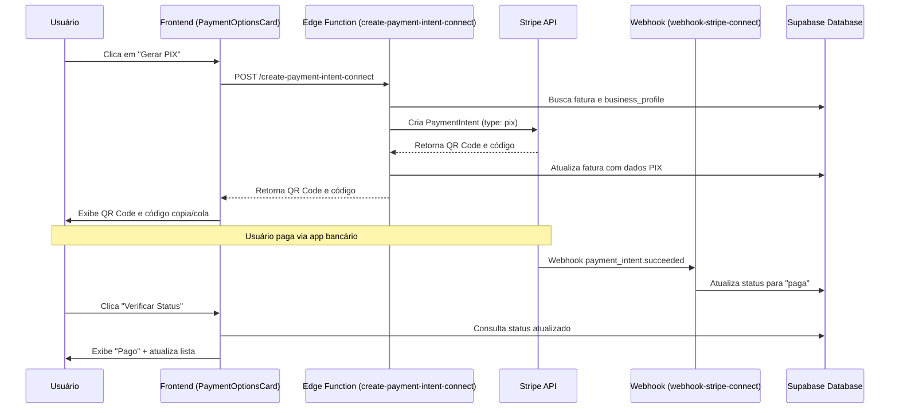

# Cenários de Teste - Fluxo de Pagamento PIX

Este documento contém todos os cenários de teste para validar o fluxo de pagamento PIX implementado no Tutor Flow.

## Índice

1. [Visão Geral do Fluxo](#visão-geral-do-fluxo)
2. [Pré-Requisitos](#pré-requisitos)
3. [Cenários de Teste](#cenários-de-teste)
   - [Geração de PIX](#categoria-1-geração-de-pix)
   - [Exibição no Frontend](#categoria-2-exibição-do-pix-no-frontend)
   - [Verificação de Status](#categoria-3-verificação-de-status)
   - [Webhook - Pagamento Confirmado](#categoria-4-webhook-payment_intentsucceeded)
   - [Webhook - Expiração](#categoria-5-webhook-payment_intentcanceled)
   - [Webhook - Falha](#categoria-6-webhook-payment_intentpayment_failed)
   - [Fluxo E2E](#categoria-7-fluxo-completo-e2e)
4. [Queries de Validação](#queries-de-validação-sql)
5. [Comandos cURL](#comandos-de-teste-curl)
6. [Checklist Pós-Deploy](#checklist-de-validação-pós-deploy)

---

## Visão Geral do Fluxo



### Componentes Envolvidos

| Componente | Arquivo | Responsabilidade |
|------------|---------|------------------|
| PaymentOptionsCard | `src/components/PaymentOptionsCard.tsx` | UI de pagamento, exibe QR Code |
| create-payment-intent-connect | `supabase/functions/create-payment-intent-connect/index.ts` | Gera PIX via Stripe |
| verify-payment-status | `supabase/functions/verify-payment-status/index.ts` | Verifica status do pagamento |
| webhook-stripe-connect | `supabase/functions/webhook-stripe-connect/index.ts` | Processa eventos Stripe |

---

## Pré-Requisitos

### Ambiente de Teste

- [ ] Conta Stripe em modo **teste** configurada
- [ ] Chaves de API Stripe (secret key) configuradas como secrets
- [ ] Webhook Stripe configurado para o endpoint `/functions/v1/webhook-stripe-connect`

### Dados de Teste

- [ ] **Professor** com Business Profile configurado
- [ ] Business Profile com Stripe Connect ID válido
- [ ] Conta Stripe Connect com `charges_enabled = true`
- [ ] **Aluno** vinculado ao professor
- [ ] **Fatura pendente** para o aluno testar

### Usuários de Teste

| Papel | Requisitos |
|-------|------------|
| Professor | Ter business_profile, stripe_connect_account com charges habilitados |
| Aluno | Estar vinculado ao professor via teacher_student_relationships |

---

## Cenários de Teste

### Categoria 1: Geração de PIX

**Edge Function:** `create-payment-intent-connect`

| ID | Cenário | Pré-condição | Ação | Resultado Esperado |
|----|---------|--------------|------|-------------------|
| T1.1 | Gerar PIX como aluno | Aluno autenticado, fatura pendente própria | Clicar "PIX" → "Gerar código PIX" | QR Code exibido, código copia/cola disponível, mensagem "expira em 24h" |
| T1.2 | Gerar PIX como professor | Professor autenticado, fatura do seu aluno | Clicar "PIX" → "Gerar código PIX" | QR Code gerado com sucesso |
| T1.3 | Gerar PIX sem autenticação | Sessão expirada ou não logado | Tentar gerar PIX | Toast: "Sua sessão expirou. Faça login novamente." |
| T1.4 | Gerar PIX para fatura de outro | Aluno A tenta gerar PIX para fatura do Aluno B | Tentar gerar PIX | Toast: "Você não tem permissão para acessar esta fatura." |
| T1.5 | Fatura sem business_profile_id | Fatura com business_profile_id = null | Tentar gerar PIX | Toast: "Fatura não possui perfil de negócio definido" |
| T1.6 | Business Profile sem Stripe Connect | business_profile existe mas sem stripe_connect_id | Tentar gerar PIX | Toast: "Conta Stripe Connect não encontrada" |
| T1.7 | Stripe Connect desabilitado | charges_enabled = false | Tentar gerar PIX | Toast: "Conta Stripe não está habilitada para receber pagamentos" |
| T1.8 | Fatura já paga | status = 'paga' | Abrir modal de pagamento | Botões de pagamento não aparecem, badge "Paga" exibido |
| T1.9 | Valor mínimo PIX | Valor < R$ 1,00 (100 centavos) | Tentar gerar PIX | Deve funcionar (PIX não tem valor mínimo no Stripe) |

### Categoria 2: Exibição do PIX no Frontend

**Componente:** `PaymentOptionsCard`

| ID | Cenário | Ação | Resultado Esperado |
|----|---------|------|-------------------|
| T2.1 | Exibir QR Code | PIX gerado com sucesso | QR Code visual renderizado corretamente |
| T2.2 | Exibir código copia/cola | PIX gerado com sucesso | Código PIX exibido em campo de texto |
| T2.3 | Copiar código PIX | Clicar botão "Copiar" | Toast "Copiado!", código na área de transferência |
| T2.4 | Mensagem de expiração | PIX gerado | Texto "Este código expira em 24 horas" visível |
| T2.5 | Badge de recomendação | Abrir opções de pagamento | PIX exibe badge "Recomendado" |
| T2.6 | Loading state | Durante geração do PIX | Botão desabilitado, ícone de loading |
| T2.7 | Fatura vencida | due_date < hoje | Alerta amarelo "Esta fatura está vencida" exibido |
| T2.8 | Fatura paga | status = 'paga' | Badge verde "Paga", sem botões de ação |

### Categoria 3: Verificação de Status

**Edge Function:** `verify-payment-status`

| ID | Cenário | Pré-condição | Ação | Resultado Esperado |
|----|---------|--------------|------|-------------------|
| T3.1 | PIX pendente | PaymentIntent status = 'requires_action' | Clicar "Verificar Status" | Toast: "Status verificado: Pendente" |
| T3.2 | PIX pago | PaymentIntent status = 'succeeded' | Clicar "Verificar Status" | Toast: "Status atualizado: Paga", lista atualizada |
| T3.3 | PIX expirado | PaymentIntent status = 'canceled' | Clicar "Verificar Status" | Toast: "Código expirado. Gere um novo.", campos PIX limpos |
| T3.4 | Verificar sem autenticação | Sessão expirada | Clicar "Verificar Status" | Erro 401, toast de sessão expirada |
| T3.5 | Verificar fatura de outro | Aluno A verifica fatura do Aluno B | Clicar "Verificar Status" | Erro 403, toast de permissão negada |
| T3.6 | Fatura sem payment_intent | stripe_payment_intent_id = null | Clicar "Verificar Status" | Retorna status atual da fatura sem erro |
| T3.7 | Fatura já marcada como paga | status = 'paga' no banco | Clicar "Verificar Status" | Retorna status 'paga' sem chamar Stripe |

### Categoria 4: Webhook payment_intent.succeeded

**Edge Function:** `webhook-stripe-connect`

| ID | Cenário | Evento | Resultado Esperado |
|----|---------|--------|-------------------|
| T4.1 | Pagamento PIX confirmado | payment_intent.succeeded | Fatura atualizada: status='paga', payment_method='pix', payment_origin='automatic' |
| T4.2 | Webhook duplicado | Mesmo evento enviado 2x | Segundo evento ignorado (idempotência), sem erro |
| T4.3 | Pagamento manual anterior | Fatura já com payment_origin='manual' | Webhook ignora, mantém dados manuais |
| T4.4 | PaymentIntent sem fatura | payment_intent_id não existe no banco | Log de aviso, sem erro |

### Categoria 5: Webhook payment_intent.canceled

**Edge Function:** `webhook-stripe-connect`

| ID | Cenário | Evento | Resultado Esperado |
|----|---------|--------|-------------------|
| T5.1 | PIX expira (24h) | payment_intent.canceled | Fatura atualizada: pix_qr_code=null, pix_copy_paste=null, stripe_payment_intent_id=null |
| T5.2 | Cancelamento manual | payment_intent.canceled (manual) | Mesma limpeza de campos |
| T5.3 | Webhook duplicado | Mesmo evento 2x | Segundo ignorado (idempotência) |
| T5.4 | Gerar novo após expiração | Após T5.1, gerar novo PIX | Novo PaymentIntent criado, novos dados PIX salvos |

### Categoria 6: Webhook payment_intent.payment_failed

**Edge Function:** `webhook-stripe-connect`

| ID | Cenário | Evento | Resultado Esperado |
|----|---------|--------|-------------------|
| T6.1 | Pagamento falha | payment_intent.payment_failed | Fatura atualizada: status='falha_pagamento' |
| T6.2 | Retry após falha | Gerar novo PIX após T6.1 | Novo PIX gerado, novos dados salvos |

### Categoria 7: Fluxo Completo E2E

| ID | Cenário | Passos | Resultado Esperado |
|----|---------|--------|-------------------|
| T7.1 | Pagamento bem-sucedido | 1. Aluno gera PIX<br>2. Simula pagamento no Stripe Dashboard<br>3. Aguarda webhook<br>4. Verifica status | Status muda para "paga", UI atualiza |
| T7.2 | Expiração e regeneração | 1. Gera PIX<br>2. Aguarda 24h ou cancela no Stripe<br>3. Verifica status<br>4. Gera novo PIX | PIX expirado detectado, novo PIX gerado com sucesso |
| T7.3 | Professor acompanha pagamento | 1. Professor cria fatura<br>2. Aluno paga via PIX<br>3. Professor atualiza lista de faturas | Fatura aparece como "paga" na lista do professor |
| T7.4 | Mobile responsivo | Executar T7.1 em dispositivo móvel | Drawer mobile funciona, QR Code legível |

---

## Queries de Validação SQL

### Faturas com PIX Pendente

```sql
SELECT 
  id,
  description,
  amount,
  status,
  pix_qr_code IS NOT NULL as has_pix,
  stripe_payment_intent_id,
  created_at,
  updated_at
FROM invoices 
WHERE pix_qr_code IS NOT NULL 
  AND status = 'pendente'
ORDER BY created_at DESC
LIMIT 20;
```

### Faturas Pagas via PIX

```sql
SELECT 
  id,
  description,
  amount,
  status,
  payment_method,
  payment_origin,
  updated_at
FROM invoices 
WHERE payment_method = 'pix' 
  AND status = 'paga'
ORDER BY updated_at DESC
LIMIT 20;
```

### Verificar Consistência de Status

```sql
-- Não deve haver status 'paid' (inglês), apenas 'paga' (português)
SELECT status, COUNT(*) as total
FROM invoices 
GROUP BY status
ORDER BY total DESC;
```

### Faturas com PIX Expirado (campos limpos)

```sql
SELECT 
  id,
  description,
  status,
  pix_qr_code,
  stripe_payment_intent_id,
  payment_intent_cancelled_at
FROM invoices 
WHERE payment_intent_cancelled_at IS NOT NULL
ORDER BY payment_intent_cancelled_at DESC
LIMIT 10;
```

### Eventos Stripe Processados (PIX)

```sql
SELECT 
  event_id,
  event_type,
  processing_status,
  processed_at,
  processing_result
FROM processed_stripe_events
WHERE event_type LIKE 'payment_intent%'
ORDER BY processed_at DESC
LIMIT 20;
```

---

## Comandos de Teste cURL

### Gerar PIX

```bash
# Substitua [PROJECT_ID], [TOKEN] e [INVOICE_ID]
curl -X POST 'https://nwgomximjevgczwuyqcx.supabase.co/functions/v1/create-payment-intent-connect' \
  -H 'Authorization: Bearer [TOKEN]' \
  -H 'Content-Type: application/json' \
  -d '{
    "invoice_id": "[INVOICE_ID]",
    "payment_method": "pix"
  }'
```

**Resposta esperada (sucesso):**
```json
{
  "success": true,
  "payment_intent_id": "pi_xxx",
  "client_secret": "pi_xxx_secret_xxx",
  "pix_copy_paste": "00020126...",
  "pix_qr_code": "data:image/png;base64,..."
}
```

### Verificar Status

```bash
curl -X POST 'https://nwgomximjevgczwuyqcx.supabase.co/functions/v1/verify-payment-status' \
  -H 'Authorization: Bearer [TOKEN]' \
  -H 'Content-Type: application/json' \
  -d '{
    "invoice_id": "[INVOICE_ID]"
  }'
```

**Resposta esperada (pendente):**
```json
{
  "status": "pendente",
  "payment_method": "pix",
  "payment_expired": false
}
```

**Resposta esperada (expirado):**
```json
{
  "status": "pendente",
  "payment_expired": true,
  "message": "Payment intent was canceled/expired"
}
```

### Simular Webhook (Teste Local)

```bash
# Requer Stripe CLI instalado
stripe trigger payment_intent.succeeded \
  --override payment_intent:metadata.invoice_id=[INVOICE_ID]
```

---

## Checklist de Validação Pós-Deploy

### Geração de PIX
- [ ] PIX gera corretamente para aluno autenticado
- [ ] PIX gera corretamente para professor
- [ ] Erro amigável para usuário não autenticado
- [ ] Erro amigável para fatura de outro usuário
- [ ] Erro quando Business Profile não tem Stripe Connect

### Exibição Frontend
- [ ] QR Code renderiza corretamente
- [ ] Código PIX é exibido e copiável
- [ ] Toast "Copiado!" aparece ao copiar
- [ ] Mensagem "expira em 24h" é exibida
- [ ] Badge "Recomendado" aparece no PIX
- [ ] Loading state durante geração
- [ ] Alerta de fatura vencida funciona

### Verificação de Status
- [ ] Status "pendente" é detectado corretamente
- [ ] Status "paga" atualiza a UI
- [ ] PIX expirado limpa os dados e permite nova geração
- [ ] Estados locais são limpos ao expirar

### Webhooks
- [ ] `payment_intent.succeeded` atualiza para status "paga" (não "paid")
- [ ] `payment_intent.canceled` limpa campos PIX
- [ ] `payment_intent.payment_failed` atualiza status
- [ ] Idempotência funciona (eventos duplicados ignorados)

### Segurança
- [ ] Aluno não acessa fatura de outro aluno
- [ ] Professor só acessa faturas dos seus alunos
- [ ] Tokens expirados retornam erro 401
- [ ] Stripe Connect desabilitado bloqueia geração

### Mobile
- [ ] Drawer mobile abre corretamente
- [ ] QR Code é legível em tela pequena
- [ ] Botão de copiar funciona no mobile

---

## Histórico de Versões

| Data | Versão | Alterações |
|------|--------|------------|
| 2026-01-13 | 1.0 | Documento inicial com todos os cenários de teste |

---

## Contato

Para dúvidas sobre os testes, consulte:
- Código fonte: `src/components/PaymentOptionsCard.tsx`
- Edge Functions: `supabase/functions/`
- Logs: Supabase Dashboard → Edge Functions → Logs
