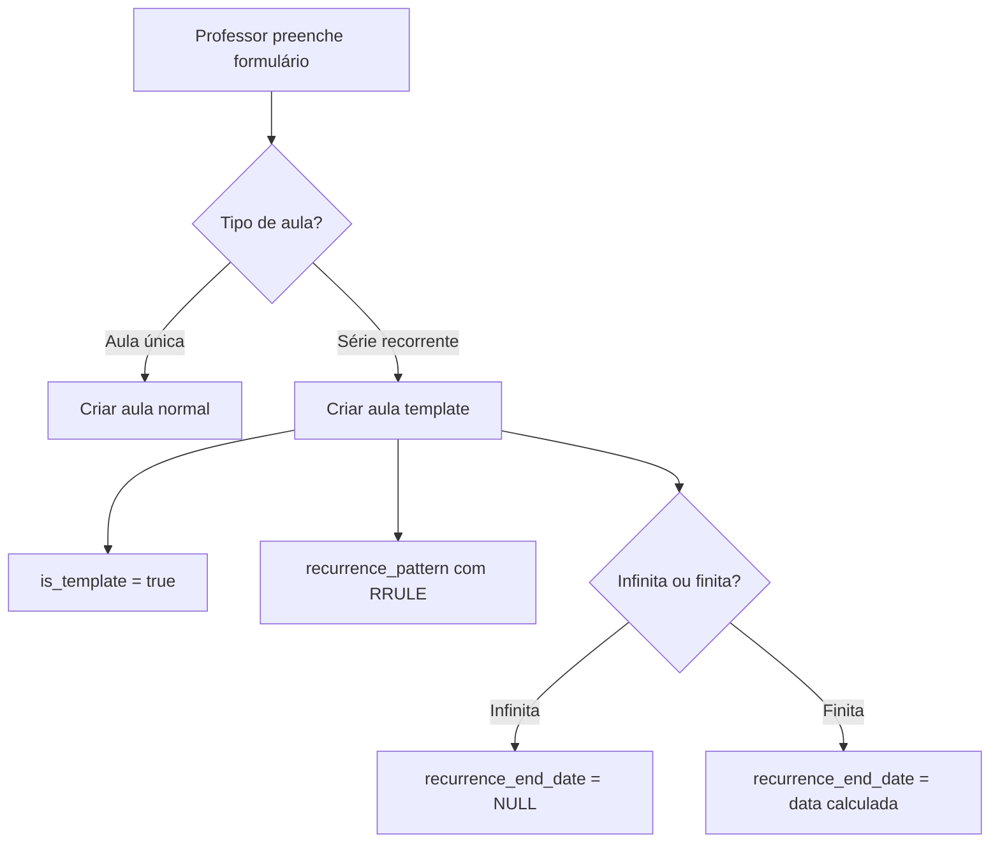
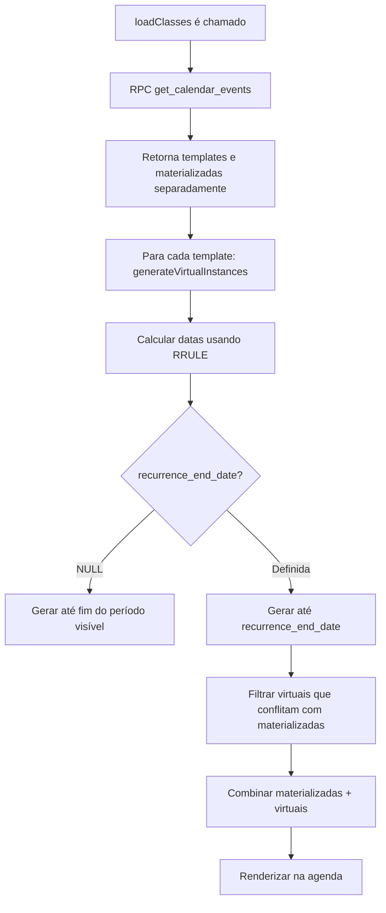
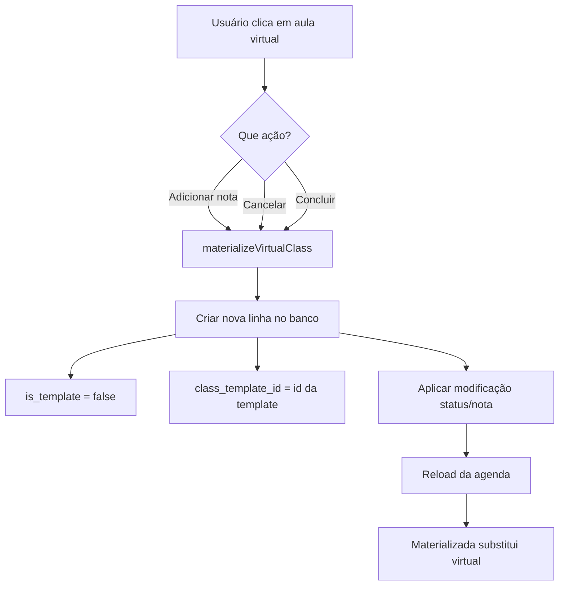
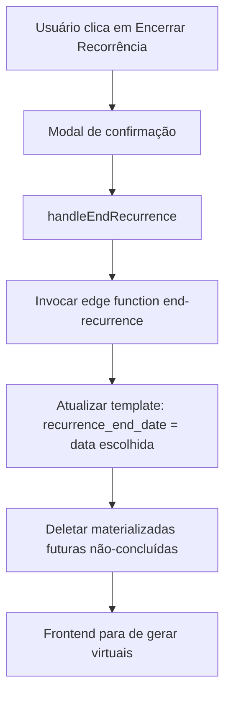

# 📚 Arquitetura de Aulas Recorrentes - Tutor Flow

## 🎯 Visão Geral

O sistema de aulas recorrentes do Tutor Flow é baseado em **3 tipos de aulas**:

### 1. **Aula Template** (Template Class)
- **Definição**: Linha na tabela `classes` com `is_template = true`
- **Propósito**: Armazena a "receita" de uma série recorrente (RRULE)
- **Visibilidade**: **NÃO aparece na agenda** para o usuário
- **Quando é criada**: Ao criar uma série recorrente (semanal, quinzenal, mensal)
- **Campos importantes**:
  - `is_template = true`
  - `recurrence_pattern` (JSON com regras de recorrência)
  - `recurrence_end_date` (NULL para infinitas, data para finitas)

---

### 2. **Aula Virtual** (Virtual Instance)
- **Definição**: Aula calculada dinamicamente pelo **frontend** a partir da template
- **Propósito**: Exibir ocorrências futuras na agenda sem ocupar espaço no banco
- **Visibilidade**: **Aparece na agenda** com badge "Virtual"
- **Quando é gerada**: Toda vez que a agenda é carregada
- **Características**:
  - Tem `isVirtual = true`
  - ID composto: `{template_id}_virtual_{timestamp}`
  - Respeita `recurrence_end_date` da template
  - **Não pode ser modificada diretamente** (precisa ser materializada primeiro)

---

### 3. **Aula Materializada** (Materialized Class)
- **Definição**: Linha real na tabela `classes` criada ao modificar uma aula virtual
- **Propósito**: Registrar mudanças específicas em uma ocorrência (nota, cancelamento, conclusão)
- **Visibilidade**: **Aparece na agenda** substituindo a virtual
- **Quando é criada**: Ao realizar ação em aula virtual (adicionar nota, cancelar, concluir)
- **Campos importantes**:
  - `is_template = false`
  - `class_template_id` (aponta para a template de origem)
  - `parent_class_id = NULL` (campo obsoleto)

---

## 📊 Fluxo Completo de uma Série Recorrente

### **Passo 1: Criação da Série**



**Exemplo SQL**:
```sql
INSERT INTO classes (
  teacher_id, 
  student_id, 
  class_date, 
  is_template, 
  recurrence_pattern,
  recurrence_end_date
) VALUES (
  'uuid-professor',
  'uuid-aluno',
  '2025-01-15 10:00:00',
  true, -- ✅ É template
  '{"frequency": "weekly", "is_infinite": false, "occurrences": 10}',
  '2025-03-19 10:00:00' -- ✅ 10 semanas depois
);
```

---

### **Passo 2: Renderização na Agenda**



**Regra de Prioridade**:
- Se existe aula **materializada** em 15/01 às 10h
- E existe aula **virtual** na mesma data/hora
- → Apenas a **materializada** é exibida

---

### **Passo 3: Materialização (Modificação de Aula Virtual)**



**Exemplo SQL**:
```sql
INSERT INTO classes (
  teacher_id,
  student_id,
  class_date,
  is_template, -- ❌ false
  class_template_id, -- ✅ uuid da template
  status, -- Ex: 'cancelada'
  notes -- Modificação específica
) VALUES (
  'uuid-professor',
  'uuid-aluno',
  '2025-01-22 10:00:00', -- 2ª ocorrência
  false, -- ✅ Materializada
  'uuid-template', -- ✅ Vinculada à série
  'cancelada',
  'Aluno faltou sem aviso'
);
```

**Resultado**: A virtual em 22/01 desaparece, aparece a materializada cancelada.

---

### **Passo 4: Encerrar Recorrência**



**Exemplo**:
- Série criada em 15/01 com 10 ocorrências (até 19/03)
- Professor encerra em 05/02
- → `recurrence_end_date = 2025-02-05`
- → Aulas materializadas de 12/02, 19/02, 26/02... são **deletadas** (se não-concluídas)
- → Virtuais futuras **não são mais geradas**

---

## 🔐 Isolamento e Independência

### ✅ **Cada Aula Materializada é Independente**

```
Template: Aula semanal às 10h
├─ Virtual 15/01 → Materializada 15/01 (nota: "Ótima aula!")
├─ Virtual 22/01 → Materializada 22/01 (status: cancelada)
├─ Virtual 29/01 → PERMANECE VIRTUAL (sem modificação)
├─ Virtual 05/02 → Materializada 05/02 (status: concluída)
```

**Regra**: Mudanças em uma aula **NÃO afetam outras** da série.

---

## 🚫 Funcionalidades Removidas (Obsoletas)

### **Antes (Arquitetura Antiga)**:
- Aulas tinham `parent_class_id` para vincular à "aula pai"
- Exceções (`class_exceptions`) modificavam aulas sem materializá-las
- `generateRecurringClasses` criava múltiplas linhas no banco
- Modais `ClassExceptionForm` e `FutureClassExceptionForm`

### **Agora (Nova Arquitetura)**:
- ✅ **Templates invisíveis** + **Virtualização no frontend**
- ✅ **Materialização sob demanda**
- ✅ `parent_class_id` → **removido** (use `class_template_id`)
- ✅ Exceções → **substituídas por materialização + "Encerrar Recorrência"**

---

## 📝 Exemplos Práticos

### **Exemplo 1: Criar Série Semanal Infinita**
```typescript
const templateData = {
  teacher_id: 'uuid-professor',
  student_id: 'uuid-aluno',
  class_date: '2025-01-15T10:00:00Z',
  duration_minutes: 60,
  is_template: true,
  recurrence_pattern: {
    frequency: 'weekly',
    is_infinite: true
  },
  recurrence_end_date: null // ✅ Infinita
};
```

### **Exemplo 2: Criar Série Quinzenal com 8 Ocorrências**
```typescript
const templateData = {
  teacher_id: 'uuid-professor',
  student_id: 'uuid-aluno',
  class_date: '2025-01-15T10:00:00Z',
  duration_minutes: 60,
  is_template: true,
  recurrence_pattern: {
    frequency: 'biweekly',
    is_infinite: false,
    occurrences: 8
  },
  recurrence_end_date: '2025-05-07T10:00:00Z' // ✅ 8 quinzenas depois
};
```

### **Exemplo 3: Cancelar Uma Ocorrência**
```typescript
// Usuário cancela virtual "template_123_virtual_1737878400000"
await materializeVirtualClass('template_123_virtual_1737878400000', 'cancelada');

// Resultado no banco:
// INSERT classes (
//   is_template = false,
//   class_template_id = 'template_123',
//   status = 'cancelada',
//   class_date = '2025-01-26 10:00:00'
// )
```

---

## 🎯 Vantagens da Nova Arquitetura

1. **Performance**: Menos linhas no banco (1 template vs 100 aulas)
2. **Escalabilidade**: Séries infinitas não enchem o banco
3. **Simplicidade**: Modificações são isoladas e óbvias
4. **Auditoria**: Fácil identificar aulas modificadas (`class_template_id IS NOT NULL`)
5. **Flexibilidade**: Encerrar série sem deletar histórico

---

## 🔧 Manutenção

### **Como Identificar Templates Ativas**
```sql
SELECT * FROM classes 
WHERE is_template = true 
AND (recurrence_end_date IS NULL OR recurrence_end_date > NOW());
```

### **Como Listar Aulas Materializadas de uma Template**
```sql
SELECT * FROM classes 
WHERE class_template_id = 'uuid-template' 
AND is_template = false
ORDER BY class_date;
```

### **Como Verificar Conflitos (Materializada vs Virtual)**
```typescript
const materializedDates = new Set(
  materializedClasses
    .filter(c => c.class_template_id === template.id)
    .map(c => new Date(c.class_date).toISOString())
);

const uniqueVirtuals = virtualClasses.filter(
  v => !materializedDates.has(v.class_date)
);
```

---

## 📞 Suporte e Referências

- **Plano de Implementação**: Este documento
- **Migration**: `supabase/migrations/20251017024358_*.sql`
- **Edge Function**: `supabase/functions/end-recurrence/index.ts`
- **RPC Function**: `public.get_calendar_events`
- **Código Principal**: `src/pages/Agenda.tsx`
- **Componentes**: `src/components/Calendar/SimpleCalendar.tsx`, `src/components/Calendar/CalendarView.tsx`

---

## ✅ Checklist de Implementação

- [x] Migração do banco de dados (colunas `is_template`, `class_template_id`, `recurrence_end_date`)
- [x] Índices otimizados para templates
- [x] RPC `get_calendar_events` atualizada
- [x] Política RLS `students_cannot_see_templates`
- [x] Edge function `end-recurrence`
- [x] `handleClassSubmit` corrigido (sempre cria template para recorrências)
- [x] Função `calculateEndDateFromOccurrences` implementada
- [x] `generateRecurringClasses` removida
- [x] Código obsoleto removido (modais, funções, estados)
- [x] `parent_class_id` removido de interfaces e queries
- [x] Toasts atualizados
- [x] Documentação completa criada
- [x] Geração de instâncias virtuais no frontend
- [x] Materialização sob demanda
- [x] Botão "Encerrar Recorrência" implementado
